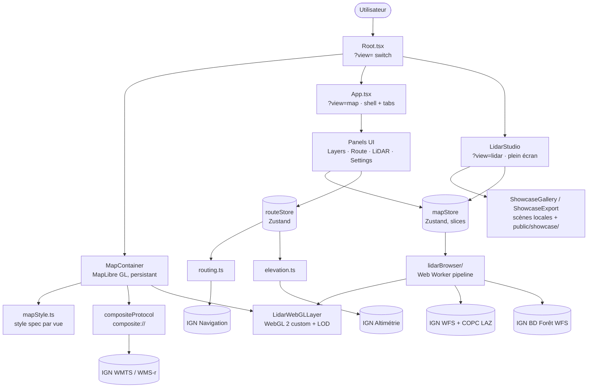

# open-cairn

> 🏔️ La montagne en relief, comme si vous y étiez — carte 3D open-source qui mêle ombrage LiDAR HD,
> nuages de points, itinéraires piétons et profils altimétriques, le tout dans un navigateur, sans backend.

Open-cairn est une application web (SPA React + MapLibre) qui exploite les services publics
de la **Géoplateforme IGN** pour afficher des cartes 3D détaillées des reliefs français,
calculer des itinéraires de randonnée, et — sa particularité — décompresser et rendre des
**nuages de points LiDAR HD** directement dans le navigateur.


---

## ✨ Fonctionnalités

- **Cartographie multi-fonds** — SCAN 25 Tour, Plan IGN, Orthophotos, OpenStreetMap, ombrage LiDAR brut
- **Ombrage LiDAR HD** — composition temps réel (mode *multiply* ou *neutre*) des couches MNS / MNT / MNH
  IGN sur le fond choisi, via un protocole MapLibre custom `composite://`
- **Relief 3D** — terrain MapLibre alimenté par le MNT haute résolution IGN (TerrainRGB), exagération réglable
- **Recherche & géocodage** — autocomplétion adresse / lieu-dit / POI via les services IGN sans clé
- **Itinéraires** — pose de waypoints à la carte, segments en mode *guidé* (API Navigation IGN piéton) ou *libre* (ligne droite)
- **Profil altimétrique interactif** — Chart.js avec coloration par pente, survol synchronisé, sélection drag
- **Survol 3D** — animation caméra le long de l'itinéraire (look-ahead, lissage, cap)
- **Itinéraires sauvegardés** — localStorage avec aperçu polyline + thumbnail
- **Import / export GPX** — preserves la géométrie originale des traces
- **Vue partageable** — URL hash encodant tout l'état de l'application
- **Nuages LiDAR HD** — décompression COPC/LAZ dans un Web Worker, rendu WebGL 2 custom avec
  Eye-Dome Lighting, normales k-NN PCA, coloration par pente. Trois modes de reconstruction :
  `shaded` (points bruts), `delaunay` (mesh 2.5D, avec variante sol lissé), `poisson`
  (reconstruction de surface WASM). Niveau de détail (LOD) adaptatif à la distance pour les
  gros nuages.
- **Studio LiDAR** (`?view=lidar`) — vue plein écran dédiée à la capture et à l'exploration d'un
  nuage : réglages de rendu (opacité, classes, ombres, EDL, éclairage solaire), mode orbite
  automatique, galerie de « vues » (scènes caméra + réglages) sauvegardables localement ou
  partagées via [public/showcase/](public/showcase/), export d'images
- **Analyse végétation / forêt** — hauteur de canopée par retour LiDAR (au-dessus du sol),
  enrichissement par essence via la BD Forêt IGN, panneau de diagnostic dédié à la classification
  falaise / pente / surplomb
- **Coupe falaise** — cross-section verticale du nuage LiDAR le long d'une polyligne, graphe
  Canvas 2D à échelle 1:1, relais cliquables et calcul de cordes recommandées (escalade,
  canyon, rappel)
- **Responsive** — layout dédié desktop (sidebar + panneau bas) et mobile (tabs) pour la vue carte
  classique ; le Studio LiDAR est desktop uniquement

---

## 🚀 Démarrage rapide

```bash
npm install
npm run dev       # Vite dev server, ~http://localhost:5173
npm run build     # tsc --build && vite build → dist/
npm run preview   # serve dist/
npm run test:run  # Vitest (lib + tests unitaires)
npm run lint:test # tsc --noEmit sur les fichiers de test
```

`npm run lint` lance `tsc --noEmit` sur le `tsconfig.json` racine — celui-ci
ne fait que référencer les autres projets TypeScript (`tsconfig.app.json` /
`tsconfig.node.json`) et ne vérifie donc rien par lui-même. Pour un vrai
contrôle de types, utiliser `npm run build` (ou `npx tsc -b`) et
`npm run lint:test`.

Aucune clé d'API n'est requise pour les fonctionnalités de base — la quasi-totalité de la
Géoplateforme IGN est désormais en accès libre. Une clé optionnelle peut être saisie dans
*Réglages* pour les couches privées (SCAN 25 Tour, MNT haute résolution interpolé linéairement).

---

## 🧱 Stack technique

| Couche               | Outil                                             |
|----------------------|---------------------------------------------------|
| Build                | Vite 6                                            |
| Langages             | TypeScript 5 · React 18                           |
| UI                   | Tailwind CSS 3                                    |
| Cartographie         | MapLibre GL JS 5.11                               |
| Rendu 3D additionnel | deck.gl 9 · WebGL 2 custom layers                 |
| LiDAR                | `copc.js` + `laz-perf` (WASM) · `delaunator` · PoissonRecon (WASM) · `meshoptimizer` (LOD) |
| État                 | Zustand 5 (avec persistance localStorage)         |
| Graphiques           | Chart.js 4                                        |
| Projections          | proj4 (EPSG:2154 Lambert-93 ↔ WGS84)              |
| Cache                | IndexedDB (`idb-keyval`)                          |

---

## 🗺️ Architecture en un coup d'œil



L'application est une SPA pure : aucun backend, toutes les données viennent en direct de
`data.geopf.fr`. Les calculs lourds (décodage LAZ, k-NN PCA, mesh, simplification LOD) tournent
dans des Web Workers dédiés.

---

## 📚 Documentation

Documentation détaillée par fonctionnalité, organisée en **sections utilisateur** et
**sections développeur**, dans le répertoire [docs/](docs/) :

### Données et carto

- [docs/BASEMAPS_AND_HILLSHADE.md](docs/BASEMAPS_AND_HILLSHADE.md) — Fonds de carte, ombrage LiDAR HD,
  protocole `composite://`, relief 3D, courbes de niveau
- [docs/IGN_DATA_SOURCES.md](docs/IGN_DATA_SOURCES.md) — Récapitulatif de tous les endpoints
  Géoplateforme utilisés (WMTS, WMS-r, Navigation, Altimétrie, Géocodage, WFS LiDAR)

### Itinéraires

- [docs/ROUTING_AND_ELEVATION.md](docs/ROUTING_AND_ELEVATION.md) — Pose de waypoints, modes
  guidé/libre, profil altimétrique, sélection drag
- [docs/SAVED_ROUTES_AND_GPX.md](docs/SAVED_ROUTES_AND_GPX.md) — Sauvegarde locale, import/export GPX
- [docs/FLYOVER.md](docs/FLYOVER.md) — Animation caméra de survol
- [docs/SHARE_VIEW.md](docs/SHARE_VIEW.md) — URL partageable encodant l'état

### Recherche

- [docs/SEARCH_AND_COORDINATES.md](docs/SEARCH_AND_COORDINATES.md) — Recherche IGN, affichage
  coordonnées curseur (décimal / DMS)

### LiDAR HD

- [docs/LIDAR_PIPELINE.md](docs/LIDAR_PIPELINE.md) — Pipeline complet : WFS → COPC → normales → mesh,
  cache IndexedDB, frontière Web Worker (déjà existant, mis à jour)
- [docs/LIDAR_RENDERING.md](docs/LIDAR_RENDERING.md) — Rendu WebGL 2 du nuage : shaders,
  Eye-Dome Lighting, masque de classification, projection Mercator depuis offsets mètres
- [docs/CLIFF_SLICE.md](docs/CLIFF_SLICE.md) — Coupe falaise : projection du nuage sur un
  plan vertical, graphe 1:1, relais et calcul de cordes
- [docs/SUN_LIGHTING.md](docs/SUN_LIGHTING.md) — Position solaire NOAA, intensité et tint
  appliqués au LiDAR
- [docs/POISSON_WASM.md](docs/POISSON_WASM.md) — Portage WebAssembly de PoissonRecon (builds
  wasm64 / wasm32 avec repli automatique), patches amont, toolchain

### Architecture & UI

- [docs/UI_SHELL_AND_RESPONSIVE.md](docs/UI_SHELL_AND_RESPONSIVE.md) — App shell, tabs,
  layout desktop / mobile, panneau bas redimensionnable
- [docs/STATE_AND_PERSISTENCE.md](docs/STATE_AND_PERSISTENCE.md) — Stores Zustand, clés
  localStorage, schéma persisté

---

## 🤝 Contribution

Le projet est en alpha. Les contributions sont bienvenues, en particulier sur :

- amélioration des artefacts de mesh sur les falaises (cf. limitations dans
  [LIDAR_PIPELINE.md](docs/LIDAR_PIPELINE.md))
- accessibilité du panneau d'altimétrie (clavier, lecteur d'écran)
- support multi-langue (actuellement français uniquement)

Lancer la validation de type : `npm run build` (ou `npx tsc -b`) et `npm run lint:test`
(`npm run lint` seul ne vérifie rien, voir plus haut). La complexité cognitive de `App.tsx` est
plafonnée par SonarQube ; extraire des sous-composants plutôt que d'empiler des ternaires.

## 📝 Licence

AGPL-3.0 (provisoire). Les données restent la propriété de l'IGN selon leurs conditions
d'utilisation publiques (Géoplateforme).
