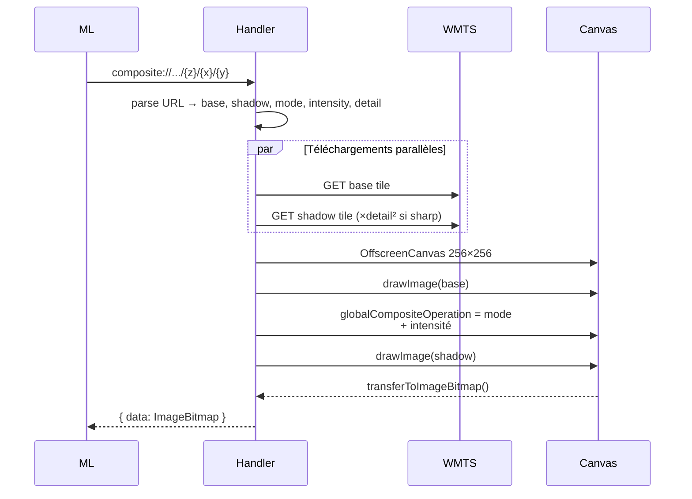

# Fonds de carte, ombrage LiDAR HD et relief 3D

Cette page couvre l'affichage cartographique de base : sélection du fond, ombrage temps
réel, terrain 3D, et courbes de niveau.

## Pour les utilisateurs

### Choisir un fond de carte

Dans le panneau **Couches** (sidebar à droite sur desktop, onglet *Couches* sur mobile),
cinq fonds sont disponibles :

| Fond            | Source                          | Pertinence                          |
|-----------------|----------------------------------|-------------------------------------|
| **SCAN 25**     | IGN SCAN 25 Tour                 | Carte topo de référence en montagne |
| **Plan IGN**    | IGN Plan IGN                     | Cartographie générale, lisible      |
| **Orthophotos** | IGN BD ORTHO                     | Imagerie aérienne                   |
| **OSM**         | OpenStreetMap                    | Détail des sentiers / refuges       |
| **LiDAR brut**  | IGN LiDAR HD ombrage             | Lecture pure du relief              |

### Activer l'ombrage LiDAR HD

L'ombrage est l'élément distinctif de open-cairn : par-dessus n'importe quel fond, vous
pouvez superposer en composition douce une couche d'ombrage **MNS**, **MNT** ou **MNH**
issue du LiDAR HD national :

- **MNS** (Modèle Numérique de Surface) — relief incluant la végétation et les bâtiments
- **MNT** (Modèle Numérique de Terrain) — sol nu, le plus pertinent pour la randonnée
- **MNH** (Modèle Numérique de Hauteur) — différence MNS − MNT, met en évidence la canopée

Réglages dans *Couches* :

- **Activer/désactiver** l'ombrage
- **Source** : MNS / MNT / MNH
- **Intensité** : 0 % (ombrage invisible) à 100 %

Le **mode de mélange** (réglages avancés) :

- **Multiply** : multiplication classique. Plus contrasté, ressemble à un fond papier.
- **LiDAR neutre** (par défaut) : préserve la luminosité du fond, ajoute uniquement le détail
  microtopographique. Recommandé sur SCAN 25 et orthophotos.

### Relief 3D

Activez **Relief 3D** dans *Couches*. La carte adopte alors une projection 3D ; pivotez
avec le clic droit + glisser. Le curseur **Exagération verticale** (1× à 3×) accentue
le relief.

### Courbes de niveau

Une option *Courbes de niveau* superpose les courbes IGN officielles. L'opacité est réglable.
Disponible jusqu'au zoom 18.

### Limitations connues

- **Pas d'usage hors ligne** : toutes les tuiles sont chargées en direct.
- **SCAN 25 plafonné z18** : les zooms 17/18 retournent parfois 404 en zone montagneuse
  isolée ; au-delà, on étire la tuile parente.
- **Mode `lidar-neutral` plus lourd** que `multiply` : peut faire chuter le framerate
  sur mobile bas de gamme.
- **Courbes de niveau publiées par l'IGN jusqu'à z18** seulement.
- **MNT / MNS / MNH** ne couvrent pas (encore) la totalité du territoire — certaines zones
  outre-mer ou frontalières sont absentes.

---

## Pour les développeurs

### Vue d'ensemble

```mermaid
flowchart LR
    Store[mapStore<br/>Zustand] --> Style[mapStyle.ts<br/>buildStyle&#40;&#41;]
    Style --> ML[MapLibre instance]
    ML -->|tile request| Proto["composite://<br/>handler"]
    Proto -->|fetch base| WMTSb[(IGN WMTS<br/>fond)]
    Proto -->|fetch shadow| WMTSs[(IGN WMTS<br/>MNS/MNT/MNH)]
    Proto -->|2D blend| Canvas[OffscreenCanvas]
    Canvas -->|ImageBitmap| ML
    ML --> Terrain[raster-dem<br/>TerrainRGB]
    Terrain --> WMSr[(IGN WMS-r<br/>HIGHRES.LINEAR)]
```



### Fichiers clés

| Fichier | Rôle |
|---------|------|
| [src/lib/compositeProtocol.ts](../src/lib/compositeProtocol.ts) | Handler MapLibre `composite://`, parallèle base + shadow, blend 2D, gestion overzoom et detail-scale |
| [src/lib/mapStyle.ts](../src/lib/mapStyle.ts) | Génère le `StyleSpecification` MapLibre depuis l'état du store |
| [src/lib/ign.ts](../src/lib/ign.ts) | Registre des endpoints IGN (URL builders, definitions de couches, plages de zoom) |
| [src/components/map/MapContainer.tsx](../src/components/map/MapContainer.tsx) | Instance MapLibre, sync style/terrain, enregistrement protocole |
| [src/components/ui/LayerSwitcher.tsx](../src/components/ui/LayerSwitcher.tsx) | UI couches (5 fonds, ombrage, relief 3D, contours) |
| [src/components/ui/SettingsPanel.tsx](../src/components/ui/SettingsPanel.tsx) | UI thème, blend mode, qualité de rendu, clés API IGN |
| [src/stores/mapStore.ts](../src/stores/mapStore.ts) | Zustand : vue, layers, persistance localStorage |

### Le protocole `composite://`

MapLibre GL JS ne sait pas appliquer un blend mode (multiply, etc.) entre couches raster
côté GPU. Pour contourner cela, on enregistre un protocole custom :

```ts
maplibregl.addProtocol('composite', compositeProtocolHandler);
```

Format d'URL :

```
composite://<base>/<shadow>/<blend>/<intensity>/<detail>/{z}/{x}/{y}
```

- `base` ∈ `scan25 | plan | ortho | osm | lidar`
- `shadow` ∈ `mns | mnt | mnh`
- `blend` ∈ `multiply | lidar-neutral`
- `intensity` : 0–100 (pourcentage, encodé entier)
- `detail` : 1 ou 2 (en `sharp`, on charge une tuile shadow d'un cran de zoom plus haut puis on la mosaïque)

#### Pipeline de blend



Le mode `lidar-neutral` parcourt les pixels et applique une formule asymétrique : les zones
sombres du shadow (creux) assombrissent le fond, les zones claires (crêtes) éclaircissent
légèrement, en préservant la luminance globale. Algo en clair dans
[compositeProtocol.ts](../src/lib/compositeProtocol.ts).

#### Overzoom et detail-scale

Si la requête dépasse le zoom max d'une couche source (ex. SCAN 25 maxZoom = 18 alors que
la carte est en z19), le handler récupère la tuile parente correspondante et la **recoupe**
en canvas 2D au quadrant demandé, en interpolation lisse.

En qualité **Sharp**, le handler charge la couche shadow à `z+1` et assemble 4 tuiles
shadow pour 1 tuile base, ce qui double le détail microtopographique sans alourdir le fond.

### Relief 3D

```ts
// mapStyle.ts (extrait simplifié)
sources: {
  'terrain-dem': {
    type: 'raster-dem',
    tiles: [ignWmsRTerrainUrl(apiKey)],
    encoding: 'custom',
    redFactor: 6553.6,
    greenFactor: 25.6,
    blueFactor: 0.1,
    baseShift: 10000,
  }
},
terrain: { source: 'terrain-dem', exaggeration: terrainExaggeration }
```

L'encodage **TerrainRGB** custom IGN décode l'altitude depuis trois canaux 8 bits en
multipliant par les coefficients ci-dessus. Avec une clé IGN, on bascule sur la couche
`ELEVATION.ELEVATIONGRIDCOVERAGE.HIGHRES.LINEAR` (interpolation bilinéaire serveur)
au lieu du nearest-neighbor.

### Schéma de l'état (mapStore)

```ts
{
  // Vue
  view: { longitude, latitude, zoom, pitch, bearing }
  // Fonds
  baseLayer: 'scan25' | 'plan' | 'ortho' | 'osm' | 'lidar'
  // Ombrage
  hillshadeEnabled: boolean
  hillshadeSource: 'mns' | 'mnt' | 'mnh'
  hillshadeBlend: 'multiply' | 'lidar-neutral'
  hillshadeIntensity: number   // 0..1
  // Relief
  terrainEnabled: boolean
  terrainExaggeration: number  // 1..3
  // Contours
  contourLinesEnabled: boolean
  contourLinesOpacity: number  // 0..1
  // Qualité
  renderQuality: 'balanced' | 'sharp'
  tileCacheSize: number
  // Clés
  ignScanApiKey?: string
  ignDemApiKey?: string
  // Thème
  uiTheme: 'light' | 'dark'
}
```

Persisté sous la clé localStorage `open-cairn-settings` (champ `state` sérialisé Zustand).

### Limitations techniques

- **Pas de cache disque navigateur** custom : on s'appuie sur le HTTP cache standard.
  Les `ImageBitmap` produits sont gardés en mémoire pour `tileCacheSize` entrées maximum.
- **Pas de fallback** sur erreur tuile : MapLibre affichera un trou. Pour debug, ouvrir
  l'onglet réseau et chercher les requêtes 4xx.
- **`OffscreenCanvas` requis** : pas de fallback sur les navigateurs qui ne le supportent
  pas (Safari < 16.4). Une dégradation possible serait un `<canvas>` détaché en main thread,
  mais cela bloquerait le rendu MapLibre.
