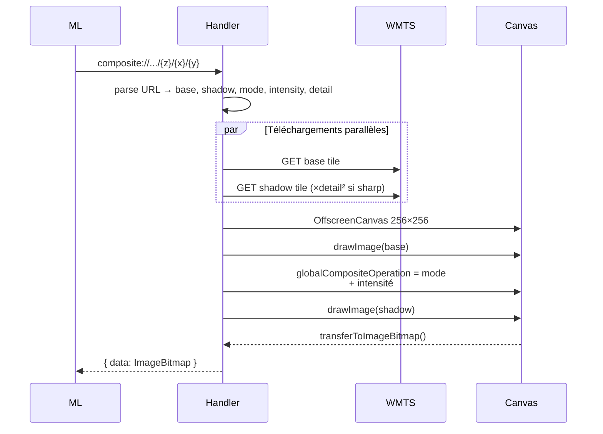

# Fonds de carte, ombrage LiDAR HD et relief 3D

Cette page couvre l'affichage cartographique de base : sélection du fond, ombrage temps
réel, terrain 3D, et courbes de niveau.

## Pour les utilisateurs

### Choisir un fond de carte

Dans le panneau **Couches** (sidebar à droite sur desktop, onglet *Couches* sur mobile),
sept fonds sont disponibles :

| Fond            | Source                          | Pertinence                          |
|-----------------|----------------------------------|-------------------------------------|
| **SCAN 25**     | IGN SCAN 25                 | Carte topo de référence en montagne |
| **Plan IGN**    | IGN Plan IGN                     | Cartographie générale, lisible      |
| **Plan IGN HD** | IGN `IGNF_PLAN-IGN-HD`           | Plan redessiné depuis le LiDAR HD  |
| **Orthophotos** | IGN BD ORTHO                     | Imagerie aérienne                   |
| **CoSIA**       | IGN `IGNF_COSIA_2021-2023`       | Couverture du sol prédite par IA    |
| **OSM**         | OpenStreetMap                    | Détail des sentiers / refuges       |
| **LiDAR brut**  | IGN LiDAR HD ombrage             | Lecture pure du relief              |

**Plan IGN HD** est le nouveau Plan IGN dérivé du LiDAR HD, celui de l'application Cartes
IGN : emprises au sol détaillées, végétation, relief souligné — mais le raster ne porte
**aucun texte**. Les toponymes sont disponibles en option, voir la section suivante.
Zooms 6 à 18, vérifiés tuile par tuile (le style officiel
annonce 0 à 20, c'est faux). Métropole, Corse, La Réunion et Guadeloupe couvertes ; Guyane
et Mayotte non. La couche publique sans clé `PLANIGN.LIDAR.SURSOL` n'est qu'une emprise de
démonstration limitée à quelques vallées de l'Oisans, elle n'est pas utilisée.

### Toponymes sur les fonds sans texte

Sous la grille des fonds, une case **Toponymes** apparaît dès que le fond sélectionné ne porte
aucun nom de lieu : *Plan IGN HD*, *Orthophotos*, *CoSIA* et *LiDAR brut*. Décochée (le défaut),
l'image reste nue — c'est le rendu « propre ». Cochée, les noms se superposent — communes,
sommets, cols, hydronymes, refuges, numéros de routes, avec les pictogrammes associés.

Ces libellés ne viennent pas du raster mais des **tuiles vectorielles `PLAN.IGN`** de la
Géoplateforme, ouvertes et sans clé, dessinées avec le style officiel *toponymes* de l'IGN —
exactement ce que fait l'application Cartes IGN. Seules les couches `symbol` de ce style sont
reprises : les routes et bâtiments qu'il contient aussi sont déjà peints par le raster HD en
dessous, les rajouter le salirait.

La typographie IGN (texte sombre à halo blanc) est calibrée pour un fond de plan clair : elle
est excellente sur le Plan HD et sur l'ombrage LiDAR, plus inégale sur une photo aérienne
selon la luminosité locale.

Le réglage est mémorisé par vue (Itinéraire / Studio LiDAR), sauf si le *Fond* est épinglé
(voir `UI_SHELL_AND_RESPONSIVE.md`), et voyage dans les liens de
partage. Sur SCAN 25, Plan IGN et OSM la case n'est pas proposée : ces fonds impriment déjà
leurs propres noms, la surcouche les doublerait.

**SCAN 25 et Plan IGN HD demandent une clé IGN** (champ *SCAN 25 et Plan IGN HD* dans les
réglages) : ce sont des couches WMTS privées, servies par `https://data.geopf.fr/private/wmts`.
Une seule clé couvre les deux. Sans clé, ces fonds sont proposés grisés, et si l'un d'eux
était déjà sélectionné (défaut d'usine, réglage d'une autre machine, lien partagé)
l'application ouvre la carte sur **Plan IGN** plutôt que sur une carte vide.

**CoSIA** (Couverture du Sol par Intelligence Artificielle) est une carte d'occupation du
sol prédite par un modèle IA à partir de la BD ORTHO, en 15 classes à 20 cm de résolution :
bâtiment, zone perméable / imperméable, surface d'eau, conifère, feuillu, broussaille, vigne,
cultures, terre labourée, pelouse, coupe, sol nu, neige, autre. C'est un fond thématique, pas
une carte de navigation. Deux points mesurés et à connaître : le millésime servi est
**2021-2023** parce que le 2024-2026, encore en cours de déploiement département par
département, renvoie des tuiles vides dans le Vercors et le Mercantour ; et la classe *Neige*
est la neige du jour de la prise de vue, pas un masque de glacier (la Mer de Glace et le
glacier d'Argentière sont classés *Sol nu*). Zooms 6 à 18, vérifiés tuile par tuile.

### Activer l'ombrage LiDAR HD

L'ombrage est l'élément distinctif de open-cairn : par-dessus n'importe quel fond, vous
pouvez superposer en composition douce une couche d'ombrage **MNS**, **MNT** ou **MNH**
issue du LiDAR HD national :

- **MNS** (Modèle Numérique de Surface) — relief incluant la végétation et les bâtiments
- **MNT** (Modèle Numérique de Terrain) — sol nu, le plus pertinent pour la randonnée
- **MNH** (Modèle Numérique de Hauteur) — différence MNS − MNT, met en évidence la canopée

Réglages dans *Couches* :

- **Activer/désactiver** l'ombrage
- **Source** : MNS / MNT / MNH
- **Intensité** : 0 % (ombrage invisible) à 100 %

Le **mode de mélange** (réglages avancés) :

- **Multiply** : multiplication classique. Plus contrasté, ressemble à un fond papier.
- **LiDAR neutre** (par défaut) : préserve la luminosité du fond, ajoute uniquement le détail
  microtopographique. Recommandé sur SCAN 25 et orthophotos.

### Relief 3D

Activez **Relief 3D** dans *Couches*. La carte adopte alors une projection 3D ; pivotez
avec le clic droit + glisser. Le curseur **Exagération verticale** (1× à 3×) accentue
le relief.

### Courbes de niveau

Un curseur *Courbes de niveau*, en bas de la section *Fond* des deux vues, superpose les
courbes IGN officielles : 0 les masque (`off`), toute autre valeur les affiche à cette opacité.
Disponible jusqu'au zoom 18.

### Limitations connues

- **Pas d'usage hors ligne** : toutes les tuiles sont chargées en direct.
- **SCAN 25 sans clé** : repli sur Plan IGN (voir ci-dessus) ; la préférence SCAN 25 est
  alors perdue, il faut la resélectionner après avoir saisi la clé.
- **SCAN 25 plafonné z18** : les zooms 17/18 retournent parfois 404 en zone montagneuse
  isolée ; au-delà, on étire la tuile parente.
- **Mode `lidar-neutral` plus lourd** que `multiply` : peut faire chuter le framerate
  sur mobile bas de gamme.
- **Courbes de niveau publiées par l'IGN jusqu'à z18** seulement.
- **MNT / MNS / MNH** ne couvrent pas (encore) la totalité du territoire — certaines zones
  outre-mer ou frontalières sont absentes.

---

## Pour les développeurs

### Vue d'ensemble

```mermaid
flowchart LR
    Store[mapStore<br/>Zustand] --> Style[mapStyle.ts<br/>buildStyle&#40;&#41;]
    Style --> ML[MapLibre instance]
    ML -->|tile request| Proto["composite://<br/>handler"]
    Proto -->|fetch base| WMTSb[(IGN WMTS<br/>fond)]
    Proto -->|fetch shadow| WMTSs[(IGN WMTS<br/>MNS/MNT/MNH)]
    Proto -->|2D blend| Canvas[OffscreenCanvas]
    Canvas -->|ImageBitmap| ML
    ML --> Terrain[raster-dem<br/>TerrainRGB]
    Terrain --> WMSr[(IGN WMS-r<br/>HIGHRES.LINEAR)]
```



### Fichiers clés

| Fichier | Rôle |
|---------|------|
| [src/lib/baseLayers.ts](../src/lib/baseLayers.ts) | **Registre unique des fonds** : id, source de tuiles, libellés, description, drapabilité |
| [src/lib/ignToponymLayers.json](../src/lib/ignToponymLayers.json) | Les 117 couches `symbol` extraites du style officiel IGN *toponymes* — **généré**, voir `tools/fetch-ign-toponyms.mjs` |
| [src/lib/compositeProtocol.ts](../src/lib/compositeProtocol.ts) | Handler MapLibre `composite://`, parallèle base + shadow, blend 2D, gestion overzoom et detail-scale |
| [src/lib/mapStyle.ts](../src/lib/mapStyle.ts) | Génère le `StyleSpecification` MapLibre depuis l'état du store |
| [src/lib/ign.ts](../src/lib/ign.ts) | Registre des endpoints IGN (URL builders, definitions de couches, plages de zoom) |
| [src/components/map/MapContainer.tsx](../src/components/map/MapContainer.tsx) | Instance MapLibre, sync style/terrain, enregistrement protocole |
| [src/components/ui/LayerSwitcher.tsx](../src/components/ui/LayerSwitcher.tsx) | UI couches (fonds, ombrage, relief 3D, contours, trajectoires soleil/lune, ciel atmosphérique) |
| [src/components/ui/SettingsPanel.tsx](../src/components/ui/SettingsPanel.tsx) | UI thème, blend mode, qualité de rendu, clés API IGN |
| [src/stores/mapStore.ts](../src/stores/mapStore.ts) | Zustand : vue, layers, persistance localStorage |

### Ajouter un fond de carte

Deux fichiers, dans cet ordre :

1. [src/lib/ign.ts](../src/lib/ign.ts) — la couche WMTS elle-même (`IGN_LAYERS`) : identifiant
   IGN, format, plage de zoom, `private`. Inutile pour un fond non-IGN.
2. [src/lib/baseLayers.ts](../src/lib/baseLayers.ts) — une entrée dans `BASE_LAYERS` : source de
   tuiles, libellé, libellé court, description.

Tout le reste en découle et n'a **pas** à être touché : le type `BaseLayerId`, l'ordre des
sélecteurs, le protocole `composite://`, le sélecteur de texture drapée du Studio LiDAR
(`DRAPE_SOURCES`, automatiquement peuplé pour toute couche ayant une `source` fixe), et le
verrouillage par clé IGN (`requiresIgnKey`, déduit du drapeau `private` de la couche).

### La surcouche toponymes et les polices

`buildMapStyle` n'ajoute la source vectorielle `ign-toponyms` et ses 117 couches que si
`toponyms` est vrai **et** que le fond courant est marqué `textless` dans `BASE_LAYERS`
(helper `showToponyms`). Ce drapeau est déclaré une fois, avec le reste du fond : proposer
la surcouche sur un nouveau fond, c'est basculer ce booléen. Les couches viennent d'un
fichier **généré**, régénérable par :

```bash
node tools/fetch-ign-toponyms.mjs
```

Le script télécharge `…/vectorTiles/styles/PLAN.IGN/toponymes.json`, ne garde que les couches
`type: 'symbol'`, les relie à notre id de source et préfixe leurs id par `ign-toponym-`.
Le sprite officiel `PlanIgn` n'est déclaré que quand la surcouche est active : une dizaine de
ces couches dessinent un pictogramme en plus du texte.

> ⚠️ **Un style MapLibre n'accepte qu'une seule URL `glyphs`.** C'est celle de l'IGN
> (`…/vectorTiles/fonts/{fontstack}/{range}.pbf`), parce que les couches toponymes demandent
> `Source Sans Pro`. Deux conséquences qui cassent en silence — un `text-font` introuvable ne
> lève rien, le texte disparaît simplement :
>
> - ce serveur ne connaît **pas** `Noto Sans` (l'ancien endpoint `demotiles.maplibre.org`) ;
> - il ne répond qu'aux piles **mono-police** : `Open Sans Bold,Arial Unicode MS Bold`
>   renvoie 404, `Open Sans Bold` renvoie 200.
>
> D'où la constante `LABEL_FONT` exportée par `mapStyle.ts` : tous les libellés maison
> (courbes de niveau, points d'itinéraire, marqueurs de recherche) passent par elle.

### Le protocole `composite://`

MapLibre GL JS ne sait pas appliquer un blend mode (multiply, etc.) entre couches raster
côté GPU. Pour contourner cela, on enregistre un protocole custom :

```ts
maplibregl.addProtocol('composite', compositeProtocolHandler);
```

Format d'URL :

```
composite://<base>/<shadow>/<blend>/<intensity>/<detail>/{z}/{x}/{y}
```

- `base` ∈ `scan25 | plan | planhd | ortho | cosia | osm | lidar`
- `shadow` ∈ `mns | mnt | mnh`
- `blend` ∈ `multiply | lidar-neutral`
- `intensity` : 0–100 (pourcentage, encodé entier)
- `detail` : 1 ou 2 (en `sharp`, on charge une tuile shadow d'un cran de zoom plus haut puis on la mosaïque)

#### Pipeline de blend



Le mode `lidar-neutral` parcourt les pixels et applique une formule asymétrique : les zones
sombres du shadow (creux) assombrissent le fond, les zones claires (crêtes) éclaircissent
légèrement, en préservant la luminance globale. Algo en clair dans
[compositeProtocol.ts](../src/lib/compositeProtocol.ts).

#### Overzoom et detail-scale

Si la requête dépasse le zoom max d'une couche source (ex. SCAN 25 maxZoom = 18 alors que
la carte est en z19), le handler récupère la tuile parente correspondante et la **recoupe**
en canvas 2D au quadrant demandé, en interpolation lisse.

En qualité **Sharp**, le handler charge la couche shadow à `z+1` et assemble 4 tuiles
shadow pour 1 tuile base, ce qui double le détail microtopographique sans alourdir le fond.

### Relief 3D

Trois sources au choix dans les réglages : `auto`, `ign`, `mapterhorn`. **`auto` prend IGN
quand une clé DEM est renseignée, Mapterhorn sinon** — mais les deux ne se valent pas
selon le terrain, voir plus bas « Mapterhorn est meilleur que l'IGN en montagne ».

```ts
// mapStyle.ts (extrait simplifié, branche IGN)
sources: {
  'terrain-dem': {
    type: 'raster-dem',
    tiles: [ignTerrainRgbUrl(apiKey, 512)],
    tileSize: 512,
    maxzoom: 14,
    encoding: 'custom',
    redFactor: 6553.6,
    greenFactor: 25.6,
    blueFactor: 0.1,
    baseShift: 10000,
  }
},
terrain: { source: 'terrain-dem', exaggeration: terrainExaggeration }
```

L'encodage **TerrainRGB** custom IGN décode l'altitude depuis trois canaux 8 bits en
multipliant par les coefficients ci-dessus. Avec une clé IGN, on bascule sur la couche
`ELEVATION.ELEVATIONGRIDCOVERAGE.HIGHRES.LINEAR` (interpolation bilinéaire serveur)
au lieu du nearest-neighbor.

#### Résolution du DEM : `tileSize` est le seul levier

Le DEM IGN passe par un **WMS GetMap** avec `{bbox-epsg-3857}` : le serveur ne sert pas
une pyramide de tuiles figée, il rend l'emprise demandée à la taille demandée. Le pas au
sol du DEM vaut donc `emprise_tuile / tileSize`, et `tileSize` est le seul paramètre qui
le pilote. À `tileSize: 256` et `maxzoom: 14`, on ne demandait que **6,7 m/px** — d'où
des lignes de crête en dents de scie très visibles sur les falaises.

À la latitude des Alpes, une tuile z14 fait 1 720 m : `tileSize: 512` donne 3,36 m/px.
Une tuile 512 px pèse ~226 Ko, soit le même volume au km² que quatre tuiles 256 px — le
passage de 256 à 512 est donc gratuit en bande passante.

Au-delà, **la limite n'est plus la taille de tuile mais la donnée source**. Monter
`maxzoom` à 15 demanderait 1,68 m/px pour ~4× le trafic, sans garantie que la donnée
sous-jacente le justifie : voir la section suivante.

> ⚠️ Ne pas mesurer la finesse réelle par la longueur des paliers de valeurs identiques :
> le WMS interpole, donc les valeurs restent toutes distinctes même quand elles
> n'apportent plus d'information.

`RGEALTI-MNT_PYR-ZIP_FXX_LAMB93_WMS` (publique, style `terrainrgb` disponible) est
annoncée à **1 m**, mais sur un même profil de falaise elle donne le même relief que
HIGHRES pour ~4× le poids : c'est le même RGE ALTI.

#### La vraie limite : RGE ALTI n'est pas du LiDAR partout

`ELEVATION.ELEVATIONGRIDCOVERAGE.HIGHRES` sert **RGE ALTI**, dont la source varie par
zone. L'IGN publie le graphe de source, interrogeable :

```
GET data.geopf.fr/wms-r?request=GetFeatureInfo
    &layers=ELEVATIONGRIDCOVERAGE.HIGHRES.QUALITY
    &query_layers=ELEVATIONGRIDCOVERAGE.HIGHRES.QUALITY
    &styles=Graphe%20de%20source%20du%20RGE%20Alti      ← obligatoire, sinon 400
    &info_format=application/json&crs=EPSG:3857&bbox=…&width=101&height=101&i=50&j=50
```

Sur les falaises du Vercors (45,2876 / 5,7885) il répond :
`code 7 · résolution 5 m · origine Radar · précision 1 m < Emq < 7 m`.

Du **radar 5 m**. C'est pourquoi une falaise verticale y sort en rampe de 17 m : le MNT
ne contient pas l'information, et aucun réglage côté client ne la fera apparaître.

#### Mapterhorn est meilleur que l'IGN en montagne

Contre-intuitif mais vérifié : le catalogue Mapterhorn pour la France est **MNT LiDAR HD**
(7 jeux IGN, ~2 To), RGE ALTI 1 m / 5 m ne servant que de complément. Là où LiDAR HD
existe, Mapterhorn restitue les ruptures de pente que RGE ALTI radar a lissées — un
rendu LiDAR 3D de la même falaise le confirme.

Sur la tuile `14/8455/5875`, les deux MNT s'accordent globalement (RMSE 7,4 m, décalage
optimal 0–1 px, biais vertical 0,2 m) et divergent de ±60 m **uniquement sur les
ruptures de pente** — là où l'un a du LiDAR et l'autre du radar.

> ⚠️ Ne pas prendre RGE ALTI comme vérité terrain pour arbitrer entre deux MNT : dans les
> zones radar il est lui-même à Emq 1–7 m. Comparer Mapterhorn au service d'altimétrie
> ponctuelle ne fait que mesurer l'écart au RGE ALTI, pas au relief réel.

L'IGN expose bien `IGNF_LIDAR-HD_MNT_ELEVATION.ELEVATIONGRIDCOVERAGE.*` sur `wms-r`,
mais **sans style `terrainrgb`** (`InvalidParameterValue: Style terrainrgb is not
available for the layer`) : seuls `normal` et `hypso` existent, donc inutilisable
directement comme `raster-dem`. Il faudrait un protocole client qui ré-encode une source
altimétrique brute.

À noter pour arbitrer : une clé DEM IGN ne change rien à ce constat, elle ne donne accès
qu'à `…HIGHRES.LINEAR`, c'est-à-dire au même RGE ALTI simplement mieux interpolé.

#### Tuiles DEM manquantes (400 `LayerNotDefined`)

`data.geopf.fr/wms-r` renvoie par intermittence `400 LayerNotDefined: Layer … unknown`
sur des requêtes pourtant valides — la même URL rejouée aussitôt répond `200`. Le taux
observé varie de 5 % à 40 % selon les moments, sur les deux couches d'altimétrie testées.
MapLibre ne réessaie pas une tuile raster en échec : les zones concernées gardent le DEM
du parent, donc un relief localement plus grossier. Ce n'est pas un défaut de l'appli.

### Schéma de l'état (mapStore)

```ts
{
  // Vue
  view: { longitude, latitude, zoom, pitch, bearing }
  // Fonds
  baseLayer: 'scan25' | 'plan' | 'planhd' | 'ortho' | 'cosia' | 'osm' | 'lidar'
  toponymsEnabled: boolean     // surcouche de noms, n'agit que sur les fonds `textless`
  // Ombrage
  hillshadeEnabled: boolean
  hillshadeSource: 'mns' | 'mnt' | 'mnh'
  hillshadeBlend: 'multiply' | 'lidar-neutral'
  hillshadeIntensity: number   // 0..1
  // Relief
  terrainEnabled: boolean
  terrainExaggeration: number  // 1..3
  // Contours
  contourLinesEnabled: boolean
  contourLinesOpacity: number  // 0..1
  // Qualité
  renderQuality: 'balanced' | 'sharp'
  tileCacheSize: number
  // Clés
  ignApiKey?: string
  ignDemApiKey?: string
  // Thème
  uiTheme: 'light' | 'dark'
}
```

Persisté sous la clé localStorage `open-cairn-settings` (champ `state` sérialisé Zustand).

### Limitations techniques

- **Pas de cache disque navigateur** custom : on s'appuie sur le HTTP cache standard.
  Les `ImageBitmap` produits sont gardés en mémoire pour `tileCacheSize` entrées maximum.
- **Pas de fallback** sur erreur tuile : MapLibre affichera un trou. Pour debug, ouvrir
  l'onglet réseau et chercher les requêtes 4xx.
- **`OffscreenCanvas` requis** : pas de fallback sur les navigateurs qui ne le supportent
  pas (Safari < 16.4). Une dégradation possible serait un `<canvas>` détaché en main thread,
  mais cela bloquerait le rendu MapLibre.
