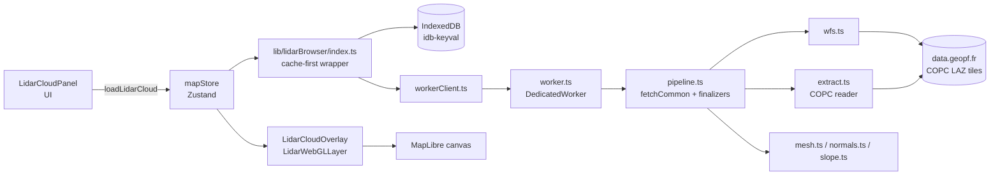
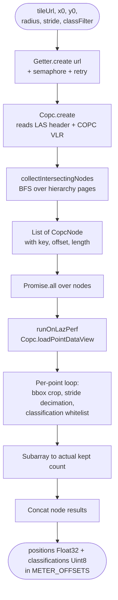
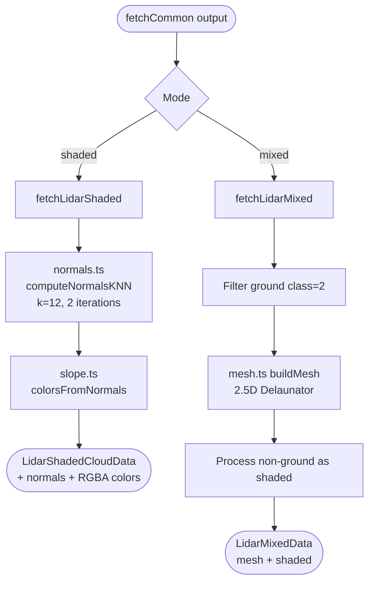
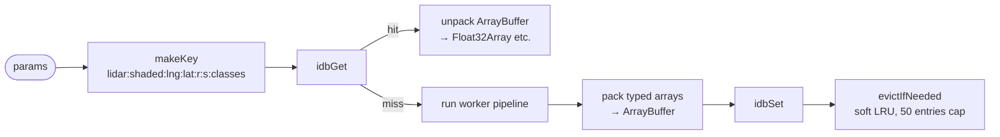
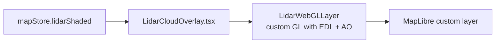

# LiDAR HD data loading & processing pipeline

This document maps how a point cloud gets from the IGN LiDAR HD archive
into the WebGL overlay rendered on top of MapLibre.

Everything runs **entirely in the browser** using a Web Worker. COPC tiles
are decoded with `copc.js` + `laz-perf` (WASM). Two render modes are
supported:

- **`shaded`** — All points with k-NN computed normals, rendered with
  slope-based coloring and Eye-Dome Lighting
- **`mixed`** — Ground (class 2) as a Delaunay mesh, vegetation/buildings
  as shaded points, both rendered together for proper depth ordering

Both modes produce variants of `LidarShadedCloudData` so the overlay layer
handles them uniformly.

---

## 1. High-level overview



---

## 2. Common shared stage: `fetchCommon`

Both modes (`shaded`, `mixed`) share the same fetch-and-crop prelude.
It runs inside the worker.


Notes:

- `radius` is the half-side of the L93 query square, not a circle radius.
- WFS bbox uses **lng/lat order** despite `srsname=EPSG:4326` — IGN
  quirk (see [wfs.ts](../src/lib/lidarBrowser/wfs.ts)).
- Positions are **METER_OFFSETS** (Float32 east/north/up) relative to
  the request center (centerLng/centerLat). This keeps Float32 precision
  workable for hundreds of meters of range.

---

## 3. Per-tile COPC decode (`extract.ts`)

A COPC tile is a 0.5–2 GB LAZ file with an octree index in its EVLR.
We HTTP-Range-fetch only the nodes that intersect our bbox.



### Throttle & retry on `data.geopf.fr` 429s

IGN rate-limits aggressive byte-range storms. The `get` wrapper handles
this transparently:


- Up to **5 attempts**, total ≤ 7.5 s of backoff.
- Semaphore is per-tile (each `extractPoints` call). With 1–4 tiles,
  the effective global concurrency is `tiles × MAX_INFLIGHT`. If 429s
  persist, drop `MAX_INFLIGHT` further or hoist the semaphore to module
  scope.

---

## 4. Mode-specific finalization

After `fetchCommon`, the worker dispatches one of two finalizers.



### Mesh rendering (mixed mode only)

The Delaunay mesh uses:
- **2.5D Delaunator** — Fast, preserves point detail, with edge-length
  filtering to remove long triangles at boundaries

---

## 5. Worker boundary (`workerClient` ↔ `worker`)

```mermaid
sequenceDiagram
    participant Store as mapStore.loadLidarCloud
    participant IDX as lib/lidarBrowser/index.ts
    participant Cache as IndexedDB cache
    participant WC as workerClient.ts
    participant WK as worker.ts
    participant PIPE as pipeline.ts

    Store->>IDX: fetchLidarShaded(params)
    IDX->>Cache: readCachedLidar('shaded', params)
    Cache-->>IDX: hit? return; miss? continue
    IDX->>WC: dispatch('shaded', params)
    WC->>WK: postMessage({id, kind, params})
    WK->>PIPE: fetchLidarShaded(paramsWithProgress)
    loop progress events
        PIPE-->>WK: onProgress(stage, detail)
        WK-->>WC: postMessage({id, type:'progress'})
        WC-->>Store: onProgress callback (UI updates)
    end
    PIPE-->>WK: LidarShadedCloudData (typed arrays)
    WK->>WK: collectTransferables(data)
    WK-->>WC: postMessage({id, ok, data}, [buffers])
    WC-->>IDX: resolve(data)
    IDX->>Cache: writeCachedLidar (fire-and-forget)
    IDX-->>Store: data
    Store->>Store: set({lidarShaded: data})
```

Key contracts:

- **Cloneable params only**: `workerClient.cleanParams` strips `signal`
  and `onProgress` (functions / AbortSignal don't survive
  `postMessage`). Cancellation is not currently propagated; the store
  handles races by "latest-wins".
- **Transferables**: every TypedArray buffer in the result is sent
  zero-copy. After `postMessage`, the worker's references are detached.
- **Progress**: streamed messages of shape
  `{ id, type: 'progress', progress: LidarProgress }` are de-multiplexed
  by request id.

---

## 6. IndexedDB cache (`cache.ts`)



- Coordinates rounded to 4 decimals (~10 m) so small jitter still hits
  the cache.
- Eviction is best-effort, ordered by insertion (Chromium IDB key
  ordering).

---

## 7. From data to pixels

Once data is in the store, the overlay re-renders:



The custom `LidarWebGLLayer` uses MapLibre's `mainMatrix` from
`args.defaultProjectionData` so points stay registered with the basemap
at any pitch/bearing/zoom. METER_OFFSETS are converted to Mercator in
the vertex shader using
`MercatorCoordinate.meterInMercatorCoordinateUnits()`.

---

## 8. Where to start when something breaks

| Symptom                                         | Likely culprit                                          |
|-------------------------------------------------|---------------------------------------------------------|
| `429 Too Many Requests` retries                 | Lower `MAX_INFLIGHT` in [extract.ts](../src/lib/lidarBrowser/extract.ts) |
| `Aucune dalle LiDAR HD` toast                   | WFS bbox; check `wfs.ts` (lng,lat order!)               |
| Points drift when pitching/panning              | `LidarWebGLLayer` shader matrix; check `mainMatrix` use |
| Worker silent / no progress                     | Check `workerClient.cleanParams` keeps required params  |
