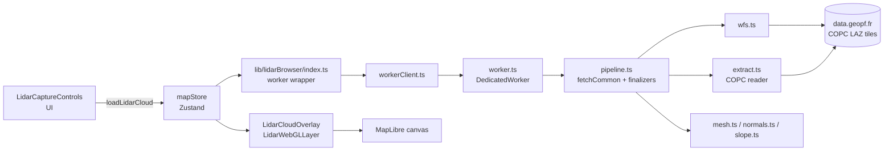
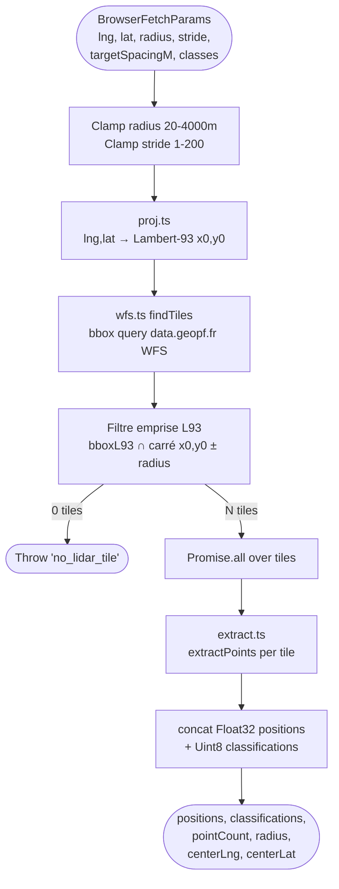
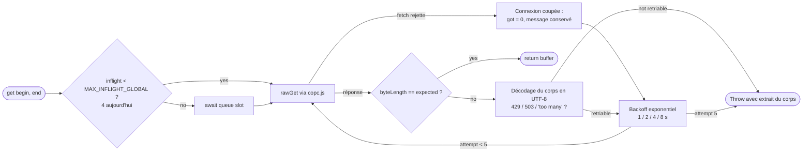
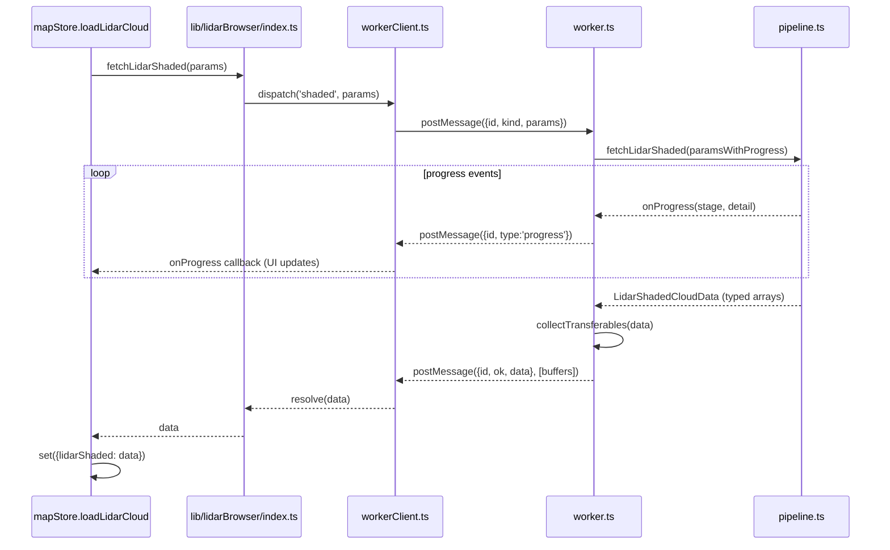
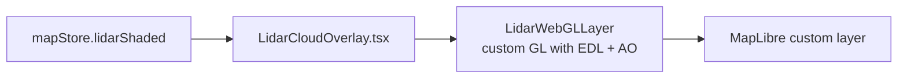

# Pipeline de chargement et traitement LiDAR HD

Cette page décrit le trajet d'un nuage de points depuis l'archive IGN LiDAR HD
jusqu'aux tableaux typés exploités par la couche WebGL. Tout s'exécute
**entièrement dans le navigateur**, dans un Web Worker, avec décodage des dalles
COPC via `copc.js` + `laz-perf` (WASM) et reconstruction de surface optionnelle
via PoissonRecon (WASM).

> Le **rendu WebGL 2** (shaders, EDL, intégration MapLibre) est documenté
> séparément dans [LIDAR_RENDERING.md](LIDAR_RENDERING.md).

## Pour les utilisateurs

### Charger un nuage

Dans le panneau **LiDAR** :

1. Ouvrez le panneau **Capture** : le mode dessin est armé d'emblée, glissez
   directement sur la carte. Le rectangle est **ancré au sol** : une fois tracé,
   la caméra bouge librement sans changer ce qui sera capturé. Le mode reste
   actif tant que le panneau est ouvert, un nouveau glissement remplace donc le
   rectangle précédent sans rien réarmer, et `Échap` annule le tracé en cours.
   La caméra est mise à plat le temps du dessin (sous une vue inclinée,
   l'emprise au sol d'un glissement à l'écran est un trapèze), puis remise comme
   elle était quand **Capturer** quitte le mode dessin. L'orientation du
   rectangle est celle de la caméra au moment du tracé.
   Tant que le mode est armé, le glissement à la souris (ou à un doigt) est
   confisqué par le dessin : la vue se déplace à la molette / au clic droit sur
   ordinateur, au pincement à deux doigts sur mobile.
   Corollaire de l'ancrage : si vous naviguez ailleurs entre-temps, la zone
   sort du champ. Rouvrir le panneau **Capture** la ramène alors sous la caméra
   (mêmes dimensions, orientation reprise de l'écran) plutôt que d'afficher des
   dimensions pour une zone invisible.
2. Choisissez le niveau de **Qualité**. Ce curseur unique règle d'un coup la
   résolution, la profondeur d'octree et la densité sol — voir
   « Le curseur Qualité » plus bas. La ligne sous le curseur donne le volume
   téléchargé, la durée et le nombre de sommets attendus.
3. Sélectionnez le **mode** :
   - **Points** (`shaded`) — tous les points sont conservés, normales calculées
     par k-NN, coloration par pente + Eye-Dome Lighting. Restitue parfaitement
     falaises, surplombs et végétation.
   - **Delaunay** (`delaunay`) — le sol (classe LAS = 2) est trié et trianglé
     en mesh Delaunay 2.5D, le reste (végétation, bâti) reste en points
     ombrés. Plus propre visuellement sur le sol, et un seul fetch suffit pour
     basculer les classes côté client.
   - **Poisson** (`poisson`) — le sol est reconstruit par PoissonRecon (WASM,
     octree adaptatif), le reste reste en nuage de points ombrés. Sortie la
     plus propre (mesh continu, sans triangles tendus en bordure), mais la plus
     coûteuse à calculer.
4. Filtrez les **classes LAS** à conserver (sol, végétation basse / moyenne /
   haute, bâtiments, etc.). Note : en modes `delaunay` et `poisson`, le filtre
   est appliqué côté GPU au runtime — un changement de classes ne déclenche
   pas un nouveau fetch.
5. **Capturer** : une barre de progression suit les étapes
   (recherche de dalles → téléchargement → décodage → normales / mesh /
   reconstruction Poisson).

Chaque chargement est ajouté à la liste « Nuages récents » : le rouvrir depuis
la galerie est instantané (aucun re-calcul).

### Le curseur Qualité

Résolution de capture, profondeur d'octree Poisson et densité sol ne veulent
rien dire séparément : un cran de résolution vaut **deux** niveaux d'octree et
quatre crans de densité sol (la pyramide IGN décuple les points d'un niveau au
suivant, cf. la table plus bas). Régler l'un sans les autres achète des octets
qu'on jette, ou demande au solveur un détail que les points ne portent pas.

[src/lib/lidarQuality.ts](../src/lib/lidarQuality.ts) encode ce couplage et en
dérive quatre paliers pour le rectangle courant, du plus grossier au plus fin ;
chaque palier est nommé par la **taille de détail** qu'il restitue (`2 m`,
`98 cm`, `49 cm`, `24 cm`…) plutôt que par ses trois nombres. Le palier
proposé par défaut est le plus fin qui tienne sous ~3 minutes de calcul estimé.
Le curseur, lui, va **plus loin que ce défaut** : il s'arrête au plafond de
20 M de points (`CAPTURE_POINT_CEILING`), pas au budget de 6 M qui dimensionne
le défaut. Sur une zone de 4 km le dernier cran coûte donc une dizaine de
minutes annoncées — la carte affiche les Mo et la durée, c'est un choix éclairé.
Plafonner le curseur au budget interdisait à une grande zone d'accéder au
niveau de pyramide suivant, seul moyen d'y gagner du détail.
Redimensionner la zone conserve le cran choisi (compté depuis le plus fin), pas
son index : le curseur perd des crans sur une petite zone.

Le palier le plus fin est **épinglé** sur ce plafond : résolution maximale et
densité sol pleine, quelle que soit la taille de la zone. Les paliers plus
grossiers, eux, déduisent leurs réglages de la maille d'octree (inutile de
télécharger plus fin que ce que la maille porte). Sans cet épinglage, la maille
du dernier palier — `Math.round` d'une profondeur continue, donc à un demi-niveau
près de l'espacement des points — faisait perdre un cran de résolution et la
moitié de la densité sol entre 50 et 80 m, rendus à 90 m, sur une zone qui n'avait
pourtant fait que gagner de la donnée.

Les quatre paliers sont calculés sur la **pyramide réelle de la zone**, lue dans
la hiérarchie des dalles COPC (voir « La table n'est qu'un repli » plus bas).
Elle arrive en ~1 s ; d'ici là le panneau affiche les paliers issus de la table
nationale, puis ils se recalculent, le cran choisi conservé.

« Réglages avancés », dans la même carte, redonne accès aux trois réglages
séparément — le curseur affiche alors « personnalisée ». Les incohérences y
sont signalées avec leur correction (« Profondeur inutilement élevée… »,
« Densité sol trop faible… »), chaque message portant son bouton *Corriger*.

### Résolution : le réglage qui décide du coût

Une dalle COPC est un octree, mais **pas un octree plein** : les niveaux de la
pyramide IGN ne quadruplent pas les points, ils les **décuplent** près de la
racine avant de saturer vers la densité native. Le
curseur **Résolution** choisit le niveau le plus profond parcouru — les niveaux
plus fins ne sont **jamais téléchargés**. C'est la différence de fond avec les
curseurs de densité : ceux-ci jettent des points déjà décodés, la résolution
empêche les octets d'arriver.

Les crans correspondent aux espacements que la pyramide IGN livre réellement
(6,8 m, 3,4 m, 1,7 m, 0,85 m, 0,43 m, puis `max` = densité native), mesurés sur
une dalle de 1 km² :

| niveau ≤ | espacement annoncé | points cumulés | pt/m² | Mo cumulés |
|---|---|---|---|---|
| 0 | 6,8 m | 60 639 | 0,061 | 0,7 |
| 1 | 3,4 m | 609 697 | 0,61 | 5,4 |
| 2 | 1,7 m | 2 268 567 | 2,3 | 17,6 |
| 3 | 0,85 m | 8 653 121 | 8,7 | 51,6 |
| 4 | 0,43 m | 18 232 817 | 18,2 | 97,0 |

C'est cette colonne pt/m² que [src/lib/lidarResolution.ts](../src/lib/lidarResolution.ts)
utilise (`DENSITY_AT_STOP_PT_M2`), et non une loi en 1/espacement². La loi
supposerait ×4 par niveau et surestimait le niveau racine d'un facteur 2,5 :
une grande zone, forcée précisément sur ce niveau, se voyait promettre un détail
de 2 m que la donnée ne portait pas — d'où un maillage plat à fond de curseur.

Le cran `max` vaut **20,4 pt/m²** : le niveau 4 multiplié par le rapport médian
natif/niveau-4 des six sondes ci-dessous. Ce sont des points **cumulés**, donc
le profil ne peut pas redescendre — il le faisait (18 contre 18,2 au cran
0,43 m), si bien que rétrograder de `max` à `0,43 m` téléchargeait *plus* de
points qu'il n'en économisait.

#### La table n'est qu'un repli : la vraie pyramide est lue sur la zone

Ces densités varient beaucoup d'une dalle à l'autre. Relevé sur six dalles, le
niveau 3 s'étale de 2,2 à 14,7 pt/m², la densité native de 9,6 à 46,5 pt/m², et
deux dalles voisines du Vercors diffèrent d'un facteur 1,8. L'IGN ne publie
qu'un **plancher** (« au moins 10 impulsions au m², 5 au-dessus de 3200 m ») et
la spécification COPC ne dit rien du nombre de points par niveau — c'est une
propriété du logiciel qui a découpé la dalle, pas du format. Aucune constante ne
peut donc être juste partout.

Elle n'a pas non plus à être devinée : la hiérarchie COPC porte le `pointCount`
de chaque nœud, et la lire coûte quelques requêtes `Range` de quelques kilo-octets.
[src/lib/lidarBrowser/pyramid.ts](../src/lib/lidarBrowser/pyramid.ts) ouvre les
**4 dalles les plus proches du centre** de la zone, somme leurs points par
niveau sans filtre d'emprise (on veut la pyramide de la dalle, pas la tranche
que la capture téléchargerait — un nœud de niveau 0 couvre le km² entier), et
moyenne les profils. Le résultat remplace la table pour cette zone.

Le déclenchement est dans [src/stores/slices/lidarSlice.ts](../src/stores/slices/lidarSlice.ts) :
`setLidarCaptureRect` programme la mesure **500 ms** plus tard (un jeton annule
la sonde d'une zone abandonnée entre-temps). Quand elle arrive, les paliers sont
recalculés en conservant le cran choisi par l'utilisateur. Si aucune dalle ne
couvre la zone, ou si toutes les sondes échouent, la table reste — un affichage
approximatif vaut mieux qu'un panneau vide. Le module est en `import()`
dynamique pour que `copc` ne parte pas dans le chunk principal.

`lidarZonePyramid` n'est remis à `null` que si le **centre** de la zone a bougé :
la sonde lit les 4 dalles les plus proches de ce centre, donc un simple
redimensionnement mesure les mêmes. Le remettre à `null` à chaque
redimensionnement faisait basculer la résolution, la profondeur et la densité
sol une première fois vers la table nationale, puis une seconde fois une seconde
plus tard quand la sonde répondait — deux sauts visibles sans aucune action de
l'utilisateur.

Sur la zone de test du Vercors, la mesure donne 0,053 / 0,637 / 2,535 / 8,085 /
24,617 / 29,816 pt/m² : la densité native réelle vaut 1,5× ce que la table
annonce, et le palier « 4 m » passe de 6,8 m / sol 1 à 3,4 m / sol 8.

C'est ce qui rend une zone de plusieurs kilomètres chargeable : les paliers de
qualité choisissent pour une zone de 3 × 3 km une résolution de 3,4 m et ~5 M
de points là où la densité native en demanderait 160 M. La ligne sous le
curseur affiche l'estimation avant de lancer, et passe en ambre au-delà du
budget.

Un ordre de grandeur mesuré : 3 × 3 km à 3,4 m = 38 dalles, ~5 M de points,
environ une minute et demie (l'essentiel du temps part en attente des 429).

### Réglages embarqués avec chaque capture

Un nuage enregistré emporte de quoi le refaire : son emprise (mode, centre,
dimensions du rectangle) et les réglages qui ont servi à le générer, sous forme
d'un petit JSON libre. C'est le `CaptureRecord` de `src/lib/captureParams.ts` —
les réglages seuls diraient *comment* générer, jamais *où*. Trois conséquences :

- **Deux captures de la même zone ne se marchent plus dessus.** L'empreinte des
  réglages (`captureParamsSignature`) entre dans la clé de dédoublonnage
  (`makeCloudKey`), donc relancer la même zone avec une profondeur d'octree ou
  une netteté différente crée une seconde entrée au lieu d'écraser la première.
- **La tuile reste lisible.** Elle n'affiche que le mode, l'emprise, le nombre
  de points et la date à la minute ; « Détails » déplie la liste complète des
  réglages, emprise et centre compris.
- **« Recapturer » rejoue le décor sans lancer la capture.**
  `recallCaptureSetup` (lidarSlice) restaure le mode, l'emprise, le cadrage et
  les réglages de génération, puis ouvre le panneau de capture — on peut donc
  changer un curseur avant de relancer, ce qui est tout l'intérêt d'un A/B. Sa
  table d'application est l'inverse de `captureParamsFromState` ; un réglage
  absent ou d'un type inattendu laisse le curseur en place.

Les trois onglets de la galerie exposent les mêmes affordances parce qu'ils
manipulent le même `CaptureRecord` : « Nuages récents » en porte un, « Mes vues »
et « Mis en avant » en portent un par nuage visible (`captures`), donc chacun a
son dépliant « Détails » et son bouton « Recapturer ». Partir d'une scène mise en
avant pour la refaire chez soi est le chemin d'entrée le plus court pour un
nouvel utilisateur. Une scène multi-nuage ne rejoue que son nuage principal —
le rectangle de capture est unique, et l'infobulle du bouton le dit.

### Génération et rendu : ce qui coûte une recapture, et ce qui ne coûte rien

La frontière ne passe pas là où le nom des réglages le suggère. Un nuage récent
n'emporte **que** les réglages de génération, parce qu'eux seuls exigent de
relancer le worker : mode, emprise, densités, et les curseurs Poisson ou grille.

Plusieurs réglages sont cuits à la capture *et* rejoués à chaud, et n'ont donc
rien à faire là :

- `lidarShader`, `lidarSnowLine`, `lidarSnowAmount`, `lidarRockType` — les quatre
  champs de `PaletteSettings`. Ils ne sont plus cuits du tout : ils descendent en
  uniformes, et `mesh.vert` comme `points.vert` évaluent la palette portée en
  GLSL (`glsl/lib/palette.glsl`). Une palette est une **ambiance de scène**, pas
  un paramètre de capture.
- `lidarCloudClasses` — aucun `fetchLidar*` ne reçoit ce paramètre ; c'est un
  masque GPU (`LidarWebGLLayer.setClassMask`).
- `lidarVegGroundGap` / `lidarVegGroundRough` — `recomputeVegHeights` refait les
  hauteurs de végétation en place (~200 ms, voir `LidarCloudOverlay`).

Ils appartiennent à l'**ambiance** d'une scène (`showcaseAmbiance.ts`), pas à
l'identité d'une capture. Les exclure de `makeCloudKey` évite de stocker deux
fois la même géométrie quand seule la couleur a changé.

Conséquence côté galerie : « Nuages récents » ne parle que de géométrie (charger,
recapturer, supprimer) et ne touche jamais au rendu courant — sans quoi rouvrir
un nuage repeindrait celui auquel on est en train de le comparer, shader et
masque de classes étant globaux. « Mes vues », sauvegardée explicitement, porte
l'ambiance : la charger la restaure, et « Appliquer le style »
(`applyAmbianceStyle`) l'applique aux nuages déjà affichés sans rien charger,
`lidarMode` excepté puisqu'il ne concerne que la prochaine capture.

Le format des réglages est délibérément un `Record<string, …>` et non une
interface figée : une entrée écrite par une version antérieure garde ses clés, un
réglage ajouté plus tard n'apparaît que sur les nouvelles entrées, et l'affichage
retombe sur la clé brute pour un réglage qu'il ne connaît pas. Les captures
voyagent aussi dans l'export de scène (`captures` du manifeste) et reviennent
intactes au rechargement. Elles sont recopiées dans le descripteur localStorage
de « Mes vues », comme l'ambiance : la tuile affiche ses détails et propose
« Recapturer » sans ouvrir IndexedDB.

### Limitations connues

- **Aucune dalle** : si la zone n'est pas couverte par LiDAR HD, un toast
  *« Aucune dalle LiDAR HD »* s'affiche. Déplacez-vous ou agrandissez la zone.
- **Lenteur sur les grandes zones** : le coût suit le nombre de dalles (jusqu'à
  64) et la résolution demandée. Une grande zone à résolution fine se paie en
  minutes ; laissez Auto faire son travail, ou descendez d'un cran.
- **Mode Poisson coûteux** : la reconstruction WASM est mono-thread et bloque
  le worker pendant plusieurs secondes (voire dizaines de secondes en
  profondeur 11–12). Préférez `mixed` pour de l'exploration rapide.
- **Erreurs réseau transitoires** : `data.geopf.fr` limite les requêtes par
  plage d'octets agressives, et coupe la connexion quand il sature. Le pipeline
  retente automatiquement (jusqu'à 5 fois) dans les deux cas ; si l'erreur
  persiste, relancez plus tard.
- **Pas d'annulation** : un chargement en cours ne peut pas être interrompu
  proprement ; lancer un nouveau chargement remplace simplement le résultat
  (logique « le dernier gagne »).

---

## Pour les développeurs

### Vue d'ensemble

Les trois modes (`shaded`, `delaunay`, `poisson`) partagent le même prélude
(`fetchCommon`) puis dispatchent vers un finalizer dédié. `delaunay` et
`poisson` produisent tous deux un `LidarMixedData` (mesh sol + nuage non-sol),
`shaded` produit un `LidarShadedCloudData` ; la couche overlay les traite
uniformément.

### Fichiers

| Fichier | Rôle |
|---------|------|
| [src/components/ui/lidar/LidarCaptureControls.tsx](../src/components/ui/lidar/LidarCaptureControls.tsx) | UI : zone dessinée, curseur Qualité, réglages avancés, déclenchement du chargement |
| [src/lib/lidarQuality.ts](../src/lib/lidarQuality.ts) | Paliers de qualité, cohérence résolution / profondeur / densité sol, conseils et estimations |
| [src/lib/lidarCaptureRect.ts](../src/lib/lidarCaptureRect.ts) | Rectangle de capture ancré au sol : tracé, aperçu GeoJSON, écrêtage à 2500 ha |
| [src/components/map/useRectDrawInteraction.ts](../src/components/map/useRectDrawInteraction.ts) | Mode dessin : armé tant que le panneau Capture est ouvert, glissement sur la carte, caméra mise à plat puis restaurée |
| [src/stores/mapStore.ts](../src/stores/mapStore.ts) | Action `loadLidarCloud`, gestion des courses (latest-wins) |
| [src/lib/lidarBrowser/index.ts](../src/lib/lidarBrowser/index.ts) | Wrapper qui dispatche vers le worker |
| [src/lib/lidarBrowser/workerClient.ts](../src/lib/lidarBrowser/workerClient.ts) | Côté main : `postMessage`, dé-multiplexage par id, transferables |
| [src/lib/lidarBrowser/worker.ts](../src/lib/lidarBrowser/worker.ts) | Boucle de réception, appel `pipeline.ts`, collecte des transferables |
| [src/lib/lidarBrowser/pipeline.ts](../src/lib/lidarBrowser/pipeline.ts) | `fetchCommon` + finalizers `fetchLidarShaded` / `fetchLidarDelaunay` / `fetchLidarPoisson` |
| [src/lib/lidarBrowser/wfs.ts](../src/lib/lidarBrowser/wfs.ts) | Recherche de dalles via WFS IGN (bbox lng,lat) |
| [src/lib/lidarBrowser/extract.ts](../src/lib/lidarBrowser/extract.ts) | Décodage COPC range-fetch |
| [src/lib/lidarBrowser/rangeGetter.ts](../src/lib/lidarBrowser/rangeGetter.ts) | Lecteur `Range` partagé : sémaphore global, reprise sur 429 et sur connexion coupée, contrôle de la taille des réponses |
| [src/lib/lidarBrowser/hierarchy.ts](../src/lib/lidarBrowser/hierarchy.ts) | Parcours de la hiérarchie COPC, sélection des nœuds intersectant l'emprise |
| [src/lib/lidarBrowser/pyramid.ts](../src/lib/lidarBrowser/pyramid.ts) | Mesure la pyramide réelle de la zone (pt/m² par niveau) à partir des `pointCount` de la hiérarchie |
| [src/lib/lidarBrowser/normals.ts](../src/lib/lidarBrowser/normals.ts) | Normales par k-NN (k=12, 2 itérations) |
| [src/lib/lidarBrowser/mesh.ts](../src/lib/lidarBrowser/mesh.ts) | Triangulation Delaunay 2.5D du sol, filtrage des longues arêtes |
| [src/lib/lidarBrowser/poissonRecon.ts](../src/lib/lidarBrowser/poissonRecon.ts) | Wrapper WASM PoissonRecon v18.76 (chargement paresseux, parsing PLY binaire) |
| [src/lib/lidarBrowser/poissonBase.ts](../src/lib/lidarBrowser/poissonBase.ts) | Socle synthétique (plancher + 4 murs orientés) qui referme le terrain en brique à fond plat |
| [src/lib/lidarBrowser/slope.ts](../src/lib/lidarBrowser/slope.ts) | Palette de référence CPU (`vertexColor`) — le rendu passe par `glsl/lib/palette.glsl` |
| [src/lib/lidarBrowser/bdforet.ts](../src/lib/lidarBrowser/bdforet.ts) | Typage des essences par BD Forêt® v2 : WFS, remplissage scanline des peuplements en raster 2 m, étiquetage des points |
| [src/lib/lidarBrowser/cosia.ts](../src/lib/lidarBrowser/cosia.ts) | Occupation du sol CoSIA : mosaïque WMTS → grille de classes, étiquetage des sommets (`a_cover`) |
| [src/lib/lidarBrowser/orthoTexture.ts](../src/lib/lidarBrowser/orthoTexture.ts) | Assemblage d'une mosaïque de tuiles WMTS/XYZ (drapage côté main, CoSIA côté worker) |
| [src/lib/lidarBrowser/proj.ts](../src/lib/lidarBrowser/proj.ts) | WGS84 ↔ Lambert-93 |
| [public/wasm/poissonrecon.mjs](../public/wasm/poissonrecon.mjs) | Bundle WASM PoissonRecon (chargé via `import()` dynamique) |

### Étape commune : `fetchCommon`

Les trois modes partagent le même prélude de fetch / crop, exécuté dans le
worker. À noter : `delaunay` et `poisson` ignorent le filtre `classes` à ce
stade — il leur faut le sol (classe 2) pour le mesh **et** le non-sol pour le
nuage. Le filtrage final est délégué au mask GPU de la couche overlay.

Notes :

- `radius` est le **demi-côté** d'un carré L93, pas un rayon de cercle.
- `wfs.ts` ramène jusqu'à **64 dalles** (`MAX_TILES`) : une zone de 5 km de côté
  en couvre 36 au pire cadrage. Au-delà, la liste est tronquée sans avertir —
  c'est la garde de dernier recours, pas un réglage.
- `targetSpacingM` est convertie par `copcMaxLevel` en profondeur d'octree
  maximale, **par dalle**, à partir de l'espacement racine lu dans son en-tête
  (~6,8 m sur LiDAR HD) : la décision ne suppose donc aucune constante IGN.
- Le bbox WFS utilise l'ordre **lng/lat** malgré `srsname=EPSG:4326` —
  particularité IGN (cf. [wfs.ts](../src/lib/lidarBrowser/wfs.ts)).
- Ce bbox WFS est l'AABB WGS84 du carré L93 **majorée de 20 %** : il ramène donc
  des dalles que le carré ne touche pas. `findTiles` expose l'emprise L93 de
  chaque dalle (`bboxL93`, dérivée de `coordonnees_nw` — carré de 1 km ancré sur
  son coin nord-ouest) et `pipeline.ts` écarte celles hors emprise **avant**
  d'ouvrir le COPC : chaque dalle ouverte pour rien coûtait deux requêtes Range
  IGN (en-tête 64 Ko + page de hiérarchie racine) sur le budget de 8 req/s.
  Une dalle sans `coordonnees_nw` exploitable est conservée.
- Les positions sont des **METER\_OFFSETS** (Float32 est/nord/up) relatifs au
  centre de la requête (`centerLng`, `centerLat`). Cela maintient une précision
  Float32 exploitable sur plusieurs centaines de mètres.

### Décodage COPC par dalle (`extract.ts`)

Une dalle COPC est un fichier LAZ de 0.5–2 GB indexé par un octree dans son
EVLR. On HTTP-Range-fetch uniquement les nœuds qui intersectent notre bbox.

#### Throttle et reprise sur les défaillances de `data.geopf.fr`

IGN limite les rafales de range-requests, et sous charge il coupe simplement la
connexion. Le wrapper `get` gère les deux de façon transparente :

- Jusqu'à **5 tentatives**, soit ≤ 15 s de backoff cumulé.
- Une connexion coupée fait rejeter `fetch` avec `Failed to fetch`. Elle compte
  comme un corps vide, donc retriable : une capture émet des centaines de
  plages, et abandonner à la première coupure rendait le téléchargement
  impraticable dès que l'IGN faiblissait.
- Chaque reprise appelle `noteRateLimit`, ce qui gare aussi les requêtes des
  autres dalles pendant la fenêtre — le sémaphore et la fenêtre glissante sont
  au scope module, donc réellement globaux à la capture.

### Finalisation par mode

Après `fetchCommon`, le worker dispatche vers l'un des trois finalizers.

- **Mixed** : mesh Delaunay 2.5D rapide via [Delaunator](https://github.com/mapbox/delaunator),
  avec filtrage des arêtes longues pour éliminer les triangles tendus en
  bordure de zone. Idéal pour de l'exploration rapide.
- **Poisson** : reconstruction de surface PoissonRecon v18.76 (Misha Kazhdan)
  compilée en WASM, chargée paresseusement depuis `/wasm/poissonrecon.mjs`. Le
  module produit un PLY binaire qu'on reparse en `Float32Array` positions +
  `Uint32Array` indices. Les normales sont ensuite recalculées par
  pondération d'aires (`normalsFromMesh` dans `pipeline.ts`).

  Avant la reconstruction, `poissonBase.ts` ajoute un **socle** : un plancher
  quelques mètres sous le point le plus bas, normales vers le bas, et quatre murs
  verticaux coplanaires sur les bords du rectangle de capture. Sans lui le
  solveur referme le dessous en coussin bombé.

  Tout y est dimensionné en **cellules d'octree** (`octreeCellM` : plus grand côté
  de la bbox / 2^profondeur), jamais en distances absolues — une valeur en mètres
  se comporte correctement à une seule échelle de capture :

  - les **pas d'échantillonnage** sont des multiples de la cellule, sinon un
    plafond en mètres fige la densité du socle pendant que la capture s'agrandit
    (une emprise de 3 km émettait 1,6 M de points de socle pour 383 k points de
    sol) ;
  - la **profondeur de la plinthe** vaut au moins `POISSON_BASE_MARGIN_CELLS`
    (6) cellules, en plus du plancher absolu `POISSON_BASE_MARGIN_M` (3 m). Les
    3 m seuls font 5,1 cellules sur une capture de 300 m mais **0,5 cellule** sur
    une capture de 3 km : la plinthe passe alors sous la résolution du solveur,
    les colonnes de mur ne reçoivent plus qu'un ou deux échantillons, plus rien
    ne contraint le dessous et le coussin revient — exactement ce que le socle
    est censé empêcher ;
  - le pas vertical des murs vaut **une** cellule (et non deux), pour que ces
    6 cellules de plinthe donnent bien 6 échantillons sur la colonne la plus
    courte ;
  - le **pas du plancher** vaut `FLOOR_STEP_CELLS` = **1,5 cellule**, et c'est
    une falaise, pas un réglage de confort. Mesuré sur le solveur de production
    (capture 3 km, `depth 9`), le débord du maillage sous le plancher vaut :

    | Pas du plancher | Débord sous le plancher |
    |---|---|
    | 1 cellule | 0,4 cellule |
    | 1,5 cellule | 0,7 cellule |
    | 2 cellules | 0,9 cellule |
    | 2,75 cellules | **6,9 cellules** |
    | 3 cellules | **50 cellules** (≈ 260 m) |

    Au-delà de ~2,5 cellules le plan porte trop peu d'échantillons par nœud
    terminal (`--samplesPerNode 1.5`) : il cesse d'exister pour le solveur, et
    le dessous s'affaisse au travers sur des centaines de mètres — un gros
    **coussin localisé**, typiquement sur la partie plate et basse du modèle où
    la plinthe est la plus mince.

  Le coût du socle reste stable à iso-emprise entre 300 m et 3 km : les trois
  pas suivent la cellule d'octree, donc le nombre de points ne dépend que de la
  profondeur, pas de la taille de la capture — 117 k points de plancher
  (341 × 341) aux deux échelles. C'est ~3× le budget du pas à 3 cellules, et
  c'est le prix d'un socle qui tient.

  Mesuré sur le solveur de production, le maillage déborde toujours d'environ
  **0,7 cellule d'octree** sous le plancher : ce débord résiduel est une
  propriété du solveur, pas un défaut de profondeur, et il ne sert à rien
  d'épaissir le socle pour le réduire.

  La profondeur d'échantillonnage reste plafonnée à
  `POISSON_BASE_MAX_SAMPLE_DEPTH` : plancher et murs sont plans, ils ne gagnent
  rien à être échantillonnés à la finesse du terrain.

Aucun de ces chemins ne produit de couleurs : la palette est évaluée par sommet
dans les vertex shaders (voir `docs/LIDAR_RENDERING.md`), le pipeline ne sort que
de la géométrie et des classifications.

### Cuisson de l'occupation du sol (`bakeCoverClasses`)

Juste avant de rendre la main, chaque finalizer étiquette ses sommets **sol**
avec la classe CoSIA correspondante, sur le même principe que la BD Forêt :

1. `fetchCoverGrid` assemble une mosaïque WMTS `IGNF_COSIA_2021-2023` centrée sur
   la capture (via `fetchTileMosaic`, plafond `MAX_COVER_PX` = **2048 px** de
   côté — moitié du budget du drapage, parce que celle-ci est relue intégralement
   par `getImageData`), puis convertit chaque pixel en classe.
2. `coverFromRgb` fait une correspondance **exacte** sur la table des 13 couleurs
   du service (relevée par histogramme : `GetLegendGraphic` répond
   `OperationNotSupported`). L'exactitude est voulue : le WMTS rend des aplats,
   donc toute couleur hors table est un bord antialiasé du serveur, c'est-à-dire
   une couverture ambiguë — mieux vaut `COVER_NONE` et laisser la palette deviner
   qu'inventer une classe. Mesuré sur la Dent de Crolles : ~6 % des pixels.
3. `labelCover` projette chaque sommet (offset est/nord en mètres) en Mercator et
   lit la grille.

Le tout est **best-effort** : hors couverture, panne réseau ou décodage raté
renvoient `undefined`, une ligne `[lidar] cover (CoSIA)` dans la console, et la
capture aboutit quand même avec la palette historique. Une capture ne doit jamais
échouer à cause d'un habillage.

> ⚠️ `cosia.ts` tourne **dans le worker** : `orthoTexture.ts` passe donc par
> `OffscreenCanvas` + `createImageBitmap` + `fetch`, jamais par
> `document.createElement('canvas')` ni `new Image()` (`document is not defined`).
> `OffscreenCanvas` étant un `TexImageSource` valide, le drapage côté main partage
> le même code sans conversion.

Dans les deux cas (`delaunay` et `poisson`), la sortie est un `LidarMixedData`
(mesh sol + nuage ombré non-sol), donc la couche overlay les traite de la
même manière.

### Frontière worker (`workerClient` ↔ `worker`)

Contrats clés :

- **Params clonables uniquement** : `workerClient.cleanParams` retire `signal`
  et `onProgress` (les fonctions et `AbortSignal` ne survivent pas à
  `postMessage`). L'annulation n'est pas propagée ; le store gère les courses
  en mode « le dernier gagne ».
- **Transferables** : chaque buffer de TypedArray du résultat est transféré
  en zéro-copie. Après `postMessage`, les références côté worker sont
  détachées.
- **Progress** : messages streamés de la forme
  `{ id, type: 'progress', progress: LidarProgress }`, dé-multiplexés par id
  de requête.

### Des données aux pixels

Une fois les données dans le store, l'overlay se ré-affiche :

`LidarWebGLLayer` utilise `args.defaultProjectionData.mainMatrix` de MapLibre
pour que les points restent calés sur le fond à n'importe quel pitch / bearing
/ zoom. Les METER\_OFFSETS sont convertis en Mercator dans le vertex shader via
`MercatorCoordinate.meterInMercatorCoordinateUnits()`.

### Limitations techniques

- **Pas de propagation d'annulation** vers le worker : un nouveau chargement
  ne stoppe pas l'ancien, on s'appuie sur la logique « latest-wins » du store.
- **Aucun plafond de durée** : sous un IGN lent (≈ 150 ko/s observés en
  saturation), une capture de 35 Mo prend plusieurs minutes sans qu'aucune
  étape n'échoue. Seul « Annuler » en sort.
- **Float32 METER\_OFFSETS** : la précision se dégrade au-delà de quelques
  kilomètres ; le clamp `radius ≤ 1000 m` reste confortablement dans la zone
  exploitable.

### Points d'entrée pour le debug

| Symptôme                                        | Piste                                                                    |
|-------------------------------------------------|--------------------------------------------------------------------------|
| Retries `429 Too Many Requests`                 | Baisser `MAX_INFLIGHT_GLOBAL` dans [rateLimiter.ts](../src/lib/lidarBrowser/rateLimiter.ts) |
| Capture qui s'arrête sur `Failed to fetch`      | L'IGN a coupé la connexion 5 fois de suite sur la même plage ; chercher `[lidarBrowser] retry` en console pour confirmer que la reprise a bien joué |
| Paliers de qualité qui ne bougent jamais        | La sonde a échoué : chercher `pyramid probe failed` en console, la table nationale sert alors de repli |
| Toast *« Aucune dalle LiDAR HD »*               | Bbox WFS ; vérifier l'ordre lng,lat dans `wfs.ts`                        |
| Points qui dérivent au pitch / pan              | Matrice du shader `LidarWebGLLayer` ; vérifier l'usage de `mainMatrix`   |
| Worker silencieux / pas de progression          | Vérifier que `workerClient.cleanParams` conserve les params requis       |
