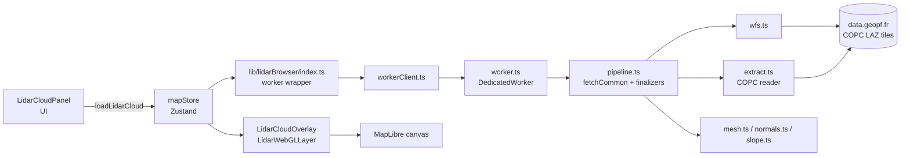
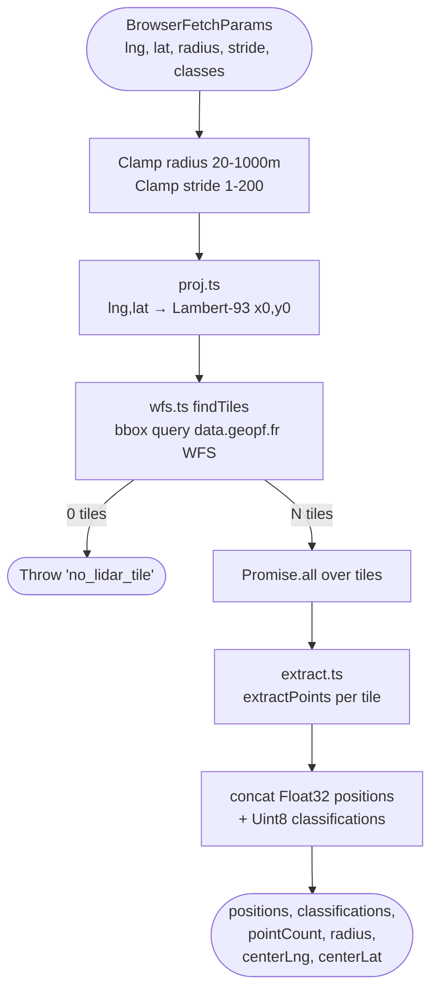
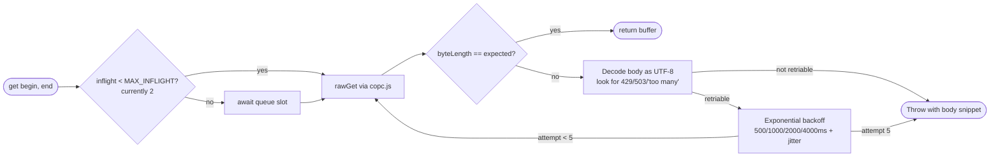
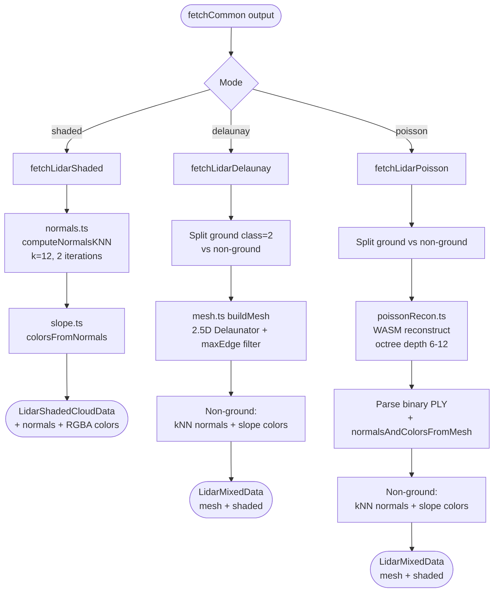
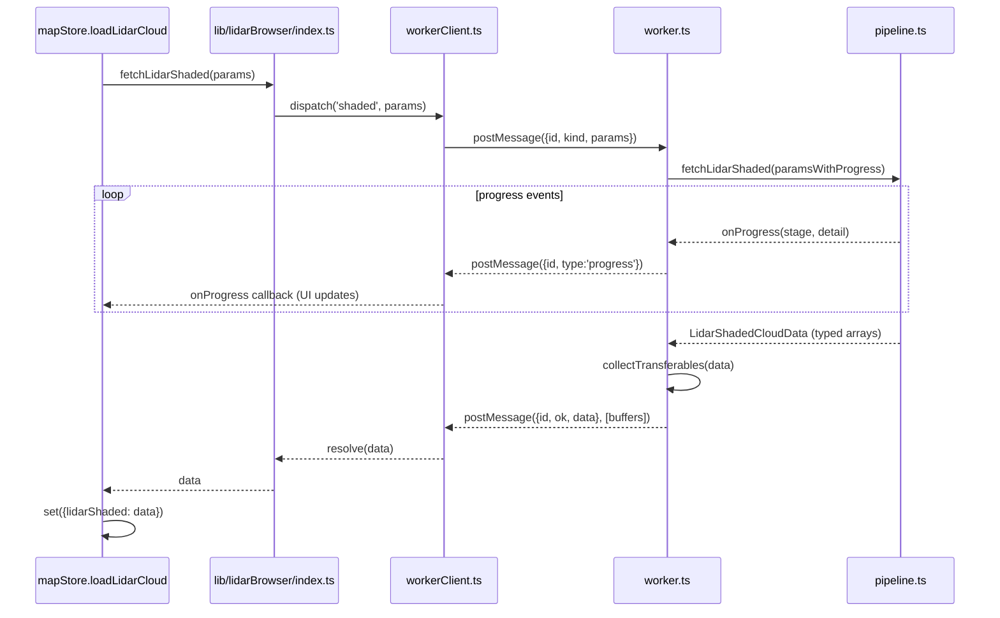
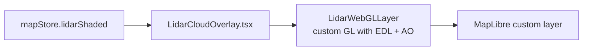

# Pipeline de chargement et traitement LiDAR HD

Cette page décrit le trajet d'un nuage de points depuis l'archive IGN LiDAR HD
jusqu'aux tableaux typés exploités par la couche WebGL. Tout s'exécute
**entièrement dans le navigateur**, dans un Web Worker, avec décodage des dalles
COPC via `copc.js` + `laz-perf` (WASM) et reconstruction de surface optionnelle
via PoissonRecon (WASM).

> Le **rendu WebGL 2** (shaders, EDL, intégration MapLibre) est documenté
> séparément dans [LIDAR_RENDERING.md](LIDAR_RENDERING.md).

## Pour les utilisateurs

### Charger un nuage

Dans le panneau **LiDAR** :

1. Centrez la carte sur la zone d'intérêt et ouvrez le panneau.
2. Choisissez le **rayon** (20 à 1000 m) et le **stride** (1 à 200, décimation
   1 point sur N).
3. Sélectionnez le **mode** :
   - **Points** (`shaded`) — tous les points sont conservés, normales calculées
     par k-NN, coloration par pente + Eye-Dome Lighting. Restitue parfaitement
     falaises, surplombs et végétation.
   - **Delaunay** (`delaunay`) — le sol (classe LAS = 2) est trié et trianglé
     en mesh Delaunay 2.5D, le reste (végétation, bâti) reste en points
     ombrés. Plus propre visuellement sur le sol, et un seul fetch suffit pour
     basculer les classes côté client.
   - **Poisson** (`poisson`) — le sol est reconstruit par PoissonRecon (WASM,
     octree adaptatif), le reste reste en nuage de points ombrés. Sortie la
     plus propre (mesh continu, sans triangles tendus en bordure), mais la plus
     coûteuse à calculer. La **profondeur d'octree** (6 à 12, défaut 9) règle
     le compromis vitesse / finesse.
4. Filtrez les **classes LAS** à conserver (sol, végétation basse / moyenne /
   haute, bâtiments, etc.). Note : en modes `delaunay` et `poisson`, le filtre
   est appliqué côté GPU au runtime — un changement de classes ne déclenche
   pas un nouveau fetch.
5. Lancez le chargement : une barre de progression suit les étapes
   (recherche de dalles → téléchargement → décodage → normales / mesh /
   reconstruction Poisson).

Chaque chargement est ajouté à la liste « Nuages récents » : le rouvrir depuis
la galerie est instantané (aucun re-calcul).

### Réglages embarqués avec chaque capture

Un nuage enregistré emporte les réglages qui ont servi à le générer, sous forme
d'un petit JSON libre (`src/lib/captureParams.ts`). Deux conséquences :

- **Deux captures de la même zone ne se marchent plus dessus.** L'empreinte des
  réglages (`captureParamsSignature`) entre dans la clé de dédoublonnage
  (`makeCloudKey`), donc relancer la même zone avec une profondeur d'octree ou
  une netteté différente crée une seconde entrée au lieu d'écraser la première.
- **La tuile affiche ce qui distingue.** Parmi les captures d'une même zone, la
  galerie ne met en avant que les réglages dont la valeur varie d'une entrée à
  l'autre (`differingCaptureParamKeys`) ; « Détails » déplie la liste complète,
  emprise et centre compris. Les captures sont aussi datées à la minute.
- **« Recapturer » rejoue le décor sans lancer la capture.**
  `recallCaptureSetup` (lidarSlice) restaure le mode, l'emprise, le cadrage et
  les réglages de génération, puis ouvre le panneau de capture — on peut donc
  changer un curseur avant de relancer, ce qui est tout l'intérêt d'un A/B. Sa
  table d'application est l'inverse de `captureParamsFromState` ; un réglage
  absent ou d'un type inattendu laisse le curseur en place.

### Génération et rendu : ce qui coûte une recapture, et ce qui ne coûte rien

La frontière ne passe pas là où le nom des réglages le suggère. Un nuage récent
n'emporte **que** les réglages de génération, parce qu'eux seuls exigent de
relancer le worker : mode, emprise, densités, et les curseurs Poisson ou grille.

Plusieurs réglages sont cuits à la capture *et* rejoués à chaud, et n'ont donc
rien à faire là :

- `lidarShader`, `lidarSnowLine`, `lidarSnowAmount`, `lidarRockType` — les quatre
  champs de `PaletteSettings`. Chaque setter recolore tous les nuages chargés via
  `colorsFromNormals` / `recolorMeshVertices`, qui appellent le même
  `vertexColor` que le worker : le résultat est identique. Une palette est une
  **ambiance de scène**, pas un paramètre de capture.
- `lidarCloudClasses` — aucun `fetchLidar*` ne reçoit ce paramètre ; c'est un
  masque GPU (`LidarWebGLLayer.setClassMask`).
- `lidarVegGroundGap` / `lidarVegGroundRough` — `recomputeVegHeights` refait les
  hauteurs de végétation en place (~200 ms, voir `LidarCloudOverlay`).

Ils appartiennent à l'**ambiance** d'une scène (`showcaseAmbiance.ts`), pas à
l'identité d'une capture. Les exclure de `makeCloudKey` évite de stocker deux
fois la même géométrie quand seule la couleur a changé.

Conséquence côté galerie : « Nuages récents » ne parle que de géométrie (charger,
recapturer, supprimer) et ne touche jamais au rendu courant — sans quoi rouvrir
un nuage repeindrait celui auquel on est en train de le comparer, shader et
masque de classes étant globaux. « Mes vues », sauvegardée explicitement, porte
l'ambiance : la charger la restaure, et « Appliquer le style »
(`applyAmbianceStyle`) l'applique aux nuages déjà affichés sans rien charger,
`lidarMode` excepté puisqu'il ne concerne que la prochaine capture.

Le format est délibérément un `Record<string, …>` et non une interface figée :
une entrée écrite par une version antérieure garde ses clés, un réglage ajouté
plus tard n'apparaît que sur les nouvelles entrées, et l'affichage retombe sur
la clé brute pour un réglage qu'il ne connaît pas. Les réglages voyagent aussi
dans l'export de scène (`captureParams` du manifeste) et reviennent intacts au
rechargement.

### Limitations connues

- **Aucune dalle** : si la zone n'est pas couverte par LiDAR HD, un toast
  *« Aucune dalle LiDAR HD »* s'affiche. Déplacez-vous ou élargissez le rayon.
- **Lenteur sur de gros rayons** : un rayon de 1000 m peut télécharger 4 dalles
  COPC et plusieurs dizaines de millions de points avant décimation. Augmentez
  le stride pour fluidifier.
- **Mode Poisson coûteux** : la reconstruction WASM est mono-thread et bloque
  le worker pendant plusieurs secondes (voire dizaines de secondes en
  profondeur 11–12). Préférez `mixed` pour de l'exploration rapide.
- **Erreurs 429 transitoires** : `data.geopf.fr` limite les requêtes par plage
  d'octets agressives. Le pipeline retente automatiquement (jusqu'à 5 fois) ;
  si l'erreur persiste, relancez plus tard.
- **Pas d'annulation** : un chargement en cours ne peut pas être interrompu
  proprement ; lancer un nouveau chargement remplace simplement le résultat
  (logique « le dernier gagne »).

---

## Pour les développeurs

### Vue d'ensemble

Les trois modes (`shaded`, `delaunay`, `poisson`) partagent le même prélude
(`fetchCommon`) puis dispatchent vers un finalizer dédié. `delaunay` et
`poisson` produisent tous deux un `LidarMixedData` (mesh sol + nuage non-sol),
`shaded` produit un `LidarShadedCloudData` ; la couche overlay les traite
uniformément.

### Fichiers

| Fichier | Rôle |
|---------|------|
| [src/components/ui/LidarCloudPanel.tsx](../src/components/ui/LidarCloudPanel.tsx) | UI : rayon, stride, mode, classes, déclenchement du chargement |
| [src/stores/mapStore.ts](../src/stores/mapStore.ts) | Action `loadLidarCloud`, gestion des courses (latest-wins) |
| [src/lib/lidarBrowser/index.ts](../src/lib/lidarBrowser/index.ts) | Wrapper qui dispatche vers le worker |
| [src/lib/lidarBrowser/workerClient.ts](../src/lib/lidarBrowser/workerClient.ts) | Côté main : `postMessage`, dé-multiplexage par id, transferables |
| [src/lib/lidarBrowser/worker.ts](../src/lib/lidarBrowser/worker.ts) | Boucle de réception, appel `pipeline.ts`, collecte des transferables |
| [src/lib/lidarBrowser/pipeline.ts](../src/lib/lidarBrowser/pipeline.ts) | `fetchCommon` + finalizers `fetchLidarShaded` / `fetchLidarDelaunay` / `fetchLidarPoisson` |
| [src/lib/lidarBrowser/wfs.ts](../src/lib/lidarBrowser/wfs.ts) | Recherche de dalles via WFS IGN (bbox lng,lat) |
| [src/lib/lidarBrowser/extract.ts](../src/lib/lidarBrowser/extract.ts) | Décodage COPC range-fetch, sémaphore + retry 429 |
| [src/lib/lidarBrowser/normals.ts](../src/lib/lidarBrowser/normals.ts) | Normales par k-NN (k=12, 2 itérations) |
| [src/lib/lidarBrowser/mesh.ts](../src/lib/lidarBrowser/mesh.ts) | Triangulation Delaunay 2.5D du sol, filtrage des longues arêtes |
| [src/lib/lidarBrowser/poissonRecon.ts](../src/lib/lidarBrowser/poissonRecon.ts) | Wrapper WASM PoissonRecon v18.76 (chargement paresseux, parsing PLY binaire) |
| [src/lib/lidarBrowser/slope.ts](../src/lib/lidarBrowser/slope.ts) | Couleurs RGBA dérivées des normales |
| [src/lib/lidarBrowser/proj.ts](../src/lib/lidarBrowser/proj.ts) | WGS84 ↔ Lambert-93 |
| [public/wasm/poissonrecon.mjs](../public/wasm/poissonrecon.mjs) | Bundle WASM PoissonRecon (chargé via `import()` dynamique) |

### Étape commune : `fetchCommon`

Les trois modes partagent le même prélude de fetch / crop, exécuté dans le
worker. À noter : `delaunay` et `poisson` ignorent le filtre `classes` à ce
stade — il leur faut le sol (classe 2) pour le mesh **et** le non-sol pour le
nuage. Le filtrage final est délégué au mask GPU de la couche overlay.

Notes :

- `radius` est le **demi-côté** d'un carré L93, pas un rayon de cercle.
- Le bbox WFS utilise l'ordre **lng/lat** malgré `srsname=EPSG:4326` —
  particularité IGN (cf. [wfs.ts](../src/lib/lidarBrowser/wfs.ts)).
- Les positions sont des **METER\_OFFSETS** (Float32 est/nord/up) relatifs au
  centre de la requête (`centerLng`, `centerLat`). Cela maintient une précision
  Float32 exploitable sur plusieurs centaines de mètres.

### Décodage COPC par dalle (`extract.ts`)

Une dalle COPC est un fichier LAZ de 0.5–2 GB indexé par un octree dans son
EVLR. On HTTP-Range-fetch uniquement les nœuds qui intersectent notre bbox.

#### Throttle et retry sur les 429 de `data.geopf.fr`

IGN limite les rafales de range-requests. Le wrapper `get` gère ça de façon
transparente :

- Jusqu'à **5 tentatives**, soit ≤ 7.5 s de backoff cumulé.
- Le sémaphore est par-dalle (chaque appel `extractPoints`). Avec 1–4 dalles,
  la concurrence globale effective est `tiles × MAX_INFLIGHT`. Si les 429
  persistent, baisser encore `MAX_INFLIGHT` ou hisser le sémaphore au scope
  module.

### Finalisation par mode

Après `fetchCommon`, le worker dispatche vers l'un des trois finalizers.

- **Mixed** : mesh Delaunay 2.5D rapide via [Delaunator](https://github.com/mapbox/delaunator),
  avec filtrage des arêtes longues pour éliminer les triangles tendus en
  bordure de zone. Idéal pour de l'exploration rapide.
- **Poisson** : reconstruction de surface PoissonRecon v18.76 (Misha Kazhdan)
  compilée en WASM, chargée paresseusement depuis `/wasm/poissonrecon.mjs`. Le
  module produit un PLY binaire qu'on reparse en `Float32Array` positions +
  `Uint32Array` indices. Les normales et couleurs sont ensuite recalculées par
  pondération d'aires (`normalsAndColorsFromMesh` dans `pipeline.ts`).

Dans les deux cas (`delaunay` et `poisson`), la sortie est un `LidarMixedData`
(mesh sol + nuage ombré non-sol), donc la couche overlay les traite de la
même manière.

### Frontière worker (`workerClient` ↔ `worker`)

Contrats clés :

- **Params clonables uniquement** : `workerClient.cleanParams` retire `signal`
  et `onProgress` (les fonctions et `AbortSignal` ne survivent pas à
  `postMessage`). L'annulation n'est pas propagée ; le store gère les courses
  en mode « le dernier gagne ».
- **Transferables** : chaque buffer de TypedArray du résultat est transféré
  en zéro-copie. Après `postMessage`, les références côté worker sont
  détachées.
- **Progress** : messages streamés de la forme
  `{ id, type: 'progress', progress: LidarProgress }`, dé-multiplexés par id
  de requête.

### Des données aux pixels

Une fois les données dans le store, l'overlay se ré-affiche :

`LidarWebGLLayer` utilise `args.defaultProjectionData.mainMatrix` de MapLibre
pour que les points restent calés sur le fond à n'importe quel pitch / bearing
/ zoom. Les METER\_OFFSETS sont convertis en Mercator dans le vertex shader via
`MercatorCoordinate.meterInMercatorCoordinateUnits()`.

### Limitations techniques

- **Pas de propagation d'annulation** vers le worker : un nouveau chargement
  ne stoppe pas l'ancien, on s'appuie sur la logique « latest-wins » du store.
- **Sémaphore par-dalle** : avec N dalles en parallèle, la concurrence
  globale est `N × MAX_INFLIGHT` ; sous 429 persistant, hisser le sémaphore
  au scope module est plus robuste que baisser `MAX_INFLIGHT`.
- **Float32 METER\_OFFSETS** : la précision se dégrade au-delà de quelques
  kilomètres ; le clamp `radius ≤ 1000 m` reste confortablement dans la zone
  exploitable.

### Points d'entrée pour le debug

| Symptôme                                        | Piste                                                                    |
|-------------------------------------------------|--------------------------------------------------------------------------|
| Retries `429 Too Many Requests`                 | Baisser `MAX_INFLIGHT` dans [extract.ts](../src/lib/lidarBrowser/extract.ts) |
| Toast *« Aucune dalle LiDAR HD »*               | Bbox WFS ; vérifier l'ordre lng,lat dans `wfs.ts`                        |
| Points qui dérivent au pitch / pan              | Matrice du shader `LidarWebGLLayer` ; vérifier l'usage de `mainMatrix`   |
| Worker silencieux / pas de progression          | Vérifier que `workerClient.cleanParams` conserve les params requis       |
