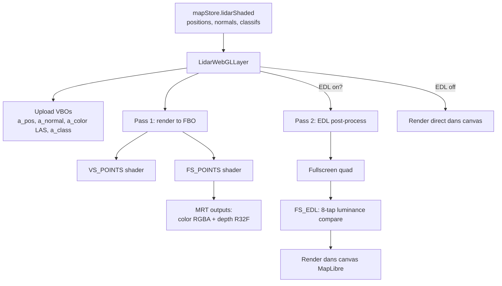
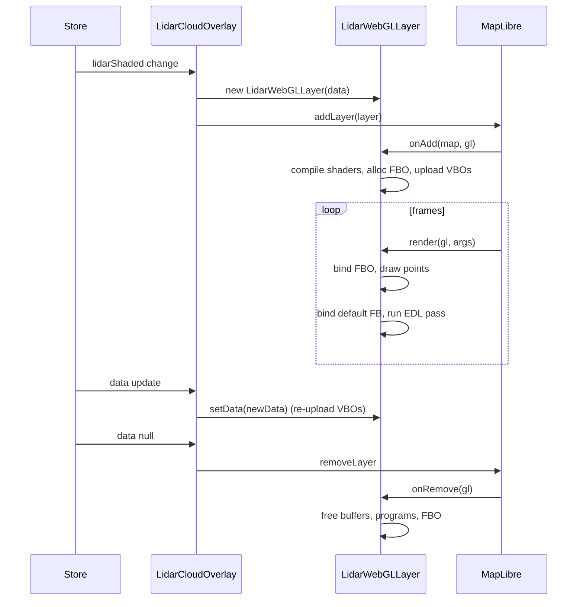

# Rendu WebGL 2 des nuages LiDAR

Cette page documente la couche de rendu : comment un `Float32Array` de positions (en
offsets mètres) devient des points colorés à l'écran, intégrés correctement dans la
projection 3D MapLibre.

> Le **pipeline de chargement** (WFS → COPC → normales → mesh) est documenté
> séparément dans [LIDAR_PIPELINE.md](LIDAR_PIPELINE.md).

## Pour les utilisateurs

### Modes

Le panneau **LiDAR** offre trois modes de rendu :

- **Shaded** (par défaut) — chaque point est rendu individuellement avec sa normale,
  coloré par la pente locale, éclairé en Lambert + Eye-Dome Lighting. Restitue
  parfaitement les falaises, surplombs, végétation.
- **Mixed** — le sol (classe LAS = 2) est triangulé en mesh Delaunay 2.5D, le reste
  (végétation, bâti) reste en points. Plus dense visuellement, plus rapide à charger.
- **Poisson** — reconstruction de surface PoissonRecon (WASM). Mesh 3D continu, lent
  à calculer mais visuellement très propre.

### Réglages

- **Taille de point** : 0.5 à 10 px
- **Compensation de taille** : si on décime (stride > 1), agrandit automatiquement les
  points pour éviter les trous
- **Opacité** : 0 à 100 %
- **Eye-Dome Lighting** : ombrage des contours par profondeur, donne un effet « relief »
  spectaculaire. Réglages : *strength* (1000–3000), *radius* (1.5 par défaut), *farPlane*
- **Préset shader** : `base` (gradient chaud), `terrain` (albédo physique : pelouse,
  roche et névés calés sur la ligne de neige), `slope` (dégradé standard par inclinaison :
  vert → jaune →
  orange → rouge → violet/rose, avec granularité fine au-delà de 35° et une teinte
  claire en fin d'échelle plutôt qu'un noir illisible)
- **Roche** : lithologie du massif pour le préset `terrain` — `limestone` (calcaire,
  s'éclaircit avec la pente), `granite`, `schist` (les deux s'assombrissent)
- **Ligne de neige** : 0–5000 m (défaut 2700). Pilote ensemble les névés, la ceinture
  d'alpage et le dessèchement de la pelouse. La borne haute passe au-dessus du mont
  Blanc : c'est ce qui permet de garantir une scène sans un flocon
- **Enneigement** : 0–100 % (défaut 50, qui reproduit le rendu d'origine). Épaisseur du
  manteau, indépendante de son altitude : la pente limite que la neige plâtre passe de
  30° à 86°, et le dénivelé sur lequel elle devient continue de 900 m à 100 m. Ne touche
  pas à la pelouse
- **Occupation du sol (CoSIA)** (préset `terrain`, activée par défaut) : arbitre
  *sol nu / pelouse / forêt* sur la couverture réelle mesurée par l'IA de l'IGN
  plutôt que sur la pente et l'altitude. Un alpage à 2 400 m reste vert au lieu de virer à la
  caillasse, un pierrier à 1 400 m reste minéral au lieu d'être gazonné, et le
  sous-bois prend la teinte dense de la forêt. La classe est **cuite à la
  capture** : une capture antérieure à l'option n'a pas l'attribut et la case est
  alors sans effet (il faut recapturer). Là où une classe a été mesurée elle est
  **sans appel** — une pelouse lue sur un versant à 50° est peinte en pelouse.
  Pente et altitude ne décident plus que des sommets non mesurés (hors mosaïque,
  eau, bâti, couleur de frontière entre deux classes).
  Ce que la classe **ne** touche **pas** : les névés, toujours pilotés par la
  ligne de neige — CoSIA voit la neige du jour du vol, pas un glacier. Sa classe
  *Neige* est d'ailleurs traitée comme « non mesuré » : sous la neige il y a
  peut-être un alpage, alors le repli pente + altitude reprend la main.
  Limite assumée : CoSIA est une vue **nadir**, donc une paroi verticale y occupe
  quelques pixels et hérite souvent de la végétation de son rebord.
- **Végétation enrichie** (activée par défaut) : rendu réaliste et lisible du feuillage
  (classes LAS 3/4/5). Réglages : *dégradé feuillage* (coloration tronc brun → cime vert
  clair selon la hauteur au-dessus du sol), *ombrage par normale* (intensité du relief
  calculé sur la normale des feuilles, 0 % = aplat EDL seul ; soleil allumé, 100 % =
  soleil pur et, en dessous, une part croissante d'éclairage neutre lui-même aplati par
  le curseur), *densité feuillage*
  (grossissement des points), *feuilles rondes* (splats
  ronds opaques découpés au disque). Le toggle maître rétablit la couleur de classe à
  plat et les splats carrés.
  En photoréaliste, l'*ombrage par normale* aplatit la lumière fixe (`N·L` et ambiante
  hémisphérique) comme le fait `flatMod` sur le chemin classique. Il ne le faisait pas :
  soleil éteint le curseur était **sans effet**, et soleil allumé il fondait le soleil
  dans une lumière fixe à relief complet — deux reliefs d'orientations différentes qui se
  compensaient à 50 %, d'où un creux au milieu de la course (amplitude du relief mesurée
  sur un couvert de Chartreuse : 0,137 / 0,081 / 0,184 à 0 / 50 / 100 %, contre 0 / 0,067 /
  0,185 désormais).
- **Filtre par classe** : cocher / décocher chaque classe LAS (sol, végétation basse,
  moyenne, haute, bâtiments, etc.)
- **Texture drapée** : projette un fond de carte en nadir sur la géométrie 3D —
  *Photo* (orthophotos IGN), *SCAN 25* (nécessite une clé IGN), *Plan* (Plan IGN v2),
  *Plan HD* (Plan IGN HD dérivé du LiDAR HD, nécessite la même clé IGN)
  ou *OSM*. Deux opacités séparées : *sol* (points classes 2/9 + mesh reconstruit) et
  *non-sol* (végétation, bâti…). La mosaïque est téléchargée une fois par nuage
  affiché, au zoom le plus fin dont l'assemblage tient dans `MAX_MOSAIC_PX`
  (4096 px de côté, la plus petite `MAX_TEXTURE_SIZE` sur laquelle on peut
  compter) et que la couche autorise (SCAN 25 s'arrête au z16, les autres au
  z19). Le budget est en **pixels** et non en tuiles, sinon une grande emprise
  reçoit la même image qu'une petite et sa résolution au sol s'effondre.
- **Affiner la zone visible** (case à cocher, sous le sélecteur de fond) : ajoute un
  **second niveau** de drapage. La mosaïque ci-dessus est figée à la capture, donc
  sa finesse est celle du zoom qui tenait dans le budget — sur 3 km c'est le z16
  (1,7 m/px) là où MapLibre diffuse du z19 (0,21 m/px). Monter le budget est
  exclu : du z19 sur 3 km demanderait ~15 600 px de côté, soit ~1 Go de VRAM et
  ~3 700 requêtes. À la place, quand la caméra s'arrête (`moveend`, débounce
  350 ms), une **deuxième** mosaïque couvrant seulement la zone vue est
  téléchargée au zoom le plus fin qui tient dans le même budget, et le shader la
  préfère partout où elle porte (`u_hasPhotoFine` / `u_uvRectFine`, unité de
  texture 4). En dessous, la mosaïque d'emprise reste affichée : un niveau fin
  absent, en retard ou hors cadre ne laisse jamais de trou.
  - La requête est quantifiée par `snapDetailView` (rayon arrondi à la puissance
    de deux supérieure, centre calé sur un quart de ce rayon) : un petit
    déplacement de caméra ne retélécharge rien.
  - Le rayon est mesuré sur le **bas** de l'écran : avec une caméra inclinée, le
    haut peut atteindre l'horizon et dimensionner la mosaïque là-dessus la
    rendrait aussi grossière que celle qu'elle doit battre.
  - Si la vue englobe déjà toute l'emprise, rien n'est téléchargé et le niveau
    fin est effacé — la mosaïque d'emprise est alors tout aussi fine.
  - Coût assumé : un lot de tuiles à chaque arrêt de caméra, d'où l'option
    désactivée par défaut. Utile surtout sur le SCAN 25, dont tout l'intérêt
    est le détail cartographique.
- **Date pour le soleil** : modifie la direction d'éclairage (ombrage Lambert)
- **Masquer le fond** : bascule l'opacité du fond MapLibre à 0 pour voir le LiDAR seul

### Limitations connues

- **Points circulaires durs** : pas d'alpha-fade sur les bords (pourrait être amélioré
  avec un sprite alpha).
- **EDL pas profondeur-aware** : il opère sur la luminance + une profondeur linéaire,
  pas sur la géométrie réelle. Sur des nuages très denses qui se superposent, peut
  sur-assombrir.
- **Z-test point ↔ mesh** : en mode mixed, on s'appuie sur le z-buffer ; les transitions
  peuvent montrer des artefacts.

---

## Pour les développeurs

### Fichiers

| Fichier | Rôle |
|---------|------|
| [src/components/map/LidarCloudOverlay.tsx](../src/components/map/LidarCloudOverlay.tsx) | Wrapper React, lazy-loaded, monte / démonte la `CustomLayer` |
| [src/components/map/LidarWebGLLayer.ts](../src/components/map/LidarWebGLLayer.ts) | ~970 lignes : `CustomLayerInterface` MapLibre, shaders, FBO, EDL post-process |
| [src/lib/lidarBrowser/groundHeight.ts](../src/lib/lidarBrowser/groundHeight.ts) | Hauteur de végétation par colonne verticale (clustering « sol étagé », correct en falaise ; seuil d'étagement réglable) pour la coloration végétation |
| [src/components/ui/lidar/LidarAppearanceControls.tsx](../src/components/ui/lidar/LidarAppearanceControls.tsx) | UI des réglages d'apparence (palette, classes, végétation, drapage) |
| [src/components/ui/lidar/LidarLightingControls.tsx](../src/components/ui/lidar/LidarLightingControls.tsx) | UI éclairage : soleil, « Forcer l'éclairage » |
| [src/components/ui/lidar/PhotorealControls.tsx](../src/components/ui/lidar/PhotorealControls.tsx) | UI rendu photoréaliste (exposition, spéculaire, micro-relief…) |
| [src/components/ui/lidar/ShadowControls.tsx](../src/components/ui/lidar/ShadowControls.tsx) | UI ombres portées (activation, intensité, taille de shadow map) |

### Architecture du rendu



### Vertex shader (extrait)

```glsl
#version 300 es
in vec3 a_pos;       // METER_OFFSETS
in vec3 a_normal;
in vec4 a_color;     // couleur de classification LAS uniquement
in float a_class;

uniform mat4 u_matrix;
uniform float u_mpu;     // meterInMercatorCoordinateUnits()
uniform float u_ps;      // point size en px
uniform vec3 u_sunDir;
uniform float u_sunIntensity;
uniform vec3 u_sunColor;
uniform uint u_classMask[8];   // 256 bits

out vec4 v_color;
out float v_depth;

void main() {
  // Filtre de classe sur le GPU
  uint cls = uint(a_class);
  uint word = cls >> 5;
  uint bit = cls & 31u;
  if ((u_classMask[word] & (1u << bit)) == 0u) {
    gl_Position = vec4(2.0);  // hors clip space
    return;
  }

  // Mètres → coords Mercator relatives à l'origine
  vec3 pos = vec3(a_pos.x * u_mpu, -a_pos.y * u_mpu, a_pos.z * u_mpu);
  gl_Position = u_matrix * vec4(pos, 1.0);
  gl_PointSize = max(u_ps, 1.0);

  // Lambert avec lumière soleil
  float diff = max(0.0, dot(normalize(a_normal), u_sunDir)) * u_sunIntensity;
  vec3 lit = a_color.rgb * 0.35 + a_color.rgb * (0.75 * diff) * u_sunColor;
  v_color = vec4(lit, a_color.a);
  v_depth = gl_Position.w;  // profondeur linéaire (Mercator units)
}
```

Constantes : ambient = 0.35, diffuse = 0.75. Le `0.35` empêche les zones non éclairées
de devenir noires.

Dans le shader réel, `a_color` n'est utilisée telle quelle que pour les points
**non-sol** : les points de classe 2 (sol) prennent la palette évaluée sur place par
`paletteAlbedo` (`glsl/lib/palette.glsl`), pilotée par les uniformes
`u_palettePreset`, `u_rockType`, `u_snowLine` et `u_snowAmount`, exactement comme
`mesh.vert`. Aucune couleur dérivée de la géométrie n'est donc pré-calculée ni
téléversée : changer un réglage de palette ne coûte que l'écriture des uniformes.

### Attribut `a_cover` : la classe CoSIA

La seule donnée d'apparence qui échappe à la règle ci-dessus est la classe
d'occupation du sol. Elle est **cuite à la capture**, pas échantillonnée au rendu :

- un octet par sommet (`a_cover`, `UNSIGNED_BYTE`, attribut **8** dans le VAO des
  points et **4** dans celui du mesh), valeurs `0` sol nu, `1` pelouse, `2` forêt,
  `255` inconnu ;
- l'uniforme `u_coverEnabled` (0/1) neutralise l'attribut sans recapture : à 0 le
  shader force `255` et la palette retombe exactement sur son comportement
  historique, ce qui rend la case à cocher A/B gratuite ;
- une capture sans l'attribut est téléversée remplie de `255`, donc identique à
  l'ancien rendu.

Pourquoi un attribut et pas une seconde texture drapée : la palette est évaluée
dans le **vertex** shader, et une classe ne s'interpole pas — un texel à mi-chemin
entre « pelouse » et « forêt » n'est pas une couverture intermédiaire, c'est du
bruit. Et une classe cuite est testable hors GPU, contrairement au GLSL qu'aucune
porte de validation ne compile.

L'arbitrage lui-même vit dans `palTurfFraction` (`glsl/lib/palette.glsl`) et son
jumeau testable `turfFraction` (`src/lib/lidarBrowser/slope.ts`) : **une classe
mesurée est sans appel**. `COVER_GRASS` et `COVER_WOOD` donnent une fraction
d'herbe de 1, `COVER_BARE` de 0 ; pente et altitude ne servent plus qu'à
`COVER_NONE`, où la fraction reste `smoothstep((45 - pente) / 9) × smoothstep((ligne
de neige - 100 - z) / 700)`. `COVER_WOOD` bascule en plus la teinte sur le vert
dense `TURF_LUSH` au lieu de la ceinture d'alpage dépendante de l'altitude.
Mesuré sur GPU contre la référence CPU : identique à l'octet près sur les 20 cas
de `slope.test.ts`.

Un veto de pente sur les classes mesurées a été essayé puis retiré : le terme
d'altitude du repli sature déjà à 1 sous `ligne de neige - 800 m`, donc la pente
y était le seul facteur restant, **identique dans les deux modes**. L'option ne
pouvait alors que retirer de l'herbe, jamais en rendre — elle était soustractive
par construction.

> ⚠️ Toute retouche de `palette.glsl` doit être portée dans `slope.ts` **dans la
> même passe** : `npm run test:run` ne compile pas le GLSL, seul `slope.ts` est
> couvert.

### Conversion mètres → Mercator

MapLibre travaille en coordonnées Mercator normalisées [0, 1]. Pour passer de mètres
relatifs au centre du nuage à Mercator :

```ts
const mc = MercatorCoordinate.fromLngLat([centerLng, centerLat], 0);
const mpu = mc.meterInMercatorCoordinateUnits();
// mpu ≈ 1 / (40075016.686 * cos(centerLat * π/180))
```

Le `u_matrix` est obtenu via `args.defaultProjectionData.mainMatrix`, ce qui garantit
que les points restent calés à n'importe quel pitch / bearing / zoom — un piège fréquent
pour les couches custom MapLibre.

### Class mask 256 bits

Les classifications LAS vont de 0 à 255. On encode leur visibilité dans **8 entiers
32 bits** envoyés en uniform :

```ts
const mask = new Uint32Array(8);
for (const cls of activeClasses) {
  mask[cls >> 5] |= (1 << (cls & 31));
}
gl.uniform1uiv(loc_classMask, mask);
```

Le filtre est fait dans le **vertex shader** (cf. extrait) : un point filtré renvoie
`gl_Position = vec4(2)` qui est rejeté par le clip. Cela évite tout overhead de drawcall
multiple.

### Eye-Dome Lighting (EDL)

Algorithme inspiré de QGIS / CloudCompare :

```glsl
// FS_EDL: échantillonne 8 voisins, accumule "à quel point je suis devant eux"
vec3 lumCoeff = vec3(0.299, 0.587, 0.114);
float cL = dot(color.rgb, lumCoeff);
vec2 texel = u_radius / texSize;

float response = 0.0, weight = 0.0;
for (each neighbor offset oi in 8 directions) {
  vec4 s = texture(uSrc, coord + oi * texel);
  if (s.a > 0.01) {
    response += max(0.0, cL - dot(s.rgb, lumCoeff));
    weight += 1.0;
  }
}
if (weight > 0.0) response /= weight;
float shade = exp(-u_strength * response);
fragColor = vec4(color.rgb * shade, color.a);
```

Effet : un point « devant » ses voisins est plus clair, ses bords sont assombris ; cela
crée un effet de relief sans avoir à calculer de vraies ombres.

> ⚠️ EDL travaille sur la **luminance**, pas sur la profondeur géométrique. C'est
> pourquoi on a parfois envie d'utiliser à la place `v_depth` (sortie MRT location 1).
> Le code actuel fait un mix des deux selon les uniformes.

### Compensation de taille

Quand `stride > 1`, des trous apparaissent. On ajuste :

```ts
const psEffective = lidarCloudSizeCompensation
  ? lidarCloudPointSize * Math.sqrt(stride)
  : lidarCloudPointSize;
```

Heuristique simple : doubler la densité décimée → augmenter le côté de point de √2 pour
recouvrir.

### Lifecycle de la couche



### Niveau de détail (LOD) selon la distance

Le calque décime automatiquement le nuage de points et le maillage quand la caméra
s'éloigne (zoom faible par rapport au `referenceZoom` du calque), une technique
 classique de moteur de jeu vidéo :

- Métrique de distance = zoom courant vs `referenceZoom` (même heuristique que la
  taille de point adaptative), pas la distance 3D réelle à la caméra.
- 3 niveaux (`POINT_LOD_LEVELS`/`MESH_LOD_LEVELS`) : plein détail, puis deux niveaux
  décimés (ratios ~35 % et ~10 %), avec une petite hystérésis pour éviter le
  scintillement au changement de niveau (« LOD popping »).
- Décimation via `meshoptimizer` (`MeshoptSimplifier.simplifyPoints` pour les points,
  `.simplify(...,['LockBorder'])` pour le maillage — `LockBorder` empêche le bord
  extérieur du maillage reconstruit de se déformer). Calcul différé
  (`requestIdleCallback`) et non bloquant : le premier rendu reste toujours en plein
  détail, la version décimée prend le relais dès qu'elle est prête.
- Activé par défaut (`config.lodEnabled`) ; un interrupteur de debug (`?debug=true` ou
  `?debug=lod`) permet de le désactiver en direct pour comparer.

### Limitations techniques

- **MRT requis** : nécessite `WEBGL_draw_buffers` + WebGL 2 (universal en 2026).
- **Pas de tile-based rendering** : le nuage entier est envoyé en VBO unique (mais le
  frustum culling et le LOD distance ci-dessus limitent le coût par frame pour la
  géométrie hors champ ou lointaine).
- **Sun direction recalculé chaque frame** mais `sunLight()` est suffisamment léger
  pour ne pas être un goulot.
- **Pas de feedback de chargement GPU** : si l'upload de VBO échoue (out of memory),
  on log mais on n'avertit pas l'utilisateur.
