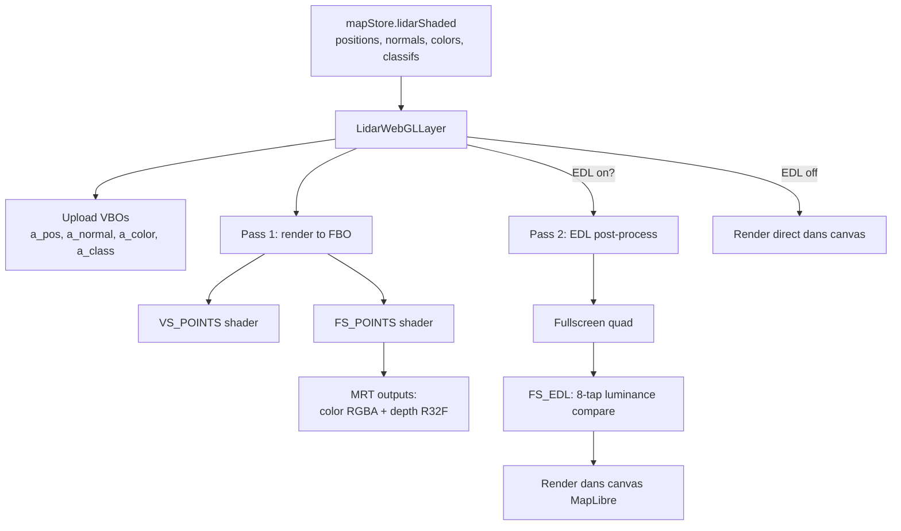
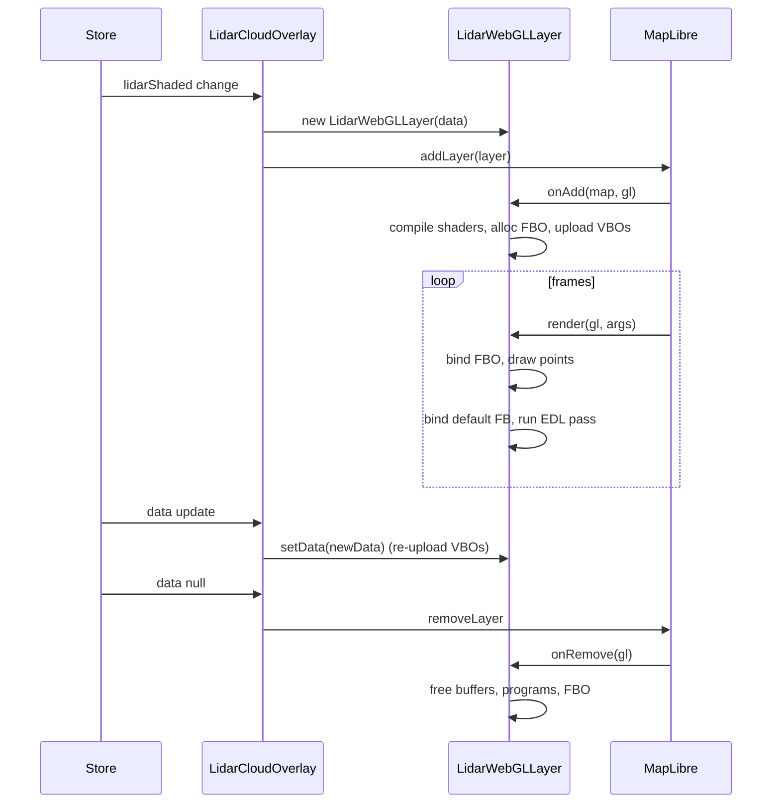

# Rendu WebGL 2 des nuages LiDAR

Cette page documente la couche de rendu : comment un `Float32Array` de positions (en
offsets mètres) devient des points colorés à l'écran, intégrés correctement dans la
projection 3D MapLibre.

> Le **pipeline de chargement** (WFS → COPC → normales → mesh) est documenté
> séparément dans [LIDAR_PIPELINE.md](LIDAR_PIPELINE.md).

## Pour les utilisateurs

### Modes

Le panneau **LiDAR** offre trois modes de rendu :

- **Shaded** (par défaut) — chaque point est rendu individuellement avec sa normale,
  coloré par la pente locale, éclairé en Lambert + Eye-Dome Lighting. Restitue
  parfaitement les falaises, surplombs, végétation.
- **Mixed** — le sol (classe LAS = 2) est triangulé en mesh Delaunay 2.5D, le reste
  (végétation, bâti) reste en points. Plus dense visuellement, plus rapide à charger.
- **Poisson** — reconstruction de surface PoissonRecon (WASM). Mesh 3D continu, lent
  à calculer mais visuellement très propre.

### Réglages

- **Taille de point** : 0.5 à 10 px
- **Compensation de taille** : si on décime (stride > 1), agrandit automatiquement les
  points pour éviter les trous
- **Opacité** : 0 à 100 %
- **Eye-Dome Lighting** : ombrage des contours par profondeur, donne un effet « relief »
  spectaculaire. Réglages : *strength* (1000–3000), *radius* (1.5 par défaut), *farPlane*
- **Préset shader** : `base` (gradient chaud), `cliff` (vert → calcaire → falaise sombre),
  `winter` (neige + aspect)
- **Végétation enrichie** (activée par défaut) : rendu réaliste et lisible du feuillage
  (classes LAS 3/4/5). Réglages : *dégradé feuillage* (coloration tronc brun → cime vert
  clair selon la hauteur au-dessus du sol), *ombrage par normale* (intensité du relief
  calculé sur la normale des feuilles, 0 % = aplat EDL seul), *densité feuillage*
  (grossissement des points), *feuilles rondes* (splats
  ronds opaques découpés au disque). Le toggle maître rétablit la couleur de classe à
  plat et les splats carrés.
- **Filtre par classe** : cocher / décocher chaque classe LAS (sol, végétation basse,
  moyenne, haute, bâtiments, etc.)
- **Date pour le soleil** : modifie la direction d'éclairage (ombrage Lambert)
- **Masquer le fond** : bascule l'opacité du fond MapLibre à 0 pour voir le LiDAR seul

### Limitations connues

- **Points circulaires durs** : pas d'alpha-fade sur les bords (pourrait être amélioré
  avec un sprite alpha).
- **EDL pas profondeur-aware** : il opère sur la luminance + une profondeur linéaire,
  pas sur la géométrie réelle. Sur des nuages très denses qui se superposent, peut
  sur-assombrir.
- **Pas de frustum culling** : tout le nuage est envoyé au GPU à chaque frame.
- **Z-test point ↔ mesh** : en mode mixed, on s'appuie sur le z-buffer ; les transitions
  peuvent montrer des artefacts.

---

## Pour les développeurs

### Fichiers

| Fichier | Rôle |
|---------|------|
| [src/components/map/LidarCloudOverlay.tsx](../src/components/map/LidarCloudOverlay.tsx) | Wrapper React, lazy-loaded, monte / démonte la `CustomLayer` |
| [src/components/map/LidarWebGLLayer.ts](../src/components/map/LidarWebGLLayer.ts) | ~970 lignes : `CustomLayerInterface` MapLibre, shaders, FBO, EDL post-process |
| [src/lib/lidarBrowser/groundHeight.ts](../src/lib/lidarBrowser/groundHeight.ts) | Hauteur de végétation par colonne verticale (clustering « sol étagé », correct en falaise ; seuil d'étagement réglable) pour la coloration végétation |
| [src/components/ui/LidarCloudPanel.tsx](../src/components/ui/LidarCloudPanel.tsx) | UI tous les réglages |

### Architecture du rendu



### Vertex shader (extrait)

```glsl
#version 300 es
in vec3 a_pos;       // METER_OFFSETS
in vec3 a_normal;
in vec4 a_color;
in float a_class;

uniform mat4 u_matrix;
uniform float u_mpu;     // meterInMercatorCoordinateUnits()
uniform float u_ps;      // point size en px
uniform vec3 u_sunDir;
uniform float u_sunIntensity;
uniform vec3 u_sunColor;
uniform uint u_classMask[8];   // 256 bits

out vec4 v_color;
out float v_depth;

void main() {
  // Filtre de classe sur le GPU
  uint cls = uint(a_class);
  uint word = cls >> 5;
  uint bit = cls & 31u;
  if ((u_classMask[word] & (1u << bit)) == 0u) {
    gl_Position = vec4(2.0);  // hors clip space
    return;
  }

  // Mètres → coords Mercator relatives à l'origine
  vec3 pos = vec3(a_pos.x * u_mpu, -a_pos.y * u_mpu, a_pos.z * u_mpu);
  gl_Position = u_matrix * vec4(pos, 1.0);
  gl_PointSize = max(u_ps, 1.0);

  // Lambert avec lumière soleil
  float diff = max(0.0, dot(normalize(a_normal), u_sunDir)) * u_sunIntensity;
  vec3 lit = a_color.rgb * 0.35 + a_color.rgb * (0.75 * diff) * u_sunColor;
  v_color = vec4(lit, a_color.a);
  v_depth = gl_Position.w;  // profondeur linéaire (Mercator units)
}
```

Constantes : ambient = 0.35, diffuse = 0.75. Le `0.35` empêche les zones non éclairées
de devenir noires.

### Conversion mètres → Mercator

MapLibre travaille en coordonnées Mercator normalisées [0, 1]. Pour passer de mètres
relatifs au centre du nuage à Mercator :

```ts
const mc = MercatorCoordinate.fromLngLat([centerLng, centerLat], 0);
const mpu = mc.meterInMercatorCoordinateUnits();
// mpu ≈ 1 / (40075016.686 * cos(centerLat * π/180))
```

Le `u_matrix` est obtenu via `args.defaultProjectionData.mainMatrix`, ce qui garantit
que les points restent calés à n'importe quel pitch / bearing / zoom — un piège fréquent
pour les couches custom MapLibre 5.

### Class mask 256 bits

Les classifications LAS vont de 0 à 255. On encode leur visibilité dans **8 entiers
32 bits** envoyés en uniform :

```ts
const mask = new Uint32Array(8);
for (const cls of activeClasses) {
  mask[cls >> 5] |= (1 << (cls & 31));
}
gl.uniform1uiv(loc_classMask, mask);
```

Le filtre est fait dans le **vertex shader** (cf. extrait) : un point filtré renvoie
`gl_Position = vec4(2)` qui est rejeté par le clip. Cela évite tout overhead de drawcall
multiple.

### Eye-Dome Lighting (EDL)

Algorithme inspiré de QGIS / CloudCompare :

```glsl
// FS_EDL: échantillonne 8 voisins, accumule "à quel point je suis devant eux"
vec3 lumCoeff = vec3(0.299, 0.587, 0.114);
float cL = dot(color.rgb, lumCoeff);
vec2 texel = u_radius / texSize;

float response = 0.0, weight = 0.0;
for (each neighbor offset oi in 8 directions) {
  vec4 s = texture(uSrc, coord + oi * texel);
  if (s.a > 0.01) {
    response += max(0.0, cL - dot(s.rgb, lumCoeff));
    weight += 1.0;
  }
}
if (weight > 0.0) response /= weight;
float shade = exp(-u_strength * response);
fragColor = vec4(color.rgb * shade, color.a);
```

Effet : un point « devant » ses voisins est plus clair, ses bords sont assombris ; cela
crée un effet de relief sans avoir à calculer de vraies ombres.

> ⚠️ EDL travaille sur la **luminance**, pas sur la profondeur géométrique. C'est
> pourquoi on a parfois envie d'utiliser à la place `v_depth` (sortie MRT location 1).
> Le code actuel fait un mix des deux selon les uniformes.

### Compensation de taille

Quand `stride > 1`, des trous apparaissent. On ajuste :

```ts
const psEffective = lidarCloudSizeCompensation
  ? lidarCloudPointSize * Math.sqrt(stride)
  : lidarCloudPointSize;
```

Heuristique simple : doubler la densité décimée → augmenter le côté de point de √2 pour
recouvrir.

### Lifecycle de la couche



### Limitations techniques

- **MRT requis** : nécessite `WEBGL_draw_buffers` + WebGL 2 (universal en 2026).
- **Pas de tile-based rendering** : le nuage entier est envoyé en VBO unique. Au-delà
  de ~5 M points, le frame time devient sensible. Solution future : split en chunks
  spatiaux et frustum culling.
- **Sun direction recalculé chaque frame** mais `sunLighting()` est suffisamment léger
  pour ne pas être un goulot.
- **Pas de feedback de chargement GPU** : si l'upload de VBO échoue (out of memory),
  on log mais on n'avertit pas l'utilisateur.
