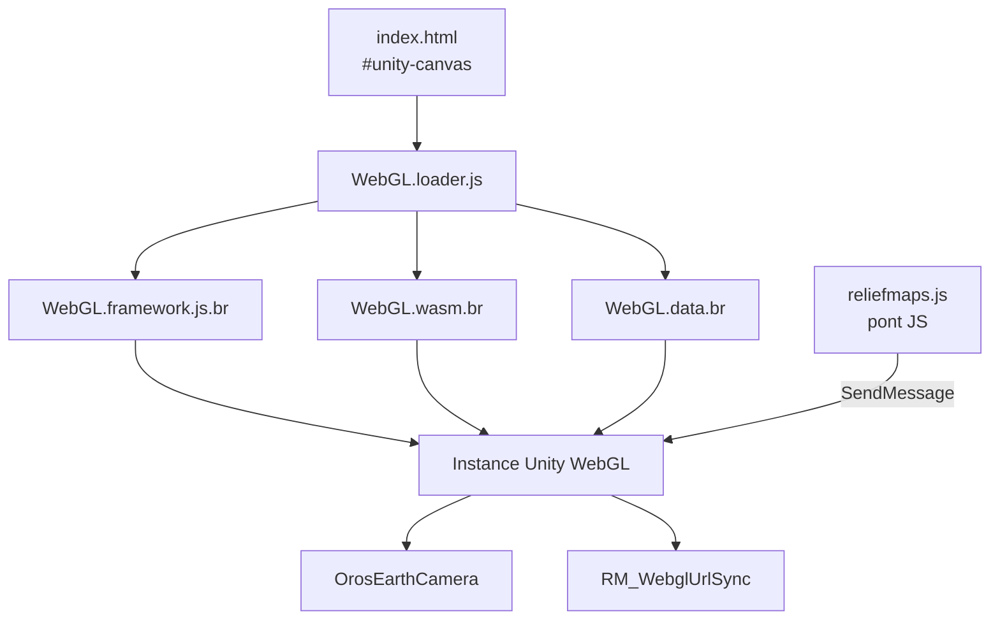
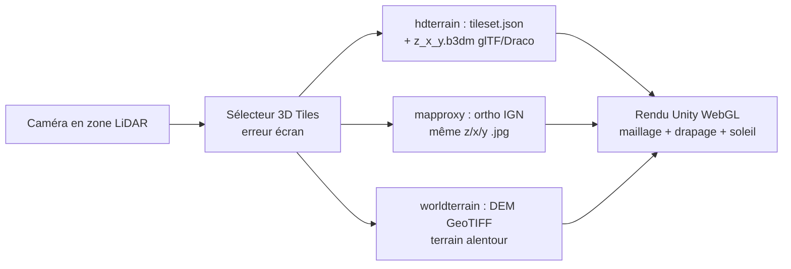
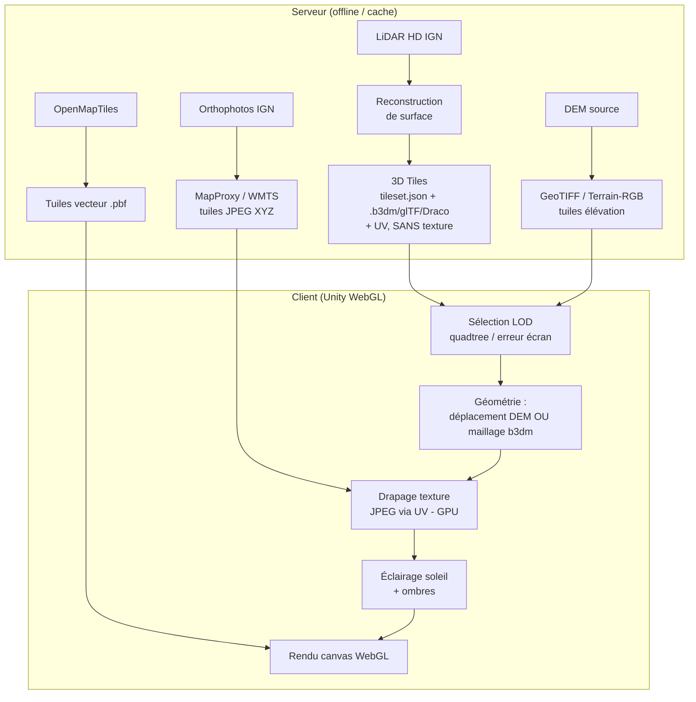

# Analyse de l'architecture de Relief Maps (app.reliefmaps.io)

Cette page documente le fonctionnement du rendu 3D de terrain de
[Relief Maps](https://app.reliefmaps.io), tel qu'observé par rétro-ingénierie
du client web en production (analyse du moteur de rendu, du trafic réseau et du
contenu binaire des tuiles). Elle sert de point de comparaison avec
l'implémentation web-native d'`open-cairn`.

> ⚠️ **Méthode** : cette analyse repose uniquement sur l'observation du client
> public (scripts chargés, requêtes réseau, en-têtes HTTP, décodage des tuiles
> `.b3dm` / glTF). Les détails internes du pipeline serveur sont déduits, pas
> confirmés par la documentation officielle.

---

## Table des matières

- [1. Vue d'ensemble](#1-vue-densemble)
- [2. Moteur de rendu : Unity → WebGL](#2-moteur-de-rendu--unity--webgl)
- [3. Sources de données](#3-sources-de-données)
- [4. Le terrain « normal » (heightfield)](#4-le-terrain--normal--heightfield)
- [5. Le relief LiDAR (3D Tiles)](#5-le-relief-lidar-3d-tiles)
- [6. Répartition serveur / client](#6-répartition-serveur--client)
- [7. Le texturage photo](#7-le-texturage-photo)
- [8. Volume de stockage des maillages](#8-volume-de-stockage-des-maillages)
- [9. Schéma de synthèse](#9-schéma-de-synthèse)
- [10. Comparaison avec open-cairn](#10-comparaison-avec-open-cairn)
- [11. Annexe : preuves observées](#11-annexe--preuves-observées)

---

## 1. Vue d'ensemble

Relief Maps assemble sa scène 3D à partir de **trois pyramides de tuiles XYZ
indépendantes** (`{z}/{x}/{y}`), streamées à la demande selon la position
caméra :

1. **Élévation** (géométrie) — DEM GeoTIFF / Terrain-RGB.
2. **Texture photo** — orthophotos IGN (France) ou raster stylisé (monde).
3. **Vecteur** — tuiles OpenMapTiles (sentiers, courbes de niveau, labels, POI).

Dans les zones couvertes par **IGN LiDAR HD**, une quatrième source apparaît :
un **maillage 3D pré-calculé** servi au format **OGC 3D Tiles** (`.b3dm` / glTF),
qui remplace le heightfield par une surface reconstruite haute fidélité.

Le tout est rendu par un **moteur Unity exporté en WebGL**, et non par une
librairie de cartographie web classique.

---

## 2. Moteur de rendu : Unity → WebGL

Le client n'expose **aucun** global de librairie cartographique
(`maplibregl`, `mapboxgl`, `Cesium`, `THREE`, `deck`, `L`, `Potree` sont tous
absents). À la place, c'est un projet **Unity** compilé en **WebGL** :

- Chargé via `Build/WebGL.loader.js`, `WebGL.framework.js.br`, `WebGL.wasm.br`,
  `WebGL.data.br` (compression Brotli).
- Globals `createUnityInstance` / `unityFramework` sur `window`.
- Rendu dans un unique `<canvas id="unity-canvas">` (contexte WebGL).
- Pont JS ↔ Unity via `SendMessage`, ciblant des GameObjects internes :
  - `OrosEarthCamera` — contrôleur caméra / globe (moteur « Oros »).
  - `RM_WebglUrlSync` — synchronisation de l'état caméra avec le hash d'URL
    (`lat,lon,alt,pitch,yaw,roll,...`).

Conséquence : le terrain est une **vraie géométrie 3D** éclairée en temps réel
par un soleil directionnel (l'ombrage et les ombres portées sont calculés par
le moteur), et non un simple plan incliné en 2.5D.



---

## 3. Sources de données

Toutes les données sont servies en pyramides de tuiles `{z}/{x}/{y}`,
streamées selon la vue.

| Rôle | Hôte / endpoint | Format |
|------|-----------------|--------|
| **Élévation (haute déf.)** | `worldterrain.reliefmaps.io/terrainserver/tiles/{z}/{x}/{y}.tif` | GeoTIFF (élévation) |
| **Élévation (monde, fallback)** | source `rgbterrain` (`raster-dem`) du style | Terrain-RGB (Mapbox) |
| **Photo (France, haute déf.)** | `mapproxy.reliefmaps.io/.../ORTHOIMAGERY.ORTHOPHOTOS/no-overlay/{z}/{x}/{y}.jpg` | Orthophotos IGN (cache MapProxy / WMTS) |
| **Photo / raster (monde)** | `worldmaps.reliefmaps.io/styles/ReliefMaps/{z}/{x}/{y}.webp` | Raster pré-rendu (TileServer GL) |
| **Vecteur** | `worldmaps.reliefmaps.io/data/OpenMapTiles/{z}/{x}/{y}.pbf` (+ OpenHikingTiles, ContourLines) | Tuiles vectorielles Mapbox |
| **Maillage LiDAR HD** | `hdterrain.reliefmaps.io/rm_tilesets/{parent}/{z}_{x}_{y}.b3dm` | OGC 3D Tiles (glTF, Draco) |

Le basemap mondial est une instance **TileServer GL** ; son `style.json` déclare
les sources `openmaptiles` (vecteur), `colormap` (Natural Earth), `contourlines`,
`trango` (OpenHikingTiles) et `rgbterrain` (`raster-dem`, élévation mondiale de
secours).

---

## 4. Le terrain « normal » (heightfield)

Hors zones LiDAR, le relief est un **champ de hauteurs construit à la volée
dans le navigateur** :

1. **Sélection LOD par quadtree** — la caméra choisit les tuiles selon distance
   et zoom (quadtree slippy-map standard). Près de la caméra : tuiles haut zoom ;
   au loin : tuiles grossières.
2. **Déplacement du maillage** — chaque GeoTIFF (ou Terrain-RGB mondial) est lu
   comme une grille d'élévations qui déplace un maillage en grille régulière
   (clipmap), produisant le relief 3D.
3. **Drapage de texture** — l'orthophoto (JPEG IGN sur la France, WebP stylisé
   ailleurs) correspondant à la tuile est échantillonnée comme texture de
   surface.
4. **Décoration vectorielle** — les tuiles `.pbf` OpenMapTiles ajoutent sentiers,
   courbes de niveau, labels et POI.
5. **Ombrage** — Unity éclaire le maillage déplacé avec un soleil directionnel.

➡️ Ici la **géométrie est calculée côté client** (déplacement de grille par le
DEM).

---

## 5. Le relief LiDAR (3D Tiles)

Dans les zones IGN LiDAR HD, un **nouvel hôte** apparaît uniquement en mode
LiDAR : `hdterrain.reliefmaps.io`. Il sert une hiérarchie **OGC / Cesium
3D Tiles** classique.

### 5.1 `tileset.json` — arbre LOD statique

Arbre imbriqué à erreur géométrique décroissante, avec volumes englobants :

```text
geometricError : 1000 → 500 → 250 → 125 → 62.5 → 31.25
content.uri    : "19_270784_188192.b3dm"
boundingVolume.box : [ ... ]
```

### 5.2 Tuiles `.b3dm` — maillages glTF

Chaque tuile est un **Batched 3D Model** (`b3dm`) :

- Magic `b3dm`, version 1, ~50 Ko.
- Tables feature/batch vides → **géométrie pure**, pas de batching par feature.
- Charge utile = **glTF binaire** (`glTF`, version 2) contenant :
  - positions `VEC3` (≈ 14 000 sommets),
  - normales / couleurs `VEC4` (uint8),
  - **coordonnées UV `VEC2`**,
  - indices `SCALAR` (≈ 79 000),
  - compression **`KHR_draco_mesh_compression`**.
- Un seul matériau `MergedMaterial` (PBR), **sans `baseColorTexture`** —
  voir [§7](#7-le-texturage-photo).

### 5.3 Ce n'est pas un nuage de points

Ce qui est affiché est une **surface maillée et texturée reconstruite à partir
du LiDAR HD** (blocs rocheux, falaises, arbres individuels en relief), **pas**
un nuage de points GPU épars. Le client se contente de décoder et dessiner les
maillages ; il ne fait **aucune** reconstruction.



---

## 6. Répartition serveur / client

Point clé : **la géométrie LiDAR est pré-calculée hors-ligne et servie en
fichiers statiques**, tandis que le **texturage est appliqué par le client**.

| Étape | Où | Quand |
|-------|----|-------|
| Nuage LiDAR HD → maillage (reconstruction de surface) | **Serveur (offline)** | Pré-cuit |
| Maillage → pyramide 3D Tiles (`tileset.json` + `.b3dm`) | **Serveur (offline)** | Statique (nginx) |
| Orthophotos IGN → reprojection + retiling XYZ JPEG | **Serveur** (MapProxy/WMTS) | Cache |
| Sélection de tuiles (erreur écran), décodage glTF/Draco | **Client (Unity WebGL)** | Temps réel |
| Drapage texture (UV) + éclairage soleil | **Client (Unity WebGL)** | Temps réel |

Preuves de la nature statique du maillage :

- `.b3dm` : `Last-Modified` figé (ex. `Mon, 23 Feb 2026`), `Content-Type:
  application/octet-stream`, servi par **nginx**.
- `tileset.json` : statique également (`Last-Modified` distinct), `geometricError`
  et bounding boxes codés en dur.

➡️ Le travail lourd (transformer le LiDAR brut en maillage propre et texturable)
se fait **une fois côté serveur**. Le client ne fait que **streamer et rendre**.

> À l'inverse, pour le **terrain normal** ([§4](#4-le-terrain--normal-heightfield)),
> la géométrie *est* construite au runtime dans le navigateur (déplacement de
> grille par le DEM). Seul le relief LiDAR HD est livré en maillages pré-cuits.

---

## 7. Le texturage photo

Le **drapage de la photo est effectué côté client**, sur le GPU. Le serveur ne
produit jamais de modèle 3D texturé ; il fournit séparément (a) des maillages
nus avec UV et (b) des tuiles image plates.

Preuve issue du décodage du glTF d'une tuile `.b3dm` :

- **Aucun `images`, `textures`, `samplers`** dans le glTF.
- Matériau unique `MergedMaterial` avec seulement un `baseColorFactor` (quasi
  noir) et **pas de `baseColorTexture`**.
- Mais présence de **coordonnées UV `VEC2`** → le maillage est « prêt à
  texturer » mais arrive nu.

Le client récupère l'**orthophoto JPEG séparément**, sous la **même clé de
tuile** que le maillage :

| Élément | URL |
|---------|-----|
| Maillage | `hdterrain.../14_8462_5881/`**`19_270794_188210`**`.b3dm` |
| Photo | `mapproxy.../ORTHOPHOTOS/no-overlay/`**`19/270794/188210`**`.jpg` |

Unity lie ce JPEG comme texture de couleur de base et l'échantillonne via les UV
du maillage → **le drapage est calculé sur le GPU au rendu, dans le navigateur**.

| Étape | Où |
|-------|----|
| Orthophotos IGN → reprojection + retiling XYZ JPEG (MapProxy WMTS) | **Serveur** |
| Maillage + **UV** (lors de la cuisson du maillage LiDAR) | **Serveur (offline)** |
| Liaison JPEG ↔ maillage, échantillonnage UV, drapage, éclairage | **Client (Unity WebGL)** |

➡️ L'imagerie est **préparée** côté serveur, mais le **texturage** de la
géométrie 3D est **côté client**. Même modèle pour le terrain normal : le DEM
construit le maillage, l'ortho JPEG est drapée au runtime.

---

## 8. Volume de stockage des maillages

### 8.1 Structure d'un tileset

Chaque `tileset.json` couvre **un parent z14** (≈ 1,73 km × 1,73 km à 45°N,
soit **≈ 3 km²**) et se subdivise en quadtree complet de z14 à z19 :

| Niveau | Nb tuiles | Taille moy./tuile (mesurée) | Sous-total |
|--------|----------:|----------------------------:|-----------:|
| z14 | 1 | 404 Ko | 0,4 Mo |
| z15 | 4 | 279 Ko | 1,1 Mo |
| z16 | 16 | 158 Ko | 2,5 Mo |
| z17 | 64 | 109 Ko | 7,0 Mo |
| z18 | 256 | 100 Ko | 25,7 Mo |
| z19 | 1024 | 63 Ko | 64,5 Mo |
| **Total / parent z14** | **1365** | — | **≈ 101 Mo** |

Les deux niveaux les plus fins (z18 + z19) représentent **~89 %** du volume. Les
maillages sont déjà compressés (Draco / `KHR_draco_mesh_compression`).

### 8.2 Densité de stockage

$$\frac{101\ \text{Mo}}{3\ \text{km}^2} \approx \mathbf{34\ \text{Mo/km}^2}$$

### 8.3 Couverture réelle : sélective, pas nationale

Le total dépend **entièrement de la surface maillée**. Or Relief Maps **ne
maille que les zones de relief**, pas toute la France. Vérification par sondage
de l'existence des `tileset.json` (tuile z14 calculée par lieu) :

| Lieu | Tuile z14 | `tileset.json` |
|------|-----------|:---:|
| Chamonix (Alpes) | `14_8504_5837` | **200 ✅** |
| Mont-Blanc sommet | `14_8504_5839` | **200 ✅** |
| Gavarnie (Pyrénées) | `14_8191_6038` | **200 ✅** |
| Paris centre | `14_8299_5636` | 404 ❌ |
| Plaine de Beauce | `14_8278_5681` | 404 ❌ |
| Bordeaux ville | `14_8165_5904` | 404 ❌ |
| Mont Ventoux | `14_8432_5946` | 404 ❌ |
| Forêt des Landes | `14_8146_5944` | 404 ❌ |
| Mer Méditerranée | `14_8442_6020` | 404 ❌ |

Le motif est net : **seuls les massifs renvoient un tileset** ; villes, plaines,
forêts et mer renvoient 404. Comme l'**IGN LiDAR HD couvre tout le territoire**,
cette absence est un **choix de Relief Maps** (mailler les zones de montagne
d'intérêt), pas une limite de la donnée source. La couverture est par
tuile-parent z14, donc **patchée massif par massif**.

### 8.4 Extrapolation à 34 Mo/km²

| Couverture | Exemple | Stockage maillages |
|-----------|---------|-------------------:|
| 100 km² | un massif local | ~3,4 Go |
| 1 000 km² | un parc national | ~34 Go |
| 10 000 km² | Alpes du Nord | ~340 Go |
| 50 000 km² | Alpes + Pyrénées | **~1,7 To** |
| 550 000 km² | (hypothétique : France entière) | **~18,6 To** |

> **Réserves :**
> - Chiffres = **maillages `.b3dm` seuls**. N'incluent **pas** les orthophotos
>   (servies à part par MapProxy, partagées avec le mode normal) ni les DEM
>   GeoTIFF.
> - Hypothèse de subdivision complète jusqu'à z19 partout ; les zones moins
>   détaillées peuvent être moins profondes → réel légèrement inférieur.
> - Ordre de grandeur : stockage **en téraoctets** dès qu'on couvre les grands
>   massifs — ce qui justifie le choix serveur (pré-cuisson + nginx statique)
>   plutôt qu'un calcul client.

---

## 9. Schéma de synthèse



**En une phrase** : géométrie du maillage = **pré-calculée serveur** ; tuiles
image = **pré-rendues serveur** ; mais la **combinaison géométrie + texture
(drapage)** = **côté client**.

---

## 10. Comparaison avec open-cairn

| Aspect | Relief Maps | open-cairn |
|--------|-------------|------------|
| Moteur de rendu | Unity → WebGL (canvas unique) | Web-native (WebGL 2 + MapLibre) |
| Reconstruction LiDAR | **Serveur**, pré-cuite en 3D Tiles | **Client**, dans un Web Worker (WASM) |
| Surface (Poisson / Delaunay) | Pré-calculée offline | PoissonRecon / Delaunay **dans le navigateur** |
| Décodage nuage | N/A (maillage déjà cuit) | COPC via `copc.js` + `laz-perf` (WASM) |
| Format livré au client | Maillages `.b3dm` texturables | Dalles LiDAR brutes (LAZ/COPC) |
| Texturage photo | Client (drapage GPU) | Client |
| Compromis | Client léger, prétraitement serveur lourd | Aucun prétraitement serveur, client lourd |

Relief Maps et open-cairn font le **compromis inverse** : Relief Maps
pré-cuit la reconstruction de surface côté serveur (cf. les meshes `.b3dm`),
alors qu'open-cairn exécute la reconstruction Poisson **côté client en WASM**
(cf. [POISSON_WASM.md](POISSON_WASM.md), [LIDAR_PIPELINE.md](LIDAR_PIPELINE.md)).

---

## 11. Annexe : preuves observées

Éléments factuels relevés sur le client en production :

- **Scripts Unity** : `Build/WebGL.loader.js`, `WebGL.framework.js.br`,
  `WebGL.wasm.br`, `WebGL.data.br` ; globals `createUnityInstance`,
  `unityFramework`.
- **Pont JS** : `TemplateData/reliefmaps.js` → `SendMessage('OrosEarthCamera', …)`,
  `SendMessage('RM_WebglUrlSync', …)`.
- **Basemap** : `worldmaps.reliefmaps.io` = TileServer GL ; `style.json` (v8)
  avec sources `openmaptiles`, `colormap`, `contourlines`, `trango`,
  `rgbterrain` (`raster-dem`).
- **Tier haute déf.** (zone Alpes) :
  - `worldterrain.reliefmaps.io/terrainserver/tiles/{z}/{x}/{y}.tif` (GeoTIFF),
  - `mapproxy.reliefmaps.io/.../ORTHOIMAGERY.ORTHOPHOTOS/no-overlay/{z}/{x}/{y}.jpg`.
- **Tier LiDAR** : `hdterrain.reliefmaps.io/rm_tilesets/{parent}/{z}_{x}_{y}.b3dm`
  + `tileset.json` (erreur géométrique 1000→31.25).
- **En-têtes statiques** : `.b3dm` et `tileset.json` servis par nginx avec
  `Last-Modified` figés ; ortho/DEM avec `cache-control: max-age=16070400`.
- **Décodage `.b3dm`** : header `b3dm` v1, tables feature/batch vides, charge
  glTF v2 ; glTF sans `images`/`textures`, matériau `MergedMaterial` sans
  `baseColorTexture`, attributs UV `VEC2` présents, `KHR_draco_mesh_compression`.
