# Itinéraires et profil altimétrique

## Pour les utilisateurs

### Tracer un itinéraire

1. Cliquez sur la carte pour poser un **premier waypoint**.
2. Chaque clic suivant ajoute un waypoint et calcule un nouveau **segment** depuis le
   précédent.
3. Le panneau bas s'ouvre automatiquement à la pose du premier point.

Vous pouvez :

- **Glisser-déposer** un waypoint sur la carte pour le déplacer
- **Réordonner** les waypoints dans le panneau de droite
- **Inverser** l'itinéraire (premier ↔ dernier)
- **Effacer** tout
- **Numérotation** : chaque waypoint affiche son index sur la carte

### Modes de calcul

Deux modes, **par segment** :

- **Guidé** (défaut) — l'API IGN piéton calcule le chemin le plus court (sentiers,
  chemins, parfois routes). Si l'API n'a pas de réponse pertinente (zone hors-sentier),
  on retombe silencieusement sur la ligne droite.
- **Libre** — ligne droite entre les deux waypoints. Utile pour mesurer une crête à vol
  d'oiseau.

Vous pouvez basculer le mode au global, ou par segment via le menu segment.

### Profil altimétrique

Le profil s'affiche dans le panneau bas dès qu'un itinéraire dépasse 2 waypoints :

- **Coloration par pente** : palette qui passe du vert (plat) au jaune, orange, rouge
  selon la déclivité
- **Survol synchronisé** : passez le curseur sur la courbe → un marqueur apparaît sur
  la carte au point correspondant
- **Sélection drag** : maintenez le clic pour sélectionner un tronçon de la courbe →
  le tronçon est mis en évidence sur la carte, et les statistiques (D+, D−, distance,
  durée) sont recalculées sur la sélection

Statistiques affichées :

- **Distance** totale (km)
- **Dénivelé positif (D+)** et **négatif (D−)**
- **Durée estimée** (vitesse de marche par défaut 4 km/h)

### Limitations connues

- L'API IGN piéton tombe parfois en rade silencieusement → on bascule sur la ligne
  droite, sans avertissement explicite. Vérifiez visuellement si le tracé suit bien
  un sentier.
- Lors d'un **déplacement de waypoint**, seuls les **deux segments adjacents** (celui
  qui arrive sur le waypoint et celui qui en part) sont recalculés ; les autres
  segments sont conservés tels quels. Pendant le drag, ces deux segments adjacents
  sont d'abord affichés en ligne droite (`computed: false`), puis remplacés par le
  tracé final dès que l'API IGN répond.
- Les **trous d'altitude** (z ≤ -100 m) sont remplacés par 0 ; vérifier les bords du
  graphique.
- L'altimétrie se fait par requêtes de 1500 points max ; les très longues routes sont
  paginées et la résolution peut varier en fonction.

---

## Pour les développeurs

### Vue d'ensemble

```mermaid
flowchart LR
    Click[Clic carte] --> Store[(routeStore)]
    Store --> SegBuild[buildSegments&#40;&#41;]
    SegBuild -->|guidé| Routing[routing.ts<br/>IGN Navigation]
    SegBuild -->|libre| Geo[geo.ts<br/>haversine + interp]
    Store --> Coords[routeCoordinates<br/>polyline fusionnée]
    Coords --> Elev[elevation.ts<br/>IGN Altimétrie]
    Elev --> Profile[profile + stats]
    Store --> Map[MapContainer<br/>GeoJSON layers]
    Store --> Chart[ElevationChart<br/>Chart.js]
    Chart -->|hover/select| Store
```



### Fichiers

| Fichier | Rôle |
|---------|------|
| [src/lib/routing.ts](../src/lib/routing.ts) | Appel API Navigation IGN (piéton, shortest), fallback ligne droite |
| [src/lib/elevation.ts](../src/lib/elevation.ts) | Échantillonnage altimétrique chunké (≤1500 pts/req) |
| [src/lib/geo.ts](../src/lib/geo.ts) | Haversine, somme de distances, interpolation, slicing, dedupe |
| [src/stores/routeStore.ts](../src/stores/routeStore.ts) | État Zustand : waypoints, segments, profil, stats, hover, selection |
| [src/components/ui/RoutePanel.tsx](../src/components/ui/RoutePanel.tsx) | UI waypoints, modes, boutons |
| [src/components/ui/ElevationChart.tsx](../src/components/ui/ElevationChart.tsx) | Graphique Chart.js, drag selection, hover |
| [src/components/map/MapContainer.tsx](../src/components/map/MapContainer.tsx) | Couches GeoJSON `route-line` + `route-points` + sélection |

### Schéma d'état (routeStore)

```ts
{
  waypoints: RouteWaypoint[]    // { id, coordinate: [lng,lat], modeFromPrevious?, name? }
  routeSegments: RouteSegment[]  // par paire de waypoints
  routeCoordinates: LngLatTuple[] // polyline fusionnée
  profile: ElevationSample[]     // { distance, elevation, coordinate, slope }
  stats: { distance, duration, ascent, descent }
  status: 'idle' | 'loading' | 'error'
  hoverDistance: number | null   // synchro graphe ↔ carte
  selectionRange: [number, number] | null
  routeMode: 'auto' | 'free'     // mode global par défaut pour nouveaux segments
  colorElevationBySlope: boolean
}
```

`RouteSegment` :

```ts
{
  id: string
  fromIndex: number
  toIndex: number
  mode: 'auto' | 'free'
  coordinates: LngLatTuple[]
  distance: number   // mètres
  duration: number   // secondes
  computed: boolean  // false = brouillon (ligne droite), recalcul en cours
  hasSnapStart?: boolean   // routeur a snappé le départ → vrai
  hasSnapEnd?: boolean
}
```

Persistance : clé localStorage `open-cairn-route` (waypoints + activeStatus uniquement,
les segments sont recalculés au boot).

### API Navigation

```
GET https://data.geopf.fr/navigation/itineraire
  ?resource=bdtopo-osrm
  &getSteps=false
  &timeUnit=second
  &optimization=shortest
  &profile=pedestrian
  &start={lng},{lat}
  &end={lng},{lat}
```

Le service retourne :

```json
{
  "geometry": { "type": "LineString", "coordinates": [...] },
  "distance": 1234.5,
  "duration": 1100
}
```

En cas d'absence de `geometry` ou d'erreur HTTP, fallback :

```ts
distance = haversineMeters(start, end);
duration = distance / 1.111; // 4 km/h = 1.111 m/s
coordinates = [start, end];
```

### API Altimétrie

```
POST https://data.geopf.fr/altimetrie/1.0/calcul/alti/rest/elevationLine.json
{
  "lon": "x|y|z",     // pipe-separated
  "lat": "x|y|z",
  "sampling": 200,
  "resource": "ign_rge_alti_wld"
}
```

Limite stricte : **1500 coordonnées par requête**. La fonction `fetchElevationProfile()`
chunke automatiquement, garde la continuité de distance entre chunks et concatène les
échantillons.

Filtrage : tout `z ≤ -100 m` est traité comme « no data » et remplacé par 0 m.

### Calcul de pente

```ts
slope = (dz / dx) * 100   // en %
```

où `dx` est la distance Haversine sur la polyline (entre deux échantillons consécutifs),
et `dz` la différence d'altitude. La coloration de la courbe utilise une rampe :

```
0–5 %   : vert
5–15 %  : jaune
15–30 % : orange
> 30 %  : rouge
```

### Sélection drag (ElevationChart)

L'utilisateur clique-glisse horizontalement sur le graphe. Le chart capture
`mousedown`/`mousemove`/`mouseup`, calcule la distance correspondant à chaque pixel via
`scales.x.getValueForPixel()`, et écrit `[d0, d1]` dans `routeStore.setSelectionRange()`.

Le store recalcule alors les stats sur le tronçon (en utilisant `lineSliceByDistance()`
de [geo.ts](../src/lib/geo.ts)) et MapContainer surligne la portion correspondante via
une seconde couche GeoJSON.

### Limitations techniques

- **Pas de cancellation** des requêtes en vol quand l'utilisateur ajoute rapidement
  plusieurs waypoints : on s'appuie sur un compteur de génération et on ignore les
  réponses obsolètes.
- **Recalcul global** à chaque modification : la stratégie actuelle recompute tous les
  segments en aval ; pour de longues routes (>20 waypoints), envisager un recalcul
  incrémental.
- **Pas d'undo/redo applicatif** ; on s'appuie sur la persistance simple localStorage.
