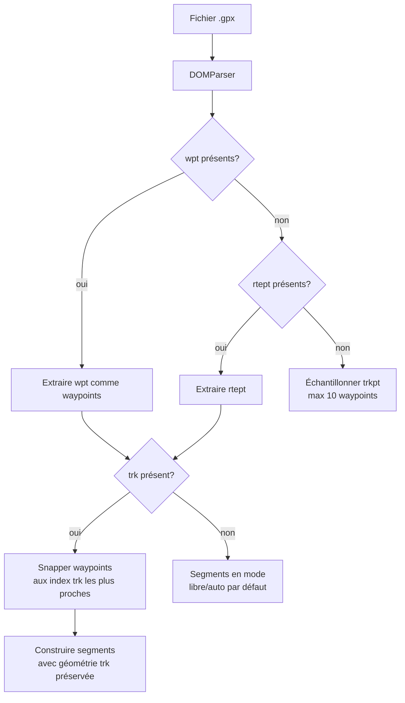

# Itinéraires sauvegardés et import / export GPX

## Pour les utilisateurs

### Sauvegarder un itinéraire

Dans le panneau **Itinéraires** (sidebar à droite, ou onglet *Itinéraires* sur mobile) :

- Bouton **Enregistrer** : sauve l'itinéraire courant dans le navigateur (localStorage)
  avec un nom modifiable.
- Le panneau liste vos itinéraires sauvegardés, triés par date, avec une miniature
  polyline et les statistiques (distance, D+).
- Cliquez sur une entrée pour la **charger** ; cela remplace l'itinéraire en cours.
- Boutons **Renommer** et **Supprimer** sur chaque entrée.

Les itinéraires sont stockés **uniquement dans votre navigateur** ; vider les données du
site les supprimera. Pour les transférer, exportez-les en GPX.

### Import / export GPX

Depuis le panneau itinéraire :

- **Importer GPX** : sélectionnez un fichier `.gpx` ; open-cairn extrait les waypoints
  et préserve la géométrie de la trace si elle est présente.
- **Exporter GPX** : télécharge un fichier `.gpx` 1.1 contenant les waypoints et la
  polyline complète de l'itinéraire.

### Limitations connues

- **Quota localStorage** ~5 MB selon le navigateur ; dépassé silencieusement → la
  sauvegarde échoue sans erreur visible. Limitez le nombre d'itinéraires longs
  sauvegardés.
- **Pas de synchro entre onglets** automatique (un événement custom est diffusé sur
  l'onglet courant uniquement).
- **GPX export sans altitude** : le profil altimétrique n'est pas inclus dans l'export.
- **GPX import** : les fichiers très complexes (multitrack, extensions Garmin) peuvent
  perdre des informations ; les waypoints `<wpt>` sont préférés, sinon `<rtept>`,
  sinon échantillonnage de la trace `<trkpt>` (max 10 waypoints).

---

## Pour les développeurs

### Itinéraires sauvegardés

#### Fichiers

| Fichier | Rôle |
|---------|------|
| [src/lib/savedRoutes.ts](../src/lib/savedRoutes.ts) | CRUD localStorage, génération de preview |
| [src/components/ui/SavedRoutesPanel.tsx](../src/components/ui/SavedRoutesPanel.tsx) | UI liste, miniatures SVG, actions |

#### Schéma

```ts
type SavedRoute = {
  id: string                  // route-{timestamp}-{rand6}
  name: string
  createdAt: string           // ISO 8601
  waypoints: RouteWaypoint[]
  segments: RouteSegment[]
  stats: { distance, duration, ascent, descent }
  preview: {
    bbox: [w, s, e, n]
    coords: LngLatTuple[]     // ~96 points downsampled
    elevations?: number[]     // ~96 échantillons
    summit?: LngLatTuple      // point culminant du profil
  }
}
```

Stockage : clé localStorage `open-cairn-saved-routes` → tableau JSON.

#### Diffusion d'événement

Au changement de la liste, on diffuse :

```ts
globalThis.dispatchEvent(new CustomEvent('open-cairn-saved-routes-changed'));
```

`SavedRoutesPanel` écoute cet événement pour rafraîchir sa vue. Pour synchroniser entre
onglets, on pourrait écouter en plus l'événement `storage` du navigateur.

#### Génération de preview

`buildPreview(coordinates, profile?, target = 96)` :

1. Échantillonne la polyline en `target` points (step-wise par index).
2. Si un profil altimétrique est fourni, échantillonne les altitudes **par distance**
   (pas par index) pour rester aligné avec les coords downsampled.
3. Calcule la bbox.
4. Identifie le point d'altitude max (sommet).

La miniature SVG est rendue côté UI à partir de `preview.coords`, mappées dans la bbox
avec un padding fixe.

### GPX

#### Fichiers

| Fichier | Rôle |
|---------|------|
| [src/lib/gpx.ts](../src/lib/gpx.ts) | `parseGpx()`, `exportGpx()`, `importGpxFile()` |

#### Parsing — stratégie de fallback



Quand une `<trk>` accompagne les waypoints, on **snappe** chaque waypoint à l'index de
trkpt le plus proche, puis on construit chaque segment à partir de la portion de trk
entre deux index consécutifs. Cela préserve la géométrie originale (sentiers virages
serrés, etc.) plutôt que de demander à l'API IGN un re-routing.

Garde-fou : on impose un ordre monotone des index (si un waypoint « recule », on snap
à l'index courant + 1). Ce n'est pas robuste pour les boucles ou traces inversées.

#### Export GPX

```xml
<?xml version="1.0" encoding="UTF-8"?>
<gpx version="1.1" creator="open-cairn">
  <metadata>
    <name>{routeName}</name>
    <time>{ISO 8601}</time>
  </metadata>
  <wpt lat="..." lon="...">
    <name>...</name>
  </wpt>
  ...
  <rte>
    <rtept lat="..." lon="..." />
    ...
  </rte>
</gpx>
```

L'échappement XML est minimal (`& < > " '` → entités). Pas de `<trk>` exporté car les
segments sont déjà aplatis dans la `<rte>`.

#### Limitations

- **DOMParser silencieux** sur XML cassé : on vérifie `<parsererror>` mais on ne
  re-throw pas systématiquement les exceptions.
- **Max 10 waypoints** quand on échantillonne depuis une trace seule (constante interne).
- **Pas d'altitude exportée** : si on veut l'ajouter, il faudrait stocker le profil
  par segment (nécessite de modifier `RouteSegment`).
- **Réimport ≠ identique** : un export puis import perd certaines métadonnées (mode
  guidé/libre par segment ramène au mode global par défaut si non encodé en extension).
