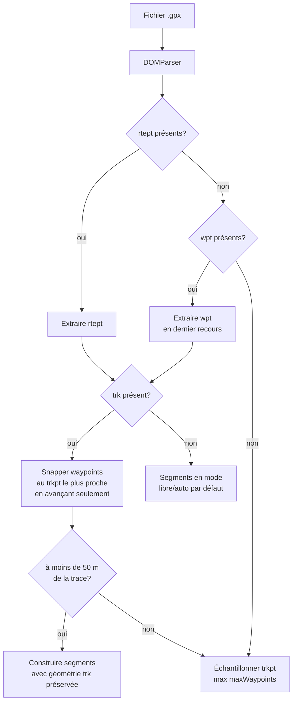

# Itinéraires sauvegardés et import / export GPX

## Pour les utilisateurs

### Sauvegarder un itinéraire

Dans le panneau **Itinéraires** (sidebar à droite, ou onglet *Itinéraires* sur mobile) :

- Bouton **Enregistrer** : sauve l'itinéraire courant dans le navigateur (localStorage)
  avec un nom modifiable.
- Le panneau liste vos itinéraires sauvegardés, triés par date, avec une miniature
  polyline et les statistiques (distance, D+).
- Cliquez sur une entrée pour la **charger** ; cela remplace l'itinéraire en cours.
- Boutons **Renommer** et **Supprimer** sur chaque entrée.

Les itinéraires sont stockés **uniquement dans votre navigateur** ; vider les données du
site les supprimera. Pour les transférer, exportez-les en GPX.

### Import / export GPX

Depuis le panneau itinéraire :

- **Importer GPX** : sélectionnez un fichier `.gpx` ; open-cairn extrait les waypoints
  et préserve la géométrie de la trace si elle est présente.
- **Exporter GPX** : télécharge un fichier `.gpx` 1.1 contenant les waypoints et la
  polyline complète de l'itinéraire.

### Marqueurs (`<wpt>`)

Un `<wpt>` GPX est un **point autonome** : un point d'intérêt, pas une étape de
l'itinéraire. Quand un fichier importé en contient (repères de course, refuges, sources…),
open-cairn les affiche sur la carte sous forme de **pastilles violettes accompagnées de
leur nom**, distinctes des waypoints numérotés de l'itinéraire.

Les noms qui se chevauchent sont masqués automatiquement (un fichier de course peut porter
des dizaines de repères) ; les pastilles, elles, restent toujours visibles.

Les marqueurs sont conservés au rechargement de la page et effacés par **Effacer
l'itinéraire**. Charger un autre itinéraire — GPX, itinéraire sauvegardé, galerie, lien
partagé — les remplace par ceux du nouveau fichier, ou par rien s'il n'en contient pas.
Ils ne sont pour l'instant ni créables à la main ni réexportés.

### Limitations connues

- **Quota localStorage** ~5 MB selon le navigateur ; dépassé silencieusement → la
  sauvegarde échoue sans erreur visible. Limitez le nombre d'itinéraires longs
  sauvegardés.
- **Pas de synchro entre onglets** automatique (un événement custom est diffusé sur
  l'onglet courant uniquement).
- **GPX export sans altitude** : le profil altimétrique n'est pas inclus dans l'export.
- **GPX import** : les fichiers très complexes (multitrack, extensions Garmin) peuvent
  perdre des informations ; les points de `<rte>` sont préférés, sinon les `<wpt>`,
  sinon échantillonnage de la trace `<trkpt>`.
- **« Points interm. »** ne s'applique **qu'à ce dernier repli** : un fichier qui porte un
  `<rte>` exploitable garde tous ses `<rtept>`, quelle que soit la valeur du champ. On ne
  redécoupe jamais un itinéraire que le fichier décrit déjà.
- **Balises `<wpt>` de signalisation** : beaucoup d'exports de course (Openrunner, par
  exemple) placent dans `<wpt>` des repères d'organisation — signaleurs, postes de secours,
  ravitaillements — qui ne sont ni sur la trace ni dans l'ordre du parcours. open-cairn les
  détecte, échantillonne la trace pour l'itinéraire plutôt que de fabriquer un parcours qui
  fait des allers-retours, et affiche ces repères comme marqueurs.

---

## Pour les développeurs

### Itinéraires sauvegardés

#### Fichiers

| Fichier | Rôle |
|---------|------|
| [src/lib/savedRoutes.ts](../src/lib/savedRoutes.ts) | CRUD localStorage, génération de preview |
| [src/components/ui/SavedRoutesPanel.tsx](../src/components/ui/SavedRoutesPanel.tsx) | UI liste, miniatures SVG, actions |

#### Schéma

```ts
type SavedRoute = {
  id: string                  // route-{timestamp}-{rand6}
  name: string
  createdAt: string           // ISO 8601
  waypoints: RouteWaypoint[]
  segments: RouteSegment[]
  stats: { distance, duration, ascent, descent }
  preview: {
    bbox: [w, s, e, n]
    coords: LngLatTuple[]     // ~96 points downsampled
    elevations?: number[]     // ~96 échantillons
    summit?: LngLatTuple      // point culminant du profil
  }
}
```

Stockage : clé localStorage `open-cairn-saved-routes` → tableau JSON.

#### Réactivité

La collection est créée par `createSavedCollection<SavedRoute>(SAVED_ROUTES_KEY)`
(cf. [src/lib/savedStore.ts](../src/lib/savedStore.ts)), qui expose un hook
`useSavedRoutes()` bâti sur `useSyncExternalStore` :

```ts
const routes = createSavedCollection<SavedRoute>(SAVED_ROUTES_KEY);
export const useSavedRoutes = routes.useItems;
```

Toute écriture passe par `writeAll`, qui notifie les abonnés — les composants
(`SavedRoutesPanel`, onglet *Itinéraires* de la galerie) se rafraîchissent seuls.
Les anciens `CustomEvent` DOM `open-cairn-saved-*-changed` ont été supprimés : ne
pas les réintroduire. Pour synchroniser entre onglets, on pourrait écouter en plus
l'événement `storage` du navigateur.

#### Génération de preview

`buildPreview(coordinates, profile?, target = 96)` :

1. Échantillonne la polyline en `target` points (step-wise par index).
2. Si un profil altimétrique est fourni, échantillonne les altitudes **par distance**
   (pas par index) pour rester aligné avec les coords downsampled.
3. Calcule la bbox.
4. Identifie le point d'altitude max (sommet).

La miniature SVG est rendue côté UI à partir de `preview.coords`, mappées dans la bbox
avec un padding fixe.

### GPX

#### Fichiers

| Fichier | Rôle |
|---------|------|
| [src/lib/gpx.ts](../src/lib/gpx.ts) | `parseGpx()`, `exportGpx()`, `importGpxFile()` |

#### Sémantique GPX 1.1

open-cairn s'en tient au sens que la spécification donne à chaque élément :

| Élément | Spécification | Usage open-cairn |
|---|---|---|
| `<rte>` / `<rtept>` | *« an ordered list of waypoints representing a series of turn points »* | les waypoints placés par l'utilisateur |
| `<trk>` / `<trkpt>` | *« an ordered list of points describing a path »* | la géométrie calculée des segments |
| `<wpt>` | *« a waypoint, point of interest, or named feature »* — point autonome | jamais exporté ; à l'import, marqueurs (ou repli d'itinéraire) |

#### Parsing — stratégie de fallback



`<rte>` fait autorité quand il est présent : c'est l'élément qui décrit un parcours. Les
`<wpt>` ne sont lus que si le fichier n'en contient aucun, car rien ne garantit qu'ils
décrivent l'itinéraire.

Quand une `<trk>` accompagne les waypoints, on **snappe** chaque waypoint à l'index de
trkpt le plus proche, puis on construit chaque segment à partir de la portion de trk
entre deux index consécutifs. Cela préserve la géométrie originale (sentiers virages
serrés, etc.) plutôt que de demander à l'API IGN un re-routing.

**Validation du snapping** (`snapWaypointsToTrack`) : chaque waypoint doit se trouver à
moins de `TRACK_SNAP_TOLERANCE_M` (50 m) de la trace. Sinon les points ne décrivent pas ce
tracé et on retombe sur l'échantillonnage de la trace seule. Sans ce contrôle,
`trackCoords.slice(a, b + 1)` avec `b < a` rend un tableau vide et on pousserait dans le
store un segment sans coordonnées ; l'ancien garde-fou (forcer un ordre monotone en
recopiant l'index précédent) le remplaçait par une ligne droite — d'où les « points
fantômes » qui traversaient la carte.

La recherche du trkpt le plus proche **ne repart jamais en arrière** : elle démarre à
l'index suivant celui du waypoint précédent. C'est indispensable pour une boucle ou un
aller-retour — un itinéraire exporté par open-cairn puis réimporté a un point d'arrivée
aux coordonnées exactes de son point de départ, et une recherche globale le snappait sur
l'index 0, invalidant toute la série et faisant bouger les points au réimport. L'ordre est
donc garanti par construction, et un waypoint réellement dans le désordre se retrouve trop
loin de tout ce qui reste devant lui : c'est la tolérance qui le rejette.

#### Marqueurs

`parseGpx` renvoie, à côté de `waypoints` / `segments`, un tableau `markers: MapMarker[]`
(champ **requis**) alimenté par les `<wpt>` :

```ts
export interface MapMarker { id: string; coordinate: LngLatTuple; name?: string }
```

Règle : un `<wpt>` devient un marqueur **sauf** s'il a été promu waypoint d'itinéraire
(fichier sans `<rte>` dont les `<wpt>` passent la validation du snapping) — sinon il serait
dessiné deux fois. En particulier le cas Openrunner (repli sur l'échantillonnage de la
trace) renvoie tous les `<wpt>` en marqueurs : c'est ce qui évite de perdre les noms.

Les id sont préfixés `mk-`, jamais `wp-`, pour ne pas entrer en collision avec les id de
waypoints utilisés comme `id` de feature MapLibre et par la garde anti-collision de
`routeStore`.

État et rendu :

| Élément | Emplacement |
|---|---|
| `markers` / `setMarkers` | [src/stores/routeStore.ts](../src/stores/routeStore.ts), persistés dans `open-cairn-route` |
| source `open-cairn-markers` + couches `open-cairn-marker-point` / `-label` | `ensureMarkerLayers()` dans [src/components/map/MapContainer.tsx](../src/components/map/MapContainer.tsx) |

`importRoute()` remet `markers: []` : remplacer l'itinéraire en bloc (itinéraire sauvegardé,
galerie) doit jeter les marqueurs du chargement précédent, sinon les postes de secours d'une
course se retrouvent sur un parcours sans rapport. L'import GPX appelle `setMarkers()` juste
après, donc l'ordre compte. `restoreWaypoints()` ne les touche PAS, sinon la restauration
localStorage au démarrage ([src/main.tsx](../src/main.tsx)) effacerait des marqueurs qui ont
été persistés avec l'itinéraire ; c'est la branche « lien partagé » de `main.tsx` qui vide
explicitement, un lien ne transportant aucun marqueur.

Les couches sont (ré)installées par `ensureRouteLayers()`, appelée à chaque `styledata`,
donc elles survivent aux reconstructions de style et aux bascules de vue. Le label utilise
`text-optional: true` sans `icon-image` : MapLibre laisse tomber les noms qui se
chevauchent, les cercles ne collisionnent jamais.

Prochaine étape prévue : créer et enregistrer des marqueurs à la main, ce qui demandera
d'émettre un bloc `<wpt>*` à l'export — **avant** `<rte>`, l'ordre imposé par le schéma
étant `metadata, wpt*, rte*, trk*`.

#### Export GPX

```xml
<?xml version="1.0" encoding="UTF-8"?>
<gpx version="1.1" creator="open-cairn"
  xmlns="http://www.topografix.com/GPX/1/1"
  xmlns:xsi="http://www.w3.org/2001/XMLSchema-instance"
  xsi:schemaLocation="http://www.topografix.com/GPX/1/1 http://www.topografix.com/GPX/1/1/gpx.xsd">
  <metadata><time>{ISO 8601}</time></metadata>
  <rte>
    <name>Itinéraire</name>
    <rtept lat="..." lon="..."><name>...</name></rtept>
    ...
  </rte>
  <trk>
    <name>Tracé</name>
    <trkseg>
      <trkpt lat="..." lon="..."></trkpt>
      ...
    </trkseg>
  </trk>
</gpx>
```

L'ordre `metadata, rte, trk` est celui qu'impose le schéma. Aucun `<wpt>` n'est émis : les
waypoints de l'itinéraire ne sont pas des points d'intérêt autonomes. L'échappement XML est
minimal (`& < > "` → entités).

Le fichier produit valide contre le XSD officiel :

```bash
curl -sO https://www.topografix.com/GPX/1/1/gpx.xsd
xmllint --noout --schema gpx.xsd itineraire.gpx
```

#### Limitations

- **DOMParser silencieux** sur XML cassé : on vérifie `<parsererror>` mais on ne
  re-throw pas systématiquement les exceptions.
- **Max 10 waypoints** quand on échantillonne depuis une trace seule (constante interne).
- **Pas d'altitude exportée** : si on veut l'ajouter, il faudrait stocker le profil
  par segment (nécessite de modifier `RouteSegment`).
- **Réimport ≠ identique** : un export puis import perd certaines métadonnées (mode
  guidé/libre par segment ramène au mode global par défaut si non encodé en extension).
