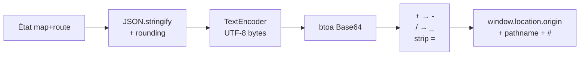

# Vue partageable (URL hash)

## Pour les utilisateurs

Le bouton **Partager** (en haut à gauche, ou dans le menu mobile) copie dans votre
presse-papier une URL qui contient l'**état complet** de l'application : position de
la carte, fonds choisis, ombrage, terrain, et waypoints de votre itinéraire.

Coller cette URL dans une autre fenêtre / l'envoyer à quelqu'un :

- la même vue 3D s'ouvrira ;
- le même fond et le même ombrage seront actifs ;
- l'itinéraire et la sélection éventuelle seront restaurés.

### Ce qui n'est **pas** inclus

- Vos clés API IGN (à ressaisir manuellement par le destinataire si nécessaire)
- Vos itinéraires sauvegardés (uniquement le courant)
- Les nuages LiDAR chargés (non sérialisables ; le destinataire doit cliquer
  *Charger ici* à son tour s'il veut le recharger)

### Limitations

- **Longueur d'URL** : avec un itinéraire à beaucoup de waypoints, l'URL peut
  dépasser ~2000 caractères et être tronquée par certains clients (Slack, Twitter).
- **Versionning** : un changement de schéma rendra les anciennes URL invalides ;
  pour l'instant, on incrémentera le `v` et on gardera un fallback minimal.

---

## Pour les développeurs

### Fichier

[src/lib/shareView.ts](../src/lib/shareView.ts)

### Format d'URL

```
https://<host>/<path>#<base64url-encoded JSON>
```

Le payload est dans le **fragment** (hash), pas dans la query string :

- pas envoyé au serveur (peut être plus long)
- pas indexé par les caches d'URL externes

### Schéma `SharePayload` v1

```ts
{
  v: 1,
  // Vue carte
  lng, lat, z, p (pitch), b (bearing),
  // Fonds & overlays
  bl,    // baseLayer
  hs,    // hillshadeEnabled
  hss,   // hillshadeSource
  hsb,   // hillshadeBlend
  hsi,   // hillshadeIntensity
  te,    // terrainEnabled
  tex,   // terrainExaggeration
  cl,    // contourLinesEnabled
  clo,   // contourLinesOpacity
  // Route
  ra,    // routeActive
  rm,    // routeMode 'auto' | 'free'
  ces,   // colorElevationBySlope
  wps: [{ c: [lng, lat], m?: 'auto' | 'free' }],
  sel?: [d0, d1]   // selectionRange en mètres
}
```

Les noms de champs sont volontairement courts pour économiser sur la longueur du payload.

### Encodage



Décodage : reverse strict.

### Arrondis

Pour minimiser la taille :

| Champ                      | Précision      |
|----------------------------|----------------|
| `lng`, `lat`               | 6 décimales (~10 cm) |
| `z`, `p`, `b`              | 2 décimales    |
| `hsi`, `tex`, `clo`        | 2 décimales    |
| `wps[].c`                  | 6 décimales    |
| `sel`                      | 0 décimale (mètres entiers) |

### Restauration

Au mount du composant racine ([App.tsx](../src/App.tsx)) :

```ts
useEffect(() => {
  const hash = window.location.hash.slice(1);
  if (!hash) return;
  const payload = decodeShareState(hash);
  if (!payload) return;
  applyMapState(payload);
  applyRouteState(payload);
}, []);
```

En cas d'échec (hash mal formé, version inconnue), on **ignore silencieusement** :
l'utilisateur tombe sur l'état persisté localement.

### Versionning

Quand on évoluera vers `v: 2` :

```ts
function decodeShareState(hash: string): SharePayload | null {
  const raw = parseHash(hash);
  if (!raw || typeof raw.v !== 'number') return null;
  if (raw.v === 1) return migrateV1ToV2(raw);
  if (raw.v === 2) return raw as SharePayload;
  return null;
}
```

### Limitations techniques

- **Pas de validation Zod / Valibot** : on fait confiance à la structure, ce qui peut
  introduire `undefined` dans les setters Zustand. Préférable d'ajouter une validation
  de schema avant l'application.
- **Pas de migration history** : seule la version courante est gérée ; un visiteur avec
  un lien d'il y a plusieurs mois peut atterrir sur un état partiellement appliqué.
- **L'utilisateur partageant ne sait pas** combien d'éléments l'URL contient : pas de
  warning sur dépassement de longueur.
