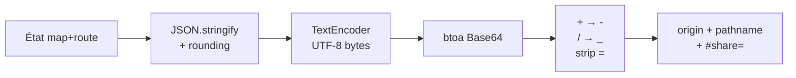

# Vue partageable (URL hash)

## Pour les utilisateurs

Le bouton **Partager** (dans le groupe d'actions en haut à droite, ou dans le menu
mobile) copie dans votre presse-papier une URL qui contient l'**état complet** de ce
que vous voyez : position de la carte, fonds choisis, ombrage, terrain, ciel, date et
heure du soleil, et waypoints de votre itinéraire.

Coller cette URL dans une autre fenêtre / l'envoyer à quelqu'un :

- la même vue 3D s'ouvrira — y compris un **point de vue** au sol : le destinataire se
  retrouve debout au même endroit, tourné dans la même direction et avec la même
  focale ;
- le même fond, le même ombrage et le même ciel seront actifs ;
- les trajectoires soleil / lune s'afficheront à la **même date et à la même heure** ;
- l'itinéraire et la sélection éventuelle seront restaurés.

### Ce qui n'est **pas** inclus

- Vos clés API IGN (à ressaisir manuellement par le destinataire si nécessaire ; un
  fond IGN privé retombe sur *Plan IGN* chez qui n'a pas de clé)
- Vos itinéraires sauvegardés (uniquement le courant)
- Les nuages LiDAR chargés (non sérialisables ; le destinataire doit dessiner
  sa zone et cliquer *Capturer* à son tour s'il veut le recharger)
- Les réglages d'éclairage du **Studio LiDAR** (exposition, ambiance, intensité du
  soleil). Ils ne sont pas réglables depuis la vue Itinéraire mais teintent quand même
  le ciel atmosphérique : le destinataire garde les siens.
- L'affichage des **noms des sommets** en *Point de vue* : c'est un confort de lecture,
  pas une vue. Le destinataire garde son propre choix, et le lien lui ouvre bien la même
  image.

### Limitations

- **Longueur d'URL** : avec un itinéraire à beaucoup de waypoints, l'URL peut
  dépasser ~2000 caractères et être tronquée par certains clients (Slack, Twitter).
- **Versionning** : un lien émis par une version antérieure du schéma est ignoré, et
  le destinataire ouvre l'application sur son état local. L'application est en
  pré-version : aucun lien ancien n'est migré.

---

## Pour les développeurs

### Fichiers

| Rôle | Fichier |
|---|---|
| Schéma, encodage, décodage | [src/lib/shareView.ts](../src/lib/shareView.ts) |
| Lecture de l'état à partager | [src/lib/useShare.ts](../src/lib/useShare.ts) |
| Application à l'ouverture | [src/main.tsx](../src/main.tsx) |

### Format d'URL

```
https://<host>/<path>#share=<base64url-encoded JSON>
```

Le payload est dans le **fragment** (hash), pas dans la query string :

- pas envoyé au serveur (peut être plus long)
- pas indexé par les caches d'URL externes

Le préfixe `#share=` distingue ce fragment de celui que MapLibre écrit lui-même
(`hash: true`).

Ce fragment MapLibre (`#zoom/lat/lng/bearing/pitch`) peut garder un pitch > 90 quand on
regarde vers le haut en *Point de vue*. Le constructeur `Map` le rejoue avant que le garde
de collision avec le terrain soit coupé, et plante. `main.tsx` le borne donc à 90
(`clampHashPitch`, `src/lib/mapHash.ts`) avant le premier rendu.

### Schéma `SharePayload` v2

```ts
{
  v: 2,
  // Vue carte
  lng, lat, z, p (pitch), b (bearing),
  vp?,   // point de vue : [lng, lat, altitude, bearing, pitch, fovDeg, heightM]
  // Fonds & overlays
  bl,    // baseLayer
  tp,    // toponymsEnabled (surcouche de noms, sur les fonds sans texte)
  hs,    // hillshadeEnabled
  hss,   // hillshadeSource
  hsb,   // hillshadeBlend
  hsi,   // hillshadeIntensity
  te,    // terrainEnabled
  tex,   // terrainExaggeration
  tds,   // terrainDemSource 'auto' | 'ign' | 'mapterhorn'
  cl,    // contourLinesEnabled
  clo,   // contourLinesOpacity
  // Ciel, soleil, lune
  sd,    // lidarSunDate, "YYYY-MM-DDTHH:mm" (heure locale naïve)
  as,    // atmosphericSky
  sp,    // skySunPath
  mp,    // skyMoonPath
  hp,    // skyHiddenPath
  // Route
  ra,    // routeActive
  rm,    // routeMode 'auto' | 'free'
  ces,   // colorElevationBySlope
  wps: [{ c: [lng, lat], m?: 'auto' | 'free' }],
  sel?: [d0, d1]   // selectionRange en mètres
}
```

Les noms de champs sont volontairement courts pour économiser sur la longueur du payload.

### Le bloc point de vue (`vp`)

Le mode *Point de vue* ne se laisse pas décrire par `lng/lat/z/p/b`, et c'est
structurel : la caméra MapLibre qu'il produit a son centre parqué à 4 km de l'œil, à
une altitude qui n'a rien à voir avec le relief, et son zoom dépend de la **hauteur du
canvas** (voir [viewpointCamera.ts](../src/lib/viewpointCamera.ts)). Rejouer cette
caméra chez quelqu'un dont la fenêtre n'a pas la même taille cadre autre chose.

Ce qui est portable, c'est le **point de station** : l'œil, la direction du regard et
la focale. `cameraForViewpoint` reconstruit le reste à l'arrivée.

L'altitude absolue de l'œil voyage quand même, mais elle ne suffit pas : à l'arrivée
`settleOnGround` la **rabat sur le sol** que le destinataire charge, qui n'est pas celui
que l'émetteur voyait. Sans le septième nombre, une station remontée à 50 m aux flèches
retomberait silencieusement à la hauteur d'arrivée (10 m) chez le destinataire. `heightM` dit **à quelle
hauteur se reposer**, et il est borné à la lecture à `[1,7 ; 3000]` m comme le pitch et
la focale.

Trois conséquences dans le code :

- `useShare` lit `bearing` / `pitch` / `fov` **sur la carte**, pas dans le store :
  `ViewpointController` les garde dans une closure, parce qu'un écrit dans le store à
  chaque image faisait saccader la rotation.
- le store gagne un `viewpointFraming` (session, non persisté) que seul un lien partagé
  remplit ; `setViewpoint` le remet à `null`, donc choisir un nouveau point de vue à la
  souris repart toujours des valeurs par défaut. `viewpointHeightM` suit la même règle,
  mais lui est écrit **aussi pendant le mode** (à chaque appui sur une flèche), parce que
  `settleOnGround` doit le relire à chaque `idle` ; une frappe de touche n'est pas une
  image d'animation, l'écriture ne coûte rien.
- `ViewpointController` pose lui-même `setMaxPitch(VIEWPOINT_MAX_PITCH)` à l'entrée :
  l'effet parent qui relève ce plafond s'exécute *après* le sien, et un regard au-dessus
  de l'horizon serait resté bloqué à 85°.

Le `lng/lat/z/p/b` du payload reste celui d'**avant** l'entrée dans le mode (les images
du mode ne sont pas publiées dans le store, exprès) : il ne sert que de vue de départ de
la carte, que le mode écrase au montage.

### Encodage



Décodage : reverse strict.

### Arrondis

Pour minimiser la taille :

| Champ | Précision |
|---|---|
| `lng`, `lat`, `wps[].c`, `vp[0..1]` | 6 décimales (~10 cm) |
| `z`, `hsi`, `tex`, `clo`, `vp[5]` (fov) | 2 décimales |
| `p`, `b`, `vp[2..4]` (altitude, cap, pitch) | 1 décimale |
| `sel` | 1 décimale (mètres) |

### Restauration

Dans [src/main.tsx](../src/main.tsx), **avant** le premier rendu React : les stores
doivent être peuplés avant que `MapContainer` ne lise la vue initiale et ne construise
la carte. Le hash est ensuite effacé (`history.replaceState`) en conservant la query
string, pour que `?view=lidar` survive au lien.

Deux pièges que l'ordre des appels règle :

- `applyLidarSunDate` (et non `setLidarSunDate`) : il écrit la date **et** les quatre
  valeurs d'éclairage dérivées dont le ciel atmosphérique est peint — sinon les
  trajectoires sont à la bonne heure sous un mauvais ciel. Il lit le centre de la
  carte, donc il passe après `setView`.
- `setViewpointFraming` après `setViewpoint`, puisque le second efface le premier.

En cas d'échec (hash mal formé, version inconnue), on **ignore silencieusement** :
l'utilisateur tombe sur l'état persisté localement.

### Versionning

Pas de migration : `decodeShareState` rend `null` dès que `v` n'est pas la version
courante, et l'application démarre sur l'état local. Quand le schéma change, on
incrémente `v` et on rend les nouveaux champs **obligatoires** — le compilateur
garantit alors que producteur et consommateur ont été mis à jour ensemble.

### Validation

Il n'y a pas d'`ErrorBoundary` : une exception dans un effet vide `#root` sans message.
Le décodage est donc défensif là où une valeur forgée ou périmée pourrait faire échouer
MapLibre ou un rendu :

- `tds` est vérifié contre une table exhaustive (`Record<TerrainDemSource, true>`, donc
  un nouveau variant ne compile pas tant qu'il n'y est pas) et retombe sur `'auto'` ;
- `sd` doit matcher `YYYY-MM-DDTHH:mm`, sinon aujourd'hui midi ;
- `vp` doit être un tuple de 6 nombres finis, sinon le mode n'est pas activé ; le pitch
  et le fov sont clampés aux bornes que le mode accepte ;
- le fond de carte passe par `gateKeyedBaseLayer`, qui dégrade les couches IGN à clé.

Le reste des champs (`hss`, `hsb`, `rm`) est encore pris au mot.

### Limitations techniques

- **Pas de validation de schéma complète** (Zod / Valibot) : seuls les champs listés
  ci-dessus sont vérifiés.
- **L'utilisateur partageant ne sait pas** combien d'éléments l'URL contient : pas de
  warning sur dépassement de longueur.
