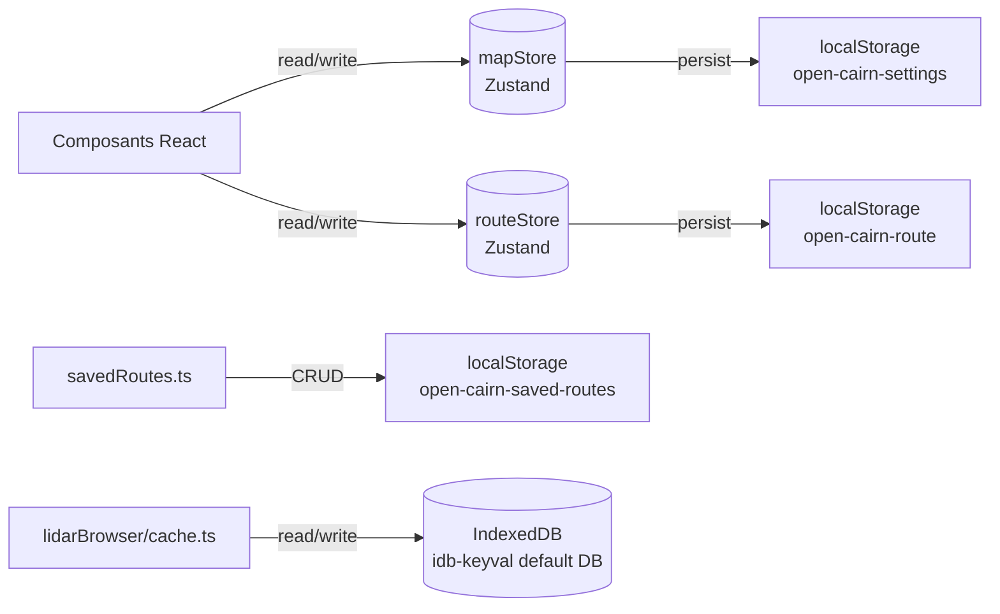

# État applicatif et persistance

## Pour les utilisateurs

L'application **mémorise localement dans votre navigateur** :

- vos **préférences carto** (fond, ombrage, terrain, contours, intensités, qualité,
  thème, clés API saisies)
- votre **itinéraire courant** (waypoints + activeStatus)
- vos **itinéraires sauvegardés**
- les **nuages LiDAR** déjà chargés (cache)

Vider les données du site dans votre navigateur supprimera tout cela. Pour transférer
votre travail, utilisez le **partage par URL** (cf. [SHARE_VIEW.md](SHARE_VIEW.md))
et l'**export GPX** (cf. [SAVED_ROUTES_AND_GPX.md](SAVED_ROUTES_AND_GPX.md)).

Aucune donnée n'est envoyée à un serveur tiers : open-cairn ne traque pas, ne fait pas
d'analytics, et ne pose pas de cookies.

---

## Pour les développeurs

### Vue d'ensemble



### Stores Zustand

#### `mapStore` — [src/stores/mapStore.ts](../src/stores/mapStore.ts)

Champs principaux :

```ts
{
  // Vue carte
  view: { longitude, latitude, zoom, pitch, bearing }
  // Fonds & overlays
  baseLayer, hillshadeEnabled, hillshadeSource, hillshadeBlend, hillshadeIntensity
  terrainEnabled, terrainExaggeration, contourLinesEnabled, contourLinesOpacity
  renderQuality, tileCacheSize, ignScanApiKey?, ignDemApiKey?, uiTheme

  // LiDAR (chargement)
  lidarMode: 'shaded' | 'mixed' | 'poisson'
  lidarShaded, lidarMesh, lidarMixed
  lidarCloudLoading, lidarCloudError, lidarCloudProgress
  lidarCloudRadius, lidarCloudStride, lidarCloudClasses
  lidarCloudPoissonDepth

  // LiDAR (rendu)
  lidarCloudPointSize, lidarCloudSizeCompensation, lidarCloudOpacity
  lidarCloudEdl, lidarCloudEdlStrength, lidarCloudEdlRadius, lidarCloudEdlFarPlane
  lidarCloudHideBasemap, lidarShader, lidarSunDate, lidarPreviewVisible
}
```

Persistance : `persist` middleware Zustand sur la clé `open-cairn-settings`. Les champs
non sérialisables (typed arrays LiDAR, dates, fonctions) sont **omis du whitelist** de
`partialize`.

#### `routeStore` — [src/stores/routeStore.ts](../src/stores/routeStore.ts)

```ts
{
  waypoints, routeSegments, routeCoordinates,
  profile, stats, status,
  hoverDistance, selectionRange,
  routeMode, colorElevationBySlope,
  flyoverActive, flyoverProgressM
}
```

Persistance : seuls `waypoints` et `routeMode` (essentiels) sont persistés sous la clé
`open-cairn-route`. Les segments / profil sont **recalculés au boot** depuis les
waypoints, ce qui garantit qu'ils sont à jour si les API IGN ont évolué.

### Clés localStorage

| Clé                              | Contenu                                         |
|----------------------------------|-------------------------------------------------|
| `open-cairn-settings`            | mapStore (sauf champs LiDAR runtime + sauf champs explicitement exclus) |
| `open-cairn-route`               | waypoints + activeStatus                        |
| `open-cairn-saved-routes`        | tableau de `SavedRoute` (cf. [SAVED_ROUTES_AND_GPX.md](SAVED_ROUTES_AND_GPX.md)) |

### IndexedDB

| Lib       | DB / store        | Usage                                                |
|-----------|-------------------|------------------------------------------------------|
| `idb-keyval` | default DB (`keyval-store`) | Cache LiDAR (cf. [LIDAR_PIPELINE.md](LIDAR_PIPELINE.md)) |

Capacité approximative : **~300 MB** par défaut sur les navigateurs (50 entrées × ~6 MB
chacune). Eviction LRU best-effort dans `cache.ts`.

### Évènements custom

| Événement                            | Émetteur          | Récepteurs               |
|--------------------------------------|-------------------|--------------------------|
| `open-cairn-saved-routes-changed`    | `savedRoutes.ts`  | `SavedRoutesPanel`       |

Pas de bus d'événements global ; on s'appuie sur Zustand pour la communication state.

### URL state

| Paramètre | Type | Usage |
|-----------|------|-------|
| `#<base64url>` | hash | Restauration via [shareView.ts](../src/lib/shareView.ts) |

Pas de query string utilisée actuellement. Le hash a la priorité au boot et **écrase**
l'état persisté localement.

### Persistance — bonnes pratiques

- **Toujours faire passer par le store** (`useMapStore.setState({ ... })`), même les
  champs persistés.
- **Ne pas persister** les blobs de données volumineux (typed arrays, mesh) : le `partialize`
  doit explicitement les exclure, sinon localStorage saturera (limite ~5 MB).
- **Versionner le schema** quand on renomme / restructure : ajouter un champ `_schemaVersion`
  et migrer dans `onRehydrateStorage`.
- **Synchronisation entre onglets** : si un jour besoin, écouter l'événement `storage`
  du navigateur sur les clés sus-mentionnées.

### Limitations techniques

- **Pas de garbage-collection** localStorage : les anciennes versions du schéma s'y
  accumulent silencieusement. Penser à nettoyer dans une migration.
- **IndexedDB single DB** : le cache LiDAR partage la DB par défaut de `idb-keyval`
  avec n'importe quel autre `idb-keyval` consumer (aucun pour l'instant). À surveiller
  si on ajoute d'autres caches.
- **Quota navigateur** silencieux : un `try/catch` autour des writes éviterait les
  exceptions visibles, mais signalerait l'utilisateur si la sauvegarde a effectivement
  échoué.
