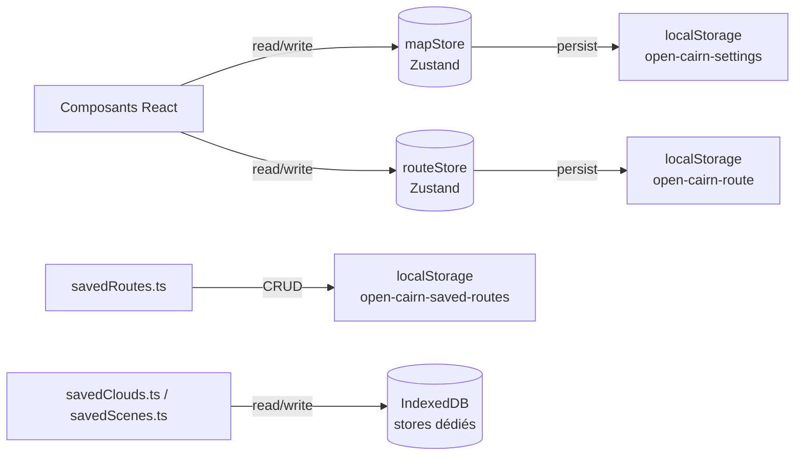

# État applicatif et persistance

## Pour les utilisateurs

L'application **mémorise localement dans votre navigateur** :

- vos **préférences carto** (fond, ombrage, terrain, contours, intensités, qualité,
  thème, clés API saisies)
- votre **itinéraire courant** (waypoints + activeStatus)
- vos **itinéraires sauvegardés**
- les **nuages LiDAR** déjà chargés (cache)

Vider les données du site dans votre navigateur supprimera tout cela. Pour transférer
votre travail, utilisez le **partage par URL** (cf. [SHARE_VIEW.md](SHARE_VIEW.md))
et l'**export GPX** (cf. [SAVED_ROUTES_AND_GPX.md](SAVED_ROUTES_AND_GPX.md)).

Aucune donnée n'est envoyée à un serveur tiers : open-cairn ne traque pas, ne fait pas
d'analytics, et ne pose pas de cookies.

---

## Pour les développeurs

### Vue d'ensemble



### Stores Zustand

#### `mapStore` — [src/stores/mapStore.ts](../src/stores/mapStore.ts)

Champs principaux :

```ts
{
  // Vue carte
  view: { longitude, latitude, zoom, pitch, bearing }
  // Fonds & overlays
  baseLayer, hillshadeEnabled, hillshadeSource, hillshadeBlend, hillshadeIntensity
  terrainEnabled, terrainExaggeration, contourLinesEnabled, contourLinesOpacity
  renderQuality, tileCacheSize, ignScanApiKey?, ignDemApiKey?, uiTheme

  // LiDAR (chargement)
  lidarMode: 'shaded' | 'delaunay' | 'poisson'
  lidarClouds: LoadedLidarCloud[]   // tous les nuages affichés, le plus ancien d'abord
  lidarShaded, lidarMesh            // miroirs de lidarClouds[0]
  lidarCloudLoading, lidarCloudError, lidarCloudProgress
  lidarCaptureRect, lidarRectNorthFixed, lidarCloudStride, lidarCloudClasses
  lidarCloudPoissonDepth

  // LiDAR (rendu)
  lidarCloudPointSize, lidarCloudSizeCompensation, lidarCloudOpacity
  lidarCloudEdl, lidarCloudEdlStrength, lidarCloudEdlRadius, lidarCloudEdlFarPlane
  lidarCloudBasemapOpacity, lidarShader, lidarSunDate, lidarPreviewVisible
}
```

Persistance : **pas de middleware `persist`**. `mapStore.ts` s'abonne au store et appelle
`savePersistedSettings` (debounce 500 ms) avec la réunion de `selectViewPersisted`,
`selectSettingsPersisted` et `selectLidarPersisted` — chaque slice choisit donc explicitement
les clés qu'elle persiste, et les champs non sérialisables (typed arrays LiDAR, fonctions)
sont exclus par construction. L'hydratation est manuelle dans chaque slice
(`persisted.X ?? défaut`), sans estampille de version.

#### `routeStore` — [src/stores/routeStore.ts](../src/stores/routeStore.ts)

```ts
{
  waypoints, routeSegments, routeCoordinates,
  profile, stats, status,
  hoverDistance, selectionRange,
  routeMode, colorElevationBySlope,
  flyoverActive, flyoverProgressM
}
```

Persistance : seuls `waypoints` et `routeMode` (essentiels) sont persistés sous la clé
`open-cairn-route`. Les segments / profil sont **recalculés au boot** depuis les
waypoints, ce qui garantit qu'ils sont à jour si les API IGN ont évolué.

### Clés localStorage

| Clé                              | Contenu                                         |
|----------------------------------|-------------------------------------------------|
| `open-cairn-settings`            | mapStore (sauf champs LiDAR runtime + sauf champs explicitement exclus) |
| `open-cairn-route`               | waypoints + activeStatus                        |
| `open-cairn-saved-routes`        | tableau de `SavedRoute` (cf. [SAVED_ROUTES_AND_GPX.md](SAVED_ROUTES_AND_GPX.md)) |

### IndexedDB

| Lib       | DB / store        | Usage                                                |
|-----------|-------------------|------------------------------------------------------|
| `idb-keyval` | `open-cairn-saved-clouds-db` | Nuages LiDAR sauvegardés (galerie « Nuages récents ») |
| `idb-keyval` | `open-cairn-saved-scenes-db` | Scènes exportées (« Mes vues ») |

Chaque store est cappé à **30 entrées** (éviction des plus anciennes au-delà,
cf. `MAX_ENTRIES` dans `savedClouds.ts` / `savedScenes.ts`). La géométrie et les
vignettes vivent dans IndexedDB ; un descripteur compact (id, titre, date,
compteurs) est miroiré en localStorage pour un rendu synchrone de la liste.

### Évènements custom

Aucun. Les dépôts sauvegardés (`savedRoutes.ts`, `savedClouds.ts`, `savedScenes.ts`) sont
réactifs via [savedStore.ts](../src/lib/savedStore.ts) (`useSyncExternalStore`) : leur `writeAll`
appelle `store.notify()`. Les anciens `CustomEvent` DOM `open-cairn-saved-*-changed` ont été
supprimés — ne pas les réintroduire. Pour le reste, on s'appuie sur Zustand.

### URL state

| Paramètre | Type | Usage |
|-----------|------|-------|
| `#<base64url>` | hash | Restauration via [shareView.ts](../src/lib/shareView.ts) |

Pas de query string utilisée actuellement. Le hash a la priorité au boot et **écrase**
l'état persisté localement.

### Persistance — bonnes pratiques

- **Toujours faire passer par le store** (`useMapStore.setState({ ... })`), même les
  champs persistés.
- **Ne pas persister** les blobs de données volumineux (typed arrays, mesh) : `select*Persisted`
  doit les exclure, sinon localStorage saturera (limite ~5 MB).
- **Pas de migration de schéma** tant que l'application est en pré-version : une valeur persistée
  périmée doit échouer sa garde de validation et retomber sur le défaut. Le schéma tout-optionnel
  tolère la dérive par construction, d'où l'absence d'estampille de version.
- **Valider les valeurs à type union à l'hydratation** (`baseLayer`, `lidarShader`, `lidarRockType`,
  `lidarMode`…) : une clé `localStorage` peut porter une valeur produite par une autre branche, et
  un identifiant inconnu propagé jusqu'au rendu vide la page (aucun `ErrorBoundary`).
- **Synchronisation entre onglets** : si un jour besoin, écouter l'événement `storage`
  du navigateur sur les clés sus-mentionnées.

### Ajouter un réglage de rendu LiDAR

Six fichiers, dans cet ordre. Aucun oubli n'est détecté par le compilateur sauf là où c'est
indiqué — un site manquant donne un réglage qui ne se persiste pas ou qui disparaît des scènes
exportées.

1. **[src/stores/slices/lidarSlice.ts](../src/stores/slices/lidarSlice.ts)** — 6 sites :
   champ + setter dans l'interface, valeur dans `LIDAR_RENDER_DEFAULTS`, hydratation
   `persisted.X ?? LIDAR_RENDER_DEFAULTS.X`, implémentation du setter, clé dans l'union `Pick`
   de `selectLidarPersisted`, clé dans son objet de retour. *(L'union `Pick` est vérifiée par
   le compilateur ; le reste non.)*
2. **[src/stores/persistence.ts](../src/stores/persistence.ts)** — champ optionnel dans
   `PersistedSettings`. Si le type est une union, l'hydratation doit valider la valeur contre
   l'ensemble autorisé (une entrée périmée peut venir d'une autre branche).
3. **[src/lib/showcaseScene.ts](../src/lib/showcaseScene.ts)** — champ dans `ShowcaseAmbiance`
   et valeur dans `DEFAULT_AMBIANCE`. Pas de bump de `MANIFEST_VERSION` :
   `parseShowcaseManifest` fait `{ ...DEFAULT_AMBIANCE, ...raw.ambiance }`.
4. **[src/lib/showcaseAmbiance.ts](../src/lib/showcaseAmbiance.ts)** — `extractAmbiance` et
   `AMBIANCE_SETTERS`. *(Les deux sont exhaustifs par leur type : un oubli est une erreur `tsc`.)*
5. **L'UI** ([LidarAppearanceControls.tsx](../src/components/ui/lidar/LidarAppearanceControls.tsx)
   ou le panneau concerné).
6. **La doc** du sous-système touché.

Deux cas particuliers :

- **Uniforme GPU** : ajouter aussi une souscription et une entrée dans l'effet `setConfig` de
  [LidarCloudOverlay.tsx](../src/components/map/LidarCloudOverlay.tsx) (avec son tableau de
  dépendances), puis le champ dans `LidarWebGLLayerConfig`, la `getUniformLocation` et le
  `uniform1f` correspondants.
- **Réglage de capture** (il change la géométrie produite) : il va dans `captureParamsFromState`
  et `applyCaptureParams`, pas dans l'ambiance. Un réglage rejouable à chaud est une ambiance.

⚠️ Recolorier un nuage est un travail **CPU sur le thread principal** (~450 ms pour 1,5 M sommets)
: un curseur qui appelle le setter à chaque `input` fige la page. Utiliser un brouillon local et
un `setTimeout(150)` dans un effet (cf. les curseurs « Ligne de neige » et « Enneigement »).

### Limitations techniques

- **Pas de garbage-collection** localStorage : les clés d'anciennes formes du schéma s'y
  accumulent silencieusement, sans effet (l'hydratation ne lit que les clés connues).
- **Stores IndexedDB dédiés** : nuages et scènes sauvegardés utilisent chacun leur
  propre DB (`createStore`), donc effacer l'un n'impacte pas l'autre. À garder en tête
  si on ajoute d'autres stores.
- **Quota navigateur** : `savedClouds.ts` évince les entrées les plus anciennes et journalise
  un `console.warn` quand un `QuotaExceededError` survient ; `savedScenes.ts` laisse remonter
  l'erreur à l'appelant, qui doit la signaler à l'utilisateur.
