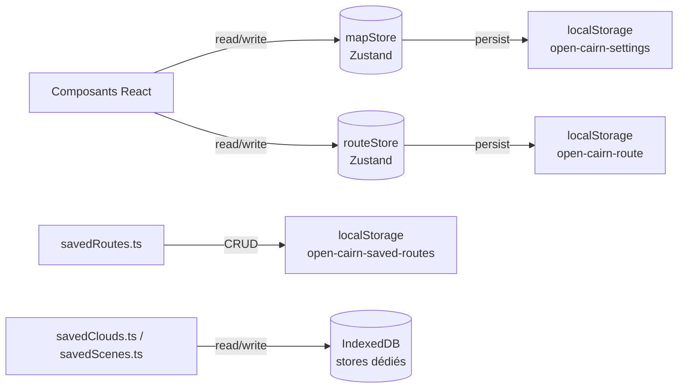

# État applicatif et persistance

## Pour les utilisateurs

L'application **mémorise localement dans votre navigateur** :

- vos **préférences carto** (fond, ombrage, terrain, contours, intensités, qualité,
  thème, clés API saisies)
- votre **itinéraire courant** (waypoints + activeStatus)
- vos **itinéraires sauvegardés**
- les **nuages LiDAR** déjà chargés (cache)

Vider les données du site dans votre navigateur supprimera tout cela. Pour transférer
votre travail, utilisez le **partage par URL** (cf. [SHARE_VIEW.md](SHARE_VIEW.md))
et l'**export GPX** (cf. [SAVED_ROUTES_AND_GPX.md](SAVED_ROUTES_AND_GPX.md)).

Aucune donnée n'est envoyée à un serveur tiers : open-cairn ne traque pas, ne fait pas
d'analytics, et ne pose pas de cookies.

---

## Pour les développeurs

### Vue d'ensemble



### Stores Zustand

#### `mapStore` — [src/stores/mapStore.ts](../src/stores/mapStore.ts)

Champs principaux :

```ts
{
  // Vue carte
  view: { longitude, latitude, zoom, pitch, bearing }
  // Fonds & overlays
  baseLayer, hillshadeEnabled, hillshadeSource, hillshadeBlend, hillshadeIntensity
  toponymsEnabled                   // surcouche de toponymes IGN, sur les fonds sans texte
  terrainEnabled, terrainExaggeration, contourLinesEnabled, contourLinesOpacity
  mapStylePinned                    // « Fond » commun aux deux vues (copies de mapStyleByView synchronisées)
  renderQuality, tileCacheSize, ignApiKey?, ignDemApiKey?, uiTheme
  skySunPath, skyMoonPath           // trajectoires dans le ciel, communes aux deux vues
  skyHiddenPath                     // dessiner ou non leur moitié masquée par le relief
  atmosphericSky                    // vue Itinéraire : ciel piloté par le soleil
  peakLabels                        // nommer les sommets visibles — n'a d'effet qu'en Point de vue

  // Chrome desktop, l'accordéon de droite de chaque vue
  sidePanelCollapsed                // panneau replié sur sa barre de titre, commun aux deux vues
  studioPanelSections: string[]     // Studio : ids des sections dépliées, plusieurs à la fois
  routePanelSections: string[]      // Itinéraire : idem (défaut : Fond ouvert)

  // Barre du haut desktop, les deux vues (défaut : replié)
  topBarCameraCollapsed             // groupe caméra réduit à un bouton
  topBarSceneCollapsed              // groupe galerie / export / aide réduit à un bouton

  // LiDAR (chargement)
  lidarMode: 'shaded' | 'delaunay' | 'poisson'
  lidarClouds: LoadedLidarCloud[]   // tous les nuages affichés, le plus ancien d'abord
  lidarShaded, lidarMesh            // miroirs de lidarClouds[0]
  lidarCloudLoading, lidarCloudError, lidarCloudProgress
  lidarCaptureRect, lidarRectDrawActive, lidarCloudStride, lidarCloudClasses
  lidarCaptureResolution
  lidarCloudPoissonDepth, lidarCloudGroundStride

  // LiDAR (rendu)
  lidarCloudPointSize, lidarCloudSizeCompensation, lidarCloudOpacity
  lidarCloudEdl, lidarCloudEdlStrength, lidarCloudEdlRadius, lidarCloudEdlFarPlane
  lidarCloudBasemapOpacity, lidarShader, lidarSunDate, lidarPreviewVisible
}
```

Persistance : **pas de middleware `persist`**. `mapStore.ts` s'abonne au store et appelle
`savePersistedSettings` (debounce 500 ms) avec la réunion de `selectViewPersisted`,
`selectSettingsPersisted` et `selectLidarPersisted` — chaque slice choisit donc explicitement
les clés qu'elle persiste, et les champs non sérialisables (typed arrays LiDAR, fonctions)
sont exclus par construction. L'hydratation est manuelle dans chaque slice
(`persisted.X ?? défaut`), sans estampille de version.

#### `routeStore` — [src/stores/routeStore.ts](../src/stores/routeStore.ts)

```ts
{
  waypoints, routeSegments, routeCoordinates,
  profile, stats, status,
  hoverDistance, selectionRange,
  routeMode, colorElevationBySlope,
  flyoverActive, flyoverProgressM
}
```

Persistance : les `waypoints`, leurs `routeSegments` déjà calculés et `routeMode` sont
persistés sous la clé `open-cairn-route`. Rejouer la géométrie stockée évite de relancer
un calcul IGN par segment à chaque chargement, et surtout préserve la trace d'un GPX
importé — la recalculer depuis les seuls waypoints la remplacerait par des lignes droites.
Seul le profil altimétrique est recalculé au boot. Une liste de segments dont la longueur
ne correspond plus aux waypoints est rejetée à l'hydratation (`loadPersistedRoute`) et la
route est recalculée depuis les waypoints.

### Clés localStorage

| Clé                              | Contenu                                         |
|----------------------------------|-------------------------------------------------|
| `open-cairn-settings`            | mapStore (sauf champs LiDAR runtime + sauf champs explicitement exclus) |
| `open-cairn-route`               | waypoints + segments + markers + `active`, `mode`, `colorElevationBySlope`, `gpxImportWaypoints`, `selectionRange` |
| `open-cairn-saved-routes`        | tableau de `SavedRoute` (cf. [SAVED_ROUTES_AND_GPX.md](SAVED_ROUTES_AND_GPX.md)) |

### IndexedDB

| Lib       | DB / store        | Usage                                                |
|-----------|-------------------|------------------------------------------------------|
| `idb-keyval` | `open-cairn-saved-clouds-db` | Nuages LiDAR sauvegardés (galerie « Nuages récents ») |
| `idb-keyval` | `open-cairn-saved-scenes-db` | Scènes exportées (« Mes vues ») |

Chaque store est cappé à **30 entrées** (éviction des plus anciennes au-delà,
cf. `MAX_ENTRIES` dans `savedClouds.ts` / `savedScenes.ts`). La géométrie et les
vignettes vivent dans IndexedDB ; un descripteur compact (id, titre, date,
compteurs) est miroiré en localStorage pour un rendu synchrone de la liste.

### Évènements custom

Aucun. Les dépôts sauvegardés (`savedRoutes.ts`, `savedClouds.ts`, `savedScenes.ts`) sont
réactifs via [savedStore.ts](../src/lib/savedStore.ts) (`useSyncExternalStore`) : leur `writeAll`
appelle `store.notify()`. Les anciens `CustomEvent` DOM `open-cairn-saved-*-changed` ont été
supprimés — ne pas les réintroduire. Pour le reste, on s'appuie sur Zustand.

### URL state

| Paramètre | Type | Usage |
|-----------|------|-------|
| `#share=<base64url>` | hash | Restauration via [shareView.ts](../src/lib/shareView.ts) |
| `?view=lidar` | query | Vue ouverte au boot ; conservée quand le hash de partage est effacé |

Le hash a la priorité au boot et **écrase** l'état persisté localement. Il peut aussi
poser des champs volontairement **non persistés** — `viewpoint` et son
`viewpointFraming` — parce qu'un lien partagé doit rouvrir exactement l'image de son
auteur, mode « Point de vue » compris (cf. [SHARE_VIEW.md](SHARE_VIEW.md)).

### Persistance — bonnes pratiques

- **Toujours faire passer par le store** (`useMapStore.setState({ ... })`), même les
  champs persistés.
- **Ne pas persister** les blobs de données volumineux (typed arrays, mesh) : `select*Persisted`
  doit les exclure, sinon localStorage saturera (limite ~5 MB).
- **Pas de migration de schéma** tant que l'application est en pré-version : une valeur persistée
  périmée doit échouer sa garde de validation et retomber sur le défaut. Le schéma tout-optionnel
  tolère la dérive par construction, d'où l'absence d'estampille de version.
- **Valider les valeurs à type union à l'hydratation** (`baseLayer`, `lidarShader`, `lidarRockType`,
  `lidarMode`…) : une clé `localStorage` peut porter une valeur produite par une autre branche, et
  un identifiant inconnu propagé jusqu'au rendu vide la page (aucun `ErrorBoundary`).
- **Valider aussi une valeur dont la validité dépend d'un AUTRE réglage** : `seedByView`
  (`mapStyleView.ts`) fait passer le `baseLayer` de chaque vue par `gateKeyedBaseLayer`, parce que
  SCAN 25 et Plan IGN HD exigent `ignApiKey` — sans clé, les tuiles répondent 401 (et le protocole
  `composite://` lève « base tile unavailable ») et la carte s'ouvre vide. Le repli est `plan`.
  Même garde côté lien partagé dans `main.tsx` : la clé n'est jamais dans l'URL.
- **Synchronisation entre onglets** : si un jour besoin, écouter l'événement `storage`
  du navigateur sur les clés sus-mentionnées.

### Ajouter un réglage de rendu LiDAR

Six fichiers, dans cet ordre. Aucun oubli n'est détecté par le compilateur sauf là où c'est
indiqué — un site manquant donne un réglage qui ne se persiste pas ou qui disparaît des scènes
exportées.

1. **[src/stores/slices/lidarSlice.ts](../src/stores/slices/lidarSlice.ts)** — 6 sites :
   champ + setter dans l'interface, valeur dans `LIDAR_RENDER_DEFAULTS`, hydratation
   `persisted.X ?? LIDAR_RENDER_DEFAULTS.X`, implémentation du setter, clé dans l'union `Pick`
   de `selectLidarPersisted`, clé dans son objet de retour. *(L'union `Pick` est vérifiée par
   le compilateur ; le reste non.)*
2. **[src/stores/persistence.ts](../src/stores/persistence.ts)** — champ optionnel dans
   `PersistedSettings`. Si le type est une union, l'hydratation doit valider la valeur contre
   l'ensemble autorisé (une entrée périmée peut venir d'une autre branche).
3. **[src/lib/showcaseScene.ts](../src/lib/showcaseScene.ts)** — champ dans `ShowcaseAmbiance`
   et valeur dans `DEFAULT_AMBIANCE`. Pas de bump de `MANIFEST_VERSION` :
   `parseShowcaseManifest` fait `{ ...DEFAULT_AMBIANCE, ...raw.ambiance }`.
4. **[src/lib/showcaseAmbiance.ts](../src/lib/showcaseAmbiance.ts)** — `extractAmbiance` et
   `AMBIANCE_SETTERS`. *(Les deux sont exhaustifs par leur type : un oubli est une erreur `tsc`.)*
5. **L'UI** ([LidarAppearanceControls.tsx](../src/components/ui/lidar/LidarAppearanceControls.tsx)
   ou le panneau concerné).
6. **La doc** du sous-système touché.

Deux cas particuliers :

- **Uniforme GPU** : ajouter aussi une souscription et une entrée dans l'effet `setConfig` de
  [LidarCloudOverlay.tsx](../src/components/map/LidarCloudOverlay.tsx) (avec son tableau de
  dépendances), puis le champ dans `LidarWebGLLayerConfig`, la `getUniformLocation` et le
  `uniform1f` correspondants.
- **Réglage de capture** (il change la géométrie produite) : il va dans `captureParamsFromState`
  et `applyCaptureParams`, pas dans l'ambiance. Un réglage rejouable à chaud est une ambiance.
- **Outil de mesure, pas d'ambiance** : les trajectoires du soleil et de la lune dans le ciel
  ne sont pas des réglages de rendu. Leurs drapeaux `skySunPath` / `skyMoonPath` /
  `skyHiddenPath` ne vivent donc
  **pas** dans `lidarSlice` mais dans [settingsSlice.ts](../src/stores/slices/settingsSlice.ts),
  avec les autres réglages globaux d'outillage — les deux vues (Studio et Itinéraire) partagent
  les mêmes cases, et
  « Réinitialiser le rendu » ne l'efface pas. Un réglage rangé dans `lidarSlice` aurait dû être
  exclu de l'ambiance à la main, comme `lidarShadowMapSize` qui dépend de la VRAM de la machine
  d'affichage : le test `showcaseAmbiance.test.ts` vérifie que tout `LIDAR_RENDER_DEFAULTS` est
  dans l'ambiance, et toute exclusion doit être ajoutée à son ensemble `NOT_IN_AMBIANCE`, ce qui
  force à la justifier.
  `peakLabels` suit la même règle, pour la même raison.
- **Bascule d'un attribut cuit à la capture** : `lidarCoverEnabled` est une ambiance (donc
  rejouable à chaud) alors que la donnée qu'elle pilote, `a_cover`, est produite par le worker.
  L'astuce est que l'uniforme `u_coverEnabled` à 0 fait lire `255` (= inconnu) au shader, ce qui
  ramène exactement la palette historique : l'A/B est gratuit, et une capture antérieure à
  l'attribut est téléversée remplie de `255`, donc identique dans les deux positions. Le `title`
  de la case doit le dire, sinon l'utilisateur croit à un bug.
- **Réglages couplés entre eux** : `lidarCaptureResolution`, `lidarCloudPoissonDepth` et
  `lidarCloudGroundStride` ne sont cohérents qu'**ensemble** (un cran de résolution = deux
  niveaux d'octree = quatre crans de densité sol, la pyramide IGN décuplant les points d'un
  niveau au suivant, cf. [src/lib/lidarQuality.ts](../src/lib/lidarQuality.ts)).
  Ils sont donc pilotés par un curseur unique, « Qualité », et **hydratés ensemble** : si l'un
  manque, les trois retombent sur le palier que `defaultQualityIndex` choisit pour le rectangle
  restauré, plutôt que sur trois défauts indépendants qui reviendraient incohérents. Les régler
  un par un reste possible dans « Réglages avancés » ; le curseur affiche alors « personnalisée »
  et `captureAdvice` signale les incohérences avec leur correction.

`lidarZonePyramid` accompagne ces trois-là sans jamais être **persisté ni exposé à l'utilisateur** :
c'est la densité par niveau mesurée dans la hiérarchie COPC des dalles sous la zone (cf.
[LIDAR_PIPELINE.md](LIDAR_PIPELINE.md)). `setLidarCaptureRect` programme la mesure 500 ms plus
tard ; elle recalcule les paliers en conservant le cran choisi. Il n'est remis à `null` que si le
**centre** de la zone a bougé : la sonde lit les dalles les plus proches de ce centre, donc un
redimensionnement mesure les mêmes — l'invalider à chaque redimensionnement faisait sauter les
trois réglages deux fois de suite, vers la table nationale puis vers la mesure. Le persister
n'aurait aucun sens — il dépend de la zone, pas des goûts de l'utilisateur, et le relire coûte une
seconde. `ensureZonePyramid()`, appelé au montage du panneau de capture, relance la mesure quand le
profil est nul (scène restaurée, échec réseau précédent).

Un réglage de **palette** ne coûte plus rien nulle part : maillage et nuage de points évaluent
tous deux `paletteAlbedo` par sommet dans leur vertex shader (`glsl/lib/palette.glsl`) à partir
des uniformes `u_palettePreset`, `u_rockType`, `u_snowLine`, `u_snowAmount` et `u_coverEnabled`.
Changer la ligne
de neige d'un nuage de 2,1 M sommets et 377 k points est mesuré à **0,2 ms dans le store et zéro
octet renvoyé au GPU** — le `setTimeout(150)` qui débounçait les curseurs « Ligne de neige » et
« Enneigement » a donc été supprimé, ils écrivent directement dans le store. La couleur qui reste
dans le tampon `a_color` du nuage de points est la couleur de **classification LAS** (végétation,
bâti, eau), la seule qui ne soit pas fonction de la géométrie.

Le débounce reste en revanche nécessaire pour les réglages qui relancent un vrai calcul, comme
les curseurs de hauteur de végétation (`recomputeVegHeights`).

Quand un effet remplace bel et bien l'objet `mesh`/`shaded`, il rappelle `setMesh`/`setData` avec
**le même maillage**. Ces deux méthodes comparent les références des
tableaux déjà téléversés (`_uploadedMesh` / `_uploadedPoints`) et ne renvoient au GPU que ceux qui
ont changé : sans cela un simple changement d'objet re-téléversait positions, normales, indices
et masques, et surtout relançait toute la simplification LOD (passe WASM d'effondrement d'arêtes),
faisant retomber le maillage au LOD 0. Corollaire pour qui touche à ce
code : **un producteur doit allouer un nouveau tableau plutôt que muter le précédent en place**,
sinon la modification est invisible pour le GPU. `clear()` / `clearMesh()` vident ces caches.

### Limitations techniques

- **Pas de garbage-collection** localStorage : les clés d'anciennes formes du schéma s'y
  accumulent silencieusement, sans effet (l'hydratation ne lit que les clés connues).
- **Stores IndexedDB dédiés** : nuages et scènes sauvegardés utilisent chacun leur
  propre DB (`createStore`), donc effacer l'un n'impacte pas l'autre. À garder en tête
  si on ajoute d'autres stores.
- **Quota navigateur** : `savedClouds.ts` évince les entrées les plus anciennes et journalise
  un `console.warn` quand un `QuotaExceededError` survient ; `savedScenes.ts` laisse remonter
  l'erreur à l'appelant, qui doit la signaler à l'utilisateur.
