# Position et lumière du soleil

## Pour les utilisateurs

Le panneau **LiDAR** offre un sélecteur de **date / heure**. La direction et la
chaleur de la lumière qui éclaire le nuage de points sont calculées en fonction :

- de la **position géographique** du centre du nuage,
- de la **date** sélectionnée (par défaut : maintenant).

Ainsi, un coup d'œil rapide à 14 h en plein été montre une lumière haute, presque
zénithale ; un coup d'œil à 18 h en hiver montre une lumière rasante orangée qui
révèle bien le micro-relief.

### Limitations

- **Validité ±50 ans** autour de l'an 2000 (formule NOAA simplifiée).
- **Pas de réfraction atmosphérique** : erreur ≤ 1° près de l'horizon.
- **Lumière figée** au moment où on choisit la date ; pas d'animation continue.

---

## Pour les développeurs

### Fichier

[src/lib/sun.ts](../src/lib/sun.ts)

### API

```ts
const lighting = sunLighting(centerLat, centerLng, date);
// {
//   azimuthRad,
//   elevationRad,
//   directionWorld: [x, y, z],   // unit vector, z up
//   intensity: 0..1,
//   color: [r, g, b],
// }
```

### Algorithme

Approximation NOAA basse précision, valide ~1950–2050. Calcul :

```mermaid
flowchart TD
    Date[Date / heure UTC] --> JD[Julian Day<br/>jd = ts/86400000 + 2440587.5]
    JD --> T[Centuries since J2000<br/>T = &#40;jd - 2451545&#41; / 36525]
    T --> L[L = mean longitude]
    T --> g[g = mean anomaly]
    L --> Lambda[λ = ecliptic longitude<br/>= L + 1.915 sin g + 0.02 sin 2g]
    Lambda --> Decl[δ = arcsin&#40;sin ε · sin λ&#41;]
    L --> RA[α = atan2&#40;cos ε · sin λ, cos λ&#41;]
    JD --> GMST[Greenwich mean sidereal time]
    GMST --> LST[Local sidereal time<br/>= GMST + lng]
    LST --> H[Hour angle H = LST − α]
    Decl --> El[el = arcsin&#40;sin φ sin δ + cos φ cos δ cos H&#41;]
    H --> Az[az = atan2&#40;<br/>−cos δ sin H,<br/>sin δ cos φ − cos δ sin φ cos H&#41;]
```



### Direction (espace monde)

```ts
const dir = [
  Math.cos(elevation) * Math.sin(azimuth),
  Math.cos(elevation) * Math.cos(azimuth),
  Math.sin(elevation),
];
```

Convention : `x = est, y = nord, z = haut`. C'est cohérent avec le système d'axes du
[LidarWebGLLayer](LIDAR_RENDERING.md) (METER_OFFSETS east/north/up).

### Intensité

```ts
const elDeg = elevation * 180 / Math.PI;
let intensity;
if (elDeg >= 6) intensity = 1;
else if (elDeg > -2) intensity = (elDeg + 2) / 8;   // fade dawn/dusk
else intensity = 0;
```

À 6° au-dessus de l'horizon, on est en pleine lumière ; à −2° (crépuscule civil), c'est
nuit noire.

### Tint (couleur de la lumière)

Mix entre une **teinte chaude** (couchant) et une **teinte neutre** (plein jour) selon
la hauteur du soleil :

```ts
const t = clamp(elDeg / 25, 0, 1);
const s = smoothstep(t);
const warm   = [1.0, 0.55, 0.30];
const neutral = [1.0, 0.98, 0.95];
const color = mix(warm, neutral, s);
```

À 0° (lever/coucher), `color = warm` (orangé). À 25°+, `color = neutral` (blanc froid).

### Utilisation côté shader

`sun.ts` produit `directionWorld`, `intensity`, `color`, qui sont passés au shader points
sous `u_sunDir`, `u_sunIntensity`, `u_sunColor`. Voir
[LIDAR_RENDERING.md](LIDAR_RENDERING.md).

### Limitations techniques

- **Pas de cache** : `sunLighting()` est appelé à chaque mise à jour de couche. Coûteux
  ? Non — quelques opérations trigo. Mais pourrait être mémoïsé sur `(date, lat, lng)`.
- **Pas d'azimuth alternatif** (south-clockwise vs north-clockwise) : on suppose le
  consommateur utilise la convention « 0 = nord, sens horaire ».
- **Pas de prise en compte du fuseau horaire** explicite : on travaille en UTC depuis
  le `Date.getTime()` qui est UTC par construction.
