# Position et lumière du soleil

## Pour les utilisateurs

Le panneau **LiDAR** offre un sélecteur de **date / heure**. La direction et la
chaleur de la lumière qui éclaire le nuage de points sont calculées en fonction :

- de la **position géographique** du centre du nuage,
- de la **date** sélectionnée (par défaut : maintenant).

Ainsi, un coup d'œil rapide à 14 h en plein été montre une lumière haute, presque
zénithale ; un coup d'œil à 18 h en hiver montre une lumière rasante orangée qui
révèle bien le micro-relief.

L'heure se règle **au curseur ou au clavier** : le champ à droite du curseur accepte
une heure tapée (`18:03`), et les deux sont liés dans les deux sens. Le curseur avance
donc **à la minute**, pour qu'il puisse afficher exactement ce que contient le champ.
Le bouton ▶ joue la journée par pas de 5 minutes en sautant la nuit (22 h → 4 h).

### Forcer l'éclairage

La date/heure ne fait que **piloter quatre réglages bas niveau** — orientation,
hauteur, teinte, luminosité — qui sont, eux, la véritable source de vérité du
rendu. Le dépliant « Forcer l'éclairage » les expose directement : on peut donc
composer une lumière qui ne correspond à aucun soleil réel (soleil au nord,
lumière orangée à midi, plein jour avec un soleil sous l'horizon…).

- Bouger la date ou l'heure **réécrit les quatre valeurs** : le calendrier reprend
  la main.
- « Recaler sur le soleil » rejoue le calcul astronomique pour la date affichée,
  sans avoir à bouger le curseur.
- Le read-out `az … · h …` et la pastille jour/aube/nuit décrivent la lumière
  **effective**, pas celle qu'impliquerait l'heure affichée.

### Trajectoire dans le ciel

Deux cases indépendantes, **« Trajectoire du soleil »** et **« Trajectoire de la
lune »**, dessinent la course de chaque astre pour la date choisie. On les trouve
sous le curseur d'heure du Studio et dans la pilule **Soleil** de la vue Itinéraire.
L'usage visé est le repérage photo : se placer où l'on veut être, regarder le sujet,
et lire à quelle heure le soleil sera derrière. Ce sont **les mêmes drapeaux**
(`skySunPath`, `skyMoonPath`) et le même sélecteur de date dans les deux vues :
cocher d'un côté coche de l'autre.

> **Demande le relief 3D.** Le tracé est testé en profondeur contre le terrain et
> les heures de lever/coucher sont lues sur sa ligne de crête. Sans terrain, rien
> n'est dessiné du tout — ni trajectoire, ni pointillé, ni étiquette — et les deux
> cases sont grisées tant que
> « Terrain 3D » est éteint. Attention aussi à l'**exagération verticale** de la vue Itinéraire (1× à
> 3×, forcée à 1× dans le Studio) : l'horizon est lu sur le relief *affiché*, donc
> au-delà de 1× les heures restent cohérentes avec l'image mais ne sont plus
> celles du terrain réel.

- Le trait est **plein là où le ciel est dégagé** et **en pointillé là où le relief
  le masque** : la limite entre les deux est la ligne de crête vue depuis la
  caméra, donc l'heure de lever ou de coucher **sur l'horizon réel**, pas sur
  l'horizon théorique. La moitié cachée est en plus nettement plus transparente.
- Le **disque** est dessiné à sa taille angulaire réelle (0,53°) — il sert d'étalon :
  si le soleil est à deux diamètres du sommet, il y sera dans 2 à 7 minutes selon
  la hauteur. Plein dans le ciel, réduit à un anneau creux quand il est caché.
- Un **trait court perpendiculaire** à la trajectoire marque chaque heure pleine
  (environ un diamètre solaire de long, deux fois plus toutes les trois heures), avec
  l'**heure écrite juste en dessous** en petit
  (`18h`). Ces heures ne sont écrites qu'au-dessus de **l'horizon** : plus bas la
  trajectoire passe dans le sol, où une heure ne ferait que flotter sur le paysage.
  Une graduation reste légendée là où le trait est en pointillé, c'est-à-dire
  derrière une crête : c'est précisément l'heure que l'on cherche à lire.
- **L'heure choisie** est écrite dans une petite étiquette juste à droite de l'astre,
  là où il se trouve à cette minute — `17:43` entre les graduations `17h` et `18h`.
  Elle est posée sur la **trajectoire**, pas sur le disque : si l'éclairage a été
  forcé, le disque du soleil quitte sa trajectoire et l'étiquette reste là où cette
  heure-là se trouve vraiment. Elle disparaît quand l'astre est sous l'horizon.
- Le tracé suit la position **apparente** (réfraction comprise), comme le reste du
  pipeline.
- Deux **étiquettes** marquent les croisements avec la crête : `↑ 08:51` là où le
  soleil sort du relief, `↓ 19:44` là où il repasse derrière. Elles sont décalées
  au-dessus du croisement et **sur le côté libre** — à gauche pour un lever, à droite
  pour un coucher, puisque l'astre dérive toujours vers la droite de l'écran : posées
  sur le point lui-même, elles se retrouvaient à cheval sur l'horizon et masquaient
  la trajectoire.

La case **« Trajectoire de la lune »** dessine la **lune** en bleu pâle, avec
exactement les mêmes conventions — trait plein/pointillé, graduations horaires, étiquettes `↑`/`↓`. Deux
différences seulement :

- le disque porte sa **phase** : le terminateur est tracé à la bonne épaisseur, et
  la corne brillante pointe vers **le vrai soleil** — celui de la date, même si
  l'éclairage a été forcé ailleurs. La partie non éclairée reste faiblement
  visible, comme la lumière cendrée ;
- il n'a **pas de halo**, sans quoi le croissant disparaîtrait dedans.

La lune est souvent au-dessus de l'horizon en plein jour : c'est normal, et c'est
même l'intérêt de l'outil — savoir à quelle heure elle sortira de telle crête, et
de quel côté le croissant sera tourné.

Une troisième case, **« Portions cachées »** (cochée par défaut), vaut **pour les
deux astres** : elle répond à « est-ce que je veux voir à travers le relief », ce
qui n'a rien à voir avec le choix des astres. Elle est **grisée**, et non retirée,
tant qu'aucune trajectoire n'est allumée — comme le sélecteur de date en dessous :
le panneau est calé sur son bord bas, si bien qu'escamoter une ligne ferait sauter
la case que l'on vient de cocher sous le curseur. Décochée, il ne reste que ce qui
est réellement visible depuis ce point de vue : plus de pointillé, plus d'anneau
creux quand l'astre est derrière une crête, et **plus d'étiquette d'heure** pour
les graduations masquées — elles n'auraient plus de trait sous lequel se poser.
Les étiquettes `↑`/`↓` de lever et de coucher restent : elles marquent justement
la frontière.

L'heure affichée est celle de **l'œil de la caméra**, pas celle du centre de la
carte : c'est ce qui garantit qu'une étiquette tombe sur la silhouette réellement
dessinée. En mode « Point de vue » l'œil est au sol, à l'endroit choisi, et les
deux heures sont donc celles que l'on lirait sur place. En vue cartographique
classique, la caméra est en l'air : les heures se décalent quand on la déplace,
ce qui est le comportement voulu — c'est bien de *ce* point de vue que l'horizon
est calculé.

Pour voir un soleil haut il faut lever la caméra au-dessus de l'horizon :

- la **vue Itinéraire** plafonne à **85°** de pitch en navigation ordinaire, comme
  une carte classique. En pratique le ciel n'y est pas atteignable : dès ~80°, avec
  le relief 3D, MapLibre replonge la caméra dans le terrain et l'image se réduit à
  des traînées de sol. La lecture d'une trajectoire se fait donc en « Point de vue » ;
- le **Studio** monte à 150° **à condition d'activer « Caméra libre » ou « Point de
  vue »** — sans l'une des deux, MapLibre rabat la caméra à ~96° pour éviter
  qu'elle traverse le terrain ;
- le mode **« Point de vue »** libère le même plafond de 150° **dans les deux vues** :
  c'est là que le nez se lève vraiment.

Le mode **« Point de vue »** est fait pour cet usage : on clique l'endroit
où l'on se tiendrait, et la caméra tourne **sur place** au lieu d'orbiter autour d'un
centre — on lit la trajectoire depuis l'œil du photographe, pas depuis un point qui
se déplace à chaque rotation. Il est offert dans les deux vues (le bouton est grisé
en Itinéraire tant que le relief 3D est éteint : sans MNT il n'y a pas de sol où
poser l'œil), et tant qu'il est actif l'édition de l'itinéraire est suspendue — le
clic sert à se placer, pas à poser un point de passage. Voir
[UI_SHELL_AND_RESPONSIVE.md](UI_SHELL_AND_RESPONSIVE.md#mode-point-de-vue).

La case **« Ciel atmosphérique »** de la pilule **Soleil** peint le ciel de la vue
Itinéraire d'après la position du soleil à l'heure choisie, au lieu du bleu nuit
neutre du style. Elle n'est jamais grisée (le ciel ne demande pas de MNT) mais ne se
voit qu'une fois la carte inclinée, et surtout en « Point de vue ». Elle ne touche
**que le ciel** : le fond de carte garde ses couleurs. Le rééclairage du fond reste
réservé au Studio, où le mode photoréaliste (`lidarPhotoreal`) allume les deux d'un
coup — là un raster mal éclairé jurerait contre le nuage voisin, alors qu'en vue
Itinéraire il n'y a rien à accorder et le rééclairage ne serait qu'un filtre posé sur
tout l'écran.

Les trajectoires sont un outil de mesure : elles sont **exclues de l'ambiance** d'une
scène, pour qu'un rendu exporté ou une scène de la galerie ne trimballe jamais un
trait jaune en travers de l'image.

### Limitations

- **Validité ±50 ans** autour de l'an 2000 (formule NOAA simplifiée). En pratique,
  comparée à une référence NOAA complète sur une année entière et quatre sites
  français, l'erreur reste sous **0,8′** en azimut comme en hauteur — soit 1/40 de
  diamètre solaire.
- **Heure du navigateur** : la date/heure saisie est interprétée dans le fuseau de
  la machine, pas dans celui du terrain affiché. Juste en France, faux ailleurs.
- **Soleil ponctuel** : la position est celle du centre du disque, qui fait 0,53°.
- **Lumière figée** au moment où on choisit la date ; pas d'animation continue.
- **La crête vient du MNT** : l'instant exact où la trajectoire passe du plein au
  pointillé vaut ce que vaut le modèle de terrain. À quelques kilomètres, une
  erreur d'altitude de quelques mètres déplace la silhouette d'environ 0,1°, soit
  un cinquième de diamètre solaire — et le MNT ignore les arbres et les bâtiments.
- **Horizon limité à 200 km** : au-delà, le rayon s'arrête. C'est la distance de
  l'horizon vu de 3 000 m ; depuis un sommet plus haut, sur une plaine dégagée,
  l'horizon serait très légèrement plus bas que calculé.
- **Étiquettes sous la barre d'outils** : elles vivent dans le conteneur de la
  carte, comme les marqueurs MapLibre. Une crête très raide et très proche place
  le croisement en haut de l'écran, où les boutons le recouvrent.
- **Une seule paire d'heures** : une crête dentelée peut être franchie plusieurs
  fois dans la journée ; seuls le **premier lever** et le **dernier coucher** sont
  affichés.
- **La lune n'éclaire pas la scène** : elle est dessinée, pas utilisée comme source
  de lumière. L'ombrage du nuage reste celui du soleil.
- **Phase sans libration ni inclinaison de l'axe** : le terminateur est l'ellipse
  théorique. À l'œil nu et à 0,5° de diamètre, la différence n'est pas observable.

---

## Pour les développeurs

### Fichier

[src/lib/sun.ts](../src/lib/sun.ts)

### API

```ts
// Astronomie : date + lieu → les quatre réglages
const settings: SunSettings = sunSettingsAt(date, lat, lng);
// { azimuthDeg, elevationDeg, warmth: 0..1, intensity: 0..1 }

// Rendu : les quatre réglages → ce que consomment les shaders et le ciel
const { dir, intensity, color } = sunLight(settings);
```

Les quatre valeurs vivent dans le store (`lidarSunAzimuth`, `lidarSunElevation`,
`lidarSunWarmth`, `lidarSunIntensity`) et sont persistées / exportées dans
l'ambiance d'une scène. `lidarSunDate` n'éclaire rien par lui-même :
`applyLidarSunDate()` écrit la date **et** les quatre valeurs dérivées (le choix
du lat/lng — centre du nuage chargé, sinon centre de la carte — est fait là, en
un seul endroit, pour que le maillage et le ciel ne puissent plus être éclairés
par deux soleils différents).

### Algorithme

Approximation NOAA basse précision, valide ~1950–2050. Calcul :

```mermaid
flowchart TD
    Date[Date / heure UTC] --> JD[Julian Day<br/>jd = ts/86400000 + 2440587.5]
    JD --> T[Centuries since J2000<br/>T = &#40;jd - 2451545&#41; / 36525]
    T --> L[L = mean longitude]
    T --> g[g = mean anomaly]
    L --> Lambda[λ = ecliptic longitude<br/>= L + 1.915 sin g + 0.02 sin 2g]
    Lambda --> Decl[δ = arcsin&#40;sin ε · sin λ&#41;]
    L --> RA[α = atan2&#40;cos ε · sin λ, cos λ&#41;]
    JD --> GMST[Greenwich mean sidereal time]
    GMST --> LST[Local sidereal time<br/>= GMST + lng]
    LST --> H[Hour angle H = LST − α]
    Decl --> El[el = arcsin&#40;sin φ sin δ + cos φ cos δ cos H&#41;]
    H --> Az[az = atan2&#40;<br/>−cos δ sin H,<br/>sin δ cos φ − cos δ sin φ cos H&#41;]
```



### Réfraction atmosphérique

`computeSunPosition` rend la position **géométrique**. `sunSettingsAt` y ajoute la
réfraction, de sorte que `SunSettings.elevationDeg` est la hauteur **apparente** —
celle à laquelle on voit réellement le soleil. Formule de Saemundsson (Meeus,
*Astronomical Algorithms* 16.4), qui est la réciproque de celle de Bennett et
prend en entrée la hauteur vraie, exactement ce dont on dispose :

```ts
// R en minutes d'arc, h en degrés
R = 1.02 / Math.tan((h + 10.3 / (h + 5.11)) * rad);
```

| hauteur vraie | 0° | 1° | 5° | 10° | 20° | 45° |
|---|---|---|---|---|---|---|
| réfraction | **0,483°** | 0,362° | 0,161° | 0,090° | 0,046° | 0,017° |

À l'horizon cela vaut **1,8 rayon solaire**, soit 3 à 4 minutes d'écart sur l'heure
d'un coucher — largement plus que l'erreur du modèle astronomique lui-même.

Sous **−1°** de hauteur vraie, la correction est gelée à sa valeur en −1° : la
formule de Saemundsson diverge vers −4,5° (son dénominateur s'annule) et le soleil
n'est de toute façon plus visible. Le gel garde la hauteur apparente continue et
monotone, ce dont dépend le tracé d'une trajectoire.

Atmosphère standard (1010 hPa, 10 °C) ; le terme pression/température de Meeus ne
déplacerait le résultat que de quelques secondes d'arc.

### Direction (espace monde)

```ts
const dir = [
  Math.cos(elevation) * Math.sin(azimuth),
  Math.cos(elevation) * Math.cos(azimuth),
  Math.sin(elevation),
];
```

Convention : `x = est, y = nord, z = haut`. C'est cohérent avec le système d'axes du
[LidarWebGLLayer](LIDAR_RENDERING.md) (METER_OFFSETS east/north/up).

### Intensité

```ts
const elDeg = elevation * 180 / Math.PI;
let intensity;
if (elDeg >= 6) intensity = 1;
else if (elDeg > -2) intensity = (elDeg + 2) / 8;   // fade dawn/dusk
else intensity = 0;
```

À 6° au-dessus de l'horizon, on est en pleine lumière ; à −2° (crépuscule civil), c'est
nuit noire. Cette rampe (`sunIntensityAt`) ne sert qu'à **dériver** la valeur
depuis la date : une fois écrite, l'intensité est un réglage libre.

### Tint (couleur de la lumière)

Mix entre une **teinte chaude** (couchant) et une **teinte neutre** (plein jour) selon
le réglage `warmth`, lui-même dérivé de la hauteur du soleil (`sunWarmthAt`) :

```ts
const warmth = smoothstep(clamp(elDeg / 25, 0, 1)); // depuis la date
const warm    = [1.0, 0.55, 0.30];
const neutral = [1.0, 0.98, 0.95];
const color = mix(warm, neutral, warmth);
```

`warmth = 0` (lever/coucher) donne l'orangé, `warmth = 1` le blanc neutre.

### Utilisation côté shader

`sunLight()` produit `dir`, `intensity`, `color`, qui sont passés au shader points
sous `u_sunDir`, `u_sunIntensity`, `u_sunColor`. Voir
[LIDAR_RENDERING.md](LIDAR_RENDERING.md).

### Limitations techniques

- **Pas de cache** : `sunLight()` est appelé à chaque mise à jour de couche. Coûteux
  ? Non — quelques opérations trigo.
- **Pas d'azimuth alternatif** (south-clockwise vs north-clockwise) : on suppose le
  consommateur utilise la convention « 0 = nord, sens horaire ».
- **Pas de prise en compte du fuseau horaire** explicite : on travaille en UTC depuis
  le `Date.getTime()` qui est UTC par construction.

---

## Trajectoire dans le ciel — implémentation

### Fichiers

| Rôle | Fichier |
|---|---|
| Échantillonnage + géométrie (pur, testable) | [src/lib/skyPath.ts](../src/lib/skyPath.ts) |
| Éphéméride lunaire (pur, testable) | [src/lib/moon.ts](../src/lib/moon.ts) |
| Couche WebGL custom MapLibre, **une par astre** | [src/components/map/SkyBodyLayer.ts](../src/components/map/SkyBodyLayer.ts) |
| Montage / câblage au store | [src/components/map/SkyBodiesOverlay.tsx](../src/components/map/SkyBodiesOverlay.tsx) |
| Shaders | `src/components/map/sky-gl/glsl/skyPath.{vert,frag}`, `skyDisc.{vert,frag}` |
| Drapeaux | `skySunPath`, `skyMoonPath`, `skyHiddenPath`, `atmosphericSky` dans [src/stores/slices/settingsSlice.ts](../src/stores/slices/settingsSlice.ts) |

Un drapeau par astre : on cherche souvent l'un sans l'autre — la lune traîne dans le
ciel en plein jour et encombre l'image quand on repère un coucher de soleil.

Mais un seul drapeau pour les deux vues, dans `settingsSlice` — pas dans `lidarSlice`
ni dans `terrainSlice` :

- `terrainSlice` passe par `patchActiveStyle`, donc ses champs sont **propres à la
  vue** (le Studio et l'Itinéraire ont chacun leur bundle de style) ; les
  trajectoires doivent rester les mêmes des deux côtés ;
- `lidarSlice` les aurait remis dans `LIDAR_RENDER_DEFAULTS`, donc effacés par
  « Réinitialiser le rendu » et à exclure explicitement de l'ambiance d'une scène.

Ils vivent donc avec les autres réglages globaux d'outillage (`renderQuality`,
`viewpoint`, `freeCamera`), et `showcaseAmbiance` n'a plus besoin de les exclure.
`atmosphericSky` les rejoint : c'est un réglage de la vue Itinéraire seule, dont le
pendant Studio est `lidarPhotoreal`.

### Pourquoi WebGL et pas un overlay SVG

Un tracé SVG par-dessus la carte serait bien plus simple, mais il perdrait la
notion de « derrière la montagne » — or c'est précisément là qu'est l'intérêt de la
fonction. Le rendu WebGL la conserve gratuitement :

- le framebuffer principal de MapLibre contient déjà la **profondeur du terrain 3D**,
  et `LidarWebGLLayer._exportDepthToMapLibre` y écrit aussi celle du nuage/maillage ;
- une couche custom ajoutée **en dernier** (pas de `beforeId`) peut donc tester
  contre cette profondeur.

### Les deux passes

La géométrie est épinglée au **plan lointain** (`gl_Position.z = w * 0.9999`), comme
une skybox. Le test de profondeur découpe alors le tracé tout seul :

| Passe | `depthFunc` | Dessine | Style |
|---|---|---|---|
| cachée | `GREATER` | exactement ce qu'une crête recouvre | trait pointillé, disque en anneau |
| visible | `LEQUAL` | exactement le ciel dégagé | trait plein, disque + halo |

MapLibre rétrécit le `depthRange` à une tranche par couche : il faut **forcer
`gl.depthRange(0, 1)`** puis restaurer tout l'état GL — même discipline que
`LidarWebGLLayer`. `depthMask(false)` : la trajectoire ne doit rien occulter.

La passe cachée est **optionnelle** : `skyHiddenPath` arrive par
`SkyBodyLayer.setHiddenPass()` et fait simplement sauter l'appel à `_drawHidden`.
Un seul drapeau pour les deux astres, et `SkyLabelsOverlay` le lit aussi pour ne
pas laisser d'étiquette d'heure orpheline derrière une crête.

Le pointillé est découpé dans le fragment shader sur la **longueur d'arc en degrés**
accumulée le long du tracé (`u_dashDeg`), pas en pixels : la cadence des tirets ne
change donc pas avec le zoom.

### « En dernier » doit être réaffirmé après chaque changement de fond

Changer de fond de carte remplace la **source** raster : MapLibre applique alors un
`setStyle({diff:true})` qui retire puis ré-ajoute la couche `base`. Rien ne la suit
dans la spécification du style, donc elle revient **en haut** de la pile, au-dessus
des couches custom. Les couches d'astres, elles, survivent au diff — leur garde
`if (map.getLayer(id)) return;` ne se déclenche jamais et personne ne remet l'ordre.

Conséquence visible : le terrain drapé est dessiné **après** les tracés, donc la
moitié qu'une crête recouvre — exactement celle que la passe cachée existe pour
montrer — est repeinte, alors que la moitié en ciel dégagé survit. D'où le symptôme
« les pointillés disparaissent quand je change de fond, et ne reviennent qu'en
décochant/recochant Soleil » (le décochage démonte la couche, le recochage la
ré-ajoute donc en dernier).

`ensureRouteLayers` (dans `MapContainer`, rejoué à chaque `styledata`) termine donc
par `reassertCustomLayerOrder`, qui replace en haut — `map.moveLayer(id)` sans cible
— chaque id de `SKY_BODY_LAYER_IDS`, exporté par `SkyBodiesOverlay`. Même correctif,
même endroit que pour les couches de nuage LiDAR, avec la même raison de ne pas coder
les identifiants en dur des deux côtés.

Le déplacement est **conditionné à un ordre réellement faux**, testé sur
`map.getLayersOrder()`. `moveLayer` marque toujours le style modifié et réémet
`styledata` : déplacer sans condition depuis un gestionnaire `styledata` alimente ce
même gestionnaire, et la carte repeint alors sans fin sans que rien ne bouge à
l'écran. Voir « La carte qui repeint sans fin » dans
[UI_SHELL_AND_RESPONSIVE.md](UI_SHELL_AND_RESPONSIVE.md).

### Invariance d'échelle

La trajectoire est une direction, pas un lieu : elle n'a pas de distance. On
projette avec `translateToEye(M, eye) = M · T(eye)`, où `eye` vient de
[cameraFromMatrix](../src/lib/cameraFromMatrix.ts). Comme celui-ci résout le point
dont le clip x = y = w = 0, la colonne de translation du résultat vaut `(0, 0, ·, 0)` :
projeter une direction devient une application **linéaire**, et la longueur du
vecteur se simplifie. Conséquence : aucun clipping au plan lointain, aucune
parallaxe, rien à régler.

Attention au signe : en coordonnées mercator MapLibre, **y croît vers le sud**, d'où
la négation du nord dans `clipOf()`.

### Largeur de trait

`gl.lineWidth` est borné à 1 sur GL desktop. Les polylignes sont donc pré-étendues
en quads face écran (**6 sommets par segment**), décalés dans le vertex shader par
la normale 2D en pixels de device. Layout par sommet, 9 floats :

```
dirA(3) dirB(3) at(1) side(1) arc(1)
```

`at` choisit l'extrémité du segment, `side` le côté du trait, `arc` porte la longueur
d'arc cumulée. Un segment dont une extrémité est derrière la caméra (`w <= 0`) est
évacué hors du volume de vue plutôt que clippé.

### Graduations perpendiculaires

Un cran est une rotation de la direction de l'astre de ±0,25° (×2 toutes les trois
heures) dans le plan `(dir, across)`, où `across = dir × tangente` : ses deux bouts
restent donc **sur la sphère unité**, ce dont dépend la projection à l'infini. La
tangente vient de la corde entre les deux échantillons voisins, privée de sa part
radiale. Un cran ordinaire fait donc à peu près **un diamètre solaire** de long :
assez pour être vu, trop court pour encombrer le ciel.

Les crans ont d'abord été dessinés **le long de la verticale locale** : simple, mais
faux dès que la trajectoire est raide — près du lever et du coucher, et toute la
journée en hiver — où le cran se couche sur le trait au lieu de le croiser.

L'étiquette d'heure se pose sur **le bout du cran le plus bas à l'écran**, recalculé
à chaque frame : elle passe ainsi toujours sous la trajectoire, sans qu'il faille
décider dans la géométrie lequel des deux bouts est le bon.

### Pièges vérifiés

- Aucune porte de validation ne compile le GLSL (`vite-plugin-glsl` ne fait que de
  l'inclusion textuelle) : après édition d'un shader, **rechargement complet** de la
  page et lecture de la console.
- HMR ne reconstruit jamais une couche WebGL déjà ajoutée — même conséquence.
- `setGeometry()` peut être appelé avant `onAdd()` : les tampons sont alors mis en
  attente et vidés à l'ajout.

---

## Étiquettes dans le ciel — implémentation

Un seul composant porte tout le texte écrit sur le ciel : les deux heures de
croisement avec la crête, l'heure de chaque graduation, et l'heure choisie à côté de
la position courante de l'astre.

### Fichiers

| Rôle | Fichier |
|---|---|
| Horizon réel + recherche des croisements (pur, testable) | [src/lib/skyline.ts](../src/lib/skyline.ts) |
| Étiquettes et câblage au store | [src/components/map/SkyLabelsOverlay.tsx](../src/components/map/SkyLabelsOverlay.tsx) |
| Échantillon d'un astre à une minute fractionnaire | `sunSampleAt` / `moonSampleAt` dans [src/lib/skyPath.ts](../src/lib/skyPath.ts) |
| Graduations horaires (géométrie des crans) | `hourTicks` dans [src/lib/skyPath.ts](../src/lib/skyPath.ts) |

Les deux astres partagent **un seul cache d'horizon, gardé tant que l'œil ne bouge
pas** : un rayon coûte quelque 400 sondages du MNT et ne dépend pas de l'heure, si
bien que promener le curseur de date ne relance aucun lancer de rayon. La lune, qui
parcourt à peu près la même bande de ciel que le soleil, réutilise les rayons du
soleil.

### Pourquoi refaire le calcul sur CPU

La couche WebGL *sait* déjà où la crête coupe la trajectoire — c'est son test de
profondeur — mais cette réponse reste dans le framebuffer. Une étiquette a besoin
d'un **nombre** (une heure) et d'une **direction** (où l'écrire). Les récupérer du
GPU demanderait soit des `occlusion queries` (asynchrones, ~16 trames de retard),
soit une passe de sondage suivie d'un `readPixels` (synchronisation coûteuse). Le
même résultat s'obtient sur CPU en 70 ms, une fois par déplacement.

### L'horizon par lancer de rayon

`skylineAt(observer, azimut, sample)` avance le long d'un azimut et garde le point
de relief dont l'**angle apparent** est le plus grand : c'est l'horizon dans cette
direction. Trois détails qui comptent :

- **pas géométrique** (`×1,02` de 80 m à 200 km, ~400 sondes) : le sol proche
  demande des mètres de résolution, une crête à 40 km se contente de 800 m ;
- **courbure + réfraction** : un point distant est rabaissé de `d²(1−k)/2R` avec
  `k = 0,13`, la réfraction terrestre standard — 5 m à 20 km ;
- **portée 200 km**, la distance de l'horizon vu de 3 000 m. S'arrêter à 80 km
  renvoyait un horizon 0,8° trop bas, soit quatre minutes d'erreur sur un coucher.

`findSkyCrossings` balaie ensuite la journée par pas de 10 min en comparant la
hauteur de l'astre à celle de l'horizon, puis dichotomie (12 itérations, ~0,1 min)
sur chaque changement de signe. Un astre sous **−6°** court-circuite le lancer de
rayon : aucun point de vue réaliste n'a d'horizon aussi bas (−2,2° depuis 4 800 m).

### Quelle source d'altitude

Trois API donnent la même altitude à des prix très différents — mesuré sur 3 000
appels, sur la même machine :

| Appel | Coût |
|---|---|
| `map.queryTerrainElevation(lngLat)` | **141 µs** |
| `map.terrain.getElevationForLngLatZoom(lngLat, 11)` | **1,7 µs** |
| `map.terrain.getElevationForLngLatZoom(lngLat, 13)` | **2,9 µs** |

Le premier rendrait un seul rayon à 50 ms, donc une journée à plusieurs secondes.
C'est `getElevationForLngLatZoom` qui est utilisé, **au zoom 13** : comparé au
relief réellement affiché sur huit azimuts autour de Chamonix, z11 rate une crête
proche de 0,51° (deux diamètres solaires) là où z13 reste sous **0,07°**, pour
0,76 ms par rayon au lieu de 0,57 ms.

Piège : hors des tuiles chargées, `getElevationForLngLatZoom` renvoie **0**, pas
`NaN`. Au-delà du MNT l'horizon est donc calculé au niveau de la mer, ce qui est
l'hypothèse raisonnable pour un horizon lointain dégagé — mais il ne faut pas lire
ce 0 comme une donnée.

### Pourquoi pas un marqueur MapLibre

Première version : un `Marker` posé sur les coordonnées de la crête gagnante.
Rejetée après mesure. MapLibre **pose un marqueur sur le terrain**, et une crête à
30 km sort du cache MNT dès que la carte se stabilise ailleurs : le marqueur
retombe alors au niveau de la mer et saute de plusieurs centaines de pixels.

Les étiquettes sont donc positionnées **à l'infini**, comme la trajectoire, avec le
même modèle sténopé que le vertex shader : base caméra `(droite, haut, avant)`
construite depuis `bearing`/`pitch`, focale `0,5·hauteur/tan(fov/2)` en pixels —
exactement la `cameraToCenterDistance` de MapLibre. Aucune dépendance au terrain,
aucune latence, recalcul sur `move` en quelques microsecondes.

Le lancer de rayon, lui, ne dépend que de **l'œil** : il est donc recalculé sur
`idle` (le temps que les tuiles MNT arrivent), et seulement si la position de l'œil
a bougé — sans cette garde, l'ajout d'une étiquette relance une trame, donc un
`idle`, donc un calcul, en boucle. Le conteneur des étiquettes, lui, n'est créé
qu'une fois par activation : l'accrocher au centre de la carte le détruisait à
chaque déplacement, et pendant l'animation de la journée il était démonté plus vite
que l'anti-rebond de 250 ms ne pouvait se déclencher.

---

## La lune — implémentation

### Pourquoi une éphéméride complète et pas la recette du soleil

La formule NOAA simplifiée du soleil tient en quelques lignes parce que l'orbite
terrestre est presque une ellipse képlérienne fixe. L'orbite lunaire, elle, est
perturbée au premier ordre par le Soleil : évection, variation, équation annuelle.
Une longitude moyenne corrigée de la seule équation du centre se trompe de plus de
**1°**, soit deux diamètres lunaires — une étiquette de lever serait fausse d'une
demi-heure.

[src/lib/moon.ts](../src/lib/moon.ts) reprend donc Meeus, *Astronomical Algorithms*,
chapitre 47 : **42 termes** de longitude et de distance (table 47.A), **30 termes**
de latitude (table 47.B), plus les additifs A1/A2/A3 (Vénus, Jupiter, aplatissement)
et le facteur d'excentricité `E^|M|`. Mesuré contre l'exemple 47.a du livre
(1992-04-12,0 TD) :

| Grandeur | Écart |
|---|---|
| longitude λ | −0,032′ |
| latitude β | +0,033′ |
| distance Δ | −0,74 km |
| ascension droite α | −0,30′ |
| déclinaison δ | +0,097′ |

Le disque lunaire fait ~15,5′ de rayon : l'erreur vaut donc entre 1/500 et 1/50 du
disque. Les bornes de [src/lib/moon.test.ts](../src/lib/moon.test.ts) sont posées à
ces valeurs mesurées, pas à un ordre de grandeur confortable.

### La parallaxe n'est pas une finesse

La Terre fait 6 378 km de rayon, la lune est à 380 000 km : un observateur à la
surface la voit jusqu'à **0,95° plus bas** qu'un observateur au centre de la Terre,
près de l'horizon. C'est deux fois la réfraction, et presque deux diamètres
lunaires — sans cette correction toutes les heures de lever seraient fausses de
plusieurs minutes. `moonState` applique donc `h' = h − π·cos h` **avant** la
réfraction, dans cet ordre.

Un test vérifie la chose de bout en bout : près de l'horizon, hauteur topocentrique
moins hauteur géocentrique tombe entre 0,3° et 0,7° (0,95° de parallaxe moins 0,48°
de réfraction).

### Phase et corne brillante

`illuminatedFraction` suit Meeus 48 : `tan i = R·sin ψ / (Δ − R·cos ψ)`, puis
`k = (1 + cos i)/2`.

Le terminateur est rendu dans `skyDisc.frag` comme la projection d'un grand cercle
sur le disque, soit une demi-ellipse : le point éclairé est celui où
`x > (1 − 2k)·√(1 − y²)`, dans le repère 2D du billboard. L'aire ainsi allumée vaut
**exactement `k`**, ce qui est la définition de la fraction éclairée. Le bord est
antialiasé avec `fwidth`, et la part sombre garde 13 % d'alpha — la lumière cendrée,
sans quoi un mince croissant flotterait sans disque.

Pour orienter le croissant, Meeus donne l'angle de position χ du bord brillant,
mesuré depuis le nord céleste — ce qui obligerait à calculer en plus l'angle
parallactique pour passer au repère de l'écran. `brightLimbDirection` prend le
chemin court : la composante de la direction du **soleil** perpendiculaire à la
direction de la lune, normalisée. C'est déjà un vecteur monde, que la couche projette
sur les axes `right`/`up` du billboard — les mêmes axes que la géométrie du quad,
donc le résultat est juste même si ce repère est indirect à l'écran.

Le soleil utilisé est **celui de la date**, jamais l'éclairage forcé : un croissant
qui ne pointerait pas vers le vrai soleil serait une désinformation.

### Une couche par astre

`SkyBodyLayer` est paramétrée par une `SkyBodyPalette` (couleurs des deux passes,
halo) et reçoit un `SkyBodyDisc` (direction, rayon angulaire, fraction éclairée,
direction du bord brillant). `SUN_PALETTE` garde son halo à 4 rayons ;
`MOON_PALETTE` a `haloRadiusFactor: 0` — un halo noierait le croissant, et la lune
n'éblouit pas.

Le disque du soleil suit l'éclairage **effectif** (le voir quitter la trajectoire
est le signal utile quand on force la lumière) ; celui de la lune suit la date,
puisque c'est aussi de là que vient sa phase.

