# Position et lumière du soleil

## Pour les utilisateurs

Le panneau **LiDAR** offre un sélecteur de **date / heure**. La direction et la
chaleur de la lumière qui éclaire le nuage de points sont calculées en fonction :

- de la **position géographique** du centre du nuage,
- de la **date** sélectionnée (par défaut : maintenant).

Ainsi, un coup d'œil rapide à 14 h en plein été montre une lumière haute, presque
zénithale ; un coup d'œil à 18 h en hiver montre une lumière rasante orangée qui
révèle bien le micro-relief.

### Forcer l'éclairage

La date/heure ne fait que **piloter quatre réglages bas niveau** — orientation,
hauteur, teinte, luminosité — qui sont, eux, la véritable source de vérité du
rendu. Le dépliant « Forcer l'éclairage » les expose directement : on peut donc
composer une lumière qui ne correspond à aucun soleil réel (soleil au nord,
lumière orangée à midi, plein jour avec un soleil sous l'horizon…).

- Bouger la date ou l'heure **réécrit les quatre valeurs** : le calendrier reprend
  la main.
- « Recaler sur le soleil » rejoue le calcul astronomique pour la date affichée,
  sans avoir à bouger le curseur.
- Le read-out `az … · h …` et la pastille jour/aube/nuit décrivent la lumière
  **effective**, pas celle qu'impliquerait l'heure affichée.

### Limitations

- **Validité ±50 ans** autour de l'an 2000 (formule NOAA simplifiée). En pratique,
  comparée à une référence NOAA complète sur une année entière et quatre sites
  français, l'erreur reste sous **0,8′** en azimut comme en hauteur — soit 1/40 de
  diamètre solaire.
- **Heure du navigateur** : la date/heure saisie est interprétée dans le fuseau de
  la machine, pas dans celui du terrain affiché. Juste en France, faux ailleurs.
- **Soleil ponctuel** : la position est celle du centre du disque, qui fait 0,53°.
- **Lumière figée** au moment où on choisit la date ; pas d'animation continue.

---

## Pour les développeurs

### Fichier

[src/lib/sun.ts](../src/lib/sun.ts)

### API

```ts
// Astronomie : date + lieu → les quatre réglages
const settings: SunSettings = sunSettingsAt(date, lat, lng);
// { azimuthDeg, elevationDeg, warmth: 0..1, intensity: 0..1 }

// Rendu : les quatre réglages → ce que consomment les shaders et le ciel
const { dir, intensity, color } = sunLight(settings);
```

Les quatre valeurs vivent dans le store (`lidarSunAzimuth`, `lidarSunElevation`,
`lidarSunWarmth`, `lidarSunIntensity`) et sont persistées / exportées dans
l'ambiance d'une scène. `lidarSunDate` n'éclaire rien par lui-même :
`applyLidarSunDate()` écrit la date **et** les quatre valeurs dérivées (le choix
du lat/lng — centre du nuage chargé, sinon centre de la carte — est fait là, en
un seul endroit, pour que le maillage et le ciel ne puissent plus être éclairés
par deux soleils différents).

### Algorithme

Approximation NOAA basse précision, valide ~1950–2050. Calcul :

```mermaid
flowchart TD
    Date[Date / heure UTC] --> JD[Julian Day<br/>jd = ts/86400000 + 2440587.5]
    JD --> T[Centuries since J2000<br/>T = &#40;jd - 2451545&#41; / 36525]
    T --> L[L = mean longitude]
    T --> g[g = mean anomaly]
    L --> Lambda[λ = ecliptic longitude<br/>= L + 1.915 sin g + 0.02 sin 2g]
    Lambda --> Decl[δ = arcsin&#40;sin ε · sin λ&#41;]
    L --> RA[α = atan2&#40;cos ε · sin λ, cos λ&#41;]
    JD --> GMST[Greenwich mean sidereal time]
    GMST --> LST[Local sidereal time<br/>= GMST + lng]
    LST --> H[Hour angle H = LST − α]
    Decl --> El[el = arcsin&#40;sin φ sin δ + cos φ cos δ cos H&#41;]
    H --> Az[az = atan2&#40;<br/>−cos δ sin H,<br/>sin δ cos φ − cos δ sin φ cos H&#41;]
```



### Réfraction atmosphérique

`computeSunPosition` rend la position **géométrique**. `sunSettingsAt` y ajoute la
réfraction, de sorte que `SunSettings.elevationDeg` est la hauteur **apparente** —
celle à laquelle on voit réellement le soleil. Formule de Saemundsson (Meeus,
*Astronomical Algorithms* 16.4), qui est la réciproque de celle de Bennett et
prend en entrée la hauteur vraie, exactement ce dont on dispose :

```ts
// R en minutes d'arc, h en degrés
R = 1.02 / Math.tan((h + 10.3 / (h + 5.11)) * rad);
```

| hauteur vraie | 0° | 1° | 5° | 10° | 20° | 45° |
|---|---|---|---|---|---|---|
| réfraction | **0,483°** | 0,362° | 0,161° | 0,090° | 0,046° | 0,017° |

À l'horizon cela vaut **1,8 rayon solaire**, soit 3 à 4 minutes d'écart sur l'heure
d'un coucher — largement plus que l'erreur du modèle astronomique lui-même.

Sous **−1°** de hauteur vraie, la correction est gelée à sa valeur en −1° : la
formule de Saemundsson diverge vers −4,5° (son dénominateur s'annule) et le soleil
n'est de toute façon plus visible. Le gel garde la hauteur apparente continue et
monotone, ce dont dépend le tracé d'une trajectoire.

Atmosphère standard (1010 hPa, 10 °C) ; le terme pression/température de Meeus ne
déplacerait le résultat que de quelques secondes d'arc.

### Direction (espace monde)

```ts
const dir = [
  Math.cos(elevation) * Math.sin(azimuth),
  Math.cos(elevation) * Math.cos(azimuth),
  Math.sin(elevation),
];
```

Convention : `x = est, y = nord, z = haut`. C'est cohérent avec le système d'axes du
[LidarWebGLLayer](LIDAR_RENDERING.md) (METER_OFFSETS east/north/up).

### Intensité

```ts
const elDeg = elevation * 180 / Math.PI;
let intensity;
if (elDeg >= 6) intensity = 1;
else if (elDeg > -2) intensity = (elDeg + 2) / 8;   // fade dawn/dusk
else intensity = 0;
```

À 6° au-dessus de l'horizon, on est en pleine lumière ; à −2° (crépuscule civil), c'est
nuit noire. Cette rampe (`sunIntensityAt`) ne sert qu'à **dériver** la valeur
depuis la date : une fois écrite, l'intensité est un réglage libre.

### Tint (couleur de la lumière)

Mix entre une **teinte chaude** (couchant) et une **teinte neutre** (plein jour) selon
le réglage `warmth`, lui-même dérivé de la hauteur du soleil (`sunWarmthAt`) :

```ts
const warmth = smoothstep(clamp(elDeg / 25, 0, 1)); // depuis la date
const warm    = [1.0, 0.55, 0.30];
const neutral = [1.0, 0.98, 0.95];
const color = mix(warm, neutral, warmth);
```

`warmth = 0` (lever/coucher) donne l'orangé, `warmth = 1` le blanc neutre.

### Utilisation côté shader

`sunLight()` produit `dir`, `intensity`, `color`, qui sont passés au shader points
sous `u_sunDir`, `u_sunIntensity`, `u_sunColor`. Voir
[LIDAR_RENDERING.md](LIDAR_RENDERING.md).

### Limitations techniques

- **Pas de cache** : `sunLight()` est appelé à chaque mise à jour de couche. Coûteux
  ? Non — quelques opérations trigo.
- **Pas d'azimuth alternatif** (south-clockwise vs north-clockwise) : on suppose le
  consommateur utilise la convention « 0 = nord, sens horaire ».
- **Pas de prise en compte du fuseau horaire** explicite : on travaille en UTC depuis
  le `Date.getTime()` qui est UTC par construction.
