# Coquille UI et responsive

## Pour les utilisateurs

### Sur ordinateur

```
┌────────────────────────────────────────────────────┐
│ Recherche · coordonnées (overlay haut-gauche)      │
│                                  ┌──────────────┐  │
│                                  │  Sidebar     │  │
│        Carte                     │  (onglets)   │  │
│                                  │  · Couches   │  │
│                                  │  · Itinér.   │  │
│                                  │  · LiDAR     │  │
│                                  │  · Réglages  │  │
│                                  └──────────────┘  │
├────────────────────────────────────────────────────┤
│ Panneau bas — Itinéraire & profil (redimensionnable)│
└────────────────────────────────────────────────────┘
```

- La **sidebar à droite** est rétractable. Ses 4 onglets : *Couches* (fonds, ombrage,
  relief), *Itinéraires sauvegardés*, *LiDAR*, *Réglages*.
- Le **panneau bas** (itinéraire courant + profil altimétrique) s'ouvre automatiquement
  dès le premier waypoint. Sa hauteur se règle en glissant la barre de séparation.

### Sur mobile (< 768 px)

Une **barre d'onglets** en bas remplace la sidebar : *Carte*, *Itinéraire*, *Itinéraires
sauvegardés*, *Couches*, *LiDAR*, *Réglages*.

### Limitations

- **Pas de mode paysage** dédié sur mobile : si le téléphone est en paysage et large
  comme une tablette, on bascule en layout desktop, ce qui peut laisser peu de place à
  la carte.
- **Breakpoint figé** à 768 px : pas configurable.

---

## Pour les développeurs

### Fichiers

| Fichier | Rôle |
|---------|------|
| [src/App.tsx](../src/App.tsx) | Shell racine, layout dispatcher desktop/mobile, état d'onglet, share |
| [src/lib/useIsMobile.ts](../src/lib/useIsMobile.ts) | Hook `matchMedia` pour breakpoint 768 px |
| [src/components/ui/LayerSwitcher.tsx](../src/components/ui/LayerSwitcher.tsx) | Onglet *Couches* |
| [src/components/ui/RoutePanel.tsx](../src/components/ui/RoutePanel.tsx) | Panneau itinéraire (bas en desktop, onglet en mobile) |
| [src/components/ui/ElevationChart.tsx](../src/components/ui/ElevationChart.tsx) | Profil altimétrique Chart.js |
| [src/components/ui/SavedRoutesPanel.tsx](../src/components/ui/SavedRoutesPanel.tsx) | Onglet itinéraires |
| [src/components/ui/LidarCloudPanel.tsx](../src/components/ui/LidarCloudPanel.tsx) | Onglet LiDAR |
| [src/components/ui/SettingsPanel.tsx](../src/components/ui/SettingsPanel.tsx) | Onglet réglages |

### Détection mobile

```ts
const MOBILE_BREAKPOINT = 768;

export function useIsMobile(): boolean {
  const [isMobile, setIsMobile] = useState(() => globalThis.innerWidth < MOBILE_BREAKPOINT);
  useEffect(() => {
    const mql = globalThis.matchMedia(`(max-width: ${MOBILE_BREAKPOINT - 1}px)`);
    const onChange = () => setIsMobile(globalThis.innerWidth < MOBILE_BREAKPOINT);
    mql.addEventListener('change', onChange);
    return () => mql.removeEventListener('change', onChange);
  }, []);
  return isMobile;
}
```

### Layout dispatcher

```mermaid
flowchart LR
    App[App.tsx] --> Hook[useIsMobile&#40;&#41;]
    Hook -->|true| Mobile[Layout mobile<br/>tabs en bas]
    Hook -->|false| Desktop[Layout desktop<br/>sidebar + panneau bas]
    Mobile --> Map1[MapContainer]
    Desktop --> Map2[MapContainer]
    Mobile --> Tabs[6 tabs]
    Desktop --> Side[Sidebar 4 tabs]
    Desktop --> Bottom[Panneau bas<br/>RoutePanel + ElevationChart]
```



### Onglets — desktop

| Onglet      | Composant            |
|-------------|----------------------|
| Couches     | `LayerSwitcher`      |
| Itinéraires | `SavedRoutesPanel`   |
| LiDAR       | `LidarCloudPanel`    |
| Réglages    | `SettingsPanel`      |

### Onglets — mobile (un de plus : Itinéraire)

| Onglet      | Composant                                |
|-------------|------------------------------------------|
| Carte       | `MapContainer` (overlays inclus)         |
| Itinéraire  | `RoutePanel` + `ElevationChart`          |
| Itinéraires | `SavedRoutesPanel`                       |
| Couches     | `LayerSwitcher`                          |
| LiDAR       | `LidarCloudPanel`                        |
| Réglages    | `SettingsPanel`                          |

### Panneau bas redimensionnable (desktop)

Le séparateur horizontal écoute `mousedown` ; au down on capture `startY` et
`startHeight`. Sur `mousemove`, on met à jour `bottomHeight = clamp(startHeight - dy, 120,
0.7 * window.innerHeight)`. Sur `mouseup`, on relâche.

### Auto-expand panneau bas au premier waypoint

```ts
const waypointCount = useRouteStore((s) => s.waypoints.length);
const prev = useRef(0);
useEffect(() => {
  if (waypointCount > 0 && prev.current === 0) setBottomOpen(true);
  prev.current = waypointCount;
}, [waypointCount]);
```

### Complexité cognitive

`App.tsx` est gardé sous le seuil **SonarQube de complexité cognitive 15**. Pour cela,
on extrait régulièrement :

- les arrays de définitions d'onglets (`DESKTOP_TABS`, `MOBILE_TABS`)
- des composants `<TabButton>` séparés
- la logique de share dans `useShareUrl()` plutôt qu'inline

Si vous ajoutez du JSX conditionnel, **préférez extraire un sous-composant** plutôt
qu'empiler des `&&` / ternaires.

### Limitations techniques

- **Pas d'animation de bascule** desktop ↔ mobile : le re-render est brut.
- **Pas de focus trap** dans la sidebar : la navigation clavier peut quitter la sidebar
  silencieusement.
- **Pas de support clavier** complet pour la barre de tabs mobile (pas de `role="tablist"`
  ni gestion ARIA complète).
