# Coquille UI et responsive

L'application a **deux vues** de premier niveau, choisies par `?view=` : la vue
*Itinéraire* (`?view=map`, par défaut) et le *Studio LiDAR* (`?view=lidar`). Les
deux partagent la même carte MapLibre et la même coquille (barre du haut, barre
du bas, chrome mobile) ; ce document décrit cette coquille.

## Pour les utilisateurs

### Sur ordinateur — vue Itinéraire

```
┌────────────────────────────────────────────────────┐
│ En-tête (recherche, coordonnées) · Actions   Vue ▾ │
│                                                    │
│                     Carte                          │
│                                                    │
│        [Fond] [Courbes] [Terrain] [Avancé]         │
│                       [Itinéraire]                 │
├────────────────────────────────────────────────────┤
│ Dock Itinéraire & profil (sous la carte, 3 états)   │
└────────────────────────────────────────────────────┘
```

Il n'y a **pas de sidebar** : les réglages sont dans des popovers ouverts par la
**barre de pilules flottante** en bas de la carte — *Fond*, *Courbes*, *Terrain*,
*Avancé* — plus la pilule *Itinéraire* qui affiche ou masque le dock.

En haut : l'en-tête (recherche de lieu, coordonnées du curseur, bascule de thème),
le groupe d'actions partagé — scindé en deux pastilles de **même hauteur** : *caméra*
(*Orbite*, *Point de vue* — qui devient *Panorama* une fois debout, voir plus bas)
puis *import/export* (*Galerie*, *Exporter cette vue*, *Partager*, aide) — et, à
droite, le sélecteur de vue.

- Le **dock Itinéraire** (itinéraire courant + profil altimétrique) est ancré *sous* la
  carte : il réduit la carte au lieu de la recouvrir. Il a trois états :
  - **fermé** — la carte occupe toute la hauteur ;
  - **réduit** — une barre de résumé d'environ 40 px (distance, D+, D−), une ligne de
    progression colorée et le bouton *Survol 3D* ;
  - **déployé** — la barre de résumé + le profil et les outils d'édition.
  Sa barre de titre porte un chevron (réduire / déplier) et une croix (fermer, sans
  perdre l'itinéraire) ; la pilule *Itinéraire* de la barre du bas le rouvre. Il
  s'ouvre automatiquement au premier waypoint, et sa hauteur se règle en glissant le
  bord supérieur.

  La ligne de l'état réduit ([RouteProgressLine.tsx](../src/components/shell/RouteProgressLine.tsx))
  remplace le profil altimétrique sans coûter un pixel de hauteur. N'ayant pas d'axe
  vertical, elle porte le relief **par la couleur de pente** (même palette que le
  graphe) et non par une courbe :

  - la couleur est moyennée sur **90 bandes** ; colorer échantillon par échantillon
    transforme le rail en confettis illisibles sur un long tracé ;
  - les waypoints sont des pastilles numérotées, avec leur **altitude au-dessus
    seulement si elle rentre** (largeur mesurée par `ResizeObserver`, 46 px par
    étiquette) ;
  - la progression du survol est un repère orange, et la portion restante est
    **assombrie par un voile** plutôt que repeinte, pour ne pas masquer les pentes à
    venir.

  L'élément est un composant à part pour que les mises à jour à chaque image du survol
  ne re-rendent pas tout le dock. Le `ResizeObserver` est branché par une **ref
  callback** : le rail n'est monté qu'une fois le profil calculé, bien après qu'un
  `useEffect` à dépendances vides aurait tourné.

### Sur ordinateur — Studio LiDAR

Même chrome en haut, mais pas de dock : la barre du bas porte les réglages de rendu
(*Fond*, *Opacité*, *Classes*, *Points*, *Shader*, *Végétation*, *Lumière*,
*Ombres*, *EDL*), avec un bouton de capture flottant et un localisateur de nuage.

Le groupe d'actions *caméra* du haut gagne un bouton propre au Studio : *Caméra
libre* (libère la collision caméra/terrain et branche les flèches haut/bas sur
l'altitude). *Point de vue*, décrit ci-dessous, est offert dans les **deux** vues.

#### Mode « Point de vue »

Le bouton *Point de vue* a trois états : **éteint**, **armé** (« Choisissez… », le
curseur passe en croix, le clic suivant sur la carte choisit le lieu) et **actif**.
Une fois actif, l'œil est posé **1,70 m au-dessus du sol** à l'endroit cliqué et
n'en bouge plus : le glisser-déposer fait tourner le regard **sur place**, comme si
l'on se tenait là et que l'on tournait la tête. C'est l'inverse de l'orbite, qui
fait tourner la caméra *autour* d'un centre.

Debout, le même bouton se relabellise **« Panorama »** (icône comprise) et le clic
n'y libère plus la caméra directement : il ouvre le popover décrit dans « Noms des
sommets » ci-dessous, qui porte lui-même le bouton « Quitter le point de vue ». Deux
boutons côte à côte (« se placer » puis « regarder ce qu'il y a d'ici ») posaient la
même question deux fois avec des mots différents ; un seul bouton qui change de nom
et d'icône avec la question qu'il pose évite ce doublon.

En vue *Itinéraire*, le bouton est **grisé tant que le relief 3D est éteint** : sans
MNT il n'y a pas de sol où poser l'œil. Et tant que le mode est armé ou actif,
l'**édition de l'itinéraire est suspendue** — sinon le clic qui choisit le lieu, puis
chaque clic de rotation, poseraient un point de passage. Le panneau *Itinéraire* le
dit à la place de son invite habituelle : « Édition suspendue pendant le mode
« Point de vue ». »

Le garde `routeEditingSuspended()` de `MapContainer` couvre les quatre gestes
concernés (clic, double-clic, clic droit, début de glisser) et vaut aussi pour le
Studio et le mode « copier les coordonnées ». Il est **orthogonal** à la bascule
*Lecture / Édition* du panneau (`route.active`, persistée) : celle-ci reste le garde
principal, testé juste après dans chaque gestionnaire. `routeEditingSuspended()`
suspend l'édition **de l'extérieur**, le temps qu'un autre mode se serve de la carte,
sans changer le mode que l'utilisateur a choisi — il le retrouve intact en sortant.
Il gouverne aussi le **curseur** : tant qu'un autre mode le possède (le contrôleur de
point de vue pose son propre `grab`/croix et restaure ce qu'il a trouvé), la
synchronisation du curseur d'itinéraire s'abstient.

- **Glisser** (souris ou **un doigt**) = azimut (horizontal) et hauteur du regard
  (vertical), le pitch étant borné à 20°–150°.
- **Molette**, ou **pincement à deux doigts** = **focale**, pas zoom. Avec un œil
  fixe, zoomer n'a plus de sens géométrique ; on change le champ de vision (8° à
  60° verticaux, soit ~24 mm à ~160 mm en équivalent 24×36). L'écartement des
  doigts pilote la focale **à l'identique** (doubler l'écartement divise le champ
  par deux) : l'image suit le geste, comme un pincement de photo.
- **Flèches haut / bas** = **hauteur de l'œil au-dessus du sol**, 2 m par appui, 20 m
  avec Maj, entre 1,70 m et 3 000 m. Le point de vue, lui, ne bouge pas : seule
  l'altitude change. C'est le remède au relief qui passe devant l'œil (voir
  « Ce que 1,70 m ne garantit pas » plus bas) — se dégager demande une quinzaine de
  mètres, pas deux. La liaison est posée en phase de **capture** sur `document`, comme
  `bindAltitudeKeys`, et ignore les frappes dans un champ de saisie. Elle est **sans
  équivalent tactile** : sur téléphone la hauteur reste à 1,70 m (voir *Limitations*).
- Les gestes MapLibre (pan, rotation, zoom, double-clic, clavier, tactile) sont
  **suspendus** pendant le mode et restaurés en sortant, avec le champ de vision et
  la caméra finale republiée dans le store. En les désactivant, MapLibre retire du
  canvas ses classes `maplibregl-touch-*` — donc le `touch-action: none` qu'elles
  portent — et le navigateur reprendrait le geste (défilement de page, `pointercancel`
  au premier mouvement de doigt). Le contrôleur repose donc `touch-action: none`
  lui-même le temps du mode, et restaure la valeur trouvée en sortant.
- Le **`mousemove` est absorbé pendant le glisser** (et seulement pendant). MapLibre
  construit un `MapMouseEvent` pour chaque `mousemove`, et ce constructeur
  désprojette le pointeur ; avec le relief 3D cela coûtait ~7 ms par image, pour une
  coordonnée au sol qui ne veut rien dire pendant qu'on balaie le panorama. Le survol
  simple continue d'alimenter la lecture des coordonnées. Voir
  « Le coût caché d'un `unproject` avec relief 3D » plus bas.

Le mode existe parce que MapLibre n'a pas d'œil : sa caméra est `centre + zoom +
pitch + azimut`, et l'œil en est *déduit*. Le module
[src/lib/viewpointCamera.ts](../src/lib/viewpointCamera.ts) inverse la relation à
distance œil–centre **constante** (4 km), ce qui garde le zoom — donc le niveau de
détail des tuiles — stable pendant qu'on balaie l'horizon. L'en-tête du fichier
explique pourquoi `calculateCameraOptionsFromCameraLngLatAltRotation` de MapLibre ne
convenait pas (elle fige la distance à 10 km près de l'horizon).

La hauteur du sol est **relue après l'entrée dans le mode** : `queryTerrainElevation`
dépend du zoom courant, et le zoom change en entrant. Sans cette correction (`idle`,
zone morte de 0,20 m), l'œil se retrouve plusieurs mètres **sous** la surface sur un
versant — écran noir, sans message, puisqu'il n'y a pas d'`ErrorBoundary`.

La correction se fait sur l'altitude **atteinte** (`transform.getCameraAltitude()`),
pas sur celle demandée. L'œil est reconstruit 4 km en arrière du centre : `cameraForViewpoint`
sort en équirectangulaire, MapLibre rebâtit en mercator, et la composante verticale du
bras de levier vaut `4000 · cos(85°) ≈ 348 m` — 0,3 % d'écart y font un mètre. Tant que
la boucle comparait la consigne à elle-même, elle ne pouvait pas le voir : mesuré sur
cinq points de vue, l'œil arrivait entre **0,73 m et 2,08 m** au-dessus du sol au lieu de
1,70 m. En corrigeant sur l'altitude atteinte — qui suit la consigne avec une pente de 1,
donc converge en une passe — les cinq mêmes points donnent **1,70 m** exactement.

> **Ce que 1,70 m ne garantit pas.** Être au-dessus du sol *selon le MNT* ne veut pas
> dire être au-dessus du sol *dessiné*. `queryTerrainElevation` interpole le raster en
> bilinéaire, alors que MapLibre dessine une grille de triangles qui ne coïncide avec
> lui qu'aux sommets du maillage — quelque 13 m de côté à z14. Mesuré sur un versant des
> Aiguilles Rouges : l'œil à 2,43 m au-dessus de sa propre empreinte, mais **33 m de
> dénivelé dans les 40 m alentour** et un point à 20 m qui culmine **8,44 m au-dessus de
> l'œil**. À incidence rasante on regarde alors l'intérieur du versant, et MapLibre
> affiche les **jupes** de ses tuiles (les rideaux verticaux qui masquent les fissures
> entre tuiles de zooms voisins), texturées par une seule colonne de texels : d'où les
> rayures verticales qui remplissent le bas de l'écran. Remonter d'un ou deux mètres n'y
> change rien — mesuré : +2 m est invisible, +10 m réduit la bande au tiers inférieur,
> +20 m la fait disparaître. 1,70 m est simplement sous le plancher de bruit de la
> représentation du terrain.

#### Le pavage du mode : du maillage plutôt que de la texture

MapLibre choisit un zoom **par tuile**, avec une pénalité d'incidence rasante dont le
poids **augmente quand le champ se referme** (son `pitchTileLoadingBehavior` passe de
~1,0 à 37° de champ à ~2,7 à 8°). Prendre le téléobjectif *dégradait* donc ce qu'il
vise. Mesuré depuis un œil à 2 070 m sur Belledonne, en passant de 60° à 8° :

| | champ 60° | champ 8° |
|---|---|---|
| maille la plus fine au-delà de 40 km | 213 m | 420 m |
| fond raster servi au-delà de 10 km | z11 | z9 (108 m/px pour ~6 m/px demandés) |

Le mode remplace cette règle par une **pure loi en 1/distance**, plafonnée au zoom du
centre — c'est ce plafond qui remplace la pénalité : aucune tuile n'obtient plus de
détail que le centre, donc une vue quasi horizontale ne peut pas faire exploser le
compte. La garde de MapLibre, elle, dégénère exactement là où ce mode vit : à 91° de
pitch et 8° de champ, ses paramètres par défaut réclament **86 831 tuiles de maillage**.

Mais chaque tuile de terrain porte une **texture drapée** (*render-to-texture*) coûtant
`rttSize² × 4` octets, soit **16,8 Mo** au `qualityFactor = 2` de MapLibre. C'est ce qui
a fait perdre le contexte WebGL pendant la mise au point : 359 tuiles à ce prix ≈ 6 Go.

Les deux réglages vont donc ensemble — on divise le drapé par quatre (512² = 1 Mo par
tuile) et on dépense ce qu'il libère en géométrie (`meshSize` 256, biais +2 sur le
terrain, −2 sur le fond). Mesuré au même point à 8° de champ :

| | MapLibre par défaut | mode panorama |
|---|---|---|
| maille 0–40 km | 213–430 m | **7 m** |
| maille au-delà de 40 km | 420 m | **13 m** |
| tuiles de maillage | 22 | 123 |
| **VRAM drapée** | **352 Mo** | **123 Mo** |

Soit un relief lointain 30 à 60 fois plus fin **pour moins de mémoire qu'avant** : le
drapé était simplement le mauvais endroit où dépenser, un panorama se lisant par ses
lignes de crête et non par sa texture de sol. La contrepartie assumée est que le sol
**proche** est moins net, mais à incidence rasante il ne vaut que quelques pixels.

Tout est posé en entrant dans le mode et **rendu en sortant** par
[src/lib/panoramaDetail.ts](../src/lib/panoramaDetail.ts), y compris le vidage des deux
caches (le drapé garde sa texture 2048² et le maillage ses 128 quads, aucun des deux
n'étant indexé par sa taille). Le réglage est **réappliqué sur `styledata`** : changer
de fond ou d'ombrage reconstruit le style, donc les sources et le terrain.

#### Noms des sommets

La case **« Noms des sommets »** vit dans le popover que le bouton *Point de vue*
ouvre une fois debout (il porte alors le nom *Panorama*) — en haut sur ordinateur,
dans le menu `⋯` sur mobile — commun aux deux vues. Debout est le seul état où le
bouton ouvre ce popover ; éteint ou armé, un clic agit sur la position comme décrit
plus haut, il n'y a donc rien à griser. Côté Itinéraire le popover ouvre aussi les
trajectoires du ciel (voir plus bas) ; côté Studio elles vivent déjà dans la pilule
*Lumière* de la barre du bas (mêmes drapeaux), donc le popover n'y répète que les
noms des sommets. Actif par défaut, son état est persisté.

Allumé, il nomme les sommets IGN **réellement visibles depuis l'œil** : le nom, et son
altitude quand l'IGN en publie une. Une arête plus proche qui masque un sommet le fait
disparaître de la liste.

Les noms ne suivent pas la ligne de crête : ils sont tous **accrochés à une même bande
horizontale**, au-dessus du plus haut sommet à l'écran, et reliés à leur cime par un
**trait strictement vertical** de longueur variable — la lecture de PeakFinder. C'est ce
qui rend une crête chargée lisible : les noms ne s'entassent plus là où les sommets
s'entassent, et ils ne recouvrent plus le relief.

Conséquence directe : **la sélection des noms suit le zoom, en direct**. Ce qui s'imprime
ne dépend que de l'écartement des sommets à l'écran, recalculé à chaque image ; resserrer
le champ les écarte, la bande trouve de la place, et les noms mineurs apparaissent d'eux-
mêmes. La visée, elle, ne dépend pas du champ de vision et reste payée une fois par
position d'œil.

Ce qu'il faut savoir :

- Les noms viennent de la **BD TOPO® IGN**, dont la couverture s'arrête à la frontière
  (plus une mince bande). Depuis le Brévent, le massif du Mont-Blanc est entièrement
  nommé ; le Gran Paradiso, non.
- La liste n'est **plus interrogée en ligne**. Elle est bâtie une fois par
  [tools/build-peaks.mjs](../tools/build-peaks.mjs) et livrée avec l'app sous forme d'un
  fichier de 25 798 sommets (391 ko gzippés), téléchargé une seule fois par session à la
  première ouverture du mode. Plus de requête WFS sur le chemin d'une étiquette.
- L'**altitude est celle que publie la meilleure source disponible** — OSM, puis la cote
  BD CARTO®, puis GeoNames, dans cet ordre (voir `docs/IGN_DATA_SOURCES.md` pour la mesure
  qui a fixé cet ordre). **52 %** des sommets en portent une ; les autres sont
  affichés **sans altitude**. C'est délibéré : en randonnée, une altitude fausse est pire
  que pas d'altitude, et aucun MNT ne donne la bonne.
- Le **point visé par le trait de rappel n'est pas le toponyme brut** : la BD TOPO® pose le
  nom d'une crête là où l'étiquette se lit sur une carte, pas sur la cime. Quand la cote
  dépasse de plus de 40 m le sol sous le toponyme, le générateur remonte l'ancre au RGE
  ALTI® jusqu'à la cote — 1 076 sommets, dont Rocher de Chalves déplacé de 625 m et le
  Néron de 618 m, jusque sur sa cime.
- Un toponyme de nature `Montagne`, `Rochers`, `Crête` ou `Escarpement` n'est retenu que
  **s'il porte une altitude** : c'est la seule preuve qu'il désigne un point culminant
  (la Grande Sure, la Meije) et non une zone (« Massif de la Chartreuse »).
- Une altitude **que le terrain contredit est écartée à la génération**, contre le
  RGE ALTI® 1 m — dix fois plus fin que le relief affiché. Elle ne l'est plus à
  l'affichage : la question ne dépend pas du point de vue, et la trancher une fois sur une
  meilleure donnée vaut mieux que la reprendre à chaque visée. Surtout, une valeur écartée
  n'efface plus l'altitude — **la source suivante prend son tour**, ce que l'ancien
  garde-fou ne savait pas faire.
- Un sommet hors du relief déjà chargé se lit à l'altitude 0 et est **silencieusement
  écarté** plutôt que placé au niveau de la mer. Le test de visibilité travaille
  entièrement sur le MNT, altitude publiée ou pas : comparer un sommet relevé à une arête
  issue du MNT biaiserait chaque verdict de l'écart entre les deux modèles.
- Sur une crête dense, les noms sont **poussés vers la droite** pour ne pas se recouvrir ;
  celui qu'il faudrait trop éloigner de son sommet est **abandonné** — un trait de rappel
  qui traverse trois autres sommets est pire que pas d'étiquette. L'écart imposé se mesure
  **perpendiculairement aux bandeaux de texte**, pas sur l'horizontale : deux noms écartés
  de 19 px mais décalés de 30 px en hauteur sont, à 58°, imprimés l'un sur l'autre.
- Le réglage **n'est pas partagé** dans les liens : il relève du confort de lecture, pas
  de la vue.

### Sur mobile (< 768 px)

La barre de pilules est remplacée par une **barre d'outils** en bas, dont chaque
outil ouvre une feuille (*bottom sheet*) à hauteur automatique :

- vue *Itinéraire* — 5 outils : *Itinéraire* (panneau d'édition + profil) puis les
  quatre mêmes sections que le desktop (*Fond*, *Courbes*, *Terrain*, *Avancé*) ;
- *Studio* — les 9 réglages de rendu, plus un bouton de réinitialisation.

La barre du haut est compacte : badge, sélecteur de vue, recherche, et un menu
d'actions (`⋯`) qui regroupe **orbite** et **point de vue** (qui devient *panorama*
une fois debout : noms des sommets et, côté Itinéraire, trajectoires du ciel),
galerie, export et partage. C'est le **seul** accès mobile à ces actions : le groupe
`TopBarActions` du desktop n'est pas monté sous 768 px, donc tout bouton ajouté
là-bas doit être repris ici sous peine de ne pas exister sur téléphone.
Armer le mode *Point de vue* **referme le menu** de lui-même : le geste suivant est
un appui sur la carte, qu'un panneau déroulé recouvrirait pour un tiers.

### Limitations

- **Pas de mode paysage** dédié sur mobile : si le téléphone est en paysage et large
  comme une tablette, on bascule en layout desktop, ce qui peut laisser peu de place à
  la carte.
- **Breakpoint figé** à 768 px : pas configurable.
- Le **tutoriel du Studio** ne se lance pas sur mobile (il désigne du chrome desktop).
- Le mode *Point de vue* n'est **pas persisté** : il s'éteint au rechargement. Il
  survit en revanche à un changement de vue, puisque les deux vues l'offrent, et un
  **lien de partage** émis depuis le mode rouvre directement dessus — même point de
  station, même direction, même focale, même hauteur d'œil (cf.
  [SHARE_VIEW.md](SHARE_VIEW.md)).
- La **hauteur de l'œil n'a pas d'équivalent tactile** : les flèches sont un geste
  clavier, donc sur téléphone on reste à 1,70 m, là où c'est justement le cadrage le
  plus souvent bouché par le relief proche.
- À 1,70 m du sol, le terrain proche remplit le cadre et l'ortho, vue en incidence
  rasante, se réduit à un lissé vertical : le mode rend une vraie image depuis un
  **sommet ou une arête**, beaucoup moins depuis un versant ou un fond de vallée.
- Le sol **proche** est volontairement moins texturé qu'ailleurs dans l'application :
  le mode réalloue le budget des tuiles vers le maillage (voir « Le pavage du mode »
  plus haut). À incidence rasante c'est un bon change, mais un panorama cadré sur un
  premier plan y perd.

---

## Pour les développeurs

### Fichiers

| Fichier | Rôle |
|---------|------|
| [src/Root.tsx](../src/Root.tsx) | Bascule de vue `?view=`, `MapContainer` persistant, thème |
| [src/App.tsx](../src/App.tsx) | Coquille de la vue *Itinéraire*, dispatch desktop/mobile |
| [src/components/MobileLayout.tsx](../src/components/MobileLayout.tsx) | Coquille mobile de la vue *Itinéraire* |
| [src/components/lidar/LidarStudio.tsx](../src/components/lidar/LidarStudio.tsx) | Coquille du Studio (desktop + `StudioMobileShell`) |
| [src/lib/useIsMobile.ts](../src/lib/useIsMobile.ts) | Hook `matchMedia` pour breakpoint 768 px |
| [src/components/map/MapSlot.tsx](../src/components/map/MapSlot.tsx) | Emplacement où la carte partagée est reparentée |
| [src/components/shell/AppHeaderBox.tsx](../src/components/shell/AppHeaderBox.tsx) | En-tête : recherche, coordonnées, thème |
| [src/components/shell/TopBarActions.tsx](../src/components/shell/TopBarActions.tsx) | Groupe d'actions partagé, scindé en deux pastilles de même hauteur : caméra (orbite, caméra libre, point de vue/panorama) et import/export (galerie, `exportSlot`, aide) |
| [src/components/map/ViewpointController.tsx](../src/components/map/ViewpointController.tsx) | Contrôleur sans rendu du mode *Point de vue* : choix du lieu, gestes, entrée/sortie |
| [src/components/map/PeakLabelsOverlay.tsx](../src/components/map/PeakLabelsOverlay.tsx) | Surcouche SVG des noms de sommets : les trois cadences (requête / visée / placement) |
| [src/lib/peaks.ts](../src/lib/peaks.ts) | Requêtes WFS BD TOPO® + BD CARTO® des sommets nommés et de leurs cotes |
| [src/lib/peakSightings.ts](../src/lib/peakSightings.ts) | Quels sommets sont vus (géométrie pure) + placement des étiquettes (écran pur) |
| [src/lib/skyProjection.ts](../src/lib/skyProjection.ts) | Maths caméra partagées par les surcouches ciel et sommets (observateur, MNT, projection) |
| [src/lib/viewpointCamera.ts](../src/lib/viewpointCamera.ts) | Inversion œil → `centre / elevation / zoom` à distance constante, gestes, focale |
| [src/lib/panoramaDetail.ts](../src/lib/panoramaDetail.ts) | Pavage du mode : LOD en 1/distance, drapé au quart, maillage doublé, et restauration |
| [src/components/shell/ViewSwitch.tsx](../src/components/shell/ViewSwitch.tsx) | Sélecteur *Itinéraire* / *Studio* |
| [src/components/shell/BottomBar.tsx](../src/components/shell/BottomBar.tsx) | Primitives de la barre du bas : `BottomBarPill`, `BottomBarButton` |
| [src/components/shell/routeSections.tsx](../src/components/shell/routeSections.tsx) | `ROUTE_SETTING_SECTIONS` — source unique des 4 sections de la vue carte |
| [src/components/shell/RouteBottomBar.tsx](../src/components/shell/RouteBottomBar.tsx) | Barre de pilules desktop + bascule du dock |
| [src/components/shell/RouteDock.tsx](../src/components/shell/RouteDock.tsx) | Dock desktop : états fermé/réduit/déployé, barre de titre, redimensionnement |
| [src/components/shell/MobileTopBar.tsx](../src/components/shell/MobileTopBar.tsx) | Barre du haut mobile |
| [src/components/shell/MobileToolbar.tsx](../src/components/shell/MobileToolbar.tsx) | Barre d'outils mobile + feuilles à hauteur automatique |
| [src/components/shell/MobileActionsMenu.tsx](../src/components/shell/MobileActionsMenu.tsx) | Menu d'actions mobile (orbite, point de vue/panorama, galerie, export, partage) |
| [src/components/lidar/StudioRenderSettings.tsx](../src/components/lidar/StudioRenderSettings.tsx) | `STUDIO_RENDER_SETTINGS` — source unique des 9 réglages de rendu |
| [src/components/lidar/StudioBottomBar.tsx](../src/components/lidar/StudioBottomBar.tsx) | Barre de pilules du Studio (desktop) |
| [src/components/panels/PanelTabs.tsx](../src/components/panels/PanelTabs.tsx) | `BottomPanelContent` — contenu du dock / de la feuille *Itinéraire* |
| [src/components/ui/RoutePanel.tsx](../src/components/ui/RoutePanel.tsx) | Panneau itinéraire (waypoints, outils d'édition, profil) |
| [src/components/ui/ElevationChart.tsx](../src/components/ui/ElevationChart.tsx) | Profil altimétrique Chart.js |
| [src/components/ui/LayerSwitcher.tsx](../src/components/ui/LayerSwitcher.tsx) | Sections *Fond*, *Courbes*, *Terrain*, plus `PeakLabelsToggle` et `SkyPathSection` (4 cases + date/heure) consommées par le popover *Panorama* du bouton *Point de vue* |
| [src/components/ui/SettingsPanel.tsx](../src/components/ui/SettingsPanel.tsx) | Sections de la pilule *Avancé* (rendu, clés d'API) |
| [src/components/ui/SavedRoutesPanel.tsx](../src/components/ui/SavedRoutesPanel.tsx) | `PreviewThumb` — vignette d'itinéraire réutilisée par la galerie |

### Détection mobile

```ts
const MOBILE_BREAKPOINT = 768;

export function useIsMobile(): boolean {
  const [isMobile, setIsMobile] = useState(() => globalThis.innerWidth < MOBILE_BREAKPOINT);
  useEffect(() => {
    const mql = globalThis.matchMedia(`(max-width: ${MOBILE_BREAKPOINT - 1}px)`);
    const onChange = () => setIsMobile(globalThis.innerWidth < MOBILE_BREAKPOINT);
    mql.addEventListener('change', onChange);
    return () => mql.removeEventListener('change', onChange);
  }, []);
  return isMobile;
}
```

### Layout dispatcher

```mermaid
flowchart LR
    Root[Root.tsx] -->|?view=| Which{vue}
    Root --> Map[MapContainer partagé]
    Which -->|map| App[App.tsx]
    Which -->|lidar| Studio[LidarStudio.tsx]
    App --> Hook[useIsMobile&#40;&#41;]
    Studio --> Hook
    Hook -->|false| Desktop[Barre de pilules<br/>+ dock Itinéraire]
    Hook -->|true| Mobile[MobileToolbar<br/>feuilles]
```



### Sections — vue Itinéraire

Définies une seule fois dans `ROUTE_SETTING_SECTIONS`, consommées à l'identique par
la barre de pilules desktop et la barre d'outils mobile.

| `id`      | Libellé    | Contenu                                  |
|-----------|------------|------------------------------------------|
| `fond`    | Fond       | `MapBackgroundSection`                   |
| `courbes` | Courbes    | `ContourSection`                         |
| `terrain` | Terrain    | `Terrain3DSection` + `TerrainDemSection` |
| `avance`  | Avancé     | `RenderSection` + `ApiKeysSection`       |

*Panorama* (`PeakLabelsToggle` + `SkyPathSection` : trajectoires soleil / lune, ciel
atmosphérique, portions cachées, `SunDateControl`) n'est **pas** une de ces sections :
c'est un bouton du groupe caméra de la barre du haut, commun aux deux vues (voir
« Noms des sommets » plus haut) — hors mode *Point de vue* la carte est plafonnée à
`MAP_MAX_PITCH` (85°), donc il n'y a **pas de ciel à l'écran** pour y tracer une course
d'astre, ni de panorama à nommer ; le bouton reste visible mais grisé.

Le mobile ajoute en tête un outil `route` (*Itinéraire*) qui rend
`BottomPanelContent` — le même contenu que le dock desktop.

### Réglages — Studio

`STUDIO_RENDER_SETTINGS` (même forme) : `fond`, `opacite`, `classes`, `points`,
`shader`, `vegetation`, `lumiere`, `ombres`, `edl`.

### Dock redimensionnable (desktop)

Le séparateur horizontal écoute `mousedown` (et `touchstart`) ; au down on capture
`startY` et `startHeight`. Sur `mousemove`, on met à jour
`height = clamp(startHeight + startY - clientY, 160, 0.6 * globalThis.innerHeight)`.
Sur `mouseup`, on relâche. Les flèches ↑/↓ ajustent la hauteur par pas de 20 px.

### Auto-ouverture du dock au premier waypoint

Le compteur précédent est gardé **au niveau module**, pas dans un `useRef` : `RouteDock`
est démonté quand on passe au Studio, et un ref remis à zéro redétecterait à tort la
transition « 0 → N » au retour, rouvrant le dock que l'utilisateur venait de fermer.

```ts
let prevRouteWaypointCount = 0;

// dans RouteDock
const waypointCount = useRouteStore((s) => s.waypoints.length);
useEffect(() => {
  if (waypointCount > 0 && prevRouteWaypointCount === 0) {
    setBottomOpen(true);
    setCollapsed(false);
  }
  prevRouteWaypointCount = waypointCount;
}, [waypointCount, setBottomOpen, setCollapsed]);
```

### Complexité cognitive

`App.tsx` est gardé sous le seuil **SonarQube de complexité cognitive 15**. Pour cela,
on extrait systématiquement :

- les registres de sections (`ROUTE_SETTING_SECTIONS`, `STUDIO_RENDER_SETTINGS`),
  partagés entre desktop et mobile ;
- les briques de chrome dans `src/components/shell/` (`AppHeaderBox`,
  `TopBarActions`, `RouteBottomBar`, `RouteDock`…) ;
- la coquille mobile entière dans un composant séparé (`MobileLayout`,
  `StudioMobileShell`), plutôt qu'un `isMobile ? … : …` inline.

Si vous ajoutez du JSX conditionnel, **préférez extraire un sous-composant** plutôt
qu'empiler des `&&` / ternaires.

### Le coût d'un `unproject` avec relief 3D

Avec le MNT branché, `map.unproject()` ne fait pas une simple inversion de matrice : il
passe par `Terrain.pointCoordinate`, qui cherche l'intersection du rayon avec le
relief. Le résultat est mis en cache tant que la transformation ne change pas —
c'est-à-dire jamais pendant un geste.

Jusqu'en v5, cette recherche redessinait le terrain dans un *framebuffer* de
coordonnées puis bloquait sur `gl.readPixels`, ce qui coûtait **~6–7 ms**. Depuis la
**v6.6** c'est un lancer de rayon **CPU** sur le MNT : plus aucun `readPixels` dans le
bundle (`grep -c readPixels node_modules/maplibre-gl/dist/maplibre-gl-dev.mjs` → 0).

Re-mesuré en v6.10 (Chrome, relief 3D, pitch 85°, z14 sur Grenoble, moyenne sur 500
appels, `setBearing` entre chaque pour invalider le cache) :

| Opération | v5 | v6.10 |
|---|---|---|
| `unproject` au centre, relief branché | ~6–7 ms | **0,069 ms** |
| `unproject`, relief masqué (inversion de matrice) | ~0,003 ms | 0,003 ms |
| `mousemove` sur le canvas, traité par MapLibre | ~7 ms | **0,17 ms** |
| le même, avalé avant MapLibre | — | 0,081 ms |
| `jumpTo` complet (le vrai coût d'un pas de rotation) | — | 0,39 ms |

Deux contournements existaient pour ce prix ; **les deux ont été retirés**, parce qu'ils
ne rapportent plus qu'une fraction de milliseconde :

- le **`ScaleControl`** se recalcule sur `move` en désprojetant deux points de l'écran.
  Son `_onMove` était enveloppé pour masquer le relief le temps du calcul. Mesuré à
  nouveau : `setBearing` coûte 0,15 ms sans le contrôle et 0,35 ms avec, **que
  l'enveloppe soit posée ou non** (0,38 vs 0,35 — dans le bruit). Elle reposait sur un
  champ privé et sur la mutation de `map.terrain` : du risque pour rien ;
- le **`mousemove` de MapLibre**, dont le constructeur `MapMouseEvent` désprojette le
  pointeur *avant* de savoir si quelqu'un écoute. Le mode *Point de vue* l'avalait
  pendant le glisser ; l'avaler économise **0,09 ms** sur un pas qui en coûte 0,48. En
  prime, la lecture de coordonnées suit de nouveau le pointeur pendant la rotation au
  lieu de rester figée.

> **`idle` n'est pas un repli utilisable ici.** Une première version reportait la barre
> d'échelle sur `idle` — elle ne s'est plus jamais mise à jour, parce que la carte
> n'était *jamais* au repos : voir « La carte qui repeint sans fin » ci-dessous.

### Pas de contexte WebGL 2 = plus une page blanche

MapLibre v6 a supprimé le chemin WebGL1 : le constructeur `Map` lève une
`GPUInitializationError` quand le navigateur ne rend pas de contexte `webgl2`. Sans
`ErrorBoundary` (tâche P0-2), ce jet viderait `#root` sans un mot. L'effet d'init de
[MapContainer.tsx](../src/components/map/MapContainer.tsx) l'attrape donc, teste
`instanceof maplibregl.GPUInitializationError`, et remplace le canvas par un message
français ; toute autre erreur est relancée telle quelle.


### La carte qui repeint sans fin

`map.loaded()` est faux tant que le style est marqué modifié, et MapLibre redemande
alors une image à la suivante. Deux appels posés dans un gestionnaire `styledata`
s'auto-alimentaient et tenaient la carte à ~24 im/s **en permanence**, carte immobile,
onglet au premier plan — et `idle` ne se déclenchait plus jamais :

- **`map.setSky()`** ne court-circuite pas, contrairement à `setPaintProperty` : il
  émet `styledata` même quand chaque valeur est déjà en place. `PhotorealAmbiance` le
  rappelait donc à chaque image. Il est maintenant précédé d'une comparaison
  (`setSkyIfChanged`).
- **`map.moveLayer()`** marque toujours le style modifié. La réaffirmation de l'ordre
  des couches (nuages LiDAR sous l'itinéraire, astres en dernier) déplaçait sans
  condition ; elle ne déplace plus que ce qui est réellement mal placé, testé sur
  `map.getLayersOrder()`.

Règle générale : **tout ce qui est appelé depuis `applyWhenStyleReady` doit être muet
quand rien n'a changé.** Le garde-fou de mesure est `m.on('render', …)` sur une carte
immobile : le compteur doit rester à **0**.

### Les trois cadences des noms de sommets

`PeakLabelsOverlay` fait trois choses de coûts très différents, et c'est ce qui dicte
sur quel événement chacune est branchée :

| Travail | Coût | Cadence |
|---|---|---|
| Chargement du fichier des sommets, puis découpe autour de l'œil | un téléchargement | une fois par **session**, puis une découpe par **kilomètre** de déplacement |
| Visée : un rayon par sommet à travers le MNT | jusqu'à **900 rayons à 0,28 ms**, soit **139 ms** mesurés depuis Belledonne avec 831 rayons | une fois par **position** de l'œil, sur `idle` |
| Placement : projection + désencombrement | arithmétique pure | à **chaque image**, sur `move` |

Seule la troisième suit le geste, et c'est la seule qui le peut : les deux autres
dépendent de *où l'on se tient*, pas de *où l'on regarde*. Tourner la tête ne
redéclenche donc ni découpe ni visée.

C'est aussi pourquoi **quels** sommets portent un nom se décide dans la troisième et non
dans la deuxième : la visée répond à « qu'est-ce qui est visible », qui ne dépend pas du
champ de vision ; le placement répond à « qu'est-ce qui tient », qui n'en dépend que.

#### À quels sommets on paie un rayon

Deux réglages décident, et la première version des deux était trop serrée — mesurée
dans les 70° vers l'ouest depuis Chamechaude, elle laissait **3 noms** à l'écran là où
**40 sommets** se détachent réellement de l'arête.

- **La portée par rang** (`REACH_BY_IMPORTANCE_M`) dit jusqu'où le nom d'un rang de
  notoriété IGN mérite d'être écrit : **150 km** au rang 1, **100 km** au rang 2,
  **40 km** au rang 3, **20 km** au rang 4. Les 25 km et 8 km d'origine coupaient
  l'essentiel du panorama : 39 des 40 sommets visibles sont de rang 3 ou 4.
- **L'ordre dans lequel le budget est dépensé** est la **part de sa portée** que le
  sommet consomme, `distance / portée(rang)`, et non le rang puis la distance. Trier
  par rang vide le budget dans l'horizon lointain : 198 rangs 2 marchés — les Rouies à
  59,8 km comprise — pour 7 des 363 rangs 3 et **aucun** des 1 030 rangs 4, si bien que
  Montvernet, à 3,4 km, n'obtenait jamais de rayon.

Après correction, le même champ affiche **25 noms** au lieu de 3, et la liste recouvre
celle de PeakFinder au même point de vue (Aiguille de Quaix, la Sure, la Buffe, Dent de
Moirans, le Gey, Bec de Neurre…). Les 15 qui manquent encore sont ceux que la portée
coupe volontairement, tous obscurs et à plus de 40 km.

Le bout lointain de la table, lui, était réglé sur la brume — 60 km aux rangs 1 et 2 —
alors que **c'est la focale qui décide**. À 8° le champ ne tient que 3,5 % du tour
d'horizon : les 432 candidats du cercle entier n'en laissaient que **9** dans l'image,
quand PeakFinder nomme des sommets au-delà de 200 km. Porter le rang 1 à 150 km et le
rang 2 à 100 km amène le cercle à **831 candidats**, encore sous les 900 rayons du
budget — la portée était la contrainte, jamais le coût. Mesuré depuis un point de vue à
2 067 m sur Belledonne, à 8° et pitch 89°, sur douze azimuts :

| | portée 60 km | portée 150/100 km |
|---|---|---|
| candidats marchés (tour complet) | 432 | **831** |
| sommets visés | 128 | **228** dont 66 au-delà de 60 km |
| noms réellement écrits | 48 | **85** |

Les rangs 3 et 4 ne bougent pas avec eux, et cette coupe-là est **éditoriale** et non
budgétaire : un rang 4 est un nom emprunté au hameau du dessous, il ne dit rien à 100 km.

Le rayon est tiré **à l'azimut exact de chaque sommet**, sans regroupement angulaire :
des paquets de 0,25° se trompent déjà de 130 m à 30 km, ce qui suffit à faire passer le
rayon dans le couloir voisin. Et la marche s'arrête **1,5 % avant** le sommet
(`SELF_CLEARANCE`) : sinon l'échantillon pris un pas avant la cime — sur sa propre
pente, à peine plus bas — compte comme un obstacle et masque tout le panorama.

Le désencombrement ne mesure aucun texte, et c'est volontaire : comme les étiquettes
sont toutes inclinées du même angle, ce sont des **bandes parallèles**, et deux bandes
parallèles ne se touchent pas dès qu'elles sont assez écartées **en travers** de cette
direction — une hauteur de ligne — quelle que soit la longueur des noms.

Toutes les ancres étant sur la même bande horizontale, cet écart en travers se réduit à
leur **écart horizontal** multiplié par le sinus de l'angle : plus le texte est couché,
plus il lui faut de place en largeur. À −32° c'est 30 px par nom, là où les −58°
d'origine n'en demandaient que 19 — le prix de la hauteur qu'on ne consomme plus.

Quand deux noms ne tiennent pas tous les deux, celui qui reste est **le plus notoire**
(`labelPriority` = rang IGN, puis `distance / portée(rang)` pour départager les égaux),
et non celui qui se trouve le plus à gauche : une butte obscure pouvait auparavant
évincer un sommet notoire pour 3 px.

Trier sur la seule fraction de portée — ce que faisait la mise en page, au motif que le
nom survivant devait être celui que le budget de rayons aurait marché en premier — écrit
**`Dent du Corbeau` par-dessus `Mont Blanc`** : depuis Chamechaude, 2 286 m à 58 km usent
0,58 d'une portée de rang 2, 4 806 m à 104 km en usent 0,69 d'une portée de rang 1, et les
deux tombent à 16 px l'un de l'autre. Ce sont deux questions différentes : choisir quoi
marcher est une question de **coût**, et le lointain y perd à raison ; choisir quoi écrire
est une question de **notoriété**, et il y gagne à raison.

> ⚠️ La bande ne monte pas indéfiniment. Le texte s'élève depuis son ancre, donc une
> bande trop haute est une bande dont **tous** les noms sont coupés par le bord — ce qui
> arrive dès que la ligne d'horizon monte. Elle s'arrête donc à 110 px du haut
> (`BAND_MIN_Y_PX`, la montée d'un nom long à −32°). Un sommet qui se retrouve **au-dessus**
> de cette bande n'est alors **pas nommé du tout** : accrocher son nom en dessous de lui
> inverserait la lecture de tous les traits de l'écran pour une seule étiquette. C'est à
> l'utilisateur de relever la caméra.

> La visée est branchée sur **`idle`**, ce qui ne marche que parce que la carte se
> repose vraiment : voir « La carte qui repeint sans fin » juste au-dessus. Si un jour
> un appel remet le style en « modifié » à chaque image, les noms de sommets cesseront
> silencieusement de se mettre à jour.

### Limitations techniques

- **Pas d'animation de bascule** desktop ⇔ mobile : le re-render est brut.
- **Pas de focus trap** dans les popovers ni les feuilles : la navigation clavier peut
  en sortir silencieusement.
- **Pas de support clavier** complet pour la barre d'outils mobile (pas de
  `role="tablist"` ni gestion ARIA complète).
