# Coquille UI et responsive

L'application a **deux vues** de premier niveau, choisies par `?view=` : la vue
*Itinéraire* (`?view=map`, par défaut) et le *Studio LiDAR* (`?view=lidar`). Les
deux partagent la même carte MapLibre et la même coquille (barre du haut, barre
du bas, chrome mobile) ; ce document décrit cette coquille.

## Pour les utilisateurs

### Sur ordinateur — vue Itinéraire

```
┌────────────────────────────────────────────────────┐
│ En-tête (recherche, coordonnées) · Actions   Vue ▾ │
│                                                    │
│                     Carte                          │
│                                                    │
│        [Fond] [Courbes] [Terrain] [Avancé]         │
│                       [Itinéraire]                 │
├────────────────────────────────────────────────────┤
│ Dock Itinéraire & profil (sous la carte, 3 états)   │
└────────────────────────────────────────────────────┘
```

Il n'y a **pas de sidebar** : les réglages sont dans des popovers ouverts par la
**barre de pilules flottante** en bas de la carte — *Fond*, *Courbes*, *Terrain*,
*Avancé* — plus la pilule *Itinéraire* qui affiche ou masque le dock.

En haut : l'en-tête (recherche de lieu, coordonnées du curseur, bascule de thème),
le groupe d'actions partagé (*Orbite*, *Galerie*, *Exporter cette vue*, *Partager*,
aide) et, à droite, le sélecteur de vue.

- Le **dock Itinéraire** (itinéraire courant + profil altimétrique) est ancré *sous* la
  carte : il réduit la carte au lieu de la recouvrir. Il a trois états :
  - **fermé** — la carte occupe toute la hauteur ;
  - **réduit** — une barre de résumé d'environ 40 px (distance, D+, D−) ;
  - **déployé** — la barre de résumé + le profil et les outils d'édition.
  Sa barre de titre porte un chevron (réduire / déplier) et une croix (fermer, sans
  perdre l'itinéraire) ; la pilule *Itinéraire* de la barre du bas le rouvre. Il
  s'ouvre automatiquement au premier waypoint, et sa hauteur se règle en glissant le
  bord supérieur.

### Sur ordinateur — Studio LiDAR

Même chrome en haut, mais pas de dock : la barre du bas porte les réglages de rendu
(*Fond*, *Opacité*, *Classes*, *Points*, *Shader*, *Végétation*, *Lumière*,
*Ombres*, *EDL*), avec un bouton de capture flottant et un localisateur de nuage.

### Sur mobile (< 768 px)

La barre de pilules est remplacée par une **barre d'outils** en bas, dont chaque
outil ouvre une feuille (*bottom sheet*) à hauteur automatique :

- vue *Itinéraire* — 5 outils : *Itinéraire* (panneau d'édition + profil) puis les
  quatre mêmes sections que le desktop (*Fond*, *Courbes*, *Terrain*, *Avancé*) ;
- *Studio* — les 9 réglages de rendu, plus un bouton de réinitialisation.

La barre du haut est compacte : badge, sélecteur de vue, recherche, et un menu
d'actions qui regroupe galerie, export et partage.

### Limitations

- **Pas de mode paysage** dédié sur mobile : si le téléphone est en paysage et large
  comme une tablette, on bascule en layout desktop, ce qui peut laisser peu de place à
  la carte.
- **Breakpoint figé** à 768 px : pas configurable.
- Le **tutoriel du Studio** ne se lance pas sur mobile (il désigne du chrome desktop).

---

## Pour les développeurs

### Fichiers

| Fichier | Rôle |
|---------|------|
| [src/Root.tsx](../src/Root.tsx) | Bascule de vue `?view=`, `MapContainer` persistant, thème |
| [src/App.tsx](../src/App.tsx) | Coquille de la vue *Itinéraire*, dispatch desktop/mobile |
| [src/components/MobileLayout.tsx](../src/components/MobileLayout.tsx) | Coquille mobile de la vue *Itinéraire* |
| [src/components/lidar/LidarStudio.tsx](../src/components/lidar/LidarStudio.tsx) | Coquille du Studio (desktop + `StudioMobileShell`) |
| [src/lib/useIsMobile.ts](../src/lib/useIsMobile.ts) | Hook `matchMedia` pour breakpoint 768 px |
| [src/components/map/MapSlot.tsx](../src/components/map/MapSlot.tsx) | Emplacement où la carte partagée est reparentée |
| [src/components/shell/AppHeaderBox.tsx](../src/components/shell/AppHeaderBox.tsx) | En-tête : recherche, coordonnées, thème |
| [src/components/shell/TopBarActions.tsx](../src/components/shell/TopBarActions.tsx) | Groupe d'actions partagé (orbite, galerie, `exportSlot`, aide) |
| [src/components/shell/ViewSwitch.tsx](../src/components/shell/ViewSwitch.tsx) | Sélecteur *Itinéraire* / *Studio* |
| [src/components/shell/BottomBar.tsx](../src/components/shell/BottomBar.tsx) | Primitives de la barre du bas : `BottomBarPill`, `BottomBarButton` |
| [src/components/shell/routeSections.tsx](../src/components/shell/routeSections.tsx) | `ROUTE_SETTING_SECTIONS` — source unique des 4 sections de la vue carte |
| [src/components/shell/RouteBottomBar.tsx](../src/components/shell/RouteBottomBar.tsx) | Barre de pilules desktop + bascule du dock |
| [src/components/shell/RouteDock.tsx](../src/components/shell/RouteDock.tsx) | Dock desktop : états fermé/réduit/déployé, barre de titre, redimensionnement |
| [src/components/shell/MobileTopBar.tsx](../src/components/shell/MobileTopBar.tsx) | Barre du haut mobile |
| [src/components/shell/MobileToolbar.tsx](../src/components/shell/MobileToolbar.tsx) | Barre d'outils mobile + feuilles à hauteur automatique |
| [src/components/shell/MobileActionsMenu.tsx](../src/components/shell/MobileActionsMenu.tsx) | Menu d'actions mobile (galerie, export, partage) |
| [src/components/lidar/StudioRenderSettings.tsx](../src/components/lidar/StudioRenderSettings.tsx) | `STUDIO_RENDER_SETTINGS` — source unique des 9 réglages de rendu |
| [src/components/lidar/StudioBottomBar.tsx](../src/components/lidar/StudioBottomBar.tsx) | Barre de pilules du Studio (desktop) |
| [src/components/panels/PanelTabs.tsx](../src/components/panels/PanelTabs.tsx) | `BottomPanelContent` — contenu du dock / de la feuille *Itinéraire* |
| [src/components/ui/RoutePanel.tsx](../src/components/ui/RoutePanel.tsx) | Panneau itinéraire (waypoints, outils d'édition, profil) |
| [src/components/ui/ElevationChart.tsx](../src/components/ui/ElevationChart.tsx) | Profil altimétrique Chart.js |
| [src/components/ui/LayerSwitcher.tsx](../src/components/ui/LayerSwitcher.tsx) | Sections *Fond*, *Courbes*, *Terrain* |
| [src/components/ui/SettingsPanel.tsx](../src/components/ui/SettingsPanel.tsx) | Sections de la pilule *Avancé* (rendu, clés d'API) |
| [src/components/ui/SavedRoutesPanel.tsx](../src/components/ui/SavedRoutesPanel.tsx) | `PreviewThumb` — vignette d'itinéraire réutilisée par la galerie |

### Détection mobile

```ts
const MOBILE_BREAKPOINT = 768;

export function useIsMobile(): boolean {
  const [isMobile, setIsMobile] = useState(() => globalThis.innerWidth < MOBILE_BREAKPOINT);
  useEffect(() => {
    const mql = globalThis.matchMedia(`(max-width: ${MOBILE_BREAKPOINT - 1}px)`);
    const onChange = () => setIsMobile(globalThis.innerWidth < MOBILE_BREAKPOINT);
    mql.addEventListener('change', onChange);
    return () => mql.removeEventListener('change', onChange);
  }, []);
  return isMobile;
}
```

### Layout dispatcher

```mermaid
flowchart LR
    Root[Root.tsx] -->|?view=| Which{vue}
    Root --> Map[MapContainer partagé]
    Which -->|map| App[App.tsx]
    Which -->|lidar| Studio[LidarStudio.tsx]
    App --> Hook[useIsMobile&#40;&#41;]
    Studio --> Hook
    Hook -->|false| Desktop[Barre de pilules<br/>+ dock Itinéraire]
    Hook -->|true| Mobile[MobileToolbar<br/>feuilles]
```



### Sections — vue Itinéraire

Définies une seule fois dans `ROUTE_SETTING_SECTIONS`, consommées à l'identique par
la barre de pilules desktop et la barre d'outils mobile.

| `id`      | Libellé    | Contenu                                  |
|-----------|------------|------------------------------------------|
| `fond`    | Fond       | `MapBackgroundSection`                   |
| `courbes` | Courbes    | `ContourSection`                         |
| `terrain` | Terrain    | `Terrain3DSection` + `TerrainDemSection` |
| `avance`  | Avancé     | `RenderSection` + `ApiKeysSection`       |

Le mobile ajoute en tête un outil `route` (*Itinéraire*) qui rend
`BottomPanelContent` — le même contenu que le dock desktop.

### Réglages — Studio

`STUDIO_RENDER_SETTINGS` (même forme) : `fond`, `opacite`, `classes`, `points`,
`shader`, `vegetation`, `lumiere`, `ombres`, `edl`.

### Dock redimensionnable (desktop)

Le séparateur horizontal écoute `mousedown` (et `touchstart`) ; au down on capture
`startY` et `startHeight`. Sur `mousemove`, on met à jour
`height = clamp(startHeight + startY - clientY, 160, 0.6 * globalThis.innerHeight)`.
Sur `mouseup`, on relâche. Les flèches ↑/↓ ajustent la hauteur par pas de 20 px.

### Auto-ouverture du dock au premier waypoint

Le compteur précédent est gardé **au niveau module**, pas dans un `useRef` : `RouteDock`
est démonté quand on passe au Studio, et un ref remis à zéro redétecterait à tort la
transition « 0 → N » au retour, rouvrant le dock que l'utilisateur venait de fermer.

```ts
let prevRouteWaypointCount = 0;

// dans RouteDock
const waypointCount = useRouteStore((s) => s.waypoints.length);
useEffect(() => {
  if (waypointCount > 0 && prevRouteWaypointCount === 0) {
    setBottomOpen(true);
    setCollapsed(false);
  }
  prevRouteWaypointCount = waypointCount;
}, [waypointCount, setBottomOpen, setCollapsed]);
```

### Complexité cognitive

`App.tsx` est gardé sous le seuil **SonarQube de complexité cognitive 15**. Pour cela,
on extrait systématiquement :

- les registres de sections (`ROUTE_SETTING_SECTIONS`, `STUDIO_RENDER_SETTINGS`),
  partagés entre desktop et mobile ;
- les briques de chrome dans `src/components/shell/` (`AppHeaderBox`,
  `TopBarActions`, `RouteBottomBar`, `RouteDock`…) ;
- la coquille mobile entière dans un composant séparé (`MobileLayout`,
  `StudioMobileShell`), plutôt qu'un `isMobile ? … : …` inline.

Si vous ajoutez du JSX conditionnel, **préférez extraire un sous-composant** plutôt
qu'empiler des `&&` / ternaires.

### Limitations techniques

- **Pas d'animation de bascule** desktop ⇔ mobile : le re-render est brut.
- **Pas de focus trap** dans les popovers ni les feuilles : la navigation clavier peut
  en sortir silencieusement.
- **Pas de support clavier** complet pour la barre d'outils mobile (pas de
  `role="tablist"` ni gestion ARIA complète).
