# Coquille UI et responsive

L'application a **deux vues** de premier niveau, choisies par `?view=` : la vue
*Itinéraire* (`?view=map`, par défaut) et le *Studio LiDAR* (`?view=lidar`). Les
deux partagent la même carte MapLibre et la même coquille (barre du haut, panneau
latéral, chrome mobile) ; ce document décrit cette coquille.

## Pour les utilisateurs

### Sur ordinateur — vue Itinéraire

```
┌──────────────────────────────────────────┬───────────────────┐
│ En-tête · Actions                        │[Itin.|Studio] ≡ ▯│
│                                          ├───────────────────┤
│                 Carte                    │ ▾ Fond          │
│                                          │ ▸ Terrain …     │
│                                          │                 │
│      [barre du mode Point de vue]        │                 │
├──────────────────────────────────────────┴───────────────────┤
│ Dock Itinéraire & profil (sous la carte, réduit ou déployé)   │
└─────────────────────────────────────────────────────────────┘
```

Les réglages vivent dans le **même accordéon ancré à droite que le Studio**
(`RouteSidePanel`, sur les primitives de `SidePanel.tsx`) : les sections *Fond*,
*Terrain*, *Avancé* — celles-là mêmes que le mobile
montre en feuilles (`ROUTE_SETTING_SECTIONS`). Mêmes règles que le Studio : plusieurs
sections ouvertes à la fois, carte décalée (`map.setPadding({ right: 368 })`), état
mémorisé (`sidePanelCollapsed`, commun aux deux vues, `routePanelSections`, *Fond* ouvert au premier
passage), repli sur sa seule barre de titre. Il est posé dans la zone de la carte, donc au-dessus du dock
et jamais dessus. Il remplace la barre de pilules du bas, qui disputait le bas de la
carte à la barre du mode *Point de vue* : celle-ci y est désormais seule.

**Le titre du panneau est le sélecteur de vue** (`ViewSwitch`, deux segments *Itinéraire* /
*Studio LiDAR*, la vue courante en vert), comme le « meta mode » de *Terrain Viewer*. Le
panneau **monte jusqu'en haut de l'écran** (marge de 12 px) : les barres du haut s'arrêtent
à sa bande (`right: SIDE_PANEL_STRIP_PX − 12`), replié ou non, et passent à la ligne
(`flex-wrap`) quand la place manque — vers 820 px, les pastilles descendent sous la boîte
d'en-tête. Replié, le panneau se réduit à une carte `[Itinéraire | Studio LiDAR] [▯]` en
haut à droite, pour que le sélecteur reste à portée ; l'état de repli étant commun aux
deux vues, le sélecteur ne bouge pas quand on change de vue. Le mobile, qui n'a pas de
panneau, garde ce même `ViewSwitch` dans sa barre du haut.

L'en-tête porte, comme celui du Studio, *Réinitialiser*, *Tout replier* et *Masquer le
panneau*. *Réinitialiser* (`resetMapStyle`) remet **le jeu de style de la vue courante**
(`MAP_STYLE_DEFAULTS` : fond, toponymes, ombrage LiDAR, fusion, courbes, relief 3D,
exagération, source du MNT) à ses valeurs par défaut, sans toucher à la copie du Studio
(sauf pour le *Fond* s'il est épinglé, voir plus bas). La
section *Avancé* n'est pas concernée : les clés IGN ne se réinitialisent évidemment pas, et
la qualité de rendu et le cache de tuiles sont communs aux deux vues. Sans clé IGN, le fond
par défaut (SCAN 25) retombe sur Plan IGN (`gateKeyedBaseLayer`). Sur mobile, le même
bouton *Réinit.* ferme la barre d'outils, comme dans le Studio.

**Le *Fond* est la seule section commune aux deux vues** (`MapBackgroundSection` : fond de
carte, toponymes, ombrage LiDAR HD, mode de fusion, courbes de niveau). C'est aussi
exactement la part de `mapStyleByView` qui peut différer d'une vue à l'autre : le Studio
force le relief 3D et l'exagération à 1× et n'expose pas de section *Terrain*. Les
courbes y ont rejoint le reste — elles avaient une section à un seul curseur dans
l'Itinéraire et un second curseur, codé autrement, dans l'*Opacité* du Studio.

En tête du *Fond*, un **méta-réglage** « Épingler : même fond dans les deux vues »
(`mapStylePinned`, persisté) décide si ce fond est partagé. Il gouverne les réglages en
dessous au lieu d'en être un, d'où son allure à part : bandeau à bord pointillé, ambre et
non vert, interrupteur plutôt que case, et une punaise ambre dans l'en-tête de la section
pour que l'état se voie section repliée. Sémantique :

- **épingler** recopie le *Fond* de la vue courante dans l'autre (ce qu'on voit gagne) ;
- **tant qu'il est épinglé**, `patchActiveStyle` écrit les clés du *Fond* (`FOND_KEYS`)
  dans les deux copies — les clés de terrain restent propres à chaque vue ; un partage
  d'URL ou une ambiance de vitrine appliqués passent par les mêmes setters, donc
  valent aussi pour les deux vues ;
- **désépingler** laisse les deux copies telles quelles : rien de l'ancien fond ne revient.

Désépinglé par défaut : le Studio démarre sur l'orthophoto (`LIDAR_STYLE_DEFAULTS`), sur
laquelle le nuage se lit mieux.

En haut : l'en-tête (recherche de lieu, coordonnées du curseur, bascule de thème)
puis le groupe d'actions partagé — scindé en deux pastilles de **même hauteur** : *caméra*
(*Orbite*, *Point de vue*) puis *import/export* (*Galerie*, *Exporter cette vue*,
*Partager*, aide). Pendant le mode *Point de vue*,
sa **barre de mode** s'ajoute en bas au centre de la carte (voir plus bas).

Les deux pastilles sont **repliées par défaut** en un seul bouton (icône + chevron,
56 px contre ~390 px déplié pour la caméra) ; l'état est mémorisé
(`topBarCameraCollapsed`, `topBarSceneCollapsed`) et vaut pour les deux vues. Repliés,
les boutons restent **montés** (masqués, pas retirés) : une orbite en cours survit
au repli. Comme le mode actif n'est alors plus visible, le bouton replié de la caméra
porte un **point vert** tant qu'une orbite ou la caméra libre est active — pas pour le
point de vue, que sa barre sur la carte signale déjà. Le tutoriel du Studio déplie le groupe dont il
désigne un bouton (`reveal: 'camera' | 'scene'`) ; `useTargetRect` traite un élément
non mis en page (`display: none`) comme absent, sinon il verrouillerait un rectangle
nul avant le dépliage. Le mobile n'est pas concerné : il compose ces boutons dans son
menu `⋯`.

- Le **dock Itinéraire** (itinéraire courant + profil altimétrique) est **toujours là**,
  dans l'un de deux états :
  - **réduit** — une barre de 40 px **posée sur le bas de la carte**, pleine largeur, collée
    en bas, sans arrondi (rien ne trahit qu'elle recouvre la carte) : distance, D+, D−,
    statut du calcul, une ligne de progression colorée, puis **toute la barre d'outils** ;
  - **déployé** — ancré *sous* la carte, qu'il réduit au lieu de la recouvrir pour que le
    terrain sous l'itinéraire reste lisible : la même barre (sans la ligne de progression)
    + le profil altimétrique et la liste des points de passage.

  Réduit, le dock ne prend donc **rien au viewport** : la carte a la même taille que dans
  le Studio, et elle ne saute plus au changement de vue (mesuré : 1291 × 637 dans les deux
  vues). En contrepartie, ce qui est ancré en bas de la carte s'écarte de
  `REDUCED_DOCK_HEIGHT_PX` (41 px, bordure comprise) : les contrôles MapLibre du coin
  bas-gauche (variable CSS `--dock-clearance` sur la zone carte), le bas du panneau de
  droite (`bottomInsetPx` de `DockedSidePanel`) et la barre du mode *Point de vue*. Ces
  trois-là bougent donc de 41 px au changement de vue ; la carte, non.
  La barre d'outils — *Lecture / Édition*, *Guidé / Libre*, inverser, survol 3D, import /
  export GPX, sauvegarder, effacer — est la même dans les deux états ; le chevron (réduire /
  déplier) la termine, calé à droite même sans itinéraire. Les deux pilules portent une
  icône (œil / crayon, et les glyphes ⤳ / ⟋ de la liste des points) : déployé, icône +
  libellé ; réduit, l'icône seule (le libellé passe en `aria-label` et en tête de l'info-bulle),
  ce qui rend ≈ 100 px à la ligne de progression. Mesuré en réduit : ≈ 550 px de contenu
  fixe, soit ≈ 890 px de ligne à 1437 px de large, mais peu vers 800 px — la ligne s'y écrase
  (elle ne déborde pas). Il n'y a plus de croix : réduit, il ne masque qu'un bandeau de
  41 px au bas de la carte et garde à portée la
  bascule qui décide de ce que fait un clic sur la carte. Réduit au démarrage
  (`bottomCollapsed`), il se déplie au premier waypoint, et sa hauteur se règle en
  glissant le bord supérieur.

  La ligne de l'état réduit ([RouteProgressLine.tsx](../src/components/shell/RouteProgressLine.tsx))
  remplace le profil altimétrique sans coûter un pixel de hauteur. N'ayant pas d'axe
  vertical, elle porte le relief **par la couleur de pente** (même palette que le
  graphe) et non par une courbe :

  - la couleur est moyennée sur **90 bandes** ; colorer échantillon par échantillon
    transforme le rail en confettis illisibles sur un long tracé ;
  - les waypoints sont des pastilles numérotées, avec leur **altitude au-dessus
    seulement si elle rentre** (largeur mesurée par `ResizeObserver`, 46 px par
    étiquette) ;
  - la progression du survol est un repère orange, et la portion restante est
    **assombrie par un voile** plutôt que repeinte, pour ne pas masquer les pentes à
    venir.

  L'élément est un composant à part pour que les mises à jour à chaque image du survol
  ne re-rendent pas tout le dock. Le `ResizeObserver` est branché par une **ref
  callback** : le rail n'est monté qu'une fois le profil calculé, bien après qu'un
  `useEffect` à dépendances vides aurait tourné.

### Sur ordinateur — Studio LiDAR

Le Studio n'a **pas de dock** : ses réglages vivent dans le même
**accordéon ancré à droite** (`StudioSidePanel`), construit sur les primitives
génériques de `SidePanel.tsx`. La **capture** en reste dehors : elle garde son
gros **bouton rond vert** flottant en bas (`StudioCaptureButton`), partagé avec
le mobile — on ne cadre pas la prochaine zone pendant qu'on règle le rendu de
la précédente, et cette action mérite d'être *l'*action du Studio plutôt qu'un
réglage parmi treize.

Les deux sont donc **exclusifs** : le bouton de capture n'existe que **panneau
replié**. Déplier le panneau le fait disparaître et referme son menu s'il était
ouvert ; pour capturer, on replie le panneau.

```
┌──────────────────────────────────────────┬───────────────────┐
│ open-cairn  [📷 ›][▭ ›]                  │[Itin.|Studio]⟳⌃▯ │   ← StudioTopBar | en-tête
│                                          ├───────────────────┤
│                                          │                   │
│                 carte                    │ ▸ Nuages      ③   │
│           (padding droit = 368 px)       │ ──── RENDU ────   │
│                                          │ ▾ Fond            │
│                                          │ ▸ Opacité         │
│                                          │ ▸ Classes …       │
└──────────────────────────────────────────┴───────────────────┘
          panneau déplié : pas de bouton de capture

┌─────────────────────────────────────────────────────────────┐
│ open-cairn  [📷 ›][▭ ›]                  [Itinéraire|Studio] [▯] │   ← panneau replié
│                                                                │
│                           carte                                │
│                                                         ╭───╮  │
│                                                         │ ◉ │  │   ← StudioCaptureButton
└─────────────────────────────────────────────────────────╰───╯──┘
          panneau replié
```

Le bouton reste **monté** quand il est masqué (prop `hidden`) : c'est ce qui lui
permet d'entendre le tutoriel. Son menu s'ouvre **au-dessus** de lui ; sur
ordinateur le bouton sert aussi à le refermer, sur mobile il s'efface pour lui
laisser la place.

Ce que cela change par rapport à l'ancienne barre de pilules (vraie pour les deux vues) :

- **Plusieurs sections peuvent rester ouvertes en même temps.** Les pilules
  étaient exclusives : régler l'éclairage en regardant l'effet sur les classes
  demandait de faire l'aller-retour. L'accordéon les empile.
- **Le panneau ne recouvre plus la carte.** `useMapRightPadding` pousse le
  `map.setPadding({ right: 368 })`, donc `fitBounds`, `easeTo` et le
  recentrage d'un nuage visent la zone réellement visible. Le nettoyage au
  démontage remet le padding à 0 — la carte est partagée avec l'Itinéraire.
  ⚠️ `setPadding` réécrit **tous** les bords : le menu de capture, qui pose lui
  aussi un padding, le fait **uniquement sur mobile** (`useIsMobile`), là où le
  panneau n'existe pas. Deux écrivains simultanés s'effaceraient l'un l'autre.
  ⚠️ Un padding déplace aussi le **point de fuite** : MapLibre projette autour
  de `((w + gauche − droite) / 2, (h + haut − bas) / 2)`, pas autour du centre
  du canevas. Tout code qui projette une direction à l'infini doit lire
  `map.getPadding()` — c'est ce qui décalait les étiquettes de sommets de
  184 px (= 368 / 2) en *Point de vue* panneau ouvert (voir
  [src/lib/skyProjection.ts](../src/lib/skyProjection.ts)).
- **L'état du panneau est persistant** (`sidePanelCollapsed`,
  `studioPanelSections`) : `LidarStudio` est entièrement démonté à chaque
  bascule de vue, donc il ne peut pas vivre dans un `useState`.
- **Replié**, le panneau se réduit à une carte `[Itinéraire | Studio LiDAR] [▯]` en haut
  à droite. L'état de repli est **un seul drapeau pour les deux vues** : sinon le sélecteur
  sautait du bord gauche du panneau au bord droit de l'écran à chaque changement de vue.

Les trois boutons de l'en-tête sont : *Réinitialiser tous les réglages de rendu*
(`resetLidarRenderSettings` puis `resetMapStyle`, donc *Fond* compris),
*Tout replier*, *Masquer le panneau*.

Le panneau ne contient donc **que le rendu** (plus la liste des nuages, qui est
son sujet). La barre du haut reste celle de l'Itinéraire, `TopBarActions` au
complet : boîte d'en-tête, groupe *caméra* (*Orbite*, *Caméra libre*, *Point de
vue*), groupe *scène* (Galerie / Exporter cette vue / Aide). Le sélecteur de vue est le
titre du panneau.
Un mode de caméra n'est pas un réglage d'apparence, et on le change **pendant**
qu'on lit le panneau.

> La barre du haut s'arrête à la bande du panneau (368 px) même panneau replié : la
> carte repliée occupe le coin, et une barre qui changerait de largeur au repli
> ferait sauter ses pastilles d'une ligne à l'autre. À 1291 px, pastille caméra du
> Studio dépliée comprise, tout tient sur une ligne.

Les sections de l'accordéon sont volontairement **hautes** (~48 px, libellé de
15 px) et leur filet séparateur est **en retrait** des bords du panneau : une
douzaine de lignes de 13 px à ras bord se lisent comme une liste d'options, pas
comme une douzaine de choses qu'on peut ouvrir. C'est le parti pris du *Terrain
Viewer* de l'IGN, dont `SidePanelGroupLabel` reprend déjà le libellé de groupe
(filet — petites capitales — filet).

Le **tutoriel** ne peut pas désigner un contrôle replié : `StudioTutorial`
émet `STUDIO_REVEAL_EVENT` avec le `reveal` de l'étape courante
(`capture` ou `render`), et chaque surface concernée s'ouvre d'elle-même :
le panneau déplie la section visée puis fait défiler l'ancre `data-tutorial`
correspondante jusqu'au centre, le bouton de capture ouvre (ou referme) son
menu selon que l'étape le vise ou non. Pour l'étape `capture`, le panneau se
**replie** (le bouton n'existe que replié) ; pour `render`, il se déplie, ce qui
escamote la capture. Au niveau des sections, le reveal n'**ouvre** jamais que :
replier les sections de l'utilisateur à chaque étape serait gratuit.

*Caméra libre* (libère la collision caméra/terrain et branche les flèches
haut/bas sur l'altitude) est propre au Studio. *Point de vue*, décrit
ci-dessous, est offert dans les **deux** vues.

#### Mode « Point de vue »

Le bouton *Point de vue* est une bascule, comme *Orbite* : un clic **arme** le mode
(le curseur passe en croix, le clic suivant sur la carte choisit le lieu), un second
clic en sort. Son libellé ne change jamais. Une fois actif, l'œil est posé **1,70 m
au-dessus du point le plus haut à moins de 50 m** de l'endroit cliqué (voir « Le point de
station » plus bas) et n'en bouge plus : le glisser-déposer fait
tourner le regard **sur place**, comme si l'on se tenait là et que l'on tournait la
tête. C'est l'inverse de l'orbite, qui fait tourner la caméra *autour* d'un centre.

Tant que le mode est armé ou actif, une **barre de mode** (`ViewpointModeBar`) est
posée **en bas au centre** de la carte, à 12 px du bas de la zone visible (du dock réduit
dans l'Itinéraire, du bord de l'écran dans le Studio) — son bas s'aligne sur celui du
panneau de droite. Sur ordinateur, `DesktopViewpointBarSlot` la centre entre deux
espaceurs `flex-1`, dont celui de gauche ne descend pas sous 176 px : la colonne des
contrôles MapLibre (attribution comprise) finit à 163 px. Centrée tant que la place le
permet, la barre glisse donc vers la droite au lieu de recouvrir l'attribution quand la
carte visible est étroite (panneau ouvert à 1291 px : 49 px de décalage).

- **armé** : « Cliquez sur la carte pour vous placer » (« Touchez … » sur mobile) et
  *Annuler* ;
- **debout** : le titre *Point de vue*, la hauteur de l'œil avec ses boutons ▼/▲, la
  bascule *Sommets*, le menu *Ciel* (trajectoires et date, voir
  [SUN_LIGHTING.md](SUN_LIGHTING.md)), *Changer de lieu* et *Quitter*. Un rappel des
  gestes s'affiche au-dessus pendant six secondes à chaque nouveau lieu.

**Échap** défait un niveau : le menu *Ciel* s'il est ouvert, sinon le choix du lieu,
sinon le mode. *Changer de lieu* quitte le point de vue — la caméra revole jusqu'à la vue
d'où le lieu avait été choisi — et réarme le choix : un clic dans le panorama tomberait
souvent dans le ciel, que `queryTerrainElevation` projette à des kilomètres, à une
altitude sans rapport (mesuré : 268 m, à 10 km). *Annuler* laisse alors sur cette vue,
hors du mode.

**Entrer et sortir se font en vol.** Au clic, l'œil part de la caméra courante et
descend se poser au lieu choisi ; en sortant, il remonte jusqu'à la caméra d'origine,
retrouvée exactement (centre, zoom, pitch, cap, focale). Le vol interpole **l'œil**,
pas les options de MapLibre : `center / zoom` interpolés feraient tourner l'œil autour
d'un centre à des kilomètres. Chaque image passe par `cameraForViewpoint` (œil, cap au
plus court, pitch, focale et distance au centre interpolés, `easeInOutCubic`), et l'œil
est maintenu au-dessus du sol dessiné (`queryTerrainElevation` + 1,70 m). Durée :
0,9 à 2,5 s selon la distance (`flightDurationMs`). Mesuré depuis un zoom 12,3 : de
6 103 m à l'arrivée au sol en 2,2 s, jamais sous le relief, et retour au pixel près.

- un **geste pendant le vol d'entrée** (glisser, molette, flèches) l'achève aussitôt ;
- **re-choisir un lieu pendant le vol de sortie** pose d'abord ce vol (gestes, focale et
  caméra rendus), puis repart de là ;
- pendant la sortie, `viewpoint` vaut déjà `null` mais l'œil part du sol : le store
  lève `viewpointFlying` **dans la même mise à jour** que `setViewpoint(null)`, et
  `MapContainer` garde la collision terrain coupée et le plafond de pitch levé tant qu'il
  est vrai — sinon la première image de la sortie serait rabotée à 85°. Le contrôleur le
  rabaisse à l'atterrissage ;
- un lien de partage ouvre **directement** sur son cadrage (pas de caméra du lecteur
  d'où partir) et en sort vers une vue d'ensemble au-dessus du lieu (zoom 13,5, pitch 45°,
  même cap) ;
- `prefers-reduced-motion` supprime les deux vols.

La barre remplace l'ancien bouton qui se relabellisait *Choisissez…* puis *Panorama*
et cachait la sortie dans son popover : le mode change ce que font tous les gestes et
suspend l'édition, il doit donc se voir là où l'on regarde, avec une sortie à un
clic — pas dans un groupe de la barre du haut replié par défaut. **En bas**, parce que
le haut de l'image est où pendent les noms de sommets (la bande et ses textes montent
jusqu'à ~10 px du bord) : posée en haut, elle les recouvrait ; le bas est le premier plan,
la partie la moins lue d'un panorama. Sur ordinateur elle se pose au-dessus de la
mention des sources, centrée sur la carte visible à gauche du panneau
(`SIDE_PANEL_STRIP_PX`), dans les deux vues ; le menu *Ciel* et le rappel des gestes s'ouvrent vers le
haut. Sur mobile elle passe par le slot `above` de `MobileToolbar`, sur deux lignes
(titre, *Changer de lieu*, ✕ ; puis hauteur, *Sommets*, *Ciel*), s'efface quand une
feuille est ouverte, et le Studio masque son bouton de capture le temps du mode. Le menu
*Ciel* s'y accroche à toute la barre plutôt qu'au bouton, qui le ferait déborder de
l'écran.

En vue *Itinéraire*, le bouton est **grisé tant que le relief 3D est éteint** : sans
MNT il n'y a pas de sol où poser l'œil. Et tant que le mode est armé ou actif,
l'**édition de l'itinéraire est suspendue** — sinon le clic qui choisit le lieu, puis
chaque clic de rotation, poseraient un point de passage. Le panneau *Itinéraire* le
dit à la place de son invite habituelle : « Édition suspendue pendant le mode
« Point de vue ». »

Le garde `routeEditingSuspended()` de `MapContainer` couvre les quatre gestes
concernés (clic, double-clic, clic droit, début de glisser) et vaut aussi pour le
Studio et le mode « copier les coordonnées ». Il est **orthogonal** à la bascule
*Lecture / Édition* du panneau (`route.active`, persistée) : celle-ci reste le garde
principal, testé juste après dans chaque gestionnaire. `routeEditingSuspended()`
suspend l'édition **de l'extérieur**, le temps qu'un autre mode se serve de la carte,
sans changer le mode que l'utilisateur a choisi — il le retrouve intact en sortant.
Il gouverne aussi le **curseur** : tant qu'un autre mode le possède (le contrôleur de
point de vue pose son propre `grab`/croix et restaure ce qu'il a trouvé), la
synchronisation du curseur d'itinéraire s'abstient.

- **Glisser** (souris ou **un doigt**) = azimut (horizontal) et hauteur du regard
  (vertical), le pitch étant borné à 20°–150°.
- **Molette**, ou **pincement à deux doigts** = **focale**, pas zoom. Avec un œil
  fixe, zoomer n'a plus de sens géométrique ; on change le champ de vision (8° à
  60° verticaux, soit ~24 mm à ~160 mm en équivalent 24×36). L'écartement des
  doigts pilote la focale **à l'identique** (doubler l'écartement divise le champ
  par deux) : l'image suit le geste, comme un pincement de photo.
- **Flèches haut / bas**, ou boutons **▲/▼** de la barre = **hauteur de l'œil
  au-dessus du sol**, 2 m par appui, 20 m avec Maj, entre 1,70 m et 3 000 m. Le point
  de vue, lui, ne bouge pas : seule l'altitude change. Elles servent à se dégager d'un
  versant qui continue de monter au-delà des 50 m du point de station. La liaison clavier est posée en phase de
  **capture** sur `document`, comme `bindAltitudeKeys`, et ignore les frappes dans un
  champ de saisie. Flèches et boutons écrivent tous deux `viewpointHeightM`, auquel le
  contrôleur est abonné ; les boutons sont le seul moyen de monter l'œil au doigt.
- Les gestes MapLibre (pan, rotation, zoom, double-clic, clavier, tactile) sont
  **suspendus** pendant le mode et restaurés quand le vol de sortie se pose, avec le champ de vision et
  la caméra finale republiée dans le store. En les désactivant, MapLibre retire du
  canvas ses classes `maplibregl-touch-*` — donc le `touch-action: none` qu'elles
  portent — et le navigateur reprendrait le geste (défilement de page, `pointercancel`
  au premier mouvement de doigt). Le contrôleur repose donc `touch-action: none`
  lui-même le temps du mode, et restaure la valeur trouvée en sortant.
- Le **`mousemove` est absorbé pendant le glisser** (et seulement pendant). MapLibre
  construit un `MapMouseEvent` pour chaque `mousemove`, et ce constructeur
  désprojette le pointeur ; avec le relief 3D cela coûtait ~7 ms par image, pour une
  coordonnée au sol qui ne veut rien dire pendant qu'on balaie le panorama. Le survol
  simple continue d'alimenter la lecture des coordonnées. Voir
  « Le coût caché d'un `unproject` avec relief 3D » plus bas.

Le mode existe parce que MapLibre n'a pas d'œil : sa caméra est `centre + zoom +
pitch + azimut`, et l'œil en est *déduit*. Le module
[src/lib/viewpointCamera.ts](../src/lib/viewpointCamera.ts) inverse la relation à
distance œil–centre **constante** (4 km), ce qui garde le zoom — donc le niveau de
détail des tuiles — stable pendant qu'on balaie l'horizon. L'en-tête du fichier
explique pourquoi `calculateCameraOptionsFromCameraLngLatAltRotation` de MapLibre ne
convenait pas (elle fige la distance à 10 km près de l'horizon).

La hauteur du sol est **relue après l'entrée dans le mode** : `queryTerrainElevation`
dépend du zoom courant, et le zoom change en entrant. Sans cette correction (`idle`,
zone morte de 0,20 m), l'œil se retrouve plusieurs mètres **sous** la surface sur un
versant — écran noir, sans message, puisqu'il n'y a pas d'`ErrorBoundary`.

La correction se fait sur l'altitude **atteinte** (`transform.getCameraAltitude()`),
pas sur celle demandée. L'œil est reconstruit 4 km en arrière du centre : `cameraForViewpoint`
sort en équirectangulaire, MapLibre rebâtit en mercator, et la composante verticale du
bras de levier vaut `4000 · cos(85°) ≈ 348 m` — 0,3 % d'écart y font un mètre. Tant que
la boucle comparait la consigne à elle-même, elle ne pouvait pas le voir : mesuré sur
cinq points de vue, l'œil arrivait entre **0,73 m et 2,08 m** au-dessus du sol au lieu de
1,70 m. En corrigeant sur l'altitude atteinte — qui suit la consigne avec une pente de 1,
donc converge en une passe — les cinq mêmes points donnent **1,70 m** exactement.

> **Ce que 1,70 m ne garantit pas.** Être au-dessus du sol *selon le MNT* ne veut pas
> dire être au-dessus du sol *dessiné* : `queryTerrainElevation` interpole le raster en
> bilinéaire, alors que MapLibre dessine une grille de triangles qui ne coïncide avec lui
> qu'aux sommets du maillage. Le point de station (ci-dessous) garde pour cela une marge sur
> le relief alentour.

#### Le point de station : le point haut à 50 m

Au clic, `highestGroundNearby` ([viewpointCamera.ts](../src/lib/viewpointCamera.ts))
sonde le MNT sur des anneaux espacés de 10 m jusqu'à **50 m** (98 sondes
`queryTerrainElevation`, une fois par clic) et pose l'œil sur le point le plus haut, comme
PeakFinder : sur un versant, le sol tombe alors devant l'œil au lieu de lui monter au
visage. Parmi les sondes à moins de **0,5 m** du maximum, la plus proche du clic l'emporte :
sur un replat, l'œil ne part pas à 50 m pour quelques centimètres, et aucune sonde du disque
ne dépasse les pieds de l'observateur de plus de 0,5 m — il reste 1,20 m de dégagement.

Un lien de partage n'est **pas** recalé : son `vp` est déjà un point de station.

Mesuré : au pied de la barre de Chamechaude, l'œil monte de 117 m pour 50 m de
déplacement et ouvre sur le panorama ; sur une pente à 60 % au-dessus de Chamrousse, il
gagne 34 m mais le versant continue au-delà du disque et remplit encore le cadre face à la
pente (voir *Limitations*).

#### Le plan de coupe proche

MapLibre place son plan de coupe proche à `height / 50` px. Dans ce mode le zoom est calé
sur un centre à 4 km, et ce plan vaut donc **`160 · tan(fov/2)` mètres** : 53 m à 37° de
champ, 92 m à 60°, 11 m à 8°. Tout le sol plus proche était découpé, et par le trou on voyait
l'intérieur des **jupes** des tuiles (les rideaux verticaux qui masquent les fissures entre
tuiles de zooms voisins, d'où les rayures verticales), les faces arrière du versant et le
fond. L'œil, lui, était bien à 1,70 m au-dessus du MNT. C'est aussi ce qu'expliquait l'ancien
constat « +2 m ne change rien, +20 m fait disparaître la bande » : monter repoussait
simplement le sol au-delà des 53 m.

`applyViewpointNearPlane` ([panoramaDetail.ts](../src/lib/panoramaDetail.ts)) ramène ce
plan à **0,5 m** pendant tout le mode, vols compris, et le rend à l'atterrissage de la
sortie. Le tampon de profondeur (24 bits) le supporte : depuis Chamechaude, crêtes à 100 km
comprises, l'image est identique au pixel près (0,009 % de pixels différents) ; à 0,05 m
les jupes scintillent dès 30 km.

Abaisser ce plan a révélé un défaut du nuanceur de terrain de MapLibre : il divise sa
profondeur de brouillard **par sommet** (`z / w`), ce qui donne une valeur absurde pour un
sommet situé derrière l'œil. Le plan par défaut découpait tous les triangles qui en ont
un ; à 0,5 m ils sont dessinés, et le sol à nos pieds virait au **blanc pur** (le mélange
de brouillard extrapolé bien au-delà de 1). Les tuiles qui contiennent l'œil, à 2 % de
marge près, reçoivent donc une matrice de brouillard neutre. Elles n'en portaient pas :
le brouillard ne commence qu'au double de la distance œil–niveau de la mer, soit des
dizaines de kilomètres en montagne.

Les deux remplacements (`_calculateNearFarZ`, `calculateFogMatrix`) sont posés sur
l'instance du *transform* du peintre et reposés sur `styledata`, au cas où un style
rechargé en fournirait un neuf.

#### Le pavage du mode : du maillage plutôt que de la texture

MapLibre choisit un zoom **par tuile**, avec une pénalité d'incidence rasante dont le
poids **augmente quand le champ se referme** (son `pitchTileLoadingBehavior` passe de
~1,0 à 37° de champ à ~2,7 à 8°). Prendre le téléobjectif *dégradait* donc ce qu'il
vise. Mesuré depuis un œil à 2 070 m sur Belledonne, en passant de 60° à 8° :

| | champ 60° | champ 8° |
|---|---|---|
| maille la plus fine au-delà de 40 km | 213 m | 420 m |
| fond raster servi au-delà de 10 km | z11 | z9 (108 m/px pour ~6 m/px demandés) |

Le mode remplace cette règle par une **pure loi en 1/distance**, plafonnée au zoom du
centre — c'est ce plafond qui remplace la pénalité : aucune tuile n'obtient plus de
détail que le centre, donc une vue quasi horizontale ne peut pas faire exploser le
compte. La garde de MapLibre, elle, dégénère exactement là où ce mode vit : à 91° de
pitch et 8° de champ, ses paramètres par défaut réclament **86 831 tuiles de maillage**.

Mais chaque tuile de terrain porte une **texture drapée** (*render-to-texture*) coûtant
`rttSize² × 4` octets, soit **16,8 Mo** au `qualityFactor = 2` de MapLibre. C'est ce qui
a fait perdre le contexte WebGL pendant la mise au point : 359 tuiles à ce prix ≈ 6 Go.

Les deux réglages vont donc ensemble — on divise le drapé par quatre (512² = 1 Mo par
tuile) et on dépense ce qu'il libère en géométrie (`meshSize` 252, biais +2 sur le
terrain, −2 sur le fond). Mesuré au même point à 8° de champ :

| | MapLibre par défaut | mode panorama |
|---|---|---|
| maille 0–40 km | 213–430 m | **7 m** |
| maille au-delà de 40 km | 420 m | **13 m** |
| tuiles de maillage | 22 | 123 |
| **VRAM drapée** | **352 Mo** | **123 Mo** |

Soit un relief lointain 30 à 60 fois plus fin **pour moins de mémoire qu'avant** : le
drapé était simplement le mauvais endroit où dépenser, un panorama se lisant par ses
lignes de crête et non par sa texture de sol. La contrepartie assumée est que le sol
**proche** est moins net, mais à incidence rasante il ne vaut que quelques pixels.

Tout est posé en entrant dans le mode et **rendu en sortant** par
[src/lib/panoramaDetail.ts](../src/lib/panoramaDetail.ts), y compris le vidage des deux
caches (le drapé garde sa texture 2048² et le maillage ses 128 quads, aucun des deux
n'étant indexé par sa taille). Le réglage est **réappliqué sur `styledata`** : changer
de fond ou d'ombrage reconstruit le style, donc les sources et le terrain.

`meshSize` est plafonné à **252**, pas 256 : MapLibre range les indices du maillage de
terrain (grille + les quatre bourrelets qui masquent la couture entre tuiles de zoom
différent) dans un `Uint16` fixe, sans repli en 32 bits. `(meshSize+1) × (meshSize+7)`
sommets — 67 591 à 256, au-delà des 65 536 adressables — fait déborder les index des
bourrelets, qui bouclent modulo 65 536 et pointent vers de mauvais sommets : la couture
que le bourrelet est censé cacher devient une bande blanche visible, pile à la limite
zoom-terrain/zoom-fond que corrige le biais `PANORAMA_SOURCE_BIAS`. 252 sommets
(65 527) reste sous la limite.

#### Noms des sommets

La case **« Sommets »** de la barre du mode (voir « Mode « Point de vue » » plus haut),
commune aux deux vues et aux deux chromes, allume les noms. Elle n'existe que debout :
c'est le seul état où il y a un œil fixe. Le menu *Ciel* voisin ouvre les trajectoires
du ciel (voir plus bas), dans les deux vues ; côté Studio sans la case « Ciel
atmosphérique », que remplace son rendu photoréaliste. Actif par défaut, son état
est persisté.

Allumé, il nomme les sommets IGN **réellement visibles depuis l'œil** : le nom, et son
altitude quand l'IGN en publie une. Une arête plus proche qui masque un sommet le fait
disparaître de la liste.

Les noms ne suivent pas la ligne de crête : ils sont tous **accrochés à une même bande
horizontale**, au-dessus du plus haut sommet à l'écran, et reliés à leur cime par un
**trait strictement vertical** de longueur variable — la lecture de PeakFinder. C'est ce
qui rend une crête chargée lisible : les noms ne s'entassent plus là où les sommets
s'entassent, et ils ne recouvrent plus le relief.

Conséquence directe : **la sélection des noms suit le zoom, en direct**. Ce qui s'imprime
ne dépend que de l'écartement des sommets à l'écran, recalculé à chaque image ; resserrer
le champ les écarte, la bande trouve de la place, et les noms mineurs apparaissent d'eux-
mêmes. La visée, elle, ne dépend pas du champ de vision et reste payée une fois par
position d'œil.

Ce qu'il faut savoir :

- Les noms viennent de la **BD TOPO® IGN**, dont la couverture s'arrête à la frontière
  (plus une mince bande). Depuis le Brévent, le massif du Mont-Blanc est entièrement
  nommé ; le Gran Paradiso, non.
- La liste n'est **plus interrogée en ligne**. Elle est bâtie une fois par
  [tools/build-peaks.mjs](../tools/build-peaks.mjs) et livrée avec l'app sous forme d'un
  fichier de 25 798 sommets (391 ko gzippés), téléchargé une seule fois par session à la
  première ouverture du mode. Plus de requête WFS sur le chemin d'une étiquette.
- L'**altitude est celle que publie la meilleure source disponible** — OSM, puis la cote
  BD CARTO®, puis GeoNames, dans cet ordre (voir `docs/IGN_DATA_SOURCES.md` pour la mesure
  qui a fixé cet ordre). **52 %** des sommets en portent une ; les autres sont
  affichés **sans altitude**. C'est délibéré : en randonnée, une altitude fausse est pire
  que pas d'altitude, et aucun MNT ne donne la bonne.
- Le **point visé par le trait de rappel n'est pas le toponyme brut** : la BD TOPO® pose le
  nom d'une crête là où l'étiquette se lit sur une carte, pas sur la cime. Quand la cote
  dépasse de plus de 40 m le sol sous le toponyme, le générateur remonte l'ancre au RGE
  ALTI® jusqu'à la cote — 1 076 sommets, dont Rocher de Chalves déplacé de 625 m et le
  Néron de 618 m, jusque sur sa cime.
- Un toponyme de nature `Montagne`, `Rochers`, `Crête` ou `Escarpement` n'est retenu que
  **s'il porte une altitude** : c'est la seule preuve qu'il désigne un point culminant
  (la Grande Sure, la Meije) et non une zone (« Massif de la Chartreuse »).
- Une altitude **que le terrain contredit est écartée à la génération**, contre le
  RGE ALTI® 1 m — dix fois plus fin que le relief affiché. Elle ne l'est plus à
  l'affichage : la question ne dépend pas du point de vue, et la trancher une fois sur une
  meilleure donnée vaut mieux que la reprendre à chaque visée. Surtout, une valeur écartée
  n'efface plus l'altitude — **la source suivante prend son tour**, ce que l'ancien
  garde-fou ne savait pas faire.
- Un sommet hors du relief déjà chargé se lit à l'altitude 0 et est **silencieusement
  écarté** plutôt que placé au niveau de la mer. Le test de visibilité travaille
  entièrement sur le MNT, altitude publiée ou pas : comparer un sommet relevé à une arête
  issue du MNT biaiserait chaque verdict de l'écart entre les deux modèles.
- Sur une crête dense, les noms sont **poussés vers la droite** pour ne pas se recouvrir ;
  celui qu'il faudrait trop éloigner de son sommet est **abandonné** — un trait de rappel
  qui traverse trois autres sommets est pire que pas d'étiquette. L'écart imposé se mesure
  **perpendiculairement aux bandeaux de texte**, pas sur l'horizontale : deux noms écartés
  de 19 px mais décalés de 30 px en hauteur sont, à 58°, imprimés l'un sur l'autre.
- Le réglage **n'est pas partagé** dans les liens : il relève du confort de lecture, pas
  de la vue.

### Sur mobile (< 768 px)

Le panneau latéral est remplacé par une **barre d'outils** en bas, dont chaque
outil ouvre une feuille (*bottom sheet*) à hauteur automatique :

- vue *Itinéraire* — 4 outils : *Itinéraire* (panneau d'édition + profil) puis les
  trois mêmes sections que le desktop (*Fond*, *Terrain*, *Avancé*), plus *Réinit.* —
  le tout tient sans défiler à 390 px ;
- *Studio* — les 9 réglages de rendu, plus un bouton de réinitialisation.

La barre du haut est compacte : badge, sélecteur de vue, recherche, et un menu
d'actions (`⋯`) qui regroupe **orbite** et **point de vue**, galerie, export et
partage. C'est le **seul** accès mobile à ces actions : ni
`TopBarActions` ni le `StudioSidePanel` du desktop ne sont montés sous 768 px,
donc tout bouton ajouté là-bas doit être repris ici sous peine de ne pas exister
sur téléphone. La barre du mode *Point de vue*, elle, se pose au-dessus de la barre
d'outils du bas (voir « Mode « Point de vue » »).
Armer le mode *Point de vue* **referme le menu** de lui-même : le geste suivant est
un appui sur la carte, qu'un panneau déroulé recouvrirait pour un tiers.

### Limitations

- **L'accordéon de droite n'a pas de jumeau mobile** : sous 768 px, les deux vues
  gardent leurs *bottom sheets* (`MobileLayout`, `StudioMobileShell`). C'est un choix
  pour le Studio (`DECISIONS.md`), un état de fait pour l'Itinéraire — voir
  [TODO.md](TODO.md).
- **Pas de mode paysage** dédié sur mobile : si le téléphone est en paysage et large
  comme une tablette, on bascule en layout desktop, ce qui peut laisser peu de place à
  la carte.
- **Breakpoint figé** à 768 px : pas configurable.
- Le **tutoriel du Studio** ne se lance pas sur mobile (il désigne du chrome desktop).
- Le mode *Point de vue* n'est **pas persisté** : il s'éteint au rechargement. Il
  survit en revanche à un changement de vue, puisque les deux vues l'offrent, et un
  **lien de partage** émis depuis le mode rouvre directement dessus — même point de
  station, même direction, même focale, même hauteur d'œil (cf.
  [SHARE_VIEW.md](SHARE_VIEW.md)).
- Sur un long versant, même recalé au point haut à 50 m, le terrain proche remplit le cadre
  face à la pente et l'ortho, vue en incidence rasante, se réduit à un lissé : le mode rend
  une vraie image depuis un **sommet ou une arête**, beaucoup moins depuis un versant ou un
  fond de vallée.
- Le sol **proche** est volontairement moins texturé qu'ailleurs dans l'application :
  le mode réalloue le budget des tuiles vers le maillage (voir « Le pavage du mode »
  plus haut). À incidence rasante c'est un bon change, mais un panorama cadré sur un
  premier plan y perd.

---

## Pour les développeurs

### Fichiers

| Fichier | Rôle |
|---------|------|
| [src/Root.tsx](../src/Root.tsx) | Bascule de vue `?view=`, `MapContainer` persistant, thème |
| [src/App.tsx](../src/App.tsx) | Coquille de la vue *Itinéraire*, dispatch desktop/mobile |
| [src/components/MobileLayout.tsx](../src/components/MobileLayout.tsx) | Coquille mobile de la vue *Itinéraire* |
| [src/components/lidar/LidarStudio.tsx](../src/components/lidar/LidarStudio.tsx) | Coquille du Studio (desktop + `StudioMobileShell`) |
| [src/lib/useIsMobile.ts](../src/lib/useIsMobile.ts) | Hook `matchMedia` pour breakpoint 768 px |
| [src/components/map/MapSlot.tsx](../src/components/map/MapSlot.tsx) | Emplacement où la carte partagée est reparentée |
| [src/components/shell/AppHeaderBox.tsx](../src/components/shell/AppHeaderBox.tsx) | En-tête : recherche, coordonnées, thème |
| [src/components/shell/TopBarActions.tsx](../src/components/shell/TopBarActions.tsx) | Groupe *caméra* (orbite, caméra libre, point de vue) et groupe *scène* (galerie, `exportSlot`, aide), composés par `TopBarActions` pour les deux vues |
| [src/components/map/ViewpointController.tsx](../src/components/map/ViewpointController.tsx) | Contrôleur sans rendu du mode *Point de vue* : choix du lieu, gestes, entrée/sortie |
| [src/components/shell/ViewpointModeBar.tsx](../src/components/shell/ViewpointModeBar.tsx) | Barre du mode *Point de vue* posée sur la carte : invite de choix, hauteur de l'œil, *Sommets*, *Ciel*, *Changer de lieu*, *Quitter*, Échap |
| [src/components/map/PeakLabelsOverlay.tsx](../src/components/map/PeakLabelsOverlay.tsx) | Surcouche SVG des noms de sommets : les trois cadences (requête / visée / placement) |
| [src/lib/peaks.ts](../src/lib/peaks.ts) | Requêtes WFS BD TOPO® + BD CARTO® des sommets nommés et de leurs cotes |
| [src/lib/peakSightings.ts](../src/lib/peakSightings.ts) | Quels sommets sont vus (géométrie pure) + placement des étiquettes (écran pur) |
| [src/lib/skyProjection.ts](../src/lib/skyProjection.ts) | Maths caméra partagées par les surcouches ciel et sommets (observateur, MNT, projection) |
| [src/lib/viewpointCamera.ts](../src/lib/viewpointCamera.ts) | Inversion œil → `centre / elevation / zoom` à distance constante, gestes, focale |
| [src/lib/panoramaDetail.ts](../src/lib/panoramaDetail.ts) | Pavage du mode : LOD en 1/distance, drapé au quart, maillage doublé ; plan de coupe proche à 0,5 m et brouillard neutre autour de l'œil ; restauration |
| [src/components/shell/ViewSwitch.tsx](../src/components/shell/ViewSwitch.tsx) | Sélecteur *Itinéraire* / *Studio* : titre du panneau desktop, pilule de la barre du haut sur mobile |
| [src/components/shell/SidePanel.tsx](../src/components/shell/SidePanel.tsx) | Primitives de l'accordéon à droite, partagées par les deux vues : géométrie (`SIDE_PANEL_STRIP_PX`), `DockedSidePanel` (panneau ou sa seule barre de titre, padding de la carte), `SidePanel` (titre = sélecteur de vue), `SidePanelSection`, `SidePanelGroupLabel`, `SidePanelIconButton` |
| [src/components/shell/RouteSidePanel.tsx](../src/components/shell/RouteSidePanel.tsx) | Panneau desktop de l'Itinéraire : sections de carte |
| [src/components/shell/routeSections.tsx](../src/components/shell/routeSections.tsx) | `ROUTE_SETTING_SECTIONS` — source unique des 4 sections de la vue carte |
| [src/components/shell/RouteDock.tsx](../src/components/shell/RouteDock.tsx) | Dock desktop : états réduit/déployé, barre de titre portant la barre d'outils de l'itinéraire, redimensionnement |
| [src/components/shell/MobileTopBar.tsx](../src/components/shell/MobileTopBar.tsx) | Barre du haut mobile |
| [src/components/shell/MobileToolbar.tsx](../src/components/shell/MobileToolbar.tsx) | Barre d'outils mobile + feuilles à hauteur automatique |
| [src/components/shell/MobileActionsMenu.tsx](../src/components/shell/MobileActionsMenu.tsx) | Menu d'actions mobile (orbite, point de vue, galerie, export, partage) |
| [src/components/lidar/StudioRenderSettings.tsx](../src/components/lidar/StudioRenderSettings.tsx) | `STUDIO_RENDER_SETTINGS` — source unique des 9 réglages de rendu |
| [src/components/lidar/StudioSidePanel.tsx](../src/components/lidar/StudioSidePanel.tsx) | Accordéon de droite du Studio desktop (nuages, rendu) |
| [src/components/lidar/StudioClouds.tsx](../src/components/lidar/StudioClouds.tsx) | Liste des nuages (`StudioCloudList`, panneau) et localisateur flottant (`StudioCloudLocator`, mobile) |
| [src/components/lidar/StudioCaptureButton.tsx](../src/components/lidar/StudioCaptureButton.tsx) | Bouton rond vert de capture + son menu — **desktop et mobile** |
| [src/components/panels/PanelTabs.tsx](../src/components/panels/PanelTabs.tsx) | `BottomPanelContent` — contenu du dock / de la feuille *Itinéraire* |
| [src/components/ui/RoutePanel.tsx](../src/components/ui/RoutePanel.tsx) | Panneau itinéraire (waypoints, outils d'édition, profil) |
| [src/components/ui/ElevationChart.tsx](../src/components/ui/ElevationChart.tsx) | Profil altimétrique Chart.js |
| [src/components/ui/LayerSwitcher.tsx](../src/components/ui/LayerSwitcher.tsx) | Sections *Fond* (fond, ombrage, courbes), *Terrain*, plus `SkyPathSection` (4 cases + date/heure) consommée par le menu *Ciel* de `ViewpointModeBar` |
| [src/components/ui/SettingsPanel.tsx](../src/components/ui/SettingsPanel.tsx) | Sections de la section *Avancé* (rendu, clés d'API) |
| [src/components/ui/SavedRoutesPanel.tsx](../src/components/ui/SavedRoutesPanel.tsx) | `PreviewThumb` — vignette d'itinéraire réutilisée par la galerie |

### Détection mobile

```ts
const MOBILE_BREAKPOINT = 768;

export function useIsMobile(): boolean {
  const [isMobile, setIsMobile] = useState(() => globalThis.innerWidth < MOBILE_BREAKPOINT);
  useEffect(() => {
    const mql = globalThis.matchMedia(`(max-width: ${MOBILE_BREAKPOINT - 1}px)`);
    const onChange = () => setIsMobile(globalThis.innerWidth < MOBILE_BREAKPOINT);
    mql.addEventListener('change', onChange);
    return () => mql.removeEventListener('change', onChange);
  }, []);
  return isMobile;
}
```

### Layout dispatcher

```mermaid
flowchart LR
    Root[Root.tsx] -->|?view=| Which{vue}
    Root --> Map[MapContainer partagé]
    Which -->|map| App[App.tsx]
    Which -->|lidar| Studio[LidarStudio.tsx]
    App --> Hook[useIsMobile&#40;&#41;]
    Studio --> Hook
    Hook -->|false, map| Desktop[RouteSidePanel<br/>accordéon à droite + dock]
    Hook -->|false, lidar| Panel[StudioSidePanel<br/>accordéon à droite]
    Hook -->|true| Mobile[MobileToolbar<br/>feuilles]
```



### Sections — vue Itinéraire

Définies une seule fois dans `ROUTE_SETTING_SECTIONS`, consommées à l'identique par
le panneau latéral desktop et la barre d'outils mobile.

| `id`      | Libellé    | Contenu                                  |
|-----------|------------|------------------------------------------|
| `fond`    | Fond       | `MapBackgroundSection` (épingle, fond, ombrage, fusion, courbes) — aussi la section *Fond* du Studio |
| `terrain` | Terrain    | `Terrain3DSection` + `TerrainDemSection` |
| `avance`  | Avancé     | `RenderSection` + `ApiKeysSection`       |

La case *Sommets* et le menu *Ciel* (`SkyPathSection` : trajectoires soleil / lune, ciel
atmosphérique hors Studio, portions cachées, `SunDateControl`) ne sont **pas** de ces sections :
ils vivent dans la barre du mode *Point de vue* (`ViewpointModeBar`), commune aux deux vues —
hors de ce mode la carte est plafonnée à `MAP_MAX_PITCH` (85°), donc il n'y a **pas de ciel à
l'écran** pour y tracer une course d'astre, ni de panorama à nommer.

Le mobile ajoute en tête un outil `route` (*Itinéraire*) qui rend
`BottomPanelContent` — le même contenu que le dock desktop, plus la barre d'outils que le
desktop porte dans la barre du dock (`RoutePanel` la rend en tête quand `useIsMobile()`,
en boutons tactiles de 36 px).

### Réglages — Studio

`STUDIO_RENDER_SETTINGS` (même forme) : `fond`, `opacite`, `classes`, `points`,
`shader`, `vegetation`, `lumiere`, `ombres`, `edl`. Le desktop les rend en
sections d'accordéon sous l'intitulé *RENDU*, le mobile en feuilles — dans les
deux cas via `setting.render()`, sans duplication.

Le panneau desktop ajoute une seule section qui n'est **pas** dans ce registre,
parce qu'elle ne pilote pas le rendu : *Nuages* (`StudioCloudList`). La capture
(`StudioCaptureButton`) et les modes de caméra (barre du haut) restent hors du
panneau.

### Dock redimensionnable (desktop)

Le séparateur horizontal écoute `mousedown` (et `touchstart`) ; au down on capture
`startY` et `startHeight`. Sur `mousemove`, on met à jour
`height = clamp(startHeight + startY - clientY, 160, 0.6 * globalThis.innerHeight)`.
Sur `mouseup`, on relâche. Les flèches ↑/↓ ajustent la hauteur par pas de 20 px.

### Auto-ouverture du dock au premier waypoint

Le compteur précédent est gardé **au niveau module**, pas dans un `useRef` : `RouteDock`
est démonté quand on passe au Studio, et un ref remis à zéro redétecterait à tort la
transition « 0 → N » au retour, rouvrant le dock que l'utilisateur venait de fermer.

```ts
let prevRouteWaypointCount = 0;

// dans RouteDock
const waypointCount = useRouteStore((s) => s.waypoints.length);
useEffect(() => {
  if (waypointCount > 0 && prevRouteWaypointCount === 0) {
    setBottomOpen(true);
    setCollapsed(false);
  }
  prevRouteWaypointCount = waypointCount;
}, [waypointCount, setBottomOpen, setCollapsed]);
```

### Complexité cognitive

`App.tsx` est gardé sous le seuil **SonarQube de complexité cognitive 15**. Pour cela,
on extrait systématiquement :

- les registres de sections (`ROUTE_SETTING_SECTIONS`, `STUDIO_RENDER_SETTINGS`),
  partagés entre desktop et mobile ;
- les briques de chrome dans `src/components/shell/` (`AppHeaderBox`,
  `TopBarActions`, `RouteSidePanel`, `RouteDock`…) ;
- la coquille mobile entière dans un composant séparé (`MobileLayout`,
  `StudioMobileShell`), plutôt qu'un `isMobile ? … : …` inline.

Si vous ajoutez du JSX conditionnel, **préférez extraire un sous-composant** plutôt
qu'empiler des `&&` / ternaires.

### Le coût d'un `unproject` avec relief 3D

Avec le MNT branché, `map.unproject()` ne fait pas une simple inversion de matrice : il
passe par `Terrain.pointCoordinate`, qui cherche l'intersection du rayon avec le
relief. Le résultat est mis en cache tant que la transformation ne change pas —
c'est-à-dire jamais pendant un geste.

Jusqu'en v5, cette recherche redessinait le terrain dans un *framebuffer* de
coordonnées puis bloquait sur `gl.readPixels`, ce qui coûtait **~6–7 ms**. Depuis la
**v6.6** c'est un lancer de rayon **CPU** sur le MNT : plus aucun `readPixels` dans le
bundle (`grep -c readPixels node_modules/maplibre-gl/dist/maplibre-gl-dev.mjs` → 0).

Re-mesuré en v6.10 (Chrome, relief 3D, pitch 85°, z14 sur Grenoble, moyenne sur 500
appels, `setBearing` entre chaque pour invalider le cache) :

| Opération | v5 | v6.10 |
|---|---|---|
| `unproject` au centre, relief branché | ~6–7 ms | **0,069 ms** |
| `unproject`, relief masqué (inversion de matrice) | ~0,003 ms | 0,003 ms |
| `mousemove` sur le canvas, traité par MapLibre | ~7 ms | **0,17 ms** |
| le même, avalé avant MapLibre | — | 0,081 ms |
| `jumpTo` complet (le vrai coût d'un pas de rotation) | — | 0,39 ms |

Deux contournements existaient pour ce prix ; **les deux ont été retirés**, parce qu'ils
ne rapportent plus qu'une fraction de milliseconde :

- le **`ScaleControl`** se recalcule sur `move` en désprojetant deux points de l'écran.
  Son `_onMove` était enveloppé pour masquer le relief le temps du calcul. Mesuré à
  nouveau : `setBearing` coûte 0,15 ms sans le contrôle et 0,35 ms avec, **que
  l'enveloppe soit posée ou non** (0,38 vs 0,35 — dans le bruit). Elle reposait sur un
  champ privé et sur la mutation de `map.terrain` : du risque pour rien ;
- le **`mousemove` de MapLibre**, dont le constructeur `MapMouseEvent` désprojette le
  pointeur *avant* de savoir si quelqu'un écoute. Le mode *Point de vue* l'avalait
  pendant le glisser ; l'avaler économise **0,09 ms** sur un pas qui en coûte 0,48. En
  prime, la lecture de coordonnées suit de nouveau le pointeur pendant la rotation au
  lieu de rester figée.

> **`idle` n'est pas un repli utilisable ici.** Une première version reportait la barre
> d'échelle sur `idle` — elle ne s'est plus jamais mise à jour, parce que la carte
> n'était *jamais* au repos : voir « La carte qui repeint sans fin » ci-dessous.

### Pas de contexte WebGL 2 = plus une page blanche

MapLibre v6 a supprimé le chemin WebGL1 : le constructeur `Map` lève une
`GPUInitializationError` quand le navigateur ne rend pas de contexte `webgl2`. Sans
`ErrorBoundary` (tâche P0-2), ce jet viderait `#root` sans un mot. L'effet d'init de
[MapContainer.tsx](../src/components/map/MapContainer.tsx) l'attrape donc, teste
`instanceof maplibregl.GPUInitializationError`, et remplace le canvas par un message
français ; toute autre erreur est relancée telle quelle.


### La carte qui repeint sans fin

`map.loaded()` est faux tant que le style est marqué modifié, et MapLibre redemande
alors une image à la suivante. Deux appels posés dans un gestionnaire `styledata`
s'auto-alimentaient et tenaient la carte à ~24 im/s **en permanence**, carte immobile,
onglet au premier plan — et `idle` ne se déclenchait plus jamais :

- **`map.setSky()`** ne court-circuite pas, contrairement à `setPaintProperty` : il
  émet `styledata` même quand chaque valeur est déjà en place. `PhotorealAmbiance` le
  rappelait donc à chaque image. Il est maintenant précédé d'une comparaison
  (`setSkyIfChanged`).
- **`map.moveLayer()`** marque toujours le style modifié. La réaffirmation de l'ordre
  des couches (nuages LiDAR sous l'itinéraire, astres en dernier) déplaçait sans
  condition ; elle ne déplace plus que ce qui est réellement mal placé, testé sur
  `map.getLayersOrder()`.

Règle générale : **tout ce qui est appelé depuis `applyWhenStyleReady` doit être muet
quand rien n'a changé.** Le garde-fou de mesure est `m.on('render', …)` sur une carte
immobile : le compteur doit rester à **0**.

### Les trois cadences des noms de sommets

`PeakLabelsOverlay` fait trois choses de coûts très différents, et c'est ce qui dicte
sur quel événement chacune est branchée :

| Travail | Coût | Cadence |
|---|---|---|
| Chargement du fichier des sommets, puis découpe autour de l'œil | un téléchargement | une fois par **session**, puis une découpe par **kilomètre** de déplacement |
| Visée : un rayon par sommet à travers le relief **dessiné** | 0,28 ms par rayon, payé seulement pour les sommets posés sur une tuile dessinée (les autres coûtent un échantillon) | sur `idle`, dès que l'œil **ou** le jeu de tuiles dessinées a changé |
| Placement : projection + désencombrement | arithmétique pure | à **chaque image**, sur `move` |

Seule la troisième suit le geste. La deuxième suit **ce que MapLibre dessine** : tourner
la tête charge d'autres tuiles, et le `idle` qui suit re-vise les sommets posés dessus. Un
sommet dont on s'est détourné garde son dernier verdict (il est hors champ) ; y revenir
le re-vise sur les tuiles chargées pour lui.

Pourquoi pas une fois par position de l'œil, comme avant : le cache de tuiles n'est pas
une vérité. Hors de ce qui est dessiné, `getElevationForLngLatZoom` répond depuis
n'importe quel ancêtre encore en mémoire. Mesuré à travers une focale de 8° : **864 des
900** candidats lus sur une tuile **z5**, **396 m trop bas** en médiane et jusqu'à
**949 m**. Une visée faite à ce moment-là — il suffisait de monter l'œil, qui change la
position — posait les amorces loin sous les sommets, et les y laissait jusqu'au
prochain déplacement. `renderedGroundSampler` (`skyProjection.ts`) ne lit donc **que les
tuiles dessinées** (`Terrain.getCoverageIndex()`, le même index que le `sampleAt` de
MapLibre) et répond `NaN` ailleurs : un sommet hors tuile n'est pas visé, un tronçon de
rayon hors tuile compte comme dégagé — c'est du relief sous le cadre, qui ne peut pas se
dresser devant un sommet dans le cadre.

C'est aussi pourquoi **quels** sommets portent un nom se décide dans la troisième et non
dans la deuxième : la visée répond à « qu'est-ce qui est visible », qui ne dépend pas du
champ de vision ; le placement répond à « qu'est-ce qui tient », qui n'en dépend que.

#### À quels sommets on paie un rayon

Deux réglages décident, et la première version des deux était trop serrée — mesurée
dans les 70° vers l'ouest depuis Chamechaude, elle laissait **3 noms** à l'écran là où
**40 sommets** se détachent réellement de l'arête.

- **La portée par rang** (`REACH_BY_IMPORTANCE_M`) dit jusqu'où le nom d'un rang de
  notoriété IGN mérite d'être écrit : **150 km** au rang 1, **100 km** au rang 2,
  **40 km** au rang 3, **20 km** au rang 4. Les 25 km et 8 km d'origine coupaient
  l'essentiel du panorama : 39 des 40 sommets visibles sont de rang 3 ou 4.
- **L'ordre dans lequel le budget est dépensé** est la **part de sa portée** que le
  sommet consomme, `distance / portée(rang)`, et non le rang puis la distance. Trier
  par rang vide le budget dans l'horizon lointain : 198 rangs 2 marchés — les Rouies à
  59,8 km comprise — pour 7 des 363 rangs 3 et **aucun** des 1 030 rangs 4, si bien que
  Montvernet, à 3,4 km, n'obtenait jamais de rayon.

Après correction, le même champ affiche **25 noms** au lieu de 3, et la liste recouvre
celle de PeakFinder au même point de vue (Aiguille de Quaix, la Sure, la Buffe, Dent de
Moirans, le Gey, Bec de Neurre…). Les 15 qui manquent encore sont ceux que la portée
coupe volontairement, tous obscurs et à plus de 40 km.

Le bout lointain de la table, lui, était réglé sur la brume — 60 km aux rangs 1 et 2 —
alors que **c'est la focale qui décide**. À 8° le champ ne tient que 3,5 % du tour
d'horizon : les 432 candidats du cercle entier n'en laissaient que **9** dans l'image,
quand PeakFinder nomme des sommets au-delà de 200 km. Porter le rang 1 à 150 km et le
rang 2 à 100 km amène le cercle à **831 candidats**, encore sous les 900 rayons du
budget — la portée était la contrainte, jamais le coût. Mesuré depuis un point de vue à
2 067 m sur Belledonne, à 8° et pitch 89°, sur douze azimuts :

| | portée 60 km | portée 150/100 km |
|---|---|---|
| candidats marchés (tour complet) | 432 | **831** |
| sommets visés | 128 | **228** dont 66 au-delà de 60 km |
| noms réellement écrits | 48 | **85** |

Les rangs 3 et 4 ne bougent pas avec eux, et cette coupe-là est **éditoriale** et non
budgétaire : un rang 4 est un nom emprunté au hameau du dessous, il ne dit rien à 100 km.

Le rayon est tiré **à l'azimut exact de chaque sommet**, sans regroupement angulaire :
des paquets de 0,25° se trompent déjà de 130 m à 30 km, ce qui suffit à faire passer le
rayon dans le couloir voisin. Et la marche s'arrête **1,5 % avant** le sommet
(`SELF_CLEARANCE`) : sinon l'échantillon pris un pas avant la cime — sur sa propre
pente, à peine plus bas — compte comme un obstacle et masque tout le panorama.

À l'autre bout, un sommet à moins de **250 m** (`MIN_SIGHT_DISTANCE_M`) n'est pas une
visée, c'est le sol sous les pieds. L'œil se pose 1,70 m au-dessus du MNT au point de
station, qui n'est jamais exactement la cime enregistrée : debout sur Chamechaude, la
ligne « Chamechaude » est à 34 m et le MNT y lit 10 m de plus, soit **16° d'élévation**.
Une amorce pointant le ciel — et, comme la bande s'accroche au sommet le plus haut de
l'écran, **toute la bande tirée 340 px au-dessus de la crête** qu'elle est censée
dégager. À 250 m les mêmes 10 m de bruit du MNT ne font plus que 2,3°. Le prix n'est
payé que si l'œil est à moins de 250 m d'un sommet nommé, c'est-à-dire debout dessus :
295 sommets sur 25 830 ont un voisin aussi proche, là où 500 m en coûterait déjà 1 454.

#### Où la pointe se pose : la géométrie de l'image, pas celle du monde

Une amorce doit tomber sur le sommet **tel qu'il est dessiné**, et le relief dessiné
n'est pas le relief réel : en projection mercator, le terrain de MapLibre est un **plan**
et ignore la courbure de la Terre.

`apparentAngleDeg` (`skyline.ts`), lui, la modélise, réfraction comprise — c'est ce qu'il
faut pour le soleil et la lune. Appliqué à la visée d'un sommet, il retranchait donc un
abaissement que le rendu n'applique pas : **738 m à 104 km**, soit 0,41°, soit **27 px**
dans un champ de 9,6°. La pointe du Mont Blanc se posait sur son flanc. L'azimut était
faux de la même manière, jusqu'à 9 px : un grand cercle est une courbe en mercator.

La pointe est donc projetée par **la matrice de MapLibre elle-même**
(`screenProjector`, `skyProjection.ts` : `clipSpaceToPixelsMatrix ×
modelViewProjectionMatrix`, soit son `_pixelMatrix3D`), au point `(lng, lat, sol)` où
`sol` est l'altitude de la surface dessinée lue par la visée. Rien n'est redérivé à la
main : ni la focale, ni la taille du canevas, ni le padding, ni l'échelle verticale —
chacune a été un bug de l'ancienne direction reconstruite. Vérifié : **0 px** d'écart avec
`Map.project` sur une grille de points et sur chaque amorce affichée, après rotation,
changement de focale et montée de l'œil. `projectDirection` (heures du soleil et de la
lune, à l'infini) lit la même matrice, avec `w = 0`.

Effet de bord mesurable : le placement ne lit plus rien dans le DOM. L'ancienne projection
appelait `getBoundingClientRect()` du canevas **à chaque sommet**, juste après avoir masqué
le nœud précédent — une écriture suivie d'une lecture, donc une remise en page forcée par
sommet. Rejoué sur 196 nœuds : **9,7 ms par image** avant, **0,27 ms** après.

La marche d'occultation, elle, reste physique (courbure, réfraction) : savoir si une
arête masque réellement un sommet est une question sur le **monde**, savoir où son nom se
pose est une question sur l'**image**, et l'image est un plan.

Le désencombrement ne mesure aucun texte, et c'est volontaire : comme les étiquettes
sont toutes inclinées du même angle, ce sont des **bandes parallèles**, et deux bandes
parallèles ne se touchent pas dès qu'elles sont assez écartées **en travers** de cette
direction — une hauteur de ligne — quelle que soit la longueur des noms.

Toutes les ancres étant sur la même bande horizontale, cet écart en travers se réduit à
leur **écart horizontal** multiplié par le sinus de l'angle : plus le texte est couché,
plus il lui faut de place en largeur. À −32° c'est 26 px par nom : une hauteur de ligne de
14 px, soit les 12 px d'encre d'une Helvetica 600 à 12 px, de la capitale au jambage
(mesurés, 9 + 3), plus un bord de halo, pour que le halo d'un voisin ne morde jamais un
glyphe. C'était 15,5 px (le halo entier des deux côtés), 3,5 px de trop : vers la
Chartreuse depuis Chamechaude, Montfromage perdait sa colonne pour 0,8 px au profit de
Rocher de Lorzier, et Mont Salomon la prenait.

Chaque nom reste **épinglé à la verticale de son sommet**, trait droit. Faire glisser les
noms serrés sur le côté avec un trait coudé a été essayé et rejeté : ça se lit comme un
fouillis. La bande en une rangée a donc un plafond dur : depuis Chamechaude vers l'ouest
(œil à 124 m, 38 sommets vus), **16 noms** est le maximum qu'elle peut porter à −32°, quel
que soit le choix. Tout se joue donc sur **quels** noms occupent ces places — et sur la
visée : tourné vers la Chartreuse depuis le même point, l'image est plus vide parce que
la plupart des sommets mineurs sont **réellement cachés** derrière la crête
Chalves–Lorzier (1 720–1 850 m à 7–9 km) : Aiguille de Chalais, Roche Brune, le Châtelet,
Rocher de la Garde, le Pavillon de 2,5 à 4° sous elle, le Grand Sabot de 0,09°.

Quand deux noms ne tiennent pas tous les deux, celui qui reste est le plus bas selon
`labelPriority` = `distance / portée(rang)` + **0,15 par rang** − **0,2 par degré de
dégagement** au-dessus du relief plus proche (plafonné à 1,5°), et non celui qui se
trouve le plus à gauche.

Le rang passait auparavant **d'abord**, entier : tout rang 2 avant n'importe quel rang 3.
Dans la vue ci-dessus, cela écrivait Crêt de Montivert (92 km, qui dépasse de 0,27° de
l'arête devant lui) à la place de **Rocher de Chalves** (7 km, 0,57°) dans la même colonne,
le Gerbier de Jonc à 132 km à la place de **la Sure** à 16 km, Mont Chaix à 99 km à la place
de **la Cuche**, et Mont Salomon — une colline de 270 m à 76 km — à la place de
**Montfromage** à 3,6 km. Avec la nouvelle règle, ces quatre sommets locaux prennent la place,
pour le même nombre de noms. Le dégagement est ce qui distingue un sommet qui se découpe
d'une encoche qui pointe à peine derrière une crête ; la marche le calcule déjà
(`clearanceDeg` de la visée).

La règle garde le cas qui avait imposé le rang d'abord — **`Dent du Corbeau` écrit
par-dessus `Mont Blanc`** quand on triait sur la seule fraction de portée : depuis
Chamechaude, 2 286 m à 58 km usent 0,58 d'une portée de rang 2, 4 806 m à 104 km en usent
0,69 d'une portée de rang 1, et les deux tombent à 16 px l'un de l'autre. Le pas de rang
suffit à rendre la place au Mont Blanc (0,69 contre 0,73, avant même son dégagement).

> ⚠️ La bande ne monte pas indéfiniment. Le texte s'élève depuis son ancre, donc une
> bande trop haute est une bande dont **tous** les noms sont coupés par le bord — ce qui
> arrive dès que la ligne d'horizon monte. Elle s'arrête donc à 110 px du haut
> (`BAND_MIN_Y_PX`, la montée d'un nom long à −32°). Un sommet qui se retrouve **au-dessus**
> de cette bande n'est alors **pas nommé du tout** : accrocher son nom en dessous de lui
> inverserait la lecture de tous les traits de l'écran pour une seule étiquette. C'est à
> l'utilisateur de relever la caméra.

> La visée est branchée sur **`idle`**, ce qui ne marche que parce que la carte se
> repose vraiment : voir « La carte qui repeint sans fin » juste au-dessus. Si un jour
> un appel remet le style en « modifié » à chaque image, les noms de sommets cesseront
> silencieusement de se mettre à jour.

### Limitations techniques

- **Pas d'animation de bascule** desktop ⇔ mobile : le re-render est brut.
- **Pas de focus trap** dans les popovers ni les feuilles : la navigation clavier peut
  en sortir silencieusement.
- **Pas de support clavier** complet pour la barre d'outils mobile (pas de
  `role="tablist"` ni gestion ARIA complète).
